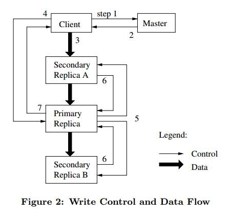

# [SOSP'03] GFS 论文阅读

在分布式系统领域，Google发表了三篇论文，奠定了大规模分布式存储系统的理论基础。

[《The Google File System》]( https://research.google.com/archive/gfs-sosp2003.pdf)

[《MapReduce: Simplified Data Processing on Large Clusters》]( https://research.google/pubs/pub62/)

[《Bigtable: A Distributed Storage System for Structured Data》]( https://research.google.com/archive/bigtable-osdi06.pdf)

本文涉及的《The Google File System》发表于2003年，介绍google文件系统的设计思想、关键逻辑流程。

## 关键词

故障容错，可扩展性。数据存储，集群存储

## 1 介绍

第一、组件故障是常态而不是异常。

> 故障原因：程序bug、OS bug、人为失误、磁盘、内存、网络、供电设备等。

第二、文件较大。

第三、大部分文件的更新是通过追加新数据而不是覆盖已有数据。

第四、共同设计应用程序和文件系统。

## 2 设计概述

### 2.1 假设

* 系统由需要经常故障的廉价组件构成。
* 系统由一定数量的大文件组成。
* 负载主要由两种读组成：大的流式读和小的随机读。
* 负载有很多大的追加写。一旦写完成，文件将很少被修改。
* 系统必须为多客户端并发操作文件提供良好语义。
* 高可持续的带宽比低时延更重要。

### 2.2 接口

文件在目录中以层次组织，并且以路径名标识。

支持通常的操作：create、delete、open、close、read、write。

此外支持：snapshot、record append。

### 2.3 架构

文件被拆分成定长的chunk。每个chunk由一个不可变且全局唯一的64位标识。每个chunk在多个chunk server复制，默认是3副本。

master维护所有的文件系统元数据。包括name space、访问控制信息、从文件到chunk的映射以及chunk的当前位置。同时控制系统范围的活动，如：chunk 租约管理，失效chunk的垃圾回收，chunk server间的chunk 迁移。master通过与每个chunk server周期性的发送心跳消息进行通信来给它指令和收集它的状态。

链接到每个应用程序的GFS客户端实现了文件系统API，同时与master、chunk server通信，代表应用程序进行数据的读写。客户端与master交互获取元数据，但所有的数据通信都是到chunk server。

### 2.4 单主

客户端读写数据不需要经过master。

客户端需要询问master它需要和哪个chunk server通信。

客户端将这种信息缓存下来一段时间，然后在后续操作直接与chunk server交互。

### 2.5 chunk大小

chunk size是关键设计参数之一，GFS是64MB。

### 2.6 元数据

master主要存储三种类型的元数据：文件和chunk namespace、文件到chunk的映射、每个chunk 副本的位置。

#### 2.6.1 内存中的数据结构

元数据存储在内存中。

#### 2.6.2 chunk的地址

master不会永久记录chunk server与chunk副本间的关系。master在启动时会轮询chunk server获取此类信息。

####  2.6.3 操作日志

操作日志包含关键的元数据变化历史记录。

master通过回放操作日志来恢复文件系统状态。

为减少启动时间，必须使得日志尽量小。当日志超过一定大小的时候，master就会进行check point。check point使用一个压缩的类B树结构。

#### 2.7 一致性模型

#### 2.7.1 GFS的保证

文件name space变化是原子性的。

#### 2.7.2 应用程序的影响

## 3 系统交互

描述client、master、chunk server之间的交互，来实现数据的改变，原子性的记录追加和快照。

### 3.1 租约和变化顺序

变化是指对诸如写操作或者追加操作等对文件的内容或者元数据进行改变的操作。

GFS采用租约机制来保证副本间的一致性变化。master授予一个chunk lease给primary副本。primary副本获得对chunk的一系列变化顺序。所有的副本都遵循这种顺序。

租约机制的设计目的是最小化master节点的管理开销。每个租约有60秒的超时时间。

图2，解释了控制流：

step1、client询问master，哪个chunk server拥有chunk的租约以及其它副本的位置。如果没有chunk server拥有租约，master会选择其中一个副本授予租约。

step2、master回复了primary副本的标识和其它副本的位置。client缓存了这些信息以便于后续的变化。client只有在primary副本不可达或者不再拥有租约的时候才会再次与master交互。

step3、client将数据推送到所有的副本。

step4、一旦所有副本确认接收到数据，client就向primary副本发送写请求。

step5、primary副本推送写请求到所有的secondary副本。每个secondary副本按照primary副本指定的相同序列号顺序去应用改变。

step6、secondary副本回复primary副本，他们已经完成了操作。

step7、primary副本回复client。

### 3.2 数据流

GFS将数据流与控制流解耦，以有效利用网络。

为避免网路瓶颈和延迟，每个机器都将数据转发给网络拓扑中最近的机器。

将B字节传输到R个副本的理想耗时是B/T + RL，其中T是网络吞吐量，L是在两台机器之间传输字节的时延。

### 3.3 原子记录追加

GFS提供了一种称为record append的原子追加操作。

### 3.4 快照

快照操作在瞬间复制文件或目录树，同时最小化正在进行的突变的任何中断。

GFS使用标准的写时复制技术来实现快照。当master收到快照请求，它首先撤销快照请求中对应的未到期租约。

当租约被撤销或者过期，master会将操作日志记录到磁盘。然后通过复制源文件或者目录树的元数据，将日志记录应用到其内存状态。新创建的快照文件如同源文件一样指向相同的chunk。

在快照操作之后，客户端在第一次写chunk C时吗，它会向master发送一个请求来找到当前的lease holder。master注意到chunk C的引用计数大于1。master将延迟回应client，而是选择一个新的chunk handle C’。然后，master要求每个当前拥有C的副本的chunkserver创建一个名为C '的chunk。

处理C'。然后，它要求每个当前拥有C副本的块服务器创建一个名为C'的新块。通过在与原始块相同的chunkserver上创建新的块，我们确保数据可以在本地复制，而不是通过网络。master授予一个副本一个新的块C'的租约，并回应client让其正常写入块，而不知道它是刚从一个现有的块创建的。

## 4 主的操作

master执行所有namespace的操作。此外，它管理全系统的chunk副本：进行排布决策，创建新chunk和新副本，并协调全系统的活动。

### 4.1 命名空间管理与锁定

考虑到许多master的操作持续较久，GFS支持多个操作并行，对命名空间的特性区域使用锁，来保证正确的序列化。

GFS将命名空间在逻辑上呈现为查找表，将完整的路径名映射到元数据。并利用前缀压缩技术，在内存中有效表达。而且命名空间树中的每个节点都有一个相关的读写锁。

master的每个操作在执行前需要获得一系列锁。

对目录加的读锁防止目录被删除、重命名、或者快照。对文件加的写锁会将同名文件的创建操作串行执行。

### 4.2 副本排布

GFS集群以多个level分布，通常分布在多个机架。

chunk副本的排布策略主要出于2个目的：第一、最大化数据可靠性和可用性。第二、最大化网络带宽利用率。

### 4.3 创建、重新复制、重新均衡

chunk创建：当master创建块，空副本的放置考虑几个因素。（1）将新副本放置在低于磁盘利用率均值的chunkserver。（2）限制每个chunkserver最近创建的数量。（3）chunk副本跨机甲。

chunk重新复制：当可用副本数量少于用户指定目标，master会重新复制chunk。此外，为防止复制流量挤压客户端流量，chunkserver会对通向源chunkserver服务器的读请求进行流控来限制耗费在复制上的带宽。

chunk重新均衡：master服务器会定期重新均衡副本。它会检查当前的副本分布，移动副本以达到更好的磁盘空间和负载均衡。

### 4.4 垃圾回收

当文件删除后，GFS不会立即去回收可用的物理存储空间。GFS只会在周期性的垃圾回收中惰性的处理。

#### 4.4.1 机制

当应用程序删除文件，master会将删除操作立即记录到日志。但是，该文件仅会重命名为一个包含删除时间戳的隐藏名称，而不是马上恢复资源。在master定期扫描文件系统的命名空间期间，它会删除已经存在了超过三天的隐藏文件（时间可配置）。当隐藏文件从命名空间中删除后，它的内存中的元数据就被删除。

在对chunk命名空间进行扫描的类似时，master识别了孤立块并且擦除了这些块的元数据。在chunkserver与master的心跳的消息中，每个chunkserver会报告它拥有的chunk的集合，然后master服务器会回复不在master元数据中的块的标识。chunkserver就可以自由的删除这些chunk的副本。

#### 4.4.2 讨论

### 4.5 旧副本检测

如果一个chunkserver故障了，并且忽略了chunk的改变，那么chunk副本可能会变的过时。对于每个chunk，master服务器维护一个块版本号(chunk version number)，以区分最新的和过时的副本。

当master服务器对chunk授予新的租约时，会增加chunk版本号并且通知这些最新的副本。master和副本都会在他们的持久状态中记录新版本号。当其他某个副本当前不可用时，它的chunk版本号就不会增加。当chunkserver重启并报告chunk和相关版本号的集合时，master会检测到chunkserver有旧副本。当master看到版本号大于它所记录的，master认为它在授予租约时失败了，并将高版本号作为最新版本号。

master服务器在其常规垃圾回收中删除过时的副本。在垃圾回收之前，当它响应客户端请求时，它能够有效的判定一个过时副本不存在。作为另一个保护措施，master通知client时，会包含chunk版本号。然后，客户端或者chunksever在执行操作的时候会校验版本号。

## 5 故障容错和诊断

GFS系统设计的最大挑战之一是处理频繁的组件故障。

### 5.1 高可用性

#### 5.1.1 快速恢复

master和chunkserver都要能快速恢复状态。

可能的异常：kill进程，超时，重连服务器等。

#### 5.1.2 Chunk复制

每个chunk在不同机架的多个chunkserver上复制。

当master离线或通过checksum检测到损坏的副本时，master会复制现有副本以保持每个chunk完全复制。

#### 5.1.3 master复制

为保证可靠性，master的状态也是多副本保存。master的操作日志和checkpoint，被复制到多台机器。只有变更日志已经在所有的master副本刷盘，一个变更状态才认为被提交。

即使在primary master down掉时，shadow master也能够提供文件系统的只读能力。

### 5.2 数据完整性

GFS的每个chunkserver使用校验和（checksumming）检测数据损坏。

chunk按照64KB划分，每个都对应32bit的checksum。checksums被保存在内存中，并利用日志持久化。

对于读请求，chunkserver在返回数据给请求者之前，会验证与读范围重叠的数据块的校验和。如果块的校验和与此前记录的不一致，chunkserver会返回错误给请求者，并将不匹配报告给master。然后，请求者会从其他副本读取数据，而master将从其他副本复制chunk。在一个有效的新副本就位后，master会通知此chunkserver（报告mismatch的）删除其副本。

GFS客户端通过在校验和边界对齐进行读取操作，使得校验和对读性能影响较小。

GFS对附加写时的checksum计算也进行了优化。即只增量更新最后一个部分块的checksum，然后对apend操作涉及的新checksum块  计算新的checksums。

对于覆盖写，GFS必须读取并校验覆盖范围的第一个和最后一个block，然后执行写，最后计算和记录新的checksums。

在空闲期间，chunkservers会扫描并校验非活跃的chunks。

### 5.3 诊断工具

GFS通过诊断日志进行问题隔离、调试和性能分析。

## 8 相关

GFS提供了独立于位置的命名空间，可以透明的移动数据以实现负载均衡或容错。

由于磁盘相对便宜，GFS目前只使用多副本机制来实现冗余。

GFS在文件系统接口下，不提供任何缓存。

GFS选择了中心式服务器的方式，是为了简化设计、提升可靠性、获得灵活性。中心式的master服务器使得复杂的chunk排布和复制策略更简单。GFS通过保持master服务器的状态尽可能小，并且在其他机器上全量复制来容错。可伸缩和高可用性目前由shadow master机制保证。对master的更新通过WAL日志来实现持久化。

GFS假设大量组件不可靠，因此容错是GFS设计的核心。

GFS具有重均衡、多副本、恢复等生产环境特性。

GFS不寻求改变现有存储设备的模型，而是聚焦于基于现有的组件构建分布式系统，来解决日常数据处理的需求。

## 9 结论

GFS通过持续监控、复制关键数据和快速自动恢复来提供容错功能。Chunk多副本允许容忍chunkserver故障。故障的频率激发了一种新颖的在线修复机制，定期和透明地修复损坏，并尽快补偿丢失的副本。此外，GFS使用checksumming来检测磁盘或IDE子系统级别的数据损坏。

GFS通过优化网络栈（分离文件系统控制和数据传输）实现了高吞吐。

本文参考资料：

Ghemawat, Sanjay, Howard Gobioff, and Shun-Tak Leung. "The Google file system." *Proceedings of the nineteenth ACM symposium on Operating systems principles*. 2003.

