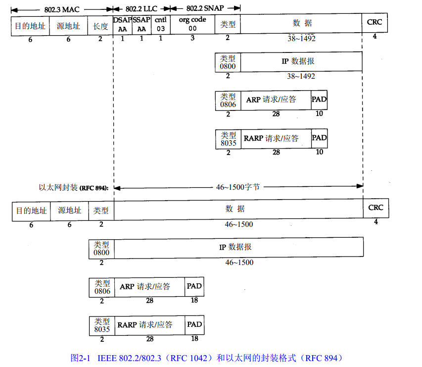
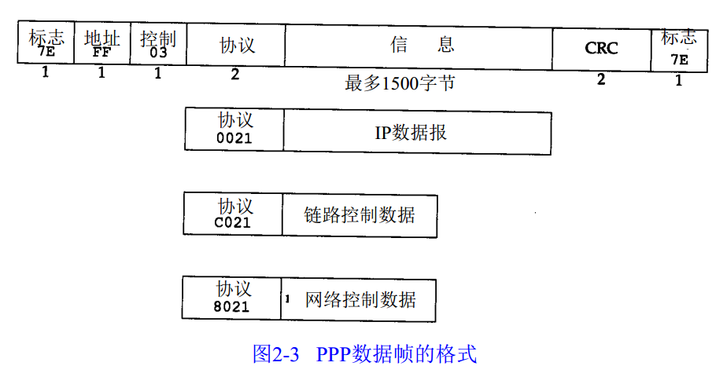
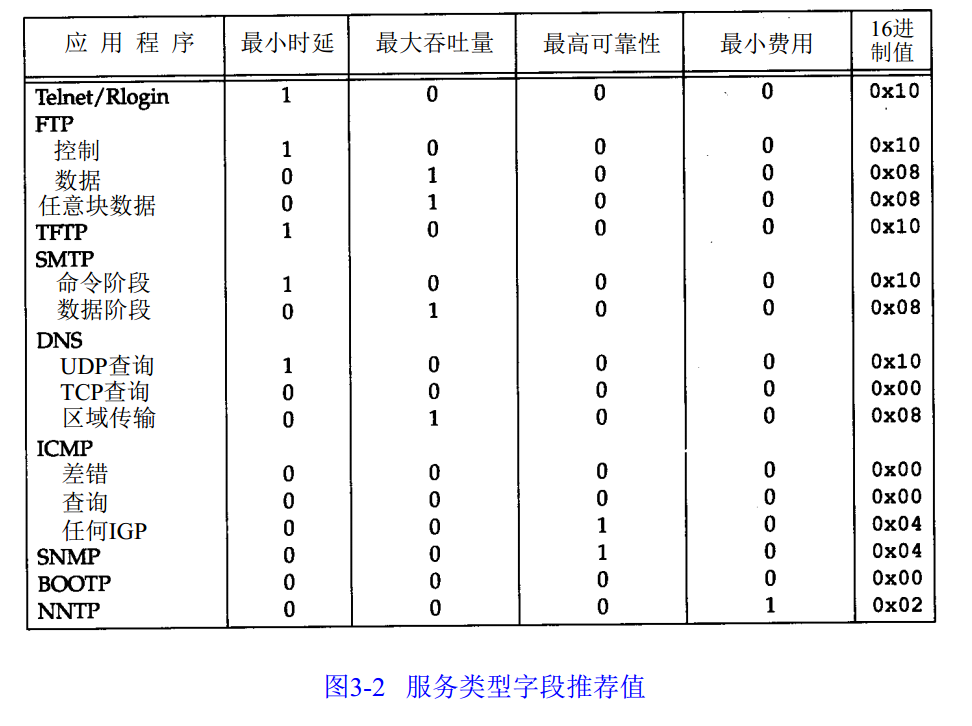
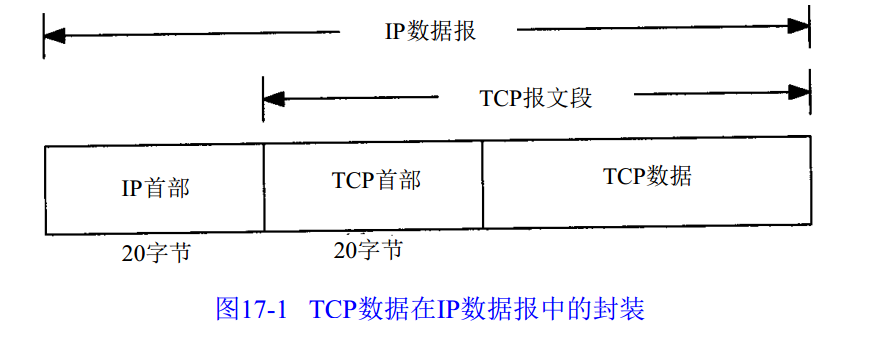
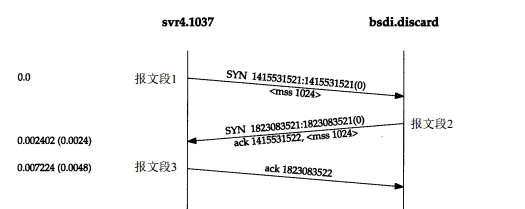
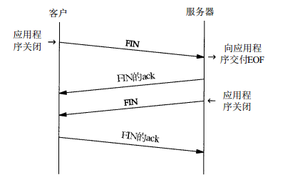

# TCP/IP详解卷一 

[toc]

**声明:**

本文为TCP/IP协议学习笔记，仅作学习交流使用。

## TCP/IP详解卷一 Chapter1 概述
### 1.1 引言
TCP/IP协议族被称作“全球互联网”或“因特网(Internet)”的基础。
### 1.2 分层
TCP/IP通常是四层协议系统。

1）链路层。通常包括操作系统中的设备驱动程序和计算机中对应的网络接口卡。

2）网络层。处理分组在网络中的活动。包括IP协议，ICMP协议，IGMP协议。

3）运输层。为两台主机上的程序提供端到端的通信。有两种不同的协议:TCP传输控制协议，UDP用户数据报协议。TCP提供了高可靠性的端到端的通信。UDP并不保证数据报到达另一台主机，可靠性由应用层提供。

在TCP/IP协议族中，网络层IP提供的是一种不可靠的服务。也就是说，它只是尽可能快地把分组从源结点送到目的结点，但是并不提供任何可靠性保证。而另一方面，TCP在不可靠的IP层上提供了一个可靠的运输层。为了提供这种可靠的服务，TCP用了超时重传、发送和接收端到端的确认分组等机制。由此可见，运输层和网络层分别负责不同的功能。网桥是在链路层上对网络进行互连，而路由器则是在网络层上对网络进行互连。TCP和UDP是两种最为著名的运输层协议，二者都使用IP作为网络层协议。

4）应用层。负责特定的应用程序细节。

### 1.3互联网的地址

ABCDE五类

### 1.5 域名系统

DNS是一个分布的数据库，提供ip与主机名之间的映射。

### 1.9 端口

客户端通常对它所使用的端口号并不关心，只需保证该端口号在本机上是唯一的就可以了。

### 1.13 互联网

intetnet意思是用一个共同的协议族把多个网络连接在一起。而 Internet指的是世界范围内通过TCP/CP互相通信的所有主机集合（超过100万台）。Internet是一个internet，但internet不等于Internet。

### 1.15 应用编程接口

使用TCP/CP协议的应用程序通常采用两种应用编程接口（API）：socket和TLI。

### 1.17 小结

TCP/IP协议族分为四层：链路层、网络层、运输层和应用层，每一层各有不同的责任。

在TCP/IP中，网络层和运输层之间的区别是最为关键的：网络层（IP）提供点到点的服务， 而运输层（TCP和UDP）提供端到端的服务。

一个互联网是网络的网络。构造互联网的共同基石是路由器，它们在IP层把网络连在一起。第一个字母大写的Internet是指分布在世界各地的大型互联网，其中包括1万多个网络和超过100万台主机。

在一个互联网上，每个接口都用IP地址来标识，尽管用户习惯使用主机名而不是IP地址。域名系统为主机名和IP地址之间提供动态的映射。端口号用来标识互相通信的应用程序。服 务器使用知名端口号，而客户使用临时设定的端口号。

## TCP/IP详解卷一 Chapter2 链路层

### 2.1 引言

#### 链路层存在的三个目的

- 为IP模块发送和接收数据报
- 为ARP模块发送ARP请求和接收ARP应答
- 为RARP发送RARP和接收RARP应答

### 2.2 以太网和IEEE 802封装

#### 以太网：带冲突检测的载波侦听多路接入，采用CSMA/CD接入方法。

#### IEEE 802公布了一个标准集，802.3/802.4/802.5的共同特性由802.2标准来定义，即802共有的LLC。
802.3 针对CSMA/CD网络
802.4 针对令牌总线网络
802.5 针对令牌环网络

CRC字段用于帧内后续字节差错的循环冗余码校验（校验和）（它也被称为FCS或帧检验序列）

#### IEEE 802 与以太网的封装格式有所不同。

### 2.3 尾部封装

#### RFC 893

- 一种用于以太网的封装格式，称作尾部封装。

### 2.4 SLIP：串行线路IP

##### SLIP：Serial Line IP，在串行线路上对IP数据报进行封装的简单形式。以这种协议定义的帧格式的IP数据报以END（0xc0）的特殊字符结束。

### 2.5 压缩的SLIP

#### 串行线路速率较低、通信是交互式的，为了传输一个数据需要20个字节的IP首部和TCP首部，总数超过40个字节。由于性能存在缺陷，人们提出了CSLIP的新协议，能将40个字节进行压缩。

### 2.6 PPP ：点对点协议

#### PPP点对点协议修复了SLIP协议中所有的缺陷。PPP包括：

- 在串行线路上封装IP数据报的方法。
- 建立、配置及测试数据链路的链路控制协议。
- 针对不同网络层的网络控制协议。

总的来说， PPP比SLIP具有下面这些优点：
(1) PPP支持在单根串行线路上运行多种协议，不只是I P协议； 
(2) 每一帧都有循环冗余检验； 
(3) 通信双方可以进行IP地址的动态协商(使用IP网络控制协议)； 
(4) 与CSLIP类似，对TCP和IP报文首部进行压缩； 
(5) 链路控制协议可以对多个数据链路选项进行设置。为这些优点付出的代价是在每一帧的首部增加 3个字节，当建立链路时要发送几帧协商数据，以及更为复杂的实现。

### 2.7 环回接口

#### 允许运行在同一台主机上的客户程序和服务器程序通过TCP/IP进行通信。

#### 访问环回接口的可以通过特殊的环回地址，一般为127.0.0.1

### 2.8 最大传输单元MTU

#### MTU称为最大传输单元。

#### 如果IP数据的长度比链路层的MTU还要大，那么IP层就需要进行分片，将数据拆分成若干片，这样每一片都小于MTU。

### 2.9 路径MTU

#### 两台通信主机路径中的最小MTU。不一定为常数，取决于当时所选择的路由。

## TCP/IP详解卷一 Chapter3 IP:网际协议
### 3.1 引言

IP是TCP/IP协议族中最为核心的协议。所有的TCP、UDP、ICMP及IGMP数据都以IP数据报格式传输。

IP仅提供最好的传输服务。任何要求的可靠性必须由上层来提供（如TCP）。

无连接：IP并不维护任何关于后续数据报的状态信息。

每个数据报的处理是相互独立的。

### 3.2 IP首部

普通IP首部长为20个字节，除非含有选项字段。P24

目前协议版本号是4，所以IP也称为IPv4。

每一份IP数据报都包含源IP地址和目的IP地址。

### 3.3 IP路由选择

路由表中的每一项包含以下信息：
* 目的IP地址
* 下一站路由器的IP地址，或者有直接连接的网络IP地址。
* 标志
* 为数据报的传输

### 3.4 子网寻址

## TCP/IP详解卷一 Chapter4 ARP:地址解析协议

### 4.1 引言
ARP为IP地址到对应的硬件地址之间提供动态映射。
RARP是被那些没有磁盘驱动器的系统使用，它需要系统管理员进行手工设置。
### 4.2 一个例子
ARP会发送一份被称作ARP请求的以太网数据帧给以太网上的每个主机。

TCP/IP有自己的地址：32bit的IP地址。知道主机的IP地址并不能让内核发送一帧数据给主机。内核（如以太网驱动程序）必须知道目的端的硬件地址才能发送数据。ARP的功能是在32bit的IP地址和采用不同网络技术的硬件地址之间提供动态映射。
### 4.3 ARP高速缓存
ARP高速缓存存放了最近Internet地址到硬件地址之间的映射记录。

## TCP/IP详解卷一 Chapter5 RARP:逆地址解析协议
### 5.1 引言
无盘系统的RARP实现过程是从接口卡上读取唯一的硬件地址，然后发送一份RARP请求（一帧在网络上广播的数据），请求某个主机响应该无盘系统的IP地址。
### 5.2 RARP的分组格式
RARP分组格式与ARP分组基本一致。
RARP请求或应答的帧类型代码为0x8035。
RAPR请求以广播方式传送，而RARP应答一般是单播传送的。
### 5.4 RARP服务器的设计
内核知道IP地址和硬件地址，当它收到一个询问IP地址的ARP请求时，只需用相应的硬件地址来提供应答。
发送和接收数据帧与系统有关，因此，RARP服务器的实现是与系统捆绑在一起的。
发送RARP请求的无盘系统一般采用最先收到的RARP应答。

## TCP/IP详解卷一 Chapter7 Ping程序
### 7.1 引言
Ping程序用于测试另一台主机是否可达。
### 7.2 Ping程序

## TCP/IP详解卷一 Chapter17 TCP:传输控制协议
### 17.2 TCP的服务
TCP提供一组面向连接的、可靠的字节流服务。
TCP对字节流的内容不作任何解释。对字节流的解释由TCP连接双方的应用层解释。
### 17.3 TCP的首部
TCP数据被封装在一个IP数据报中。

TCP首部通常是20字节。

IP首部的源端IP地址和目的端IP地址，以及TCP首部的源端口号和目的端端口号唯一确定一个TCP连接。
一个IP地址和一个端口号也称为一个插口（socket）。
TCP为应用层提供全双工服务。
TCP首部中的6个标志比特：
| 标志位 | 意义 |
| --- | --- |
| URG | 紧急指针 |
| ACK | 确认序号有效 |
| PSH | 接收方应该尽快将这个报文段交给应用层 |
| PST | 重建连接 |
| SYN | 同步序号用来发送一个连接 |
| FIN | 发端完成发送任务 |
### 17.4 小结
TCP提供了一种可靠的面向连接的字节流运输层服务。
TCP将用户数据打包构成报文段；它发送数据后启动一个定时器；另一端对收到的数据进行确认，对失序的数据重新排序，丢弃重复数据；TCP提供端到端的流量控制，并计算和验证一个强制性的端到端校验和。

## TCP/IP详解卷一 Chapter18 TCP连接的建立与终止
### 18.1 引言
TCP是面向连接的协议。
### 18.2 连接的建立与终止

3次握手，建立连接协议：

step1：请求端发送一个SYN段指明客户打算连接的服务器的端口，以及初始序号（ISN）。这个SYN段为报文段1。

step2：服务器发回包含服务器的初始序号的SYN报文段（报文段2）作为应答。同时，将确认序号设置为客户的ISN加1以客户的SYN报文段进行确认。

step3：客户必须将确认序号设置为服务器的ISN加1以对服务器的SYN报文段进行确认（报文段3）。

4次挥手，连接终止协议：

### 18.3 连接建立的超时

### 18.4 最大报文段长度

最大报文段长度（MSS）表示TCP传往另一端的最大块数据的长度。当一个连接建立时，连接的双方都要通告各自的MSS。

### 18.5 TCP的半关闭

半关闭：TCP提供了连接的一端在结束它的发送后还能接收来自另一端数据的能力。

### 18.6 TCP的状态变迁图
### 18.7 复位报文段

RST用于复位。

### 18.8 同时打开
### 18.9 同时关闭
### 18.10 TCP选项

### 18.11 TCP服务的设计

### 18.12 小结

两个进程在进行TCP交换数据之前，必须建立一条连接。

三次握手。

四次挥手。

## TCP/IP详解卷一 Chapter19 TCP的交互数据流

### 19.1 引言

成块数据的报文段基本上是满长度的（通常为512字节）。

交互数据小得多（小于10个字节）。

TCP需要同时处理这两类数据。

### 19.2 交互式输入

### 19.3 经受时延的确认

### 19.4 Nagle算法

### 19.5 窗口大小通告

### 19.6 小结

交互数据总是以小于最大报文段长度的分组发送。

对于小的报文段，接收方使用经受时延的确认方法来判断确认是否可被推迟发送，以便与回送数据一起发送。这样会减少报文段的数目。

在较慢的广域网环境中，通常使用Nagle算法减少小报文段的数量。

## TCP/IP详解卷一 Chapter20 TCP的成块数据流

### 20.1 引言

本章介绍一种流量控制方法：滑动窗口协议。

该协议允许发送方在停止并等待确认前可以连续发送多个分组。

由于发送方不必每发一个分组就停下来等待确认，因此该协议可以加速数据的传输。

### 20.2 正常数据流

### 20.3 滑动窗口

### 20.4 窗口大小啊

### 20.5 PUSH标志

### 20.6 慢启动

### 20.7 成块数据的吞吐量

### 20.8 紧急方式

### 20.9 小结

进行成块数据有效传输的最重要的方法是TCP的滑动窗口协议。

## TCP/IP详解卷一 Chapter21 TCP的超时与重传
### 21.1 引言
### 21.3 往返时间测量
### 21.6 拥塞避免算法
### 21.7 快速重传与快速恢复算法
### 21.12 小结

