# TCP/IP协议知识总结
[[toc]]
## 总体
首先，展示下总体的思维导图。接下来，按照每个点解释。
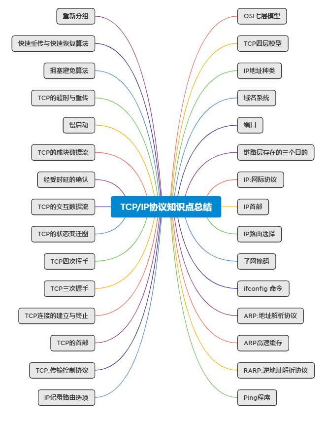
## OSI七层模型
开放式系统互联模型（英语：Open System Interconnection Model，缩写：OSI；简称为OSI模型）是一种概念模型，由国际标准化组织提出，一个试图使各种计算机在世界范围内互连为网络的标准框架。
物理层（Physical Layer）在局部局域网上传送数据帧（Data Frame），它负责管理电脑通信设备和网络媒体之间的互通。包括了针脚、电压、线缆规范、集线器、中继器、网卡、主机接口卡等。
数据链路层（Data Link Layer）负责网络寻址、错误侦测和改错。当表头和表尾被加至数据包时，会形成信息框（Data Frame）。数据链表头（DLH）是包含了物理地址和错误侦测及改错的方法。数据链表尾（DLT）是一串指示数据包末端的字符串。例如以太网、无线局域网（Wi-Fi）和通用分组无线服务（GPRS）等。
分为两个子层：逻辑链路控制（logical link control，LLC）子层和介质访问控制（Media access control，MAC）子层。
网络层（Network Layer）决定数据的路径选择和转寄，将网络表头（NH）加至数据包，以形成报文。网络表头包含了网络资料。例如:互联网协议（IP）等。
传输层（Transport Layer）把传输表头（TH）加至数据以形成数据包。传输表头包含了所使用的协议等发送信息。例如:传输控制协议（TCP）等。
会话层（Session Layer）负责在数据传输中设置和维护计算机网络中两台计算机之间的通信连接。
表达层（Presentation Layer）把数据转换为能与接收者的系统格式兼容并适合传输的格式。
应用层（Application Layer）提供为应用软件而设计的接口，以设置与另一应用软件之间的通信。例如：HTTP、HTTPS、FTP、Telnet、SSH、SMTP、POP3等。

## TCP四层模型
TCP/IP协议族被称作“全球互联网”或“因特网(Internet)”的基础。
TCP/IP通常是四层协议系统。
1）链路层。通常包括操作系统中的设备驱动程序和计算机中对应的网络接口卡。
2）网络层。处理分组在网络中的活动。包括IP协议，ICMP协议，IGMP协议。
3）运输层。为两台主机上的程序提供端到端的通信。有两种不同的协议:TCP传输控制协议，UDP用户数据报协议。TCP提供了高可靠性的端到端的通信。UDP并不保证数据报到达另一台主机，可靠性由应用层提供。
在TCP/IP协议族中，网络层IP提供的是一种不可靠的服务。也就是说，它只是尽可能快地把分组从源结点送到目的结点，但是并不提供任何可靠性保证。而另一方面，TCP在不可靠的IP层上提供了一个可靠的运输层。为了提供这种可靠的服务，TCP用了超时重传、发送和接收端到端的确认分组等机制。由此可见，运输层和网络层分别负责不同的功能。网桥是在链路层上对网络进行互连，而路由器则是在网络层上对网络进行互连。TCP和UDP是两种最为著名的运输层协议，二者都使用IP作为网络层协议。
4）应用层。负责特定的应用程序细节。

## IP地址种类
IP地址分为五大类：A类、B类、C类、D类和E类。
A类IP地址是指， 在IP地址的四段号码中，第一段号码为网络号码，剩下的三段号码为本地计算机的号码。
B类IP地址是指，在IP地址的四段号码中，前两段号码为网络号码。
C类IP地址是指，在IP地址的四段号码中，前三段号码为网络号码，剩下的一段号码为本地计算机的号码。
D类IP地址在历史上被叫做多播地址(multicast address)，即组播地址。
E类IP地址是保留地址。该类IP地址的最前面为“1111”。
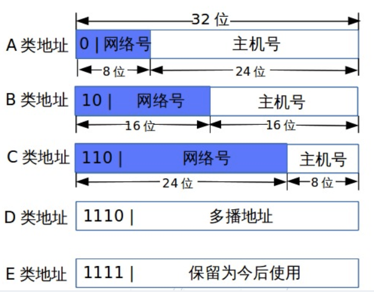
## 域名系统（DNS）
域名系统（英文：Domain Name System，缩写：DNS）是互联网的一项服务。它作为将域名和IP地址相互映射的一个分布式数据库，能够使人更方便地访问互联网。

## 链路层
链路层存在的三个目的：
为IP模块发送和接收数据报
为ARP模块发送ARP请求和接收ARP应答
为RARP发送RARP和接收RARP应答
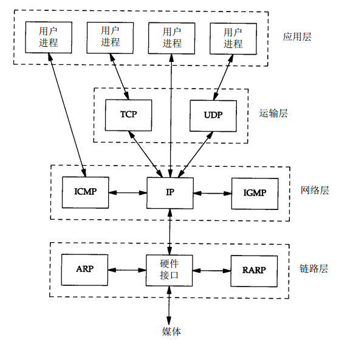
## IP：网际协议
IP是TCP/IP协议族中最为核心的协议。所有的TCP、UDP、ICMP及IGMP数据都以IP数据报格式传输。
IP仅提供最好的传输服务。任何要求的可靠性必须由上层来提供（如TCP）。
无连接：IP并不维护任何关于后续数据报的状态信息。
每个数据报的处理是相互独立的。
## IP首部
普通IP首部长为20个字节，除非含有选项字段。
目前协议版本号是4，所以IP也称为IPv4。
每一份IP数据报都包含源IP地址和目的IP地址。
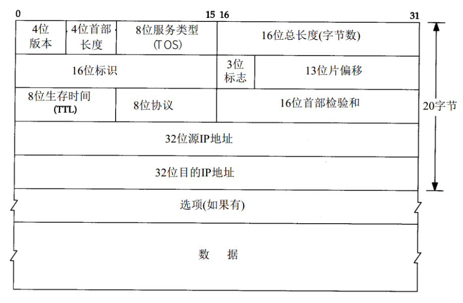
## IP路由选择
路由表中的每一项包含以下信息：
目的IP地址。
下一站路由器的IP地址，或者有直接连接的网络IP地址。
标志。
为数据报的传输指定一个网络接口。
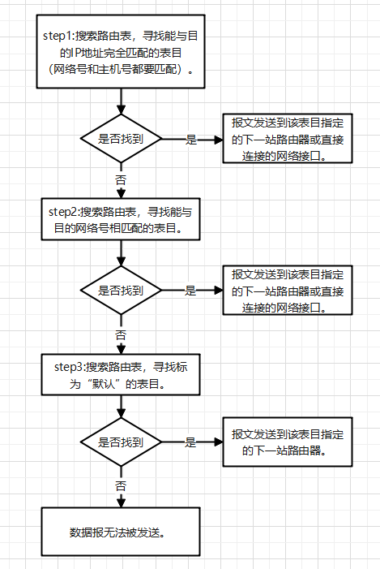
## 子网掩码
子网掩码：值为1的比特留给网络号和子网号，为0的留给主机号。
除了IP地址外，主机还需要知道有多少bit用于子网号及多少bit用于主机号。
IP地址一般以点分十进制方法表示，但是子网掩码却经常用十六进制来表示，特别是当界限不是一个字节时，因为子网掩码是一个比特掩码。

## ifconfig 命令
ifconfig一般在引导的时候运行，以配置主机上的每个接口。
ifconfig -a   // 所有接口
ifconfig eth0  // 某一接口 
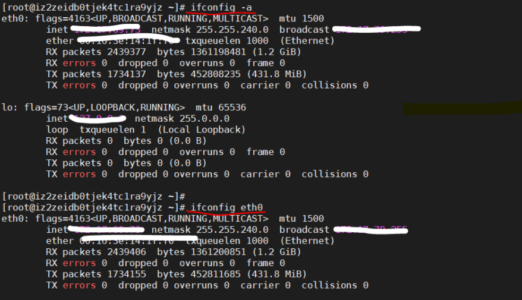
## ARP:地址解析协议
ARP为IP地址到对应的硬件地址之间提供动态映射。 RARP是被那些没有磁盘驱动器的系统使用，它需要系统管理员进行手工设置。
ARP会发送一份被称作ARP请求的以太网数据帧给以太网上的每个主机。
TCP/IP有自己的地址：32bit的IP地址。知道主机的IP地址并不能让内核发送一帧数据给主机。内核（如以太网驱动程序）必须知道目的端的硬件地址才能发送数据。ARP的功能是在32bit的IP地址和采用不同网络技术的硬件地址之间提供动态映射。
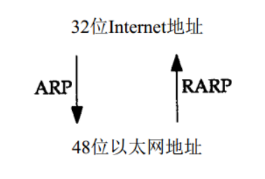
## ARP高速缓存
ARP高速缓存存放了最近Internet地址到硬件地址之间的映射记录。
arp -a // 显示ARP高速缓存中的所有内容 
arp -d // 删除ARP高速缓存中的某一项内容 
arp -s // 增加高速缓存中的内容

## RARP:逆地址解析协议
RARP协议是许多无盘系统在引导时用来获取IP地址的。 
无盘系统的RARP实现过程是从接口卡上读取唯一的硬件地址，然后发送一份RARP请求（一帧在网络上广播的数据），请求某个主机响应该无盘系统的IP地址。 
RARP分组格式基本上与 ARP分组一致。 
一个RARP请求在网络上进行广播，它在分组中标明发送端的硬件地址，以请求相应IP地址的响应。应答通常是单播传送的。

## Ping程序
Ping程序用于测试另一台主机是否可达。
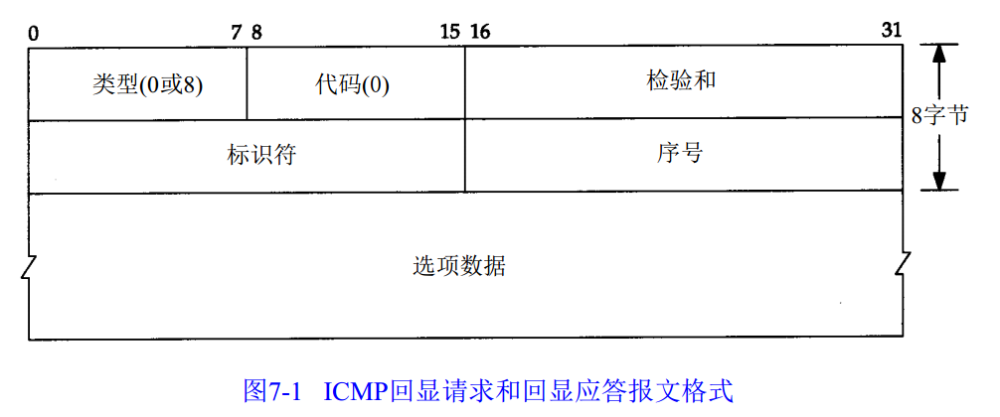
## IP记录路由选项
大多数不同版本的 ping程 序都提供-R选项，以提供记录路由的功能。它使得 ping程序在发送出去的IP数据报中设置IPR R选项（该 IP数据报包含ICMP回显请求报文）。 

## TCP:传输控制协议
TCP提供一组面向连接的、可靠的字节流服务。 TCP对字节流的内容不作任何解释。对字节流的解释由TCP连接双方的应用层解释。
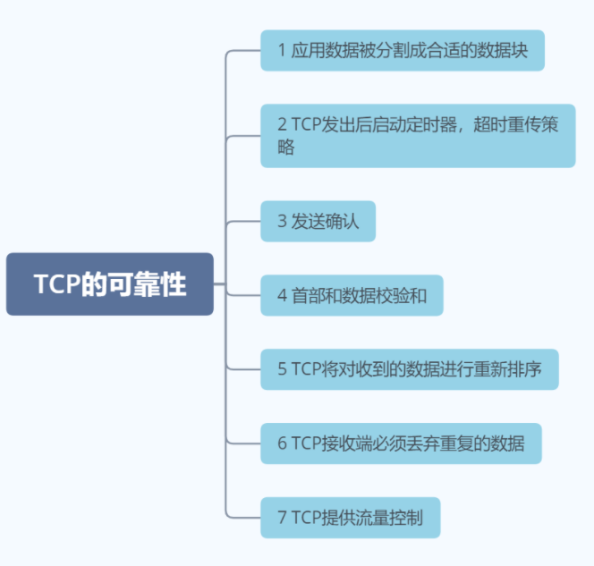
## TCP的首部
TCP数据被封装在一个IP数据报中。
TCP首部通常是20字节。

## TCP的首部
IP首部的源端IP地址和目的端IP地址，以及TCP首部的源端口号和目的端端口号唯一确定一个TCP连接。
一个IP地址和一个端口号也称为一个插口（socket）。
插口对（socket pair）（包含客户IP地址、客户端口号、服务器IP地址和服务器端口号的四元祖）可唯一确定互联网络中的每个TCP连接的双方。
确认序号应当是上次已成功收到数据字节序号加1。 
TCP为应用层提供全双工服务。
TCP的流量控制由连接的每一端通过声明的窗口来提供。 检验和覆盖了整个的TCP报文段：TCP首部和TCP数据。这是一个强制性的字段，一定是由发端计算和存储，并由收端进行验证。 最常见的可选字段是最长报文大小，又称为MSS(Maximum Segment Size)。 
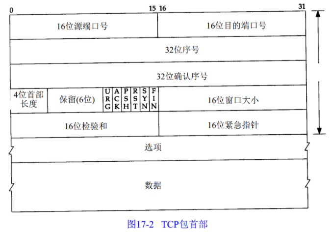
## TCP连接的建立与终止
TCP是面向连接的协议。无论哪一方向另一方发送数据之前，都必须先在双方之间建立一条连接。
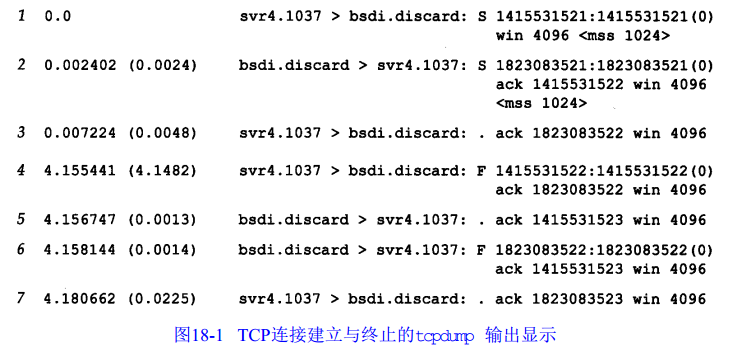
## TCP三次握手
step1：请求端发送一个SYN段指明客户打算连接的服务器的端口，以及初始序号（ISN）。这个SYN段为报文段1。
step2：服务器发回包含服务器的初始序号的SYN报文段（报文段2）作为应答。同时，将确认序号设置为客户的ISN加1以客户的SYN报文段进行确认。 
step3：客户必须将确认序号设置为服务器的ISN加1以对服务器的SYN报文段进行确认（报文段3）。

## TCP四次挥手
当服务器收到这个FIN，它发回一个ACK，确认序号为收到的序号加1。和SYN一样，一个FIN将占用一个序号。
同时TCP服务器还向应用程序（即丢弃服务器）传送一个文件结束符。
接着这个服务器程序就关闭它的连接，导致它的TCP端发送一个FIN，客户必须发回一个确认，并将确认序号设置为收到序号加1。

## TCP的状态变迁图

## TCP的交互数据流
成块数据的报文段基本上是满长度的（通常为512字节）。 交互数据小得多（小于10个字节）。 TCP需要同时处理这两类数据。
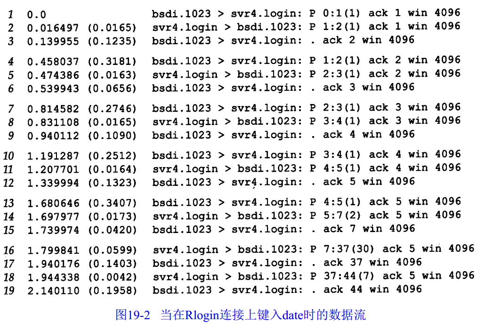
## 经受时延的确认
通常TCP在接收到数据时并不立即发送ACK；相反，它推迟发送，以便将 ACK与需要沿该方向发送的数据一起发送（有时称这种现象为数据捎带A CK）。绝大多数实现采用的时延为200 ms，也就是说，TCP将以最大200 ms 的时延等待是否有数据一起发送。
对于小的报文段，接收方使用经受时延的确认方法来判断确认是否可被推迟发送，以便与回送数据一起发送。这样会减少报文段的数目。
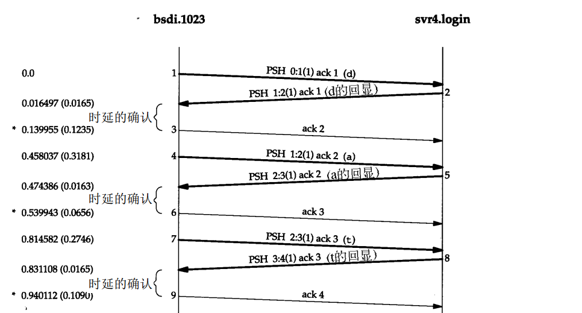
## TCP的成块数据流
进行成块数据有效传输的最重要的方法是TCP的滑动窗口协议。
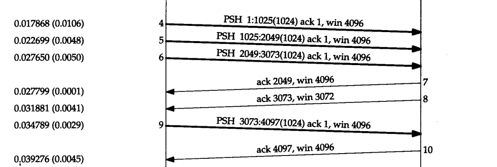
## 滑动窗口协议
该协议允许发送方在停止并等待确认前可以连续发送多个分组。
由于发送方不必每发一个分组就停下来等待确认，因此该协议可以加速数据的传输。
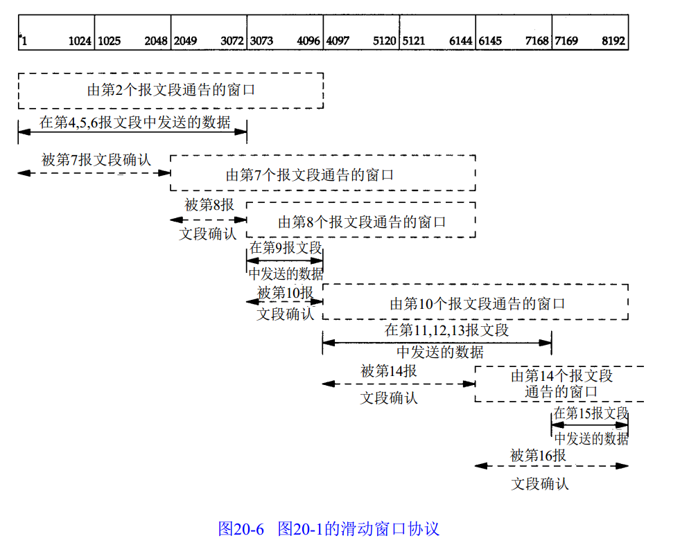
## 慢启动
慢启动 (slow start)： 该算法通过观察到新分组进入网络的速率应该与另一端返回确认的速率相同而进行工作。
慢启动为发送方的TCP增加了另一个窗口：拥塞窗口 (congestion window)，记为cwnd。当与另一个网络的主机建立 TCP连接时，拥塞窗口被初始化为 1个报文段（即另一端通告的报文段大小）。每收到一个 A C K，拥塞窗口就增加一个报文段（cwnd以字节为单位，但是慢启动以报文段大小为单位进行增加）。
发送方取拥塞窗口与通告窗口中的最小值作为发送上限。拥塞窗口是发送方使用的流量控制，而通告窗口则是接收方使用的流量控制。
## TCP的超时与重传
TCP通过在发送时设置一个定时器来解决这种问题。如果当定时器溢出 时还没有收到确认，它就重传该数据。
## 拥塞避免算法
慢启动算法是在一个连接上发起数据流的方法，但有时我们会达到中间 路由器的极限，此时分组将被丢弃。拥塞避免算法是一种处理丢失分组的方法。
拥塞避免算法和慢启动算法需要对每个连接维持两个变量：一个拥塞窗口 cwnd和一个慢启动门限ssthresh。

## 快速重传与快速恢复算法
1、当收到第3个重复的ACK时，将ssthresh设置为当前拥塞窗口cwnd的一半。重传丢失的 报文段。设置cwnd为ssthresh加上3倍的报文段大小。
2、每次收到另一个重复的 ACK时， cwnd增加1个报文段大小并发送 1个分组（如果新的cwnd允许发送）。
3、当下一个确认新数据的 ACK到达时，设置cwnd为ssthresh（在第1步中设置的值）。这个ACK应该是在进行重传后的一个往返时间内对步骤 1中重传的确认。另外，这个 ACK也应该是对丢失的分组和收到的第 1个重复的ACK之间的所有中间报文段的确认。这一步采用的是拥塞避免，因为当分组丢失时我们将当前的速率减半。
## 重新分组
当TCP超时并重传时，它不一定要重传同样的报文段。相反，TCP允许进行重新分组而发送一个较大的报文段，这将有助于提高性能。
