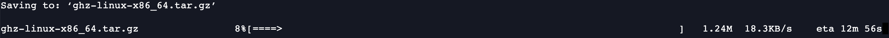
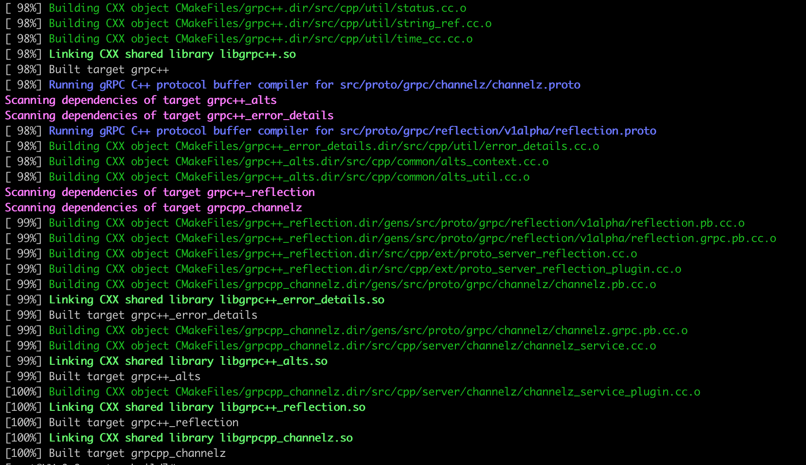
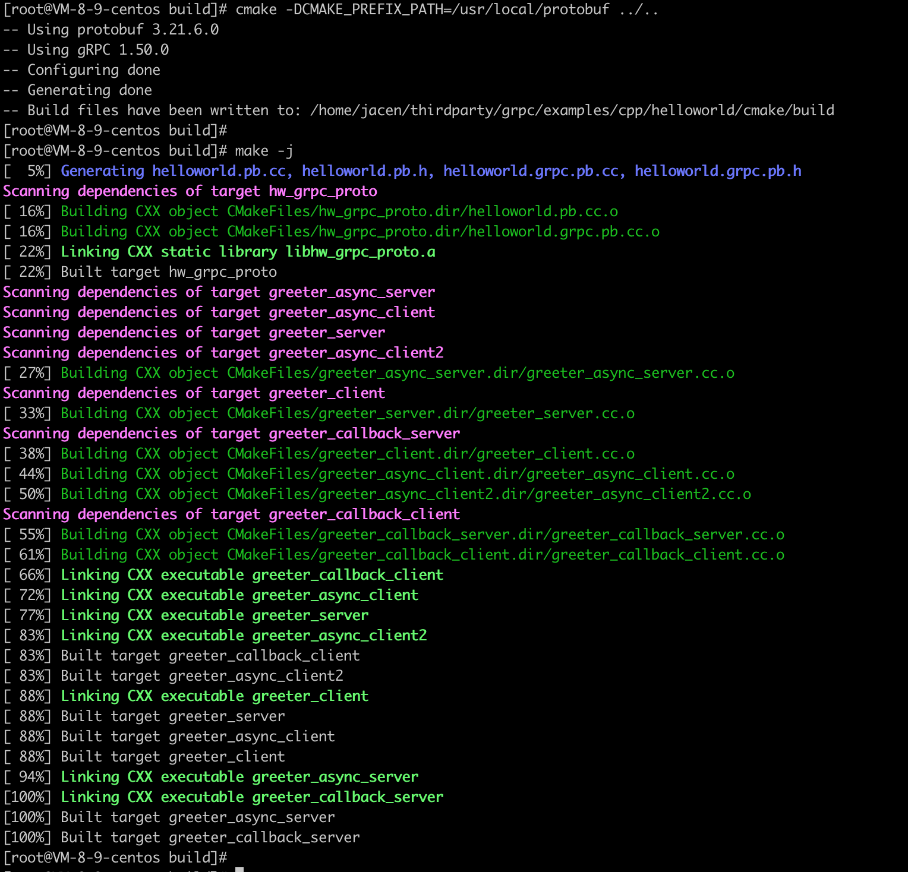
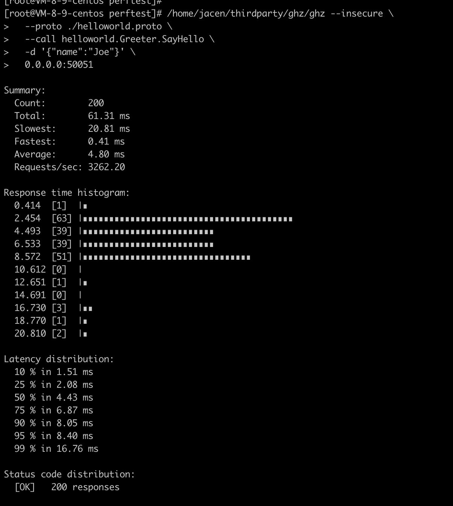

# 基于ghz进行gRpc框架性能压测（1）

## 1 ghz介绍

ghz是一个命令行程序和Go包，用于负载测试和gRPC服务的基准测试。

## 2 ghz下载与安装

step1 在https://github.com/bojand/ghz/releases下载对应环境的ghz二进制包。

``` shell
wget https://github.com/bojand/ghz/releases/download/v0.110.0/ghz-linux-x86_64.tar.gz
```



step2 解压ghz压缩包，可得到二进制执行程序文件。

解决后的目录结构如下：


## 3 ghz命令行

执行./gzh -h，得到ghz的命令行说明

```shell

usage: ghz [<flags>] [<host>]

Flags:
  -h, --help                     Show context-sensitive help (also try --help-long and --help-man).
      --config=                  Path to the JSON or TOML config file that specifies all the test run settings.
      --proto=                   The Protocol Buffer .proto file.
      --protoset=                The compiled protoset file. Alternative to proto. -proto takes precedence.
      --call=                    A fully-qualified method name in 'package.Service/method' or 'package.Service.Method' format.
  -i, --import-paths=            Comma separated list of proto import paths. The current working directory and the directory of the protocol buffer
                                 file are automatically added to the import list.
      --cacert=                  File containing trusted root certificates for verifying the server.
      --cert=                    File containing client certificate (public key), to present to the server. Must also provide -key option.
      --key=                     File containing client private key, to present to the server. Must also provide -cert option.
      --cname=                   Server name override when validating TLS certificate - useful for self signed certs.
      --skipTLS                  Skip TLS client verification of the server's certificate chain and host name.
      --insecure                 Use plaintext and insecure connection.
      --authority=               Value to be used as the :authority pseudo-header. Only works if -insecure is used.
      --async                    Make requests asynchronous as soon as possible. Does not wait for request to finish before sending next one.
  -r, --rps=0                    Requests per second (RPS) rate limit for constant load schedule. Default is no rate limit.
      --load-schedule="const"    Specifies the load schedule. Options are const, step, or line. Default is const.
      --load-start=0             Specifies the RPS load start value for step or line schedules.
      --load-step=0              Specifies the load step value or slope value.
      --load-end=0               Specifies the load end value for step or line load schedules.
      --load-step-duration=0     Specifies the load step duration value for step load schedule.
      --load-max-duration=0      Specifies the max load duration value for step or line load schedule.
  -c, --concurrency=50           Number of request workers to run concurrently for const concurrency schedule. Default is 50.
      --concurrency-schedule="const"  
                                 Concurrency change schedule. Options are const, step, or line. Default is const.
      --concurrency-start=0      Concurrency start value for step and line concurrency schedules.
      --concurrency-end=0        Concurrency end value for step and line concurrency schedules.
      --concurrency-step=1       Concurrency step / slope value for step and line concurrency schedules.
      --concurrency-step-duration=0  
                                 Specifies the concurrency step duration value for step concurrency schedule.
      --concurrency-max-duration=0  
                                 Specifies the max concurrency adjustment duration value for step or line concurrency schedule.
  -n, --total=200                Number of requests to run. Default is 200.
  -t, --timeout=20s              Timeout for each request. Default is 20s, use 0 for infinite.
  -z, --duration=0               Duration of application to send requests. When duration is reached, application stops and exits. If duration is
                                 specified, n is ignored. Examples: -z 10s -z 3m.
  -x, --max-duration=0           Maximum duration of application to send requests with n setting respected. If duration is reached before n requests
                                 are completed, application stops and exits. Examples: -x 10s -x 3m.
      --duration-stop="close"    Specifies how duration stop is reported. Options are close, wait or ignore. Default is close.
  -d, --data=                    The call data as stringified JSON. If the value is '@' then the request contents are read from stdin.
  -D, --data-file=               File path for call data JSON file. Examples: /home/user/file.json or ./file.json.
  -b, --binary                   The call data comes as serialized binary message or multiple count-prefixed messages read from stdin.
  -B, --binary-file=             File path for the call data as serialized binary message or multiple count-prefixed messages.
  -m, --metadata=                Request metadata as stringified JSON.
  -M, --metadata-file=           File path for call metadata JSON file. Examples: /home/user/metadata.json or ./metadata.json.
      --stream-interval=0        Interval for stream requests between message sends.
      --stream-call-duration=0   Duration after which client will close the stream in each streaming call.
      --stream-call-count=0      Count of messages sent, after which client will close the stream in each streaming call.
      --stream-dynamic-messages  In streaming calls, regenerate and apply call template data on every message send.
      --reflect-metadata=        Reflect metadata as stringified JSON used only for reflection request.
  -o, --output=                  Output path. If none provided stdout is used.
  -O, --format=                  Output format. One of: summary, csv, json, pretty, html, influx-summary, influx-details. Default is summary.
      --skipFirst=0              Skip the first X requests when doing the results tally.
      --count-errors             Count erroneous (non-OK) resoponses in stats calculations.
      --connections=1            Number of connections to use. Concurrency is distributed evenly among all the connections. Default is 1.
      --connect-timeout=10s      Connection timeout for the initial connection dial. Default is 10s.
      --keepalive=0              Keepalive time duration. Only used if present and above 0.
      --name=                    User specified name for the test.
      --tags=                    JSON representation of user-defined string tags.
      --cpus=4                   Number of cpu cores to use.
      --debug=                   The path to debug log file.
  -e, --enable-compression       Enable Gzip compression on requests.
      --lb-strategy=             Client load balancing strategy.
      --max-recv-message-size=   Maximum message size the client can receive.
      --max-send-message-size=   Maximum message size the client can send.
  -v, --version                  Show application version.

Args:
  [<host>]  Host and port to test.
```

## 4 程序准备

### 4.1 编译和安装gRPC、Protocol Buffers

#### 4.1.1 安装依赖

```shell
# 开发依赖安装
yum group info "Development Tools"

yum install -y git cmake gcc gcc-c++ make autoconf automake libtool pkg-config
```

```shell
# pkg-config安葬
wget https://pkgconfig.freedesktop.org/releases/pkg-config-0.29.2.tar.gz

./configure --with-internal-glib 
make
make check
make install

pkg-config --version
```

#### 4.1.2 下载grpc及其子模块，并编译

##### 4.1.2.1 下载grpc源码

```shell
# 下载grpc源码
cd /home/jacen/thirdparty
git clone --recurse-submodules -b v1.50.0 --depth 1 --shallow-submodules https://github.com/grpc/grpc

git submodule update --init # 下载任务中断后，继续
```

##### 4.1.2.2 编译protobuf

```shell
# 编译protobuf
wget https://github.com/protocolbuffers/protobuf/releases/download/v21.6/protobuf-all-21.6.tar.gz #v2.6
./configure --prefix=/usr/local/protobuf
make -j8 && make install
ldconfig
/usr/local/protobuf/bin/protoc --version #验证
```

##### 4.1.2.3 编译grpc

```shell
# 编译grpc

# 由于centos 7 gcc版本较低，升级下版本
ln -sf /usr/local/gcc7.3.0/bin/gcc /usr/bin/cc
ln -sf /usr/local/gcc7.3.0/bin/g++ /usr/bin/c++

cd /home/jacen/thirdparty/grpc
mkdir -p cmake/build
cd cmake/build

cmake -DCMAKE_INSTALL_PREFIX=/usr/local/grpc \
       -DCMAKE_BUILD_TYPE=Release \
       -DgRPC_INSTALL=ON \
       -DBUILD_SHARED_LIBS=ON \
       -DgRPC_BUILD_TESTS=OFF \
       -DgRPC_ZLIB_PROVIDER=package \
       -DgRPC_PROTOBUF_PROVIDER=package \
       -DgRPC_SSL_PROVIDER=package \
       -DProtobuf_INCLUDE_DIR=/usr/local/protobuf/include \
       -DProtobuf_LIBRARY=/usr/local/protobuf/lib/libprotobuf.so \
       -DProtobuf_PROTOC_LIBRARY=/usr/local/protobuf/lib/libprotoc.so \
       -DProtobuf_PROTOC_EXECUTABLE=/usr/local/protobuf/bin/protoc ../..
make -j8
make install
```



### 4.2 简单的测试

#### 4.2.1 proto文件准备

使用example中的helloworld进行测试，文件为：https://github.com/grpc/grpc/blob/master/examples/protos/helloworld.proto

```shell
# helloworld.proto
syntax = "proto3";

package helloworld;

// The greeting service definition.
service Greeter {
  // Sends a greeting
  rpc SayHello (HelloRequest) returns (HelloReply) {}
}

// The request message containing the user's name.
message HelloRequest {
  string name = 1;
}

// The response message containing the greetings
message HelloReply {
  string message = 1;
}
```

#### 4.2.2 执行简单的测试初体验

##### 4.2.2.1 编译、启动服务端程序

```shell
cd examples/cpp/helloworld

mkdir -p cmake/build
pushd cmake/build
cmake -DCMAKE_PREFIX_PATH=/usr/local/protobuf ../..
make -j
./gretter_server

```




##### 4.2.2.2 启动GHZ CLI客户端测试程序

```shell
/home/jacen/thirdparty/ghz/ghz --insecure \
  --proto ./helloworld.proto \
  --call helloworld.Greeter.SayHello \
  -d '{"name":"Joe"}' \
  0.0.0.0:50051

# 或者利用server reflection 忽略proto
/home/jacen/thirdparty/ghz/ghz --insecure \
  --call helloworld.Greeter.SayHello \
  -d '{"name":"Joe"}' \
  0.0.0.0:50051
```

得到结果：



##### 4.2.2.3 结果解释

| 输出项| 含义 |
| :--- | :--- |
| count | 已完成的请求总数，包括成功的和失败的请求。 |
| total | 从开始到结束的测试总时间。 |
| slowest | 最慢的请求的耗时。 |
| fastest | 最快的请求的耗时。 |
| average | 平均的请求耗时. |
| requests/sec | 每秒的请求数量，计算公式：count/total。 |

## 5 参考资料

* ghz
https://ghz.sh/
https://ghz.sh/docs/output

* grpc cpp quickstart
https://grpc.io/docs/languages/cpp/quickstart/

* gRPC doc
https://doc.oschina.net/grpc?t=57966
