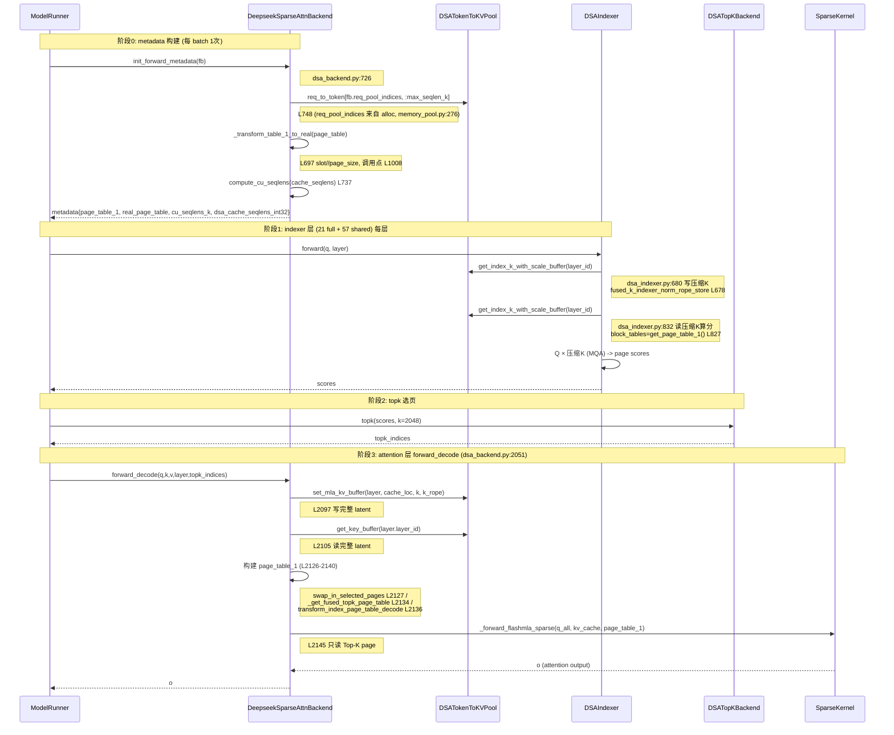

# 深度解析 SGLang KV Cache：RadixTree 前缀共享、全生命周期流转、跨设备传输与 HiCache 多级缓存工程优化

## 前言
在大模型推理体系中，KV Cache 是制约 **TTFT、吞吐、显存上限、长上下文能力** 的核心瓶颈。传统 PagedAttention 仅实现「块级显存复用」，无法解决多请求公共前缀重复计算问题。

SGLang 相较于 vLLM 最大架构革新是 **RadixTree（基数树）全局前缀 KV 共享机制**，结合三层内存池（`ReqToTokenPool` → `TokenToKVPoolAllocator` → `KVCache`）、精细化请求级元数据管理、**跨设备 KV 传输链路**（GPU↔CPU offload、Disaggregation PD、HiCache 多后端存储），实现了「计算复用+显存复用+跨设备数据流转+硬件层级扩容」四重优化。

> **源码版本说明**：本文基于 SGLang `release/v0.5.15` 分支源码分析。GLM-5.2 的 `GlmMoeDsaForCausalLM` 架构已在该分支注册，MTP index sharing、NVFP4 等特性已合入。KV 物理池通过 `DSATokenToKVPool` 直接复用，与 DeepSeek-V3.2 共享同一套基础设施。GLM-5.2 所依赖的 **DSA 稀疏注意力、MLA 低秩压缩 KV、DeepSeek V4 HiSparse 等基础设施已在 SGLang 代码库中存在**，可据此推演 GLM-5.2 的适配路径。

本文将从**底层数据结构 → RadixCache 前缀共享内核 → KV 完整生命周期 → 跨设备 KV Cache 传输专项 → HiCache 多级缓存工程扩容 → 源码路径导读 → 性能与展望**逐层递进，完成 SGLang KV 全套技术栈深度拆解。

## 目录

- [第1章 SGLang KV Cache 底层数据结构与内存池机制](#第1章-sglang-kv-cache-底层数据结构与内存池机制)
    - [1.1 传统 KV Cache 架构缺陷（PyTorch 原生连续缓存）](#11-传统-kv-cache-架构缺陷pytorch-原生连续缓存)
    - [1.2 SGLang 三层内存池架构核心设计](#12-sglang-三层内存池架构核心设计)
        - [1.2.1 `ReqToTokenPool`：请求级逻辑映射池（逻辑层）](#121-reqtotokenpool请求级逻辑映射池逻辑层)
        - [1.2.2 `TokenToKVPoolAllocator`：Token 映射物理显存池（物理层）](#122-tokentokvpoolallocatortoken-映射物理显存池物理层)
        - [1.2.3 `KVCache`：物理存储层（`MHATokenToKVPool` / `MLATokenToKVPool` / `DSATokenToKVPool`）](#123-kvcache物理存储层mhatokentokvpool-mlatokentokvpool-dsatokentokvpool)
        - [1.2.4 三层解耦优势：逻辑请求自由伸缩、物理显存统一池化](#124-三层解耦优势逻辑请求自由伸缩、物理显存统一池化)
    - [1.3 `req_to_token` 统一页表机制（per-token 直接映射）](#13-req_to_token-统一页表机制per-token-直接映射)
    - [1.4 KV Cache 精细化元数据体系](#14-kv-cache-精细化元数据体系)
    - [1.5 Chunked Prefill：长文本分段与 `req_pool_idx` 复用机制](#15-chunked-prefill长文本分段与-req_pool_idx-复用机制)
    - [1.6 工程踩坑与源码细节](#16-工程踩坑与源码细节)
- [第2章 SGLang RadixCache 基数树：全局前缀 KV 共享核心](#第2章-sglang-radixcache-基数树全局前缀-kv-共享核心)
    - [2.1 RadixAttention 演进背景：PagedAttention 只能单请求复用](#21-radixattention-演进背景pagedattention-只能单请求复用)
    - [2.2 SGLang 中多种 Cache 类型的全景图](#22-sglang-中多种-cache-类型的全景图)
    - [2.3 `TreeNode` 核心源码字段全解析](#23-treenode-核心源码字段全解析)
    - [2.4 最长公共前缀匹配算法流程](#24-最长公共前缀匹配算法流程)
    - [2.5 树节点分裂、新建、挂载、EvictionPolicy 多策略淘汰](#25-树节点分裂、新建、挂载、evictionpolicy-多策略淘汰)
    - [2.6 RadixCache 与 `req_to_token` + `token_to_kv_pool_allocator` 三者关系](#26-radixcache-与-req_to_token-token_to_kv_pool_allocator-三者关系)
    - [2.7 引用计数 RC 联动机制：`lock_ref` + `host_ref_counter`](#27-引用计数-rc-联动机制lock_ref-host_ref_counter)
    - [2.8 线上问题：前缀失效、树内存泄漏、共享缓存脏数据](#28-线上问题前缀失效、树内存泄漏、共享缓存脏数据)
- [第3章 KV Cache 生成机制：Prefill / Decode 双阶段](#第3章-kv-cache-生成机制prefill-decode-双阶段)
    - [3.1 Prefill 预填充全量生成逻辑](#31-prefill-预填充全量生成逻辑)
    - [3.2 Decode 增量单 Token 生成](#32-decode-增量单-token-生成)
    - [3.3 惰性显存分配策略：不预占显存、随用随分](#33-惰性显存分配策略不预占显存、随用随分)
    - [3.4 多并行架构下 KV 分片生成：TP 按 head 切分 / PP 按 layer 隔离](#34-多并行架构下-kv-分片生成tp-按-head-切分-pp-按-layer-隔离)
    - [3.5 [GLM-5.2 适配] DSA 稀疏注意力的 token_mask 选择性 KV 生成](#35-glm-52-适配-dsa-稀疏注意力的-token_mask-选择性-kv-生成)
- [第4章 KV Cache 写入机制：显存固化与数据落地](#第4章-kv-cache-写入机制显存固化与数据落地)
    - [4.1 GPU 原地零拷贝写入主路径：`KVCache.set_kv_buffer()`](#41-gpu-原地零拷贝写入主路径kvcacheset_kv_buffer)
    - [4.2 跨设备写入链路：`get_cpu_copy()` / `load_cpu_copy()` 同步 offload](#42-跨设备写入链路get_cpu_copy-load_cpu_copy-同步-offload)
    - [4.3 追加写入（Decode 增量）vs 覆盖写入（上下文重置/窗口刷新）](#43-追加写入decode-增量vs-覆盖写入上下文重置窗口刷新)
    - [4.4 Batch 并发写入锁竞争：RadixCache 全局读写锁与 Block 空闲池竞争规避](#44-batch-并发写入锁竞争radixcache-全局读写锁与-block-空闲池竞争规避)
    - [4.5 [GLM-5.2 适配] 超长文本分段写入与 DSA 稀疏索引写入](#45-glm-52-适配-超长文本分段写入与-dsa-稀疏索引写入)
- [第5章 KV Cache 读取机制：Attention 计算核心链路](#第5章-kv-cache-读取机制attention-计算核心链路)
    - [5.1 标准读取全流程：Query 计算 → `req_to_token` 查页表 → `create_flashinfer_kv_indices_triton` 转换为 paged KV → Attention kernel](#51-标准读取全流程query-计算-req_to_token-查页表-create_flashinfer_kv_indices_triton-转换为-paged-kv-attention-kernel)
    - [5.2 `IndicesUpdater`：`req_to_token` → flashinfer `paged_kv_indices` 的 Triton 转换 kernel](#52-indicesupdaterreq_to_token-flashinfer-paged_kv_indices-的-triton-转换-kernel)
    - [5.3 零拷贝读取、in-place 视图复用、预取优化](#53-零拷贝读取、in-place-视图复用、预取优化)
    - [5.4 多卡跨分片 KV 聚合读取：TP AllGather / EP 路由分发](#54-多卡跨分片-kv-聚合读取tp-allgather-ep-路由分发)
    - [5.5 多级缓存命中分支：L1 (GPU) 直接命中 / L2 (CPU HostKVCache) → `load_cpu_copy` / L3 (Storage Backend) → `PrefetchOperation`](#55-多级缓存命中分支l1-gpu-直接命中-l2-cpu-hostkvcache-load_cpu_copy-l3-storage-backend-prefetchoperation)
    - [5.6 [GLM-5.2 适配] RoPE 位置偏移修正与稀疏 Token 精准读取](#56-glm-52-适配-rope-位置偏移修正与稀疏-token-精准读取)
- [第6章 KV Cache 淘汰与内存回收机制](#第6章-kv-cache-淘汰与内存回收机制)
    - [6.1 显存水位线分级管控：软阈值降级 Swap / 硬阈值强制淘汰](#61-显存水位线分级管控软阈值降级-swap-硬阈值强制淘汰)
    - [6.2 `evict_policy.py`：可插拔淘汰策略（LRU / LFU / SLRU / FIFO）](#62-evict_policypy可插拔淘汰策略lru-lfu-slru-fifo)
    - [6.3 [GLM-5.2 适配] DSA 稀疏 KV 管理：索引一致性与淘汰策略](#63-glm-52-适配-dsa-稀疏-kv-管理索引一致性与淘汰策略)
    - [6.4 细粒度 slot 回收 vs 粗粒度整会话回收](#64-细粒度-slot-回收-vs-粗粒度整会话回收)
    - [6.5 双层 RC 防误删：`TreeNode.lock_ref` + `host_ref_counter`](#65-双层-rc-防误删treenodelock_ref-host_ref_counter)
    - [6.6 淘汰后置：树分支修剪、`req_to_token` 索引刷新、slot 归还 `free_pages`、HiCache 下沉传输标记](#66-淘汰后置树分支修剪、req_to_token-索引刷新、slot-归还-free_pages、hicache-下沉传输标记)
- [第7章 KV Cache 跨设备传输体系设计](#第7章-kv-cache-跨设备传输体系设计)
    - [7.1 传输场景全景：SGLang 中实际存在的三类传输](#71-传输场景全景sglang-中实际存在的三类传输)
    - [7.2 GPU↔CPU Offload 详细链路](#72-gpucpu-offload-详细链路)
    - [7.3 Disaggregation PD 传输链路](#73-disaggregation-pd-传输链路)
    - [7.4 HiCache 层级传输：HostKVCache ↔ Storage Backend](#74-hicache-层级传输hostkvcache-storage-backend)
    - [7.5 [GLM-5.2 适配] 大 KV 量下的传输优化方向](#75-glm-52-适配-大-kv-量下的传输优化方向)
    - [7.6 传输链路常见故障与排坑](#76-传输链路常见故障与排坑)
- [第8章 非标准 Attention 架构对 KV Cache 的强约束](#第8章-非标准-attention-架构对-kv-cache-的强约束)
    - [8.1 SGLang 中已有的非标准 KV Cache 实现全景](#81-sglang-中已有的非标准-kv-cache-实现全景)
    - [8.2 MLA（Multi-Head Latent Attention）KV Cache 存储对比分析](#82-mlamulti-head-latent-attentionkv-cache-存储对比分析)
    - [8.2.5 SWA（Sliding Window Attention）混合双池架构](#825-swasliding-window-attention混合双池架构)
    - [8.3 DSA（DeepSeek-Sparse-Attention）稀疏窗口机制](#83-dsadeepseek-sparse-attention稀疏窗口机制)
    - [8.4 RoPE 位置编码偏移引发的索引修正原理](#84-rope-位置编码偏移引发的索引修正原理)
    - [8.5 Continuous Batch 动态批处理资源调度](#85-continuous-batch-动态批处理资源调度)
    - [8.6 FP8 量化 KV Cache：`store_dtype=torch.uint8` 的数值对齐与精度兼容](#86-fp8-量化-kv-cachestore_dtypetorchuint8-的数值对齐与精度兼容)
    - [8.7 MoE 专家并行 EP 下多卡 KV 分布与路由](#87-moe-专家并行-ep-下多卡-kv-分布与路由)
    - [8.8 [GLM-5.2 推演] 结合 MLA + DSA + MoE 的综合 KV Cache 架构设计方向](#88-glm-52-推演-结合-mla-dsa-moe-的综合-kv-cache-架构设计方向)
- [第9章 SGLang 端到端全推理链路时序闭环](#第9章-sglang-端到端全推理链路时序闭环)
    - [9.1 请求接入、分词、`Req` 对象元信息初始化](#91-请求接入、分词、req-对象元信息初始化)
    - [9.2 RadixCache `match_prefix()` 前缀匹配判定](#92-radixcache-match_prefix-前缀匹配判定)
    - [9.3 Prefill 全量 / Chunked Prefill 增量双分支执行流程](#93-prefill-全量-chunked-prefill-增量双分支执行流程)
    - [9.4 Decode 循环生成 + 增量 KV 持续挂载](#94-decode-循环生成-增量-kv-持续挂载)
    - [9.5 多轮对话缓存复用加速逻辑](#95-多轮对话缓存复用加速逻辑)
    - [9.6 会话超时/结束资源回收链路：`release_kv_cache()` 完整流程](#96-会话超时结束资源回收链路release_kv_cache-完整流程)
    - [9.7 显存超限→触发淘汰→`evict()` → 可能触发 HiCache 下沉传输](#97-显存超限触发淘汰evict-可能触发-hicache-下沉传输)
    - [9.8 下级缓存命中→`load_back()` → `load_cpu_copy` 回灌 GPU](#98-下级缓存命中load_back-load_cpu_copy-回灌-gpu)
    - [9.9 GLM-5.2 场景推演：工具调用 / 长摘要 / 记忆裁剪特殊链路](#99-glm-52-场景推演工具调用-长摘要-记忆裁剪特殊链路)
- [第10章 SGLang HiCache 多级缓存架构原理](#第10章-sglang-hicache-多级缓存架构原理)
    - [10.1 三级存储层级定义](#101-三级存储层级定义)
    - [10.2 多池类型管理：`PoolName` 枚举与 `PoolTransfer` 传输抽象](#102-多池类型管理poolname-枚举与-pooltransfer-传输抽象)
    - [10.3 `HiCacheController` + `HybridCacheController`：升降级调度与预取](#103-hicachecontroller-hybridcachecontroller升降级调度与预取)
    - [10.4 与第 7 章传输链路的联动](#104-与第-7-章传输链路的联动)
    - [10.5 HiCache 与 Disaggregation PD 的协同：`StorageMedium` 标记](#105-hicache-与-disaggregation-pd-的协同storagemedium-标记)
    - [10.6 工程稳定性方案](#106-工程稳定性方案)
- [第11章 核心源码路径导读](#第11章-核心源码路径导读)
    - [11.1 内存池与页表](#111-内存池与页表)
    - [11.2 RadixCache 前缀匹配与淘汰](#112-radixcache-前缀匹配与淘汰)
    - [11.3 跨设备传输](#113-跨设备传输)
    - [11.4 Attention Backend 中的 paged KV 转换](#114-attention-backend-中的-paged-kv-转换)
    - [11.5 调度入口与工具函数](#115-调度入口与工具函数)
- [附录](#附录)
    - [A.1 传统原版 PagedAttention 原理回顾](#a1-传统原版-pagedattention-原理回顾)
    - [A.2 `KVCache` 子类全景参考](#a2-kvcache-子类全景参考)
    - [A.3 `TokenToKVPoolAllocator` 子类全景参考](#a3-tokentokvpoolallocator-子类全景参考)


---

# 第一部分：底层内核架构（数据结构基础）
## 第1章 SGLang KV Cache 底层数据结构与内存池机制
### 1.1 传统 KV Cache 架构缺陷（PyTorch 原生连续缓存）
- 1.1.1 四维张量排布：`[batch, seq_len, n_head, head_dim]` 存储范式

四维张量 [batch, seq_len, n_head, head_dim] 是 Transformer 架构（如多头注意力机制）中处理 Q、K、V 及最终输出时的核心逻辑排布。这种排布旨在将序列数据映射到不同的子空间，实现多角度特征的并行捕捉。

维度详解与物理意义:
batch (批次大小 / 序列条数)：表示一次并行处理的独立样本数量。
seq_len (序列长度)：单个样本包含的 Token 数量或时间步数。
n_head (注意力头数)：模型并行的注意力子空间数量。
总特征维度通常由 (n_head * head_dim) 决定。
head_dim (单头维度)：每个注意力头负责提取的特征向量长度。

在代码中的流转过程（PyTorch 为例）
在多头注意力机制（Multi-Head Attention）内部，数据排布需经过多次变换以满足计算要求：
线性投影：通常输入的特征维度为 [batch, seq_len, embed_dim]。经过投影层展开为 Q、K、V 后，形状仍保持为 [batch, seq_len, embed_dim]。拆分与重塑 (view)：将最后一个维度 embed_dim 拆分为 n_head 和 head_dim，张量变为四维：[batch, seq_len, n_head, head_dim]。转置与排列 (transpose 或 permute)：为了能对每个头进行点积注意力计算，需要将 seq_len 和 n_head 维度进行交换，变成 [batch, n_head, seq_len, head_dim]。这样计算时，能保证每个 head 独立处理序列信息。

参考： https://medium.com/@kavierim/transformers-from-scratch-part-3-multi-head-attention-d1a3a061ba89


- 1.1.2 固定连续内存导致：显存碎片化严重、无法局部复用、长序列 OOM
- 1.1.3 批量推理无法共享公共 Prompt，Prefill 算力严重浪费

### 1.2 SGLang 三层内存池架构核心设计
#### 1.2.1 `ReqToTokenPool`：请求级逻辑映射池（逻辑层）

**定位**：

SGLang 内存池体系分为三层，`ReqToTokenPool` 是**逻辑层**——只做请求到 token 位置的索引映射，不管物理显存：

```
ReqToTokenPool           ← 逻辑层：请求 → token 位置映射（本类）
TokenToKVPoolAllocator   ← 分配层：物理 slot 的分配/释放/碎片整理
KVCache                  ← 物理层：GPU 上真实的 K/V 张量
```

源码位于 `python/sglang/srt/mem_cache/memory_pool.py:242-310`，总共不到 70 行。

---

**核心数据结构**：

```python
class ReqToTokenPool:
    """A memory pool that maps a request to its token locations."""

    def __init__(self, size, max_context_len, device, enable_memory_saver):
        self.size = size
        self._alloc_size = size + 1    # +1: 第 0 行是 CUDA graph padding
        self.max_context_len = max_context_len
        self.device = device
        self.req_to_token = torch.zeros(
            (self._alloc_size, max_context_len),
            dtype=torch.int32, device=device
        )
        self.free_slots = list(range(1, self._alloc_size))
```

只有四个实例属性：

| 属性 | 类型 | 含义 |
|---|---|---|
| `size` | `int` | 最大并发请求数 |
| `max_context_len` | `int` | 单请求最大上下文长度 |
| `req_to_token` | `torch.Tensor` | GPU 上的二维页表，`[req_pool_idx, pos] → kv_slot` |
| `free_slots` | `list[int]` | 空闲行号的列表，从 1 开始 |

**`size` 的计算**（`_resolve_max_num_reqs`，`model_runner_kv_cache_mixin.py:1225`）：

`size` 是最大并发**请求数**（不是 token 数），由 `--max-running-requests` 或自动估算决定：

```python
def _resolve_max_num_reqs(self, token_capacity: int) -> int:
    # 估算值：根据 KV token 容量和上下文长度推算
    estimated = int(token_capacity / context_len * 512)       # L1229
    estimated = max(min(estimated, 4096), 2048)                # L1230 钳制到 [2048, 4096]

    if server_args.max_running_requests is not None:
        # 情况①: 用户指定了 --max-running-requests
        requested_per_worker = max_running_requests // dp_size           # L1234 DP 均分
        max_num_reqs = min(requested_per_worker, token_capacity // 2)    # L1235 不超过容量一半
    else:
        # 情况②: 用户未指定，自动估算
        max_num_reqs = min(estimated, token_capacity // 2)               # L1238
```

GLM-5.2 部署举例（`--max-running-requests 256 --dp 8`）：

```
requested_per_worker = 256 // 8 = 32              # 每个 DP worker 32 个并发请求
token_capacity = ~1,010,000 tokens                 # DSATokenToKVPool 的 size
max_num_reqs = min(32, 1010000 // 2) = 32

ReqToTokenPool.size = 32
_alloc_size = 32 + 1 = 33                          # +1 是 slot 0 padding
req_to_token shape = (33, max_context_len)         # 33 行 × 1M 列 × 4B ≈ 132 MB
```

关键约束：

| 约束 | 作用 |
|---|---|
| `// dp_size` | 每个 DP worker 独立池，用户值按 DP 数均分 |
| `token_capacity // 2` | 上限--防止请求元数据（页表）占满 KV 池 |
| `clamp(estimated, 2048, 4096)` | 自动估算的合理范围 |

与 `DSATokenToKVPool.size` 的区别：

| | `ReqToTokenPool.size` | `DSATokenToKVPool.size` |
|---|---|---|
| 含义 | 最大并发**请求数** | 最大并发 **token 数** |
| 来源 | `--max-running-requests` 或估算 | `可用显存 ÷ 每 token 字节` |
| GLM-5.2 值 | 32（每 DP worker） | ~1,010,000 |
| 影响的显存 | 页表 `size × max_context_len × 4B` | KV 池 `size × kv_cache_dim × layer_num` |

**页表解读**：`req_to_token[3][127] = 2048` 表示"第 3 号请求槽位中，该请求的第 127 个 token，存储在 KV cache 的第 2048 号物理 slot"。

---

**三个方法**：

`alloc(reqs: list[Req]) -> Optional[List[int]]`

```python
def alloc(self, reqs: list[Req]) -> Optional[List[int]]:
    # 1. 先挑出已有 req_pool_idx 的请求（chunked prefill 复用）
    reusing = [i for i, r in enumerate(reqs) if r.req_pool_idx is not None]
    assert all(
        reqs[i].inflight_middle_chunks > 0 or reqs[i].kv_committed_len > 0
        for i in reusing
    ), "reusing request must be chunked or have committed KV"

    # 2. 为新请求分配行号
    need_size = len(reqs) - len(reusing)
    if need_size > len(self.free_slots):
        return None                    # 不够 → 返回 None，上层调度阻塞
    select_index = self.free_slots[:need_size]
    self.free_slots = self.free_slots[need_size:]

    # 3. 把行号写回 Req 对象
    offset = 0
    for r in reqs:
        if r.req_pool_idx is None:
            r.req_pool_idx = select_index[offset]
            offset += 1
    return [r.req_pool_idx for r in reqs]
```

**关键设计点**：

- **只分配行号**，不填页表。填页表由 `common.py:write_cache_indices()` 通过 Triton kernel 完成。
- **chunked prefill 复用**：同一请求跨多个 chunk 时不重新分配，复用已有的 `req_pool_idx`。
- **返回 `None` 表示资源不足**，上层 scheduler 据此阻塞批次。

`free(req: Req)`

```python
def free(self, req: Req):
    assert req.req_pool_idx is not None, "request must have req_pool_idx"
    self.free_slots.append(req.req_pool_idx)
    req.req_pool_idx = None
```

行号归还到 `free_slots`，同时清除 `Req` 对象上的引用。

`write(indices, values)`

```python
def write(self, indices, values):
    self.req_to_token[indices] = values
```

直接写 GPU 张量。由 `common.py:write_cache_indices()` 调用，底层通过 Triton kernel `write_req_to_token_pool_triton` 批量写入 prefix + extended token 的物理 slot 映射。

**`clear()`**

```python
def clear(self):
    self.free_slots = list(range(1, self._alloc_size))
```

重置所有空闲槽位。

`available_size()`

```python
def available_size(self):
    return len(self.free_slots)
```

返回当前可用槽位数。

---

**索引 0 的约定**

```
行 0:  CUDA graph padding（dummy 读写落在这里，无害）
行 1~size: 实际请求
```

`free_slots` 初始化为 `list(range(1, self._alloc_size))`，永远不从 0 分配。CUDA graph 的 padded batch 把无效请求的 `req_pool_indices` 置 0，attention kernel 读写的都是 padding 行，不会污染真实数据。KV Canary (`jit_kernel/kv_canary/consts.py:8`) 也显式记录了这条约定：

```python
# Mirrors SGLang's ReqToTokenPool contract: req_pool_idx 0 is the CUDA-graph padding row
```

---

**在整个推理流程中的位置**

```
Scheduler
  │
  ├─ alloc_req_slots()       ──→  ReqToTokenPool.alloc(reqs)    分配行号
  ├─ write_cache_indices()   ──→  ReqToTokenPool.write()        Triton kernel 填页表
  │
  ▼
Attention Backend
  │
  └─ init_forward_metadata()
       req_to_token_pool.req_to_token  ──→  构建 page table 传给 GPU kernel
```

**Prefill 阶段**

1. `alloc_req_slots()` 调用 `ReqToTokenPool.alloc(reqs)` 为每个请求分配 `req_pool_idx`
2. `TokenToKVPoolAllocator` 为每个 token 分配物理 slot
3. `write_cache_indices()` 调用 `ReqToTokenPool.write()` 把 `(req_pool_idx, pos) → kv_slot` 写入页表
4. Attention kernel 读取 `req_to_token` 页表，按物理地址查 K/V

**Decode 阶段**

1. 新 token 的物理 slot 被分配后，追加一条映射到页表对应行末尾
2. Attention kernel 读取整行 page table 完成全序列 attention

**释放阶段**

1. `release_kv_cache()` 从 `req_to_token[req_pool_idx]` 读出该请求所有物理 slot，归还给 `TokenToKVPoolAllocator`
2. `ReqToTokenPool.free(req)` 归还行号到 `free_slots`

---

**全局访问方式**

通过 forward context 获取：

```python
# forward_context.py:74
def get_req_to_token_pool() -> ReqToTokenPool:
    return get_attn_backend().req_to_token_pool
```

池在服务启动时由 `ModelRunner._init_pools()` 一次性创建，然后被所有 attention backend、radix cache、schedule batch 共享引用。

---

**实例化分支逻辑**

在 `model_runner_kv_cache_mixin.py:_init_pools()` 中，根据模型类型和部署模式选择具体的池类：

| 条件 | 池类 |
|---|---|
| 分离式 decode + Mamba 模型 | `HybridMambaDecodeReqToTokenPool` |
| 分离式 decode + 无 Mamba | `DecodeReqToTokenPool` |
| 普通模式 + Mamba 模型 | `HybridReqToTokenPool` |
| 普通模式 + DSV4 on NPU | `DSV4NPUReqToTokenPool` |
| 普通模式（默认） | `ReqToTokenPool` |

---

**层次**

```
ReqToTokenPool                         (基类, ~70行)
  ├── HybridReqToTokenPool             (+Mamba conv/temporal state 池)
  │     └── HybridMambaDecodeReqToTokenPool  (+分离式 decode pre-alloc)
  ├── DSV4NPUReqToTokenPool            (+c4/c128 压缩 KV 页表)
  └── MlxAuxiliaryStateReqToTokenPool  (+MLX 辅助状态池)

DecodeReqToTokenPool                   (分离式 decode, 兄弟类, 非继承)
```

---

**Triton Kernel 支持**

`python/sglang/srt/mem_cache/triton_ops/common.py` 中两个关键 kernel：

| Kernel | 功能 |
|---|---|
| `write_req_to_token_pool_triton` | 批量写入 prefix + extended token 的物理 slot 映射到 `req_to_token` |
| `get_last_loc_triton` | 从 `req_to_token` 读取每个请求最后一个 token 的物理位置 |

---

**一句话总结**

一张 GPU 上的二维 int32 张量，行是请求槽位、列是 token 位置、值是物理 slot 索引，外加一个空闲行号列表。不存请求元数据、不管物理显存、不感知前缀缓存——纯粹就是一张页表。

同一条请求的多个 chunk 共享一行页表，每个 chunk 往同一行追加新的 slot 映射，KV cache 自然累积，attention 时只需读这一行就能看到所有 token 的 K/V。

#### 1.2.2 `TokenToKVPoolAllocator`：Token 映射物理显存池（物理层）

**定位**：

SGLang 内存池体系三层中的**分配层**——管理 KV cache 物理 slot 的分配和释放，但不持有真实的 K/V 数据：

```
ReqToTokenPool           ← 逻辑层：请求 → token 位置映射（页表）
TokenToKVPoolAllocator   ← 分配层：物理 slot 的分配/释放/碎片整理（本类）
KVCache                  ← 物理层：GPU 上真实的 K/V 张量
```

源码位于 `python/sglang/srt/mem_cache/allocator/` 包。

---

**类层次**

```
BaseTokenToKVPoolAllocator          (抽象基类, allocator/base.py:27)
  ├── TokenToKVPoolAllocator         (per-token 分配, allocator/token.py:28)
  ├── PagedTokenToKVPoolAllocator    (per-page 分配, allocator/paged.py:105)
  ├── SWATokenToKVPoolAllocator      (Hybrid SWA, allocator/swa.py:20)
  ├── HiSparseTokenToKVPoolAllocator (稀疏注意力, allocator/hisparse.py:15)
  │     └── DeepSeekV4HiSparseTokenToKVPoolAllocator
  └── (NPU 变体)
```

---

**核心数据结构**

基类 (`allocator/base.py`)

```python
class BaseTokenToKVPoolAllocator(abc.ABC):
    def __init__(self, size, page_size, dtype, device, kvcache, need_sort):
        self.size = size              # 物理 slot 总数
        self.page_size = page_size    # 分配粒度: 1=per-token, >1=per-page
        self._kvcache = kvcache       # 反向引用 KVCache，用于 CPU offload 等
        self.need_sort = need_sort    # 是否对空闲页排序（前缀缓存命中率高时关闭）

        self.free_pages = None        # 空闲物理索引（GPU tensor, int64）
        self.release_pages = None     # 延迟释放队列（待排序合并）
        self.free_group = []          # 批量释放暂存
        self.is_not_in_free_group = True
```

`TokenToKVPoolAllocator`（`allocator/token.py:28-84`，总共 ~55 行）

```python
class TokenToKVPoolAllocator(BaseTokenToKVPoolAllocator):
    """An allocator managing the indices to kv cache data."""

    def __init__(self, size, dtype, device, kvcache, need_sort):
        super().__init__(size, 1, dtype, device, kvcache, need_sort)
        self.clear()

    def clear(self):
        # 索引 0 是 padded token 的 dummy 写入位置
        self.free_pages = torch.arange(1, self.size + 1, dtype=torch.int64, device=device)
        self.release_pages = torch.empty((0,), dtype=torch.int64, device=device)
```

**PagedTokenToKVPoolAllocator**（page_size>1，allocator/paged.py:105）的 free_pages 初始化类似但按 page：`num_pages = size // page_size`（paged.py:125），`clear()` 里 `free_pages = arange(1, num_pages+1)`（paged.py:276）。**size 来源**：`PagedTokenToKVPoolAllocator(size=self.max_total_num_tokens * self.dcp_size, page_size=self.page_size * self.dcp_size, kvcache=self.token_to_kv_pool, ...)`（model_runner_kv_cache_mixin.py:1141-1148）--由 **model_runner 创建并传 size**，**不是 DSATokenToKVPool 赋值**。DSATokenToKVPool（`token_to_kv_pool`，size=max_total_num_tokens，L855-856）和 allocator 共享同一个 `max_total_num_tokens`（model_runner 属性），`allocator.kvcache` 引用 DSATokenToKVPool（物理 buffer），但 free_pages 由 allocator.clear() 自己初始化。职责分离：DSATokenToKVPool 管物理 buffer（kv_buffer/index_k），allocator 管 page 分配（free_pages）。

两个 GPU tensor：

| 属性 | 类型 | 含义 |
|---|---|---|
| `free_pages` | `torch.Tensor[int64]` | 空闲物理 slot 索引，按需排序 |
| `release_pages` | `torch.Tensor[int64]` | 延迟释放队列，等 `merge_and_sort_free()` 时合并 |

**为什么都在 GPU 上？** 分配/释放操作发生在每个 batch 的 forward 路径上，tensor 在 GPU 上可以直接参与 Triton kernel、CUDA kernel 的操作，避免 CPU↔GPU 同步。

---

**核心方法**：

`alloc(need_size: int) -> Optional[torch.Tensor]`（`token.py:55-64`）

```python
def alloc(self, need_size: int):
    # 不够且需要排序 → 先合并延迟释放队列再排序
    if self.need_sort and need_size > len(self.free_pages):
        self.merge_and_sort_free()

    if need_size > len(self.free_pages):
        return None              # 不够 → 返回 None，上层抛异常

    select_index = self.free_pages[:need_size]
    self.free_pages = self.free_pages[need_size:]
    return select_index          # 返回 GPU tensor，直接给 kernel 用
```

与 `ReqToTokenPool.alloc()` 结构完全对称，但操作的是 **GPU tensor** 而非 Python list。返回的 `select_index` 就是物理 slot 编号，后续 `write_cache_indices()` 把它写入 `req_to_token` 页表。

`free(free_index: torch.Tensor)`（`token.py:66-76`）

```python
def free(self, free_index: torch.Tensor):
    if free_index.numel() == 0:
        return

    if self.is_not_in_free_group:
        if self.need_sort:
            # 需要排序 → 先丢进延迟释放队列
            self.release_pages = torch.cat((self.release_pages, free_index))
        else:
            # 不需要排序 → 直接追加到 free_pages 末尾
            self.free_pages = torch.cat((self.free_pages, free_index))
    else:
        # 批量释放模式 → 暂存到 free_group
        self.free_group.append(free_index)
```

两阶段释放机制：
- **`need_sort=True`**（前缀缓存命中率高）→ 先放到 `release_pages`，攒到 `alloc` 不够时再 `merge_and_sort_free()` 合并排序。排序保证碎片整理——连续 free 的 slot 不连续，排序后大块连续分配效率更高。
- **`need_sort=False`**（命中率低、释放少）→ 直接追加到 `free_pages` 末尾，免排序开销。

`merge_and_sort_free()`（`base.py:78-84`）

```python
def merge_and_sort_free(self):
    if len(self.release_pages) > 0:
        self.free_pages = torch.cat((self.free_pages, self.release_pages))
        self.free_pages, _ = torch.sort(self.free_pages)
        self.release_pages = torch.empty((0,), dtype=..., device=...)
```

把延迟释放队列和现有空闲 page 合并后排序，保证碎片整理。

`available_size()`（`token.py:51-53`）

```python
def available_size(self):
    return len(self.free_pages) + len(self.release_pages)
```

批量释放：`free_group_begin()` / `free_group_end()`（`base.py:69-76`）

```python
def free_group_begin(self):
    self.is_not_in_free_group = False
    self.free_group = []

def free_group_end(self):
    self.is_not_in_free_group = True
    if self.free_group:
        self.free(torch.cat(self.free_group))
```

批量释放场景（如一次释放多个请求的 KV）先把所有待释放索引收集到 `free_group`，最后一次性 `torch.cat` + `free`，减少 `torch.cat` 调用次数。

---

`PagedTokenToKVPoolAllocator`（`allocator/paged.py`）

当 `page_size > 1` 时使用。core 思路同 `TokenToKVPoolAllocator`，但以**页**为最小分配单元。

关键差异：

| 方面 | `TokenToKVPoolAllocator` | `PagedTokenToKVPoolAllocator` |
|---|---|---|
| 粒度 | per-token (`page_size=1`) | per-page (`page_size=64/128/...`) |
| `free_pages` 存什么 | slot 索引 | page 编号 |
| `alloc()` 返回 | slot 索引 | `page_num * page_size + offset` 展开为 slot 索引 |
| `free()` | 直接释放 slot | `torch.unique(free_index // page_size)` 去重后释放 page |

额外方法：

| 方法 | 用途 |
|---|---|
| `alloc_extend()` | Prefill 阶段分配，通过 Triton kernel `alloc_extend_kernel` 在同页内顺序追加 |
| `alloc_decode()` | Decode 阶段每个请求分配 1 个新 slot，通过 `alloc_decode_kernel` |

这两个 kernel 都利用了 page 内连续分配的特性——extend/decode 时如果当前 page 还有空位就直接用，否则才从 `free_pages` 拿新 page。

alloc_extend 就是一个 GPU Triton kernel 驱动的页分配器——知道每个请求已经占了多少页（前缀缓存），算出还需要多少页，用三段填充法把已有页剩余空位、
  完整新页、最后不完整页串联起来，返回一段物理上不连续但逻辑上无缝的光滑 slot 序列。


**`alloc_extend` 源码解析**（`allocator/paged.py:168-220`）：

```python
def alloc_extend(self, prefix_lens, prefix_lens_cpu, seq_lens, seq_lens_cpu,
                 last_loc, extend_num_tokens, num_new_pages=None):
    # ① debug 断言: last_loc 与 prefix_lens 的 page 对齐一致 (L182-185)
    if self.debug_mode:
        assert torch.all((last_loc + 1) % page_size == prefix_lens % page_size)

    # ② 延迟排序: 空闲页不够时先 merge_and_sort_free (L188-191)
    if self.need_sort and extend_num_tokens // page_size + bs + 1 > len(free_pages):
        self.merge_and_sort_free()

    # ③ 预分配输出 tensor (L193-195)
    out_indices = torch.empty((extend_num_tokens,), dtype=int64, device=device)

    # ④ Triton kernel 三段填充 (L197-205)
    alloc_extend_kernel[(bs,)](      # 每请求一个 block
        prefix_lens,                  # 前缀长度（已有页内已用多少）
        seq_lens,                     # 完整序列长度
        last_loc,                     # 当前最后一页的最后一个 slot
        self.free_pages,              # 空闲页编号池
        out_indices,                  # 输出: 分配的 slot 索引
        next_power_of_2(bs),          # power-of-2 特化
        self.page_size,               # 64
    )

    # ⑤ debug 无重复检查 (L207-208)
    if self.debug_mode:
        assert len(torch.unique(out_indices)) == len(out_indices)

    # ⑥ 计算新页数 + 容量检查 (L210-217)
    if num_new_pages is None:
        num_new_pages = get_num_new_pages(seq_lens_cpu, page_size, prefix_lens_cpu)
    if num_new_pages > len(self.free_pages):
        return None                   # OOM

    # ⑦ 消费空闲页 (L219-220)
    self.free_pages = self.free_pages[num_new_pages:]
    return out_indices
```

kernel 三段填充逻辑（每请求独立计算）：

```
请求 i 的 extend token slot 分配:

段1: 当前页剩余空位
     last_loc+1 到 last_loc + (page_size - prefix_len % page_size)
     ↑ 复用已有页的尾部空位，不消耗新页

段2: 完整新页
     从 free_pages 取 num_full_new_pages 个新页
     每页 page_size 个 slot 全部使用
     num_full_new_pages = (剩余需求) // page_size

段3: 最后不完整页
     从 free_pages 取 1 个新页，只用前 (剩余需求 % page_size) 个 slot

-> out_indices = [段1 slots | 段2 slots | 段3 slots]
  物理上跨多个页，逻辑上连续无缝
```

关键设计：**kernel 先写、free_pages 后切**。L197 kernel 从 `free_pages` 读取页编号写入 `out_indices`，L219 才真正消费 `free_pages`。中间 L210-217 的容量检查如果不够则返回 None，`out_indices` 被丢弃，`free_pages` 不变--"先计算后提交"避免分配失败时的回滚开销。

---

`SWATokenToKVPoolAllocator`（`allocator/swa.py`）

Hybrid SWA（Sliding Window Attention）模型的分配器。内部组合**两个**子分配器：

```
SWATokenToKVPoolAllocator
  ├── full_attn_allocator   ← 管理全 attention 层的 KV slot
  └── swa_attn_allocator    ← 管理 SWA 层的 KV slot
```

核心：`full_to_swa_index_mapping` —— 一个映射表，`full_idx → swa_idx`。
- `alloc()` / `alloc_extend()` / `alloc_decode()` 都同时分配 full 和 SWA 两套 slot
- `free()` 从 full index 查出 swa index，两边一起释放
- `translate_loc_from_full_to_swa()` 供 attention backend 把 full pool 的 `last_loc` 转为 swa pool 的位置

---

索引 0 的约定

与 `ReqToTokenPool` 一致：

```python
# token.py:44
self.free_pages = torch.arange(1, self.size + 1, ...)

# paged.py:279
self.free_pages = torch.arange(1, self.num_pages + 1, ...)
```

索引 0 留给 padded token 的 dummy 写入，永远不分配给真实请求。

---

在推理流程中的位置

```
alloc_for_extend()                        (common.py:452)
  │
  ├── alloc_req_slots()                  分配请求行号 (ReqToTokenPool)
  │
  ├── alloc_token_slots(tree_cache)  ←── 分配物理 slot (TokenToKVPoolAllocator)
  │     │                                  tree_cache 内部调用
  │     └── token_to_kv_pool_allocator.alloc(need_size)
  │           → 返回 select_index: [1024, 1025, ..., 2047]
  │
  └── write_cache_indices()              把 select_index 写入 req_to_token 页表

释放:
release_kv_cache()                        (common.py:635)
  │
  ├── 从 req_to_token[req_pool_idx] 读出待释放的物理 slot
  │
  ├── token_to_kv_pool_allocator.free(indices_to_free)
  │
  └── req_to_token_pool.free(req)
```

关键点：**token_to_kv_pool_allocator 的调用入口不在 allocator 本身，而是通过 tree_cache（PrefixCache）代理**：

```python
# common.py:487
out_cache_loc = alloc_token_slots(batch.tree_cache, batch.extend_num_tokens)
# 内部: tree_cache.token_to_kv_pool_allocator.alloc(need_size)
```

因为前缀缓存命中时可能不需要分配新 slot——tree_cache 先把命中部分复用，缺口部分才调用 allocator 分配。

---

**总结**

`TokenToKVPoolAllocator` 就是一个 **GPU 上的空闲 slot 管理器**：

- 一个 `free_pages` int64 tensor 存所有空闲物理索引
- `alloc()` 从头部切，返回连续的 GPU tensor 直接给 kernel 用
- `free()` 追加到尾部（或延迟队列），按需排序做碎片整理
- 不持有 KV 数据本身（数据在 `KVCache` 里），只管"哪些位置可用"
- 与 `ReqToTokenPool` 镜像设计——一个管行号、一个管 slot，两者通过页表 `req_to_token` 关联


#### 1.2.3 `KVCache`：物理存储层（`MHATokenToKVPool` / `MLATokenToKVPool` / `DSATokenToKVPool`）

**定位**：

三层内存池体系中的**物理层**——真正持有 GPU 上 K/V 张量、负责显存布局与读写落地的类：

```
ReqToTokenPool           ← 逻辑层：请求 → token 位置映射（页表）
TokenToKVPoolAllocator   ← 分配层：物理 slot 的分配/释放/碎片整理
KVCache                  ← 物理层：GPU 上真实的 K/V 张量（本节）
```

它**只管物理存储**：在哪块显存上、以什么布局存 K/V。它**不知道"哪个 token 放哪"**——那是分配层 `TokenToKVPoolAllocator` + 逻辑层 `ReqToTokenPool` 的职责；中间由 `loc`（槽位索引）解耦。源码位于 `python/sglang/srt/mem_cache/memory_pool.py`。

---

**公共基类 `KVCache`（`memory_pool.py:1191`）**

所有物理池的抽象基类，定义存储层共性：

```python
class KVCache(abc.ABC):
    @abc.abstractmethod
    def __init__(self, size, page_size, dtype, layer_num, device,
                 enable_memory_saver, start_layer=None, end_layer=None):
        self.size = size                      # 池容量（token 数，不含 padding）
        self.page_size = page_size            # 分页大小
        self.dtype = dtype                    # 计算 dtype
        if dtype in (torch.float8_e5m2, torch.float8_e4m3fn, ...):
            # fp8 存为 uint8：Tensor.index_put 不支持 fp8（L1210-1214）
            self.store_dtype = torch.uint8
        else:
            self.store_dtype = dtype
        self.layer_num = layer_num
        self.start_layer = start_layer or 0   # 该池负责的层范围（支持多池分层）
        self.end_layer = end_layer or layer_num - 1
        self.memory_saver_adapter = TorchMemorySaverAdapter.create(...)
        self.mem_usage = 0
        self.cpu_offloading_chunk_size = 8192
        self.layer_transfer_counter = None    # 分层传输同步钩子
        self.enable_custom_mem_pool, self.custom_mem_pool, _ = (
            maybe_init_custom_mem_pool(device=self.device)   # disagg nvlink 独立显存池
        )
```

抽象接口：`get_key_buffer` / `get_value_buffer` / `get_kv_buffer` / `set_kv_buffer`。

核心字段含义：

| 字段 | 含义 |
|---|---|
| `size` / `page_size` | 池容量与分页粒度 |
| `store_dtype` | 实际存储 dtype；fp8 存为 `uint8` 以绕过 `index_put` 限制 |
| `start_layer`/`end_layer` | 该池负责的层范围（SWA/Dense 多池分层时各管一段） |
| `memory_saver_adapter` | CPU offload 友好的显存分配适配器 |
| `custom_mem_pool` | disagg 场景独立 CUDA memory pool（Nvlink 链路传输） |
| `layer_transfer_counter` | 逐层传输同步：`get_key_buffer` 会 `wait_until(layer_id)` |
| `cpu_offloading_chunk_size` | D2H/H2D 分块粒度（默认 8192 token） |

**通用约定：所有池都多分配 `+ self.page_size` 个槽位**作为 padding slot 0，用于写 padded/dummy token 的输出（不污染真实数据）。配合 `maybe_detect_oob(loc, 0, self.size + self.page_size, ...)` 越界检查，防止 stale slot id 导致静默 KV 损坏（由 `SGLANG_ENABLE_ASYNC_ASSERT` 控制开关）。

---

**`MHATokenToKVPool`（`memory_pool.py:1291`）—— 标准 MHA**

适用 Llama / Qwen / GLM 等标准多头注意力模型，每 token 存完整 K 和 V。

张量布局（每层一对独立 K/V buffer，共 `layer_num` 对）：

```python
# 默认 NHD 布局（L1516）
self.k_buffer[i] = torch.zeros(size + page_size, head_num, head_dim)       # [token, head, dim]
self.v_buffer[i] = torch.zeros(size + page_size, head_num, v_head_dim)     # 支持 K/V 维度不等
```

可选 AITER 5D SHUFFLE 布局（仅 ROCm AITER，`SGLANG_AITER_KV_CACHE_LAYOUT=vectorized_5d`，L1362-1372）：

```
K: (num_blocks, H, D_k // X, page, X)
V: (num_blocks, H, page // X, D_v, X)     # X = 16 / dtype_itemsize，fp8=16，bf16/fp16=8
```

为 aiter `mha_batch_prefill_func` / `pa_decode_gluon` 原生消费的 SHUFFLE 物理布局。

元数据加速（创建时预计算 GPU 端指针表，供 JIT kernel 直接取址，L1537-1554）：

```python
self.data_ptrs    = torch.cat([k_data_ptrs, v_data_ptrs])     # 各层 K/V 的 data_ptr (uint64)
self.data_strides = [np.prod(x.shape[1:]) * x.dtype.itemsize] # 每层单 token 字节步幅
```

`enable_kv_cache_copy=True` 时还会 `_init_kv_copy_and_warmup()`（L1398）预热 `copy_all_layer_kv_cache_tiled` 跨层拷贝 kernel，用于 disagg 整池搬迁，按 stride 自适应 tile 大小（8192/4096 阈值切 512/256/128 tile）。

写入 `set_kv_buffer()`（L1673）分三条路径：

1. **`dcp_kv_mask` 路径**（L1704）—— context parallel 的 masked 写入 kernel `masked_set_kv_buffer_kernel`
2. **vectorized_5d 路径**（L1724）—— 调 `launch_reshape_and_cache_shuffle_5d`
3. **NHD 默认路径**（L1746）—— 调 `_set_kv_buffer_impl`，支持 `alt_stream`（异步写流）与 `same_kv_dim` 优化

辅助能力：`set_kv_buffer_prefix_valid`（按 `commit_lens` 部分写入，draft/prefix commit）、`move_kv_cache(tgt, src)`（槽位搬迁）/、`get_cpu_copy`/`load_cpu_copy`（分块 `cpu_offloading_chunk_size=8192` 异步 CPU 拷贝，用于 offload disagg）。

---

**`MLATokenToKVPool`（`memory_pool.py:2610`）—— DeepSeek MLA**

适用 DeepSeek-V2/V3 的 Multi-head Latent Attention。核心省显存思想：**每 token 只存一个低秩潜在向量**，而非完整多头 K/V。

**张量形状**（`_create_buffers` L2672）：

```python
# 每层一个 tensor，共 layer_num 个
self.kv_buffer[i] = torch.zeros(
    (size + page_size, 1, kv_cache_dim),  # [token数, head=1, 每token字节]
    dtype=self.store_dtype,               # uint8 (fp8) 或 bfloat16
    device=self.device,
)
```

`head_num=1`：所有查询头共享同一份 latent，头维坍缩为 1。

**每 token 的最后一维布局**——物理上一个连续向量，逻辑上分为两段：

```
无量化 (kv_cache_dim = 576, dtype = bf16):
┌──────────────────────────────────┐
│  V_nope(512 维)  │ K_rope(64 维) │
│  bf16 × 512      │ bf16 × 64    │
│  = 1024 bytes    │ = 128 bytes  │
└──────────────────────────────────┘
 ←─ kv_lora_rank ─→ ←─ qk_rope ──→

FP8 DSA 量化 (kv_cache_dim = 656, dtype = uint8):
┌──────────────────────────────────────────────────────────┐
│  V_nope fp8(512B) │ nope scales(16B) │ K_rope bf16(128B) │
└──────────────────────────────────────────────────────────┘
```

对 128 头 × 128 维的模型，MHA 每 token 存 `128×128×2(K+V)`；MLA 只存 `576`，约 **57× 压缩**。

**物理 vs 逻辑**——只有一个 tensor，通过切片对外暴露 key/value（L2701-2718）：

```python
# L2701 memory_pool.py
def get_key_buffer(self, layer_id: int):
    if self.store_dtype != self.dtype:
        return self.kv_buffer[layer_id - self.start_layer].view(self.dtype)
    return self.kv_buffer[layer_id - self.start_layer]       # 返回完整 [nope | rope]

# L2710 memory_pool.py
def get_value_buffer(self, layer_id: int):
    if self.store_dtype != self.dtype:
        return self.kv_buffer[layer_id - self.start_layer][
            ..., : self.kv_lora_rank                          # 只返回前 512 维 (nope)
        ].view(self.dtype)
    return self.kv_buffer[layer_id - self.start_layer][
        ..., : self.kv_lora_rank
    ]
```

key 取完整的 `[nope | rope]`，value 只取前 `kv_lora_rank` 维的 nope 部分。

**写入**（`set_mla_kv_buffer` L2752）--三条路径：

```python
def set_mla_kv_buffer(self, layer, loc, cache_k_nope, cache_k_rope):
    # cache_k_nope: (N, 1, kv_lora_rank)     # V_nope latent
    # cache_k_rope: (N, 1, qk_rope_head_dim) # K_rope (已施加 RoPE)
    # loc:          (N,)                      # N 个 token 的物理 slot 索引

    # 路径1 (L2758): HIP FP8 -> set_mla_kv_buffer_triton_fp8_quant
    # 路径2 (L2763): dsa_kv_cache_store_fp8 -> 分别量化 nope/rope 后写入
    # 路径3 (L2790-2802): 默认路径，dtype 匹配后直接写入

    # 路径3 默认路径（DSA+BF16 或纯 MLA）:
    set_mla_kv_buffer_triton(kv_buffer[layer], loc, cache_k_nope, cache_k_rope)
```

**默认路径（L2790-2802）写入示例**--以 DSA+BF16 场景，3 个 token 的 decode batch 为例：

```python
# 输入
loc           = tensor([1024, 2048, 3072])        # 3 个 slot 索引
cache_k_nope  = tensor([[[0.12, -0.34, ...]],     # (3, 1, 512) bf16, V_nope latent
                        [[0.56, 0.78, ...]],
                        [[-0.11, 0.23, ...]]])
cache_k_rope  = tensor([[[0.45, -0.67, ...]],     # (3, 1, 64) bf16, K_rope（已施加 RoPE）
                        [[0.89, 0.12, ...]],
                        [[-0.33, 0.44, ...]]])

# 目标物理池
kv_buffer[layer_id]: shape (100064, 1, 576) dtype=bfloat16
#                     [token数, head=1, kv_cache_dim=576]
```

Triton kernel 把 `cache_k_nope` 和 `cache_k_rope` **拼接**后 scatter 写入 `kv_buffer[loc]`：

```
kv_buffer[layer_id] 写入后:
              ←── V_nope (512 维) ──-> ←K_rope(64)->
  slot 1024:  [0.12, -0.34, ...]      [0.45, -0.67, ...]
  slot 2048:  [0.56, 0.78, ...]       [0.89, 0.12, ...]
  slot 3072:  [-0.11, 0.23, ...]      [-0.33, 0.44, ...]
              ↑                        ↑
              get_value_buffer()       get_key_buffer()
              返回前 512 维             返回全部 576 维
```

物理上是一个连续的 576 维向量，逻辑上前 512 维是 V_nope，后 64 维是 K_rope。写入是**原位 scatter**--`kv_buffer[slot] = [nope | rope]`，无数据拷贝中间体。

对比 **FP8 DSA 路径**（L2763-2778），同样的输入会先量化再写入，物理排布变为 656 维：`[fp8(512B) | scales(16B) | rope_bf16(128B)]`。默认路径不量化，直接拼接写入 576 维--这是最简单的路径。

`set_kv_buffer`（L2723）用于非 MLA 路径（整块 latent 写入），`set_mla_kv_buffer` 是 MLA 专用（nope/rope 分开接收，支持 FP8 分量化路径）。

**读取--`get_mla_kv_buffer`（L2804）与 FP8 DSA 专用反量化路径**：

普通 MLA（非 FP8 DSA）用 `get_mla_kv_buffer`（L2804），其 Triton kernel（`mla_buffer.py:335`）按元素偏移直接读取 576 维 `[nope(512) | rope(64)]`，Triton 隐式做 dtype 转换，返回 `cache_k_nope(512) + cache_k_rope(64)`。

**FP8 DSA 场景不走此路径**--656 维存储布局 `[fp8(512) | scales(16) | rope_bf16(128)]` 的偏移与 kernel 假设的 576 维不匹配（第 512-527 是 scale 而非 rope）。`set_kv_buffer` 有 `assert not self.dsa_kv_cache_store_fp8`（L2733）强制隔离。

FP8 DSA 使用**专用反量化读取路径**（`forward_mha.py:570`）：

```python
def _get_mla_kv_buffer_from_fp8_for_dsa(self, forward_batch):
    kv_cache_fp8 = get_token_to_kv_pool().get_key_buffer(self.attn_mha.layer_id)
    kv_latent_bf16 = dequantize_k_cache_paged(kv_cache_fp8, kv_indices)
    kv_a = kv_latent_bf16[:, :, :512]    # V_nope (512 维 bf16)
    k_pe = kv_latent_bf16[:, :, 512:]    # K_rope (64 维 bf16)
    return kv_a, k_pe
```

`dequantize_k_cache_paged`（`dsa/dequant_k_cache.py:168`，`assert dim_quant == 656`）分三段解析 656 维存储：

```python
input_nope_q = quant_k_cache[:, :512]                        # L207: fp8, 512 元素
input_nope_s = quant_k_cache[:, 512:528].view(torch.float32) # L209: 4 个 fp32 scale
input_rope   = quant_k_cache[:, 528:].view(torch.bfloat16)   # L213: 64 个 bf16 rope
```

Triton kernel `_dequantize_k_cache_paged_kernel` 做反量化：

```
存储 (656 维 uint8/fp8):                    反量化后 (576 维 bf16):
┌─────────────────────────────────────────────────────────────┐
│ fp8_nope(512B) │ scales(16B=4×fp32) │ rope_bf16(128B=64×bf16)│
│  block_0: 128B  │ scale_0: 4B        │  rope_0: 2B           │
│  block_1: 128B  │ scale_1: 4B        │  ...                  │
│  block_2: 128B  │ scale_2: 4B        │  rope_63: 2B          │
│  block_3: 128B  │ scale_3: 4B        │                       │
└─────────────────────────────────────────────────────────────┘
       │                 │                        │
       ▼                 ▼                        │
  nope_bf16[i] = fp8[i] × scale[i // 128]         │
       │                                          ▼
       ▼                              ┌─────────────────────┐
┌──────────────────┐                  │  rope_bf16 (64 维)   │ ← 直接读取，无需反量化
│  nope_bf16(512维) │                  │  (写入时保持 bf16)   │
│  = kv_a (V_nope)  │                  │  = k_pe (K_rope)    │
└──────────────────┘                  └─────────────────────┘
```

**rope 不需要反量化**--写入时 `rope_storage_dtype = bfloat16` 保持原始精度，读取时直接 `view(bf16)`。只有 nope 需要 `fp8 × scale -> bf16` 反量化。这就是为什么 FP8 存储虽然多了 16B scale 开销，但 rope 部分仍用 bf16（2 bytes/元素）而非 fp8（1 byte/元素）--RoPE 位置编码对精度敏感，不能量化。

DSA 钩子：`use_dsa=True` 时不立即打印分配日志（`_finalize_allocation_log` 推迟到 DSA 子类，因为 DSA 还要再分配 indexer 缓冲，L2660）。

---

**`DSATokenToKVPool`（`memory_pool.py:3009`）—— DeepSeek V3.2 DSA**

继承自 `MLATokenToKVPool`，适用 DeepSeek-V3.2 的 DeepSeek Attention (DSA)。在 MLA latent KV 之上**额外增加一个索引缓存**用于稀疏注意力 Top-K 路由。

双缓冲结构：

```
DSA 池 = MLA 的 latent kv_buffer  +  index_k_with_scale_buffer（每层各一）
```

`index_k_with_scale_buffer` 布局（L3072）：

```python
shape = (num_pages, page_size * (index_head_dim + index_head_dim//quant_block_size * 4))
#      = (num_pages, 64 * (128 + 4))   # page_size=64, head_dim=128, fp32 scale=4字节
# dtype = uint8
```

每个页内 8448 字节按 **[K 区 | scale 区] 分开**存储（**不是** 每 token 132 交替）。`memory_pool.py:3076-3079` 的注释是**正确**的：`buf[i, :page_size*head_dim]`（前 8192B）放 fp8 K，`buf[i, page_size*head_dim:]`（后 256B）放 fp32 scale。`index_buf_accessor.py:25-28` 的 `k: 128 item/token, s: 1 item/token` 只描述每 token 的*字节预算*（128+4=132），不表示物理交错。

> **切勿被 `view(num_pages, 64, 1, 132)` 误导为"每 token 132 交替"。** 这里的 132 = 128+4 只是用来算页大小（64×132=8448）的每 token 字节预算；`.view(64, 1, 132)` 只是对 8448 字节页的一次 reshape，**不代表** `[i, t, 0, :128]=token t 的 K、[i, t, 0, 128:132]=token t 的 scale`。物理上 token t 的 K 在 `i*8448 + t*128`，scale 在 `i*8448 + 8192 + t*4`。

**物理内存布局（一页 8448 bytes，[K 区 | scale 区] 分开）**：

```
page[i] 连续内存:
┌────────────────────────────────────────────┬──────────────────────────┐
│ K 区: 前 8192B = 64 token × 128B fp8 K     │ scale 区: 后 256B        │
│ ┌────────┬────────┬─────┬────────┐         │ ┌────┬────┬─────┬────┐   │
│ │token 0 │token 1 │ ... │token 63│         │ │t0  │t1  │ ... │t63 │   │
│ │128B K  │128B K  │     │128B K  │         │ │4B  │4B  │     │4B  │   │
│ └────────┴────────┴─────┴────────┘         │ └────┴────┴─────┴────┘   │
│  token t 的 K @ offset t*128               │  token t 的 scale @ 8192+t*4 │
└────────────────────────────────────────────┴──────────────────────────┘
 ←────────── 8192 bytes ──────────────────→ ←──────── 256 bytes ────────→
合计: 64 × 128 (K) + 64 × 4 (scale) = 8192 + 256 = 8448 bytes
```

**view 转换（给 kernel，仅 reshape，不改变 [K|scale] 分区事实）**：

```python
# dsa_indexer.py:899 (deep_gemm, CUDA) — 仅把 8448 字节页 reshape 成 (64,1,132)
kv_cache_fp8.view(num_pages, 64, 1, 132)
# dsa_indexer.py:1601 (AITER, HIP, 仅 _use_aiter_preshuffle/HIP 才走)
buf.view(-1, 64, 132).view(fp8_dtype)
# deep_gemm 不按 [i,t,0,:128]/[i,t,0,128:132] 读单 token; 而是用两个独立 TMA 描述符:
#   tensor_map_kv       -> K 区  [num_pages, 64, 128] fp8  (页内偏移 0)
#   tensor_map_kv_scales-> scale区[num_pages, 64]      fp32(页内偏移 8192)
# 见 deep_gemm/.../sm90_fp8_paged_mqa_logits.cuh:206-209 / sm100_*.cuh:36-37
```

**举例（池 6400 token）**：`[100, 8448]` uint8 = 100 页 × 64 token × 132 bytes ≈ 825 KB/层。

**和 MLA latent（kv_buffer）对比**：

| | index_k_with_scale_buffer | kv_buffer (latent) |
|--|--|--|
| shape | `[num_pages, 8448]` | `[num_slots, 576]` |
| 每 token | 132 bytes(128K + 4scale) | 576 维(512 nope + 64 rope) |
| dtype | uint8(fp8 K + fp32 scale) | bf16 / fp8 |
| 组织 | 按 page(64 token) | 按 token(slot) |
| 用途 | indexer 打分(MQA) | attention 精读 |
| 哪些层 | 21 full 层写入 | 78 层都有 |
| 投影来源 | `wk`(indexer 专用) | `kv_a_proj`(MLA) |

**写入 / 读取**：
- **写入**（21 full 层）：`fused_store_index_k_cache`（dsa_indexer.py:1583，CUDA 主路径）把 key FP8 块量化（128值共享1个fp32 scale），**K 写页内 `offset*128`、scale 写页内 `8192+offset*4`**（fused_store_index_cache.cuh:70-72，`pointer::offset` 字节累加，见 sgl_kernel/utils.cuh:200）。fallback 路径 `set_index_k_scale_buffer`->`SetKAndS` triton（index_buf_accessor.py:373-387）写法相同。两条写入路径都是 [K 区 | scale 区] 分开，**非** 每 token 132 交替。
- **读取**（indexer 打分）：`get_index_k_with_scale_buffer` -> `view[num_pages,64,1,132]` -> `deep_gemm.fp8_paged_mqa_logits`。deep_gemm 用**两个独立 TMA 描述符**分别连读 K 区（前 8192B，64×128 fp8）和 scale 区（后 256B，64×fp32），Q×K（用 scale 反量化）算 per-token score。权威构造见 `fp8_mqa_logits_make_fused_kv`（utils.py:310-329：`fused[blk,:8192]=K`、`fused[blk,8192:]=scale` 再 `.view(n,64,1,132)`），并由 test_deepgemm_paged_mqa_logits.py 对照参考验证。

**关键设计**：按 page(64) 组织（内存局部性）+ [K 区 | scale 区] 分开（K 连续 8192B 一次 coalesced load + scale 连续 256B 一次 coalesced load，比 64 次交错读取高效）+ FP8 块量化（省 ~48% 显存，132 vs bf16 256 bytes）+ MQA（`num_heads_kv=1`，算量 1/N）+ 每 token 粒度（支持精确 per-token 打分 + topk）。

平台约束（L3056）：

```python
if _is_hip:
    # ROCm: page_size 须为 16 倍数（preshuffle）否则 ==1（legacy）
else:
    assert page_size == 64   # CUDA 强制页大小 64
```

索引访问 API（通过 `index_buf_accessor` 提供融合读写）：

| 方法 | 作用 |
|---|---|
| `get_index_k_with_scale_buffer` | 原始 buffer |
| `get_index_k_continuous` / `get_index_k_scale_continuous` | 分取 K / scale |
| `get_index_k_scale_buffer` | **融合**一次取 K+scale（Triton，比分开调高效） |
| `set_index_k_scale_buffer` | 融合写入 K+scale |

一致性维护（关键）：DSA 有两块缓冲，所有"搬移/卸载"操作都必须**成对更新**，否则读脏数据。

- `move_kv_cache(tgt, src)`（L3098）：先 `super().move_kv_cache` 搬 latent，再逐层搬 `index_k_with_scale_buffer`
- `get_cpu_copy` 返回 `{"kv":..., "index_k":...}` 字典。注释明确指出（L3184-3189）：retract 释放的页会被别的请求 `set_index_k_scale_buffer` 复用，若不同步 offload 索引缓存，resume 时会恢复 latent 却留下**别人的 index/scale**，导致 DSA 注意力读到错位的垃圾数据

**`quant_block_size = 128` 与 fp8 量化存储**：

`quant_block_size`（L3010）是 FP8 量化 KV 时的分块大小。fp8 精度有限，直接把 512 维 latent KV 存为 fp8 会损失精度。做法是按每 128 维切一个 block，每个 block 独立算一个 fp32 scale：

```
kv_lora_rank = 512, quant_block_size = 128 → 4 个 block

每 token 的 latent KV 实际存储:
  block_0: [128B fp8 | 4B fp32 scale]
  block_1: [128B fp8 | 4B fp32 scale]
  block_2: [128B fp8 | 4B fp32 scale]
  block_3: [128B fp8 | 4B fp32 scale]
  rope  : 64 × 2B bf16 = 128B (不量化, 保持精度)
──────────────────────────────────
  总共: 4 × 132 + 128 = 656 bytes per token
```

这就是 `calculate_mla_kv_cache_dim()` 中 `kv_cache_dim = kv_lora_rank + kv_lora_rank//128*4 + rope*2 = 656` 的来源。无量化时 `kv_cache_dim = 512 + 64 = 576`（纯 bf16），量化后多了 80 字节的 scale 开销，但 dtype 从 bf16(2B) 降到 uint8(1B)，总显存仍大幅减少。

**`kv_cache_dim` 的三层赋值链**——从调用方计算到 DSA 判断到父类最终赋值：

```
① calculate_mla_kv_cache_dim()                    model_runner_kv_cache_mixin.py:245
   │  is_dsa_model=True, kv_cache_dtype=fp8, CUDA, 非TRTLLM
   └─→ return 656   (override 值)

② DSATokenToKVPool.__init__()                     memory_pool.py:3030-3032
   │  override_dim = 656 if 656 != (512+64) else None → 656
   └─→ 传给父类 MLATokenToKVPool

③ MLATokenToKVPool.__init__()                     memory_pool.py:2647-2651
   │  dsa_kv_cache_store_fp8 = (use_dsa=True and dtype==fp8 and override!=None)
   │                        = True
   │  self.kv_cache_dim = override_kv_cache_dim → 656
   └─→ kv_buffer shape: [tokens, 1, 656]
```

**DSA + BF16 场景**（存在但少见）：不启用 fp8 量化时，`calculate_mla_kv_cache_dim()` 跳过量化的 L280 分支，直接返回 L291 的 `kv_cache_dim = 576`。此时 `override_dim = None`（因为 576 == 576），`dsa_kv_cache_store_fp8 = False`，最终 `kv_cache_dim = 576`。DSA 索引 K 也按 bf16 存储（不量化）。推理场景中 DSA 模型基本都是 FP8 部署——BF16 仅用于调试或精度敏感场景。

**Block 量化的核心——为什么 scale 用 fp32、数据用 fp8**：

量化不是每个值单独配一个 scale，而是 **128 个值共享一个 fp32 scale**：

```
无量化 (bf16):  128 个值 × 2 字节 = 256 字节
Block 量化:     128 个值 × 1 字节(fp8) + 1 个 scale × 4 字节(fp32) = 132 字节
节省: 256 - 132 = 124 字节 (48%)
```

如果每个值单独带 scale：`128 × (1 + 4) = 640` 字节，比 bf16 的 256 字节还大——**必须共享 scale 才能省显存**。

scale 用 fp32 而非 fp8 的原因：量化还原是 `value_fp8 × scale = restored_value`，scale 是乘法因子。如果 scale 也是 fp8（3-4 位精度），还原时 scale 自身的误差被乘法放大到所有 128 个值上——精度损失叠加。fp32 有 7 位有效精度，scale 的误差可忽略。

block_size=128 的选择：太大 → scale 覆盖范围过大，block 内数值动态范围差异大，量化误差高；太小 → scale 开销占比高（如 block_size=32，开销 4/36=11% vs 4/132=3%）。128 是 DeepSeek 实验得出的平衡点。

写入和读取流程：

```python
# 写入时量化:
block_max = max(abs(values[0:128]))
scale = block_max / 448.0          # fp32
store = (values / scale).to(fp8)   # → k_buffer (128 bytes, uint8)
scale_buffer[block_idx] = scale    # → scale_buffer (4 bytes, fp32)

# 读取时还原:
restored = k_buffer[...].float() * scale  # fp8 → fp32 还原
```

**`index_k_with_scale_buffer` 的物理布局**（L3072-3091）：

DSA 索引 K 也按 `quant_block_size=128` 分块量化，但存储方式与 latent KV 不同——按**页**组织而非按 token：

```python
shape = (
    (index_buf_size + page_size + 1) // page_size,   # 页数
    page_size * (index_head_dim + index_head_dim // quant_block_size * 4)
    #           └── 128 ──┘   └──── 128//128*4 = 4 ────┘
)
# GLM-5.2: (num_pages, 64 × 132) = (num_pages, 8448)

每页 8448 字节布局:
  ┌──────────────────────────────────────────────────┐
  │ token_0 fp8_K(128B) │ token_1 fp8_K(128B) │ ...  │ ← 前 8192B (64×128)
  │ token_63 fp8_K(128B)│                            │
  ├──────────────────────────────────────────────────┤
  │ token_0 scale(4B)   │ token_1 scale(4B)   │ ...  │ ← 后 256B (64×4)
  │ token_63 scale(4B)  │                            │
  └──────────────────────────────────────────────────┘
```

K 数据在前、scale 在后，不是交错存放。DSA kernel 扫描索引时一次连续读取 8192 字节的 fp8 K（memory coalesced load），再偏移到尾部读 scale——两次连续读取比 64 次交错读取高效。

**`DSATokenToKVPool.__init__` 入参来源**（13 个参数，分三类）：

| 类别 | 参数 | GLM-5.2 值 | 来源 |
|---|---|---|---|
| **模型 config** | `kv_lora_rank` | 512 | `config.json: kv_lora_rank` |
| | `qk_rope_head_dim` | 64 | `config.json: qk_rope_head_dim` |
| | `layer_num` | 78 | `config.json: num_hidden_layers` |
| | `index_head_dim` | 128 | `config.json: index_head_dim` |
| **CLI/部署** | `dtype` | `float8_e4m3fn` | `--model-path ...-FP8` → 自动匹配 |
| | `device` | `"cuda"` | GPU 硬件 |
| | `enable_memory_saver` | `False` | `--enable-memory-saver` |
| | `start_layer` | 0 | PP=1 时; PP>1 时按 rank 计算 |
| | `end_layer` | 77 | PP=1 时; PP>1 时按 rank 计算 |
| **运行时计算** | `size` | ~3.7M | `mem_fraction_static × GPU显存 / 每token字节`（权重显存已扣除） |
| | `page_size` | 64 | DSA CUDA 强制固定值 |
| | `kv_cache_dim` | 656 | `calculate_mla_kv_cache_dim()`: lat(512) + scale(16) + rope(128) |
| | `index_buf_size` | 等于 `size` | 默认与 KV 池容量相同 |


**`size` 的完整计算链路**（从 `ModelRunner.__init__` 到 `DSATokenToKVPool` 构造）：

```
ModelRunner.__init__()                          model_runner.py:350
  └─ self.init_memory_pool(pre_model_load_memory)  model_runner.py:846
       │
       ├─ _resolve_memory_pool_config(pre)      model_runner_kv_cache_mixin.py:1295
       │    │
       │    ├─ _profile_available_bytes(pre)    model_runner_kv_cache_mixin.py:104
       │    │    │  available = get_available_gpu_memory()       # 权重加载后剩余
       │    │    │  rest = available - pre × (1-0.85)            # 扣 15% slack
       │    │    └─ return rest × (1<<30)                        # -> bytes
       │    │
       │    ├─ create_memory_pool_configurator(self)
       │    │    └─ _compute_cell_size(num_layers=78)            pool_configurator.py:175
       │    │         MLA: (512+64) × 78 × 1 = 44,928
       │    │         DSA: +(128+4) × 78 × 1 = 10,296
       │    │         -> cell_size = 55,224 bytes/token
       │    │
       │    └─ calculate_pool_sizes(available_bytes, page_size)  pool_configurator.py:270
       │         max_total_num_tokens = available_bytes // 55,224
       │         max_total_num_tokens = // 64 × 64               # page 对齐
       │         -> MemoryPoolConfig(max_total_num_tokens=size)
       │
       └─ _apply_memory_pool_config(config)     model_runner_kv_cache_mixin.py:1264
            └─ _init_pools()                    model_runner_kv_cache_mixin.py:503
                 └─ self.token_to_kv_pool = DSATokenToKVPool(
                        size=config.max_total_num_tokens,         ← 这就是 size
                        ...
                    )
```

`size` 的本质是 **token 计数**（不是字节数），计算公式：`size = (GPU 可用字节 - slack) ÷ (每 token 字节)`，分子来自 `_profile_available_bytes`（已扣权重和 slack），分母来自 `_compute_cell_size`（MLA latent + DSA index），最后 `// page_size × page_size` 做 64 对齐。

**`size` 的计算——`mem_fraction_static` 如何扣除权重**（`model_runner_kv_cache_mixin.py:115-116`）：

```python
rest_memory = available_gpu_memory - pre_model_load_memory * (1 - mem_fraction_static)
```

| 变量 | 含义 | B300 示例 |
|---|---|---|
| `pre_model_load_memory` | 加载模型**前**的总空闲显存 | 192 GB |
| `available_gpu_memory` | 加载权重**后**的剩余显存 | `192 - weight_size` |
| `mem_fraction_static` | KV pool 的目标占比 | 0.85 |

`pre_model_load_memory × (1 - 0.85)` 是给 CUDA context / workspace 等非静态组件的 slack。`available_gpu_memory` 已扣除权重。两者相减 = 静态预算中扣除 slack 和权重后的余额，就是 KV pool。

```
┌────────── 192 GB 总显存 ──────────┐
│ 15% slack │      85% static       │
│  28.8 GB  │       163.2 GB         │
│           ├──────────┬─────────────┤
│           │  权重    │  KV pool    │
│           │  ~110 GB │   ~53 GB    │
└───────────┴──────────┴─────────────┘
```

如果权重过大导致 `rest_memory ≤ 0`（L122），会抛错并提示上调 `--mem-fraction-static`。

**`size`（token 数）的计算--`cell_size` 估算 vs 实际 `kv_cache_dim`**：

`size = available_bytes / cell_size`，其中 `cell_size` 是每 token 占用字节数。但估算和实际分配用了不同值：

| | cell_size / kv_cache_dim | 用途 | 代码位置 |
|---|---|---|---|
| **估算值** | `(512+64) × 78 = 44,928` | 配置阶段换算 token 数 | `pool_configurator.py:185-189` |
| **真实值** | `(512+16+128) × 78 = 51,168` | 物理张量分配 | `memory_pool.py:2674` |

```python
# pool_configurator.py:184-189 (MLA 路径，cell_size 估算)
if mr.use_mla_backend:
    cell_size = (kv_lora_rank + qk_rope_head_dim) * num_layers * kv_size
              = (512 + 64) * 78 * 1 = 44,928        # ← 少算了 fp8 scale (16B × 78)
```

估算时 MLA 路径只算 raw 布局 `kv_lora_rank + qk_rope_head_dim = 576`，没算 fp8 scale。这是有意的近似--配置阶段只需快速换算 token 数，后续 `_apply_token_constraints`（L1301）会做安全余量兜底。

而实际张量分配走 `calculate_mla_kv_cache_dim()` 返回 `656`（含 scale），`kv_buffer` 真实按 656 分配。两者差异 `16 × 78 = 1248` 字节/token，约 2%，被安全余量吸收。

DSA 索引部分同理：估算用 `128+4 = 132`，实际也是 `132`（这部分代码一致）。完整每 token 字节（GLM-5.2 FP8 DSA）：

```
真实 cell_size = MLA latent + DSA index
              = (512 + 16 + 128) + (128 + 4)
              = 656 + 132 = 788 bytes per token (每层)

完整每 token (78 层):
  MLA:  656 × 78 = 51,168
  Index: 132 × 78 = 10,296
  合计: 61,464 bytes per token
```

实际部署时 KV 显存占用按 `size × 656 × 78`（MLA 部分）+ `size × 132 × 78`（index 部分）计算，真实每 token 字节 61,464 比估算的 `55,224` 多约 11%--估算偏乐观，但 `mem_fraction_static=0.85` 的 15% slack + `_apply_token_constraints` 兜底足以覆盖。

---

**三者对比总览**

| 维度 | MHATokenToKVPool | MLATokenToKVPool | DSATokenToKVPool |
|---|---|---|---|
| 适用模型 | Llama/Qwen/GLM 等标准 MHA | DeepSeek-V2/V3 MLA | DeepSeek-V3.2 DSA |
| 每层 buffer | K + V 两个 | kv_buffer 一个 | kv_buffer + index_k_with_scale |
| token 存储量 | `head_num·head_dim·2` | `kv_lora_rank+qk_rope` | MLA 量 + 索引页 |
| 头维度 | `head_num` | `1`（共享 latent） | `1` + 独立 index head |
| 布局选项 | NHD / AITER 5D SHUFFLE | 单块 | 单块 + 打包 uint8 索引页 |
| 继承关系 | ← KVCache | ← KVCache | ← MLATokenToKVPool |
| 额外能力 | alt_stream 异步写、kv_copy JIT | DSA 钩子 | 索引 K/scale 融合读写、双缓冲一致性 |

附录 A.2 还会覆盖子类家族：`NoOpMHATokenToKVPool`（L1943，空池，all-SWA 模型的 full sub-pool）、`MHATokenToKVPoolFP4`（L2057）、`MLATokenToKVPoolFP4`（L2869）、`HybridLinearKVPool`（L2361，SWA/Dense 混合双池），此处先不展开。

---

**与上层的协作关系（物理层 vs 逻辑层）**

```
逻辑层  RadixCache / ReqToTokenPool      ← 决定 token→槽位映射、前缀复用
   ↓ 提供 slot loc
物理层  MHATokenToKVPool / MLA / DSA      ← 本节，管显存布局与读写
   ↓ data_ptrs / JIT kernel
执行层  Attention Backend                 ← 读 K/V 算 attention，写新 K/V
```

调度器调 `pool.set_kv_buffer(layer, loc, k, v)` 写入；attention backend 调 `pool.get_key_buffer(layer_id)` 读出。中间由 `loc`（槽位索引）解耦——这种分层让同一套前缀缓存逻辑能复用于 MHA/MLA/DSA 三种截然不同的物理布局。

**一句话总结**：三个类是 KV cache 的"显存布局器"——MHA 存全量多头 K/V，MLA 把多头压成单 latent（57× 省显存），DSA 在 MLA 之上再加一份打包的 fp8 索引页支撑稀疏 Top-K 路由；三者都靠 `loc` 槽位索引与上层解耦，靠多出的 `page_size` padding slot 0 兜底 dummy 写入。

#### 1.2.4 三层解耦优势：逻辑请求自由伸缩、物理显存统一池化

把 `ReqToTokenPool`（逻辑层）、`TokenToKVPoolAllocator`（分配层）、`KVCache`（物理层）拆成三层，不是单纯的代码整洁，而是为了以下四个解耦带来的工程红利。它们两两之间都通过**索引张量**耦合，绝不直接持有对方对象的数据。

---

**优势 1：请求逻辑可任意伸缩，物理显存零感知**

`ReqToTokenPool` 只管"第 N 号请求的第 i 个 token → 哪个物理 slot"的映射（一张 `[req_pool_idx, pos]` 的 int32 页表）。它：

- **不感知模型结构**：不知道 head_num、head_dim、是 MHA 还是 MLA；
- **不感知物理 dtype**：页表里只存 int32 索引，K/V 是 fp8/bf16/fp4 都与它无关；
- **不感知显存水位**：slot 够不够是 `TokenToKVPoolAllocator.alloc()` 返回 `None` 时才由上层决策阻塞。

于是 chunked prefill 的"同一请求跨多 chunk 复用一行页表"、continuous batching 的"请求随时进出"都只在逻辑层发生，物理层张量纹丝不动——只是页表里的某些行被追加、某些行被归还。

---

**优势 2：物理显存统一池化，碎片交给分配层专管**

`KVCache` 一次性预分配整池张量（`size + page_size`），之后**永不再 grow/shrink**，只原地读写。所有"哪块 slot 空闲、何时碎片整理、要不要排序"都被收进 `TokenToKVPoolAllocator`：

- `free_pages` / `release_pages` 两个 GPU tensor 管空闲与延迟释放；
- `need_sort` 控制是否攒一批再 `merge_and_sort_free()` 做碎片整理；
- per-token（`page_size=1`）与 per-page（`page_size>1`）是两个子类，分配策略不同但 `KVCache` 无感。

物理层因此可以专心做布局优化——MHA 的 NHD / AITER 5D SHUFFLE、MLA 的 latent 合一、DSA 的打包索引页——完全不被分配策略污染。

---

**优势 3：一套前缀缓存逻辑，复用三种物理布局**

RadixCache 的前缀共享、引用计数、淘汰策略，操作的全是"slot 索引"这一抽象：

```
树节点 value  ──→  一段物理 slot 索引序列  ──→  通过 allocator.free() 归还
                                          ──→  通过 KVCache.move_kv_cache() 搬迁
                                          ──→  通过 get_cpu_copy/load_cpu_copy 卸载/回灌
```

无论底层是 MHA 要搬"K+V 两 buffer"、MLA 要搬"单 kv_buffer"、还是 DSA 要搬"latent + index_k_with_scale"成对缓冲（L3098 的锁步搬迁），对 RadixCache 而言都只是"搬一段 loc"。这是 DSA/MLA 这类强约束架构能直接复用通用缓存体系的关键。

---

**优势 4：跨设备传输与计算路径互不阻塞**

三层分层让传输可以挂在每一层而不互相干扰：

| 传输场景 | 挂在哪一层 | 机制 |
|---|---|---|
| 逐层 KV 加载（disagg） | 物理层 | `layer_transfer_counter.wait_until(layer_id)`，`get_key_buffer` 同步（L1655） |
| 请求级 CPU offload | 物理层 | `get_cpu_copy` / `load_cpu_copy`，分块 8192（L1573） |
| 整池跨卡搬迁 | 物理层 | `data_ptrs` + `copy_all_layer_kv_cache_tiled` JIT kernel（L1208） |
| 索引 slot 复用 | 分配层 | `free_pages` 回收，下次 `alloc` 再切出 |
| 请求映射回收 | 逻辑层 | `ReqToTokenPool.free(req)` 归还行号 |

计算路径只依赖 `loc`，传输路径只改 `KVCache` 内部张量数据或 `allocator` 的空闲集合，二者在 forward 路径上天然解耦——这才有 alt_stream 异步写 KV（L1781）与 attention 计算重叠的可能。

---

**一句话总结**：逻辑层管"谁映射到哪"、分配层管"哪块空闲/何时整理"、物理层管"数据以什么布局落地"——三者用一张 int32 页表 + 一组 int64 空闲索引解耦，让请求逻辑、显存碎片、存储布局三件事各自独立演进，是 SGLang 能一套代码同时支撑 MHA/MLA/DSA/SWA/Hybrid 多种 KV 架构的架构根基。

### 1.3 `req_to_token` 统一页表机制（per-token 直接映射）

`req_to_token` 是三个池类互通的**中央页表**，承载 `(req_pool_idx, pos) → kv_slot` 的全部映射。它是 SGLang 与 vLLM **最根本的架构差异**之一，直接决定了 KV 分配/释放/读取的粒度与灵活性。

- 1.3.1 `page_size=1`：per-token 粒度的 slot 映射

默认 `page_size=1`（大多数 MHA 模型）下，`req_to_token` 是一张 `[max_batch, max_context_len]` 的 `int32` GPU 张量。其创建逻辑在 `ReqToTokenPool.__init__`（`memory_pool.py:247`）：

```python
self.req_to_token = torch.zeros(
    (self._alloc_size, max_context_len),   # _alloc_size = size + 1
    dtype=torch.int32, device=device
)
```

**物理含义**：`req_to_token[3][127] = 2048` 表示"第 3 号请求的第 127 个 token，其 KV 存储在物理 slot #2048"。

**写入由 Triton kernel 驱动**。`write_req_to_token_pool_triton`（`triton_ops/common.py:9`）每个请求一个 block，分两步：

```python
@triton.jit
def write_req_to_token_pool_triton(req_to_token_ptr, req_pool_indices,
    prefix_tensors, pre_lens, seq_lens, extend_lens, out_cache_loc, ...):
    pid = tl.program_id(0)
    req_pool_index = tl.load(req_pool_indices + pid)
    pre_len = tl.load(pre_lens + pid)
    seq_len = tl.load(seq_lens + pid)
    prefix_tensor = tl.load(prefix_tensors + pid).to(tl.pointer_type(tl.int64))

    # Step 1: 写入前缀命中段
    for i in range(tl.cdiv(pre_len, BLOCK_SIZE)):
        offset = tl.arange(0, BLOCK_SIZE) + i * BLOCK_SIZE
        mask = offset < pre_len
        value = tl.load(prefix_tensor + offset, mask=mask)
        tl.store(req_to_token_ptr + req_pool_index * req_to_token_ptr_stride + offset,
                 value, mask=mask)

    # Step 2: 写入新分配的 extend 段
    cumsum_start = 0  # prefix sum of extend_lens for prior requests
    for i in range(pid):
        cumsum_start += tl.load(extend_lens + i)
    for i in range(tl.cdiv(seq_len - pre_len, BLOCK_SIZE)):
        offset = tl.arange(0, BLOCK_SIZE) + i * BLOCK_SIZE
        mask = offset < (seq_len - pre_len)
        value = tl.load(out_cache_loc + cumsum_start + offset, mask=mask)
        tl.store(req_to_token_ptr + req_pool_index * req_to_token_ptr_stride
                 + offset + pre_len, value, mask=mask)
```

两步写入：前缀部分从 `prefix_tensors[i]` 读出树缓存命中的 slot 序列（长度 `pre_len`），延申部分从 `out_cache_loc` 读出本轮新分配的 slot 段（长度 `extend_len`）。两步写完后，页表行 `[req_pool_index, 0:seq_len]` 完整覆盖该请求全部已确认 token 的 KV 物理位置。

**读取由 `get_last_loc` 驱动**。`get_last_loc_triton`（`triton_ops/common.py:144`）从页表取每请求最后一个 token 的物理位置：`req_to_token[req_pool_indices, prefix_lens - 1]`。decode 阶段用它找"当前页的最后一槽"，判断是否需要申请新页（`alloc_paged_token_slots_decode`）。HIP 上 Triton 的 `int32→int64` store 有 bug，所以 HIP 路径走 `get_last_loc_triton_safe`（L91）——中间存 int32 结果再统一 cast。

- 1.3.2 `page_size>1`：`PagedTokenToKVPoolAllocator` 隐式分页

`page_size>1` 时 `req_to_token` 的**格式不变**（仍是 `[req_pool_idx, pos] → kv_slot`），变化只发生在分配层：

| 方面 | `page_size=1` | `page_size>1` |
|---|---|---|
| allocator 粒度 | per-token slot | per-page（页编号 `page_num * page_size + offset` → slot） |
| `alloc` 返回 | slot 索引序列 | 页级展开后的 slot 索引序列 |
| `free` | 直接释放 slot | `torch.unique(free_index // page_size)` 去重后按页释放 |
| 分配函数 | `allocator.alloc()` | `alloc_paged_token_slots_extend`（`common.py:337`）三段填充（已有页剩余 + 完整新页 + 最后不完整页） |
| 页表内容 | slot 是连续的 | slot 在 page 内连续，跨 page 不连续——但页表行统一存 slot，**不暴露 page 概念** |

核心设计：**页表行对 attention backend 永远是一段 `int32` slot 序列**，backend 不需要知道 page 边界。`PagedTokenToKVPoolAllocator` 在分配时做三段填充串成"逻辑连续、物理可能多次跨越 page 边界"的 slot 序列，写进页表后对 downstream 透明。这使得 flashinfer 等 backend 可以把 `page_size=1` 和 `>1` 统一处理——只需要每请求一个 `seq_len` 和对应的 slot 序列。

- 1.3.3 与 vLLM BlockTable 的架构差异对比

**声明**：此对比针对 vLLM **原版** PagedAttention（论文 arXiv:2309.06180，2023）。vLLM 后续版本增加了 Automatic Prefix Caching (APC)，基于 hash 的跨请求前缀共享，但实现机制与 SGLang 的 RadixTree 不同。此处聚焦的是两种**页表结构本身**对前缀共享的支持能力差异。

| 维度 | vLLM BlockTable (原版) | SGLang `req_to_token` |
|---|---|---|
| 粒度 | per-block（block_id → KV block） | **per-token**（pos → KV slot） |
| 形状 | `[max_batch, max_blocks]` | `[max_batch, max_context_len]` |
| block 概念 | 显式：block table 存 block id，kernel 内部 `block_id * block_size + offset` 算 token 位置 | 隐式：当 `page_size>1` 时在分配层做 page 映射再展开，页表本身不存 page |
| 前缀共享 | 原版不支持。vLLM APC 通过独立 hash 表维护 block → 前缀映射，block table 本身仍是 per-request | RadixTree 直接复用 `req_to_token` 中的 slot 序列：请求 A 和 B 的页表行前 N 列完全相同，指向同一物理 slot |
| 前缀匹配粒度 | APC 是 hash 碰撞（整 block 单位），partial block 尾部不匹配时需重算 | RadixTree 精确到 token（可分裂节点暴露精确边界） |
| 内存开销 | `O(batch × max_blocks)` | `O(batch × max_context_len)`，长上下文时更高，但换取精确前缀复用 |

两种设计的本质差异在于"前缀共享的索引放在哪里"：vLLM 把前缀共享放在 block table **之外**（hash 表），SGLang 把前缀共享**内嵌**进页表本身——`req_to_token` 的不同行可以直接包含相同的 slot 序列值，共享的 KV 段自然被多请求引用，不需要额外的 hash 查找层。RadixTree 在第 2 章详述。

- 1.3.4 flashinfer 后端中 `req_to_token` → paged KV 格式的转换

flashinfer 的 attention kernel 要求 paged KV 格式输入：`paged_kv_indices`（一维 int32，把所有请求的 slot 序列按 `kv_indptr` 偏移拼接）和 `kv_indptr`（每请求起始偏移）。`create_flashinfer_kv_indices_triton`（`triton_ops/kv_indices.py:9`）把 `req_to_token` 转换为这种格式：

```python
@triton.jit
def create_flashinfer_kv_indices_triton(
    req_to_token_ptr,      # [max_batch, max_context_len]
    req_pool_indices_ptr,  # [batch_size]
    page_kernel_lens_ptr,  # [batch_size] 每个请求需要读的 token 数
    kv_indptr,             # [batch_size+1] 累积偏移
    kv_start_idx,          # [batch_size] optional，SWA 窗口的起始偏移
    kv_indices_ptr,        # [total_tokens] 输出缓冲区
    req_to_token_ptr_stride: tl.constexpr,
):
    pid = tl.program_id(axis=0)
    req_pool_index = tl.load(req_pool_indices_ptr + pid)
    kv_indices_offset = tl.load(kv_indptr + pid)       # 本请求在输出中的起始位
    kv_start = tl.load(kv_start_idx + pid) if kv_start_idx else 0
    kv_end = kv_start + tl.load(page_kernel_lens_ptr + pid)

    for i in range(tl.cdiv(kv_end - kv_start, BLOCK_SIZE)):
        offset = tl.arange(0, BLOCK_SIZE) + i * BLOCK_SIZE
        mask = offset < kv_end - kv_start
        data = tl.load(req_to_token_ptr + req_pool_index * req_to_token_ptr_stride
                       + kv_start + offset, mask=mask)
        tl.store(kv_indices_ptr + kv_indices_offset + offset, data, mask=mask)
```

每个请求一个 block，从 `req_to_token[req_pool_index, kv_start:kv_end]` 逐行拷贝到 `kv_indices` 的对应偏移段。`kv_start_idx` 可选参数支持 SWA 的"仅读取窗口内 KV"——SWA 混合模型下 full attention 层取全量 token，SWA 层只取 `kv_start_idx` 到末尾的窗口内 token。这个转换是 zero-copy 的——只拷贝 int32 索引（每 token 4 字节），不碰 KV 数据本身。

### 1.4 KV Cache 精细化元数据体系

`Req` 对象（`schedule_batch.py:700`）承载了请求级 KV 管理的全部元数据，按功能分为四个维度。每个字段在 Prefill/Decode/释放/淘汰四个阶段被不同模块读写，构成 SGLang 请求状态机。

- 1.4.1 请求维度：`kv_committed_len`、`kv_allocated_len`、`req_pool_idx`、`priority`、`time_stats`

| 字段 | 类型 | 一句话含义 |
|---|---|---|
| `req_pool_idx` | `Optional[int]` | 在 `ReqToTokenPool.req_to_token` 中的行号（L793） |
| `kv_committed_len` | `int` | 已确认提交的 KV token 数——页表行中有效 slot 的下界（L740） |
| `kv_allocated_len` | `int` | 已分配的 KV token 数——含尚未确认的 draft token slot（L741） |
| `priority` | `Optional[int]` | 淘汰优先级（L820），insert 进树时作为 `TreeNode.priority` |
| `time_stats` | `SchedulerReqTimeStats` | 全生命周期时间戳（L979），记录 queue/prefill/decode 耗时 |

各字段的读写时序：

**`req_pool_idx`** — `alloc_req_slots`（`common.py:401`）从 `ReqToTokenPool.free_slots` 分配，`release_kv_cache`（`common.py:635`）末尾调 `req_to_token_pool.free(req)` 归还为 `None`。同一请求的 chunked prefill 跨多 chunk 复用同一个 `req_pool_idx`（第 1.5 节）。

**`kv_committed_len`** — decode 每步 +1（每确认一个 output token）；chunk 结束时累加本 chunk 的新 token 数。`pop_committed_kv_cache`（`schedule_batch.py:1060`）读出并置 `kv_committed_freed=True` 防重复释放。

**`kv_allocated_len`** — prefill 时 `= seq_len`（整段 extend 一次性分配）；spec decode 时 `>= kv_committed_len`（含待验证 draft token 的 slot）。`pop_overallocated_kv_cache`（`schedule_batch.py:1068`）返回 `(committed, allocated)` 区间，`release_kv_cache` 把超出部分 `allocator.free`。

**`priority`** — 请求创建时从 `sampling_params` 传入，`cache_finished_req` 的 `insert` 将其写入 `TreeNode.priority`，沿路径 `max` 传播（`radix_cache.py:718`）。`PriorityStrategy` 淘汰时 `(priority, last_access_time)` 元组决定逐出顺序。

**`time_stats`** — `SchedulerReqTimeStats` 对象在 `Req.__init__` 创建时打 `scheduler_recv_time`，后续各阶段（queue/prefill/decode/finish）打点，供 metrics 和 debug 用。

`kv_allocated_len - kv_committed_len` 就是该请求的"悬空 slot"——spec decode 中已被分配但尚未验证的 draft token slot。`release_kv_cache`（`common.py:635`）先调 `cache_finished_req` 把已确认 KV 插树，再调 `pop_overallocated_kv_cache` 释放悬空 slot，最后 `req_to_token_pool.free(req)` 归还行号。这一"确认→插树→释放悬空→归还行号"的四段释放确保不会有内存泄漏。

- 1.4.2 前缀缓存维度：`prefix_indices`、`num_matched_prefix_tokens`、`host_hit_length`、`cache_protected_len`

| 字段 | 类型 | 一句话含义 |
|---|---|---|
| `prefix_indices` | `torch.Tensor[int64]` | 设备侧命中前缀对应的 KV slot 序列（L845） |
| `last_node` | `Any` | 该请求当前持有 RC 锁的最深树节点（L847） |
| `num_matched_prefix_tokens` | `int` | 总缓存命中 token 数（L858），`= len(prefix_indices) + host_hit_length` |
| `host_hit_length` | `int` | L2 CPU 侧命中 token 数，HiCache 专用（L851） |
| `cache_protected_len` | `int` | 已插入树且受树 RC 保护的前缀长度（L866） |
| `best_match_node` | `Any` | `match_prefix` 完整匹配的终端节点（L849） |

各字段的来源与生命周期：

**`prefix_indices`** — `match_prefix` 返回的 `MatchResult.device_indices` 赋值。chunked prefill 时每次 `cache_unfinished_req` 后刷新为树返回的 `new_indices` + 未进树的 tail。

**`last_node`** — `match_prefix` 返回的 `last_device_node` 或 `insert` 返回的 `last_device_node`。`cache_unfinished_req` 中 `dec_lock_ref(req.last_node)` + `inc_lock_ref(new_last_node)` 完成切换。请求结束时 `cache_finished_req` 内 `dec_lock_ref(req.last_node)` 释放。

**`num_matched_prefix_tokens`** — `= len(prefix_indices) + host_hit_length`。调度器用此值按"未命中 token 数"倒排 batch（未命中多的请求先处理，最大化 prefill 利用率）。

**`host_hit_length`** — `HiRadixCache.match_prefix` 返回，标记有多少 token 的 KV 在 L2 主机侧（`host_value` 非空但 `value` 为空），触发 `init_load_back` → `load_back` → `load_cpu_copy` 回灌。

**`cache_protected_len`** — `cache_unfinished_req` 更新。`page_size>1` 时可能 `< len(prefix_indices)`（partial page 的 slot 在页表里但未进树），差值部分在下一次 `cache_unfinished_req` 和最终 `cache_finished_req` 中释放。

**`best_match_node`** — 供 HiCache 的 `init_load_back` 锚定 load-back 来源节点。

`cache_protected_len` 是"防泄漏"的关键。`page_size>1` 下，partial page 尾部的 slot 被写入页表供 attention 读取，但由于长度不满足 page 对齐，不能插入 RadixTree——它们被记到 `cache_protected_len` 的额外尾部，在下一次 `cache_unfinished_req` 和最终 `cache_finished_req` 中释放（见 `radix_cache.py:528-537` 的注释）。这个机制防止"页表里引用了但树里没记录"的 slot 永远无法回收。

- 1.4.3 SWA 维度：`swa_evicted_seqlen`、`sliding_window_size`

`swa_evicted_seqlen`（L751）追踪 SWA 池中已被逻辑淘汰的 KV 长度。它在两类 cache 下的行为不同（见 L747-750 注释）：
- **RadixCache**：`[cache_protected_len, swa_evicted_seqlen)` 的 KV 由 `ScheduleBatch.maybe_evict_swa` 手动释放；`[0, cache_protected_len)` 由 radix cache 淘汰时释放。
- **ChunkCache**：`[0, swa_evicted_seqlen)` 全部由 `maybe_evict_swa` 手动释放。

`free_swa_out_of_window_slots`（`common.py:69`）计算窗口外应淘汰量：`evict_threshold = pre_len - max(sliding_window_size, page_size)`（Radix cache 路径，L97）；Chunk cache 路径为 `pre_len - sliding_window_size`（L94），然后从 `req_to_token[req_pool_idx, swa_evicted_seqlen:new_swa_evicted_seqlen]` 取出 slot 调 `allocator.free_swa` 释放。SWA 池**只释放 slot 映射、不修改页表**（页表仍保留完整 slot 序列供 full attention 层读取），这是通过 `kv_start_idx` 在 flashinfer 转换 kernel 中裁剪窗口实现（1.3.4 节）。

- 1.4.4 生命周期维度：`kv_committed_freed`、`kv_overallocated_freed`、`inflight_middle_chunks`

| 字段 | 含义 | 保护机制 |
|---|---|---|
| `kv_committed_freed`（L740） | 已确认 KV 是否已释放 | `pop_committed_kv_cache` 断言 `kv_committed_freed` 为 False，释放后置 True——**防重复释放** |
| `kv_overallocated_freed`（L741） | 悬空 KV 是否已释放 | `pop_overallocated_kv_cache` 同理；spec decode 路径允许 committed < allocated，非 spec 路径断言二者相等（L677） |
| `inflight_middle_chunks`（L871） | chunked prefill 中的未完成 chunk 数 | 每新增一个 chunk +1，每处理完成一个 chunk -1；调度器据此判断"该请求还有未完成的 chunk，不能释放页表行" |
| `is_retracted` / `retracted_stain`（L874-876） | 请求是否被 retract（回退）/ 是否曾被 retract | retract 时把已分配但未确认的 decode slot 释放，`retracted_stain` 标记历史上被 retract 过，影响 scheduling priority |
| `extend_batch_idx` / `decode_batch_idx`（L754-755） | 当前 batch 中的索引 | overlap scheduler 用 `decode_batch_idx >= 1` 判断 decode 是否已脱离 extend 阶段，决定何时可以 evict SWA（`maybe_evict_swa` (`schedule_batch.py:2864`)）

### 1.5 Chunked Prefill：长文本分段与 `req_pool_idx` 复用机制

Chunked prefill 把长 prompt 按 `chunked_prefill_size`（`CacheInitParams` 中的参数，`cache_init_params.py:45`）切成多个 chunk 分批次 prefill，核心价值是避免单条长 prompt 阻塞调度、牺牲 TTFT。

**`req_pool_idx` 复用是 chunked prefill 的关键设计**。同一请求跨多 chunk 保持同一个 `req_pool_idx`（页表行），各 chunk 往同一页表行**追加写入**新 token 的 slot 映射：

```
Chunk 1: req_to_token[3, 0:1024]   ← prefix match 命中 800 token + 新分配 224 slot
Chunk 2: req_to_token[3, 1024:2048]← prefix match 命中 1024 token（含 Chunk1 已算）+ 新分配 1024 slot
Chunk 3: req_to_token[3, 2048:3072]← 同上，最终 seq_len = 第 1 章整体 extend 的长度
```

`ReqToTokenPool.alloc`（`memory_pool.py:276`）的第一行逻辑就是复用检测：

```python
def alloc(self, reqs: list[Req]) -> Optional[List[int]]:
    reusing = [i for i, r in enumerate(reqs) if r.req_pool_idx is not None]
    assert all(
        reqs[i].inflight_middle_chunks > 0 or reqs[i].kv_committed_len > 0
        for i in reusing
    ), "reusing request must be chunked or have committed KV"
    need_size = len(reqs) - len(reusing)
    ...
```

复用条件严格约束：`inflight_middle_chunks > 0`（中间 chunk，还有后续）或 `kv_committed_len > 0`（至少已有部分 KV 已落盘）——不允许空请求复用已分配的行号。

**chunk 间的 KV 持久化**：每 chunk 结束后调 `cache_unfinished_req`（`radix_cache.py:488`），把本 chunk 新算的 KV slot 插入 RadixTree 使之能被后续 chunk（或其他请求）命中。关键流程（已在第 2 章阐述，此处聚焦 chunked 视角）：

1. `cache_unfinished_req` 插入新 KV 到树 → 树返回更新后的 `new_indices`
2. `self.req_to_token_pool.write(...)` 把页表行中受保护段刷新为树返回的新 slot 映射（`radix_cache.py:528`）
3. `req.cache_protected_len = len(new_indices)` 更新受保护长度
4. `req.prefix_indices` 设为 `new_indices + 未进树的 tail`（`radix_cache.py:545-550`）
5. `inc_lock_ref(new_last_node)` 锁住新节点，`dec_lock_ref(req.last_node)` 释放旧节点

**Chunk 间交互的 `inflight_middle_chunks`**：每切一个新 chunk +1，每处理完一个 chunk -1。当 `inflight_middle_chunks == 0` 时该 chunk 是最后一个——此时 `cache_finished_req`（而非 `cache_unfinished_req`）被调用，把最终 KV 完整插树并释放行号。

Chunked prefill 的额外收益是**与其他请求的 batching**：调度器可以把多个请求的不同 chunk 混编进同一个 prefill batch，长 prompt 的中间 chunk 和短 prompt 的第一个 chunk 共享 GPU forward，提高 batch 利用率。

### 1.6 工程踩坑与源码细节

- 1.6.1 `_alloc_size = size + 1`：索引 0 的 CUDA graph padding 约定

**为什么需要 padding**：CUDA graph 捕获后 batch 大小固化。若图捕获时 batch=256，某轮实际只有 200 个请求，不补 56 个空位则 kernel 的 grid/block 对不上——图 replay 时输入张量 shape 必须和捕获时完全一致。`_pad_tensor_to_size`（`forward_batch_info.py:1115`）在尾部用 0 补齐：

```python
def _pad_tensor_to_size(self, tensor, size, *, value=0):
    return torch.cat(
        [tensor, tensor.new_zeros(size - tensor.shape[0], ...)], dim=0
    )
self.req_pool_indices = self._pad_tensor_to_size(self.req_pool_indices, bs)
# 200 个真实 req_pool_idx + 56 个 0 = 256 个
```

**两道门互锁保证 padding 和数据区隔离**：

逻辑层（页表）：`ReqToTokenPool` 的 `_alloc_size = size + 1`（`memory_pool.py:261`），`free_slots = list(range(1, _alloc_size))`，索引 0 永远不被分配。`req_to_token[0, :]` 全零初始化后从未被 `write_cache_indices` 覆盖——没有任何真实请求能拿到 `req_pool_idx = 0`。

物理层（显存）：`TokenToKVPoolAllocator` 的 `free_pages = torch.arange(1, size + 1)`（`allocator/token.py:44`），slot 0 永远不在空闲池。`alloc()` 绝不返回 slot 0。`set_kv_buffer` 被真实请求调用时 `loc` 绝不可能是 0。

**全链路串联**：

```
Padding 请求 (req_pool_idx=0):
  attention kernel 用 req_pool_indices[200]=0 读页表
    → req_to_token[0, pos] = 0 (始终全零)
    → 读 K/V: k_buffer[layer][0, :, :]  ← slot 0 的数据
    → 写 K/V: set_kv_buffer(layer, loc=0, k_pad, v_pad)  ← 覆盖 slot 0

真实请求 (req_pool_idx≥1):
  读 K/V: k_buffer[layer][slot≥1, :, :]  ← 真实数据
  写 K/V: set_kv_buffer(layer, loc≥1, k, v)  ← 真实数据

两道门: free_slots 不给 0 │ free_pages 不给 0 → 真实请求永远不碰 slot 0
```

**为什么是 `+ page_size` 而不是 `+ 1`**：当 `page_size > 1` 时，`PagedTokenToKVPoolAllocator` 按整页管理空闲集合。页 0 必须整体保留——不能只保留 slot 0 而把 slot 1~63 分出去。所以需要 `page_size` 个额外槽位，保证整个 padding 页不被分配。AITER 5D 布局的断言也要求总量整页对齐（`memory_pool.py:1366`）。

**外部的显式依赖**：`jit_kernel/kv_canary/consts.py:8` 注释引用此约定；`maybe_detect_oob` 上限为 `size + page_size`（非 `size`），确认 padding 区域是合法写入目标。

这个约定让 CUDA graph 的 padded batch 与真实 KV 管理完全解耦——padding 请求的输出被丢弃，它写进 slot 0 的垃圾数据下轮 padding 请求读到也无所谓。真实请求和 padding 请求各走各的，不需要任何 `if is_padding` 分支判断。

- 1.6.2 `need_sort` 与 `merge_and_sort_free`：碎片整理时机选择

`BaseTokenToKVPoolAllocator.need_sort`（`allocator/base.py:43`）控制 slot 释放策略：

```python
self.need_sort = need_sort          # 是否需要排序
self.free_pages = None              # 可用 slot 池（GPU int64 tensor）
self.release_pages = None           # 延迟释放队列
self.free_group = []                # 批量释放暂存
self.is_not_in_free_group = True
```

两阶段释放（`allocator/token.py:66`）：

```python
def free(self, free_index):
    if free_index.numel() == 0: return
    if self.is_not_in_free_group:
        if self.need_sort:
            self.release_pages = torch.cat((self.release_pages, free_index))  # 延迟
        else:
            self.free_pages = torch.cat((self.free_pages, free_index))         # 直接追加
    else:
        self.free_group.append(free_index)                                     # 攒批
```

两种模式的选择逻辑：
- **`need_sort=True`**（默认，前缀缓存命中率高的场景）：释放的 slot 先放进 `release_pages` 延迟队列，**只在 `alloc` 发现 `need_size > len(free_pages)` 时才执行** `merge_and_sort_free()`——把 `free_pages` 与 `release_pages` 合并后 `torch.sort`。排序保证大块连续分配、减少碎片。
- **`need_sort=False`**（命中率低、释放频繁的场景）：直接 `cat` 到 `free_pages` 尾部，免排序开销。

为什么延迟排序更优？前缀缓存被大量请求共享时，树节点淘汰不是逐 token、而是整段 slot 一起 free——这些释放是**批量的而且位置随机**。如果不排序，`free_pages` 很快变成乱序片段，大段 extend 分配时要在碎片化的空闲 set 中反复跳过。排序一次的成本 O(n log n) 远低于 n 次碎片化分配中每步扫描的隐性开销。延迟则把多个小释放攒成一次排序，摊还掉频繁 sort 的峰值 GPU/CPU 同步延迟。

批量释放 API `free_group_begin` / `free_group_end`（`base.py:69`）用于同一 batch 内释放多个请求 KV 的场景——先把所有 `free_index` 收集到 `self.free_group`，最后一次性 `torch.cat + free`，减少 `torch.cat` 调用次数（每次 cat 都是 GPU memory allocator 开销）。

## 第2章 SGLang RadixCache 基数树：全局前缀 KV 共享核心

### 2.1 RadixAttention 演进背景：PagedAttention 只能单请求复用

- 2.1.1 分页缓存只能「单请求复用」，无法「跨请求前缀复用」

vLLM 的 PagedAttention 解决的是**单请求内部**的显存碎片化：把一个请求的 KV 切成等大 block，用 block table 映射，使显存利用率接近 100%。但它的 block table 是 **per-request** 的——请求 A 和请求 B 即使共享完全相同的前 1000 个 system prompt token，各自的 KV cache 仍然各算一份、各存一份、各 prefill 一遍。KV 复用只发生在一个请求自己的 decode 期间，不跨越请求边界。

- 2.1.2 企业级固定系统 Prompt 场景 70% 以上 KV 计算冗余

真实服务里，大量请求共享同一份 system prompt（角色设定、工具描述、RAG 检索上下文、few-shot 示例）。这部分 prompt 动辄数千 token，其 KV 计算成本高昂却逐请求重复。SGLang 的 RadixAttention（源自 SOSP'24 论文）把"全局共享前缀 KV"作为一等公民：用一棵基数树（radix tree）记录所有已计算过的 token 序列到 KV slot 的映射，新请求**先查树、命中则直接复用**，只对命中点之后的新 token 计算 KV。

这就是 SGLang 相对 vLLM 的核心架构红利：把 PagedAttention 的"单请求 block 复用"升级为"全集群跨请求前缀复用"。

### 2.2 SGLang 中多种 Cache 类型的全景图

`python/sglang/srt/mem_cache/` 下并非只有一个 cache 类，而是一族，按是否多级存储、是否混合 SSM/SWA、是否分片组合区分。它们都实现 `PrefixCacheTrait` 协议（`base_prefix_cache.py:35`）：暴露 `req_to_token_pool` / `token_to_kv_pool_allocator` / `page_size` / `disable` 四个字段，以及 `match_prefix` / `insert` / `evict` / `inc_lock_ref` / `dec_lock_ref` 等统一方法。

| 类 | 文件:行号 | 定位 |
|---|---|---|
| `BasePrefixCache` | `base_prefix_cache.py:211` | 抽象基类，实现 `PrefixCacheTrait` 协议 |
| `RadixCache` | `radix_cache.py:280` | 基础基数树，GPU 单级 KV 共享 |
| `HiRadixCache` | `hiradix_cache.py:76` | 继承 `RadixCache`，叠加 L2/L3 多级存储（HostKVCache + storage backend） |
| `UnifiedRadixCache` | `unified_radix_cache.py:305` | SSM(Mamba) + Attention 混合模型统一缓存 |
| `SWARadixCache` | `swa_radix_cache.py:343` | 滑动窗口注意力，维护 SWA 尾部 + 全量双池 |
| `MambaRadixCache` | `mamba_radix_cache.py:424` | Mamba/SSM 状态缓存 |
| `HiMambaRadixCache` | `hi_mamba_radix_cache.py:97` | Mamba + HiCache 多级 |
| `ChunkCache` / `SWAChunkCache` | `chunk_cache.py:35`/`113` | chunked prefill 用的轻量缓存 |
| `SessionRadixCacheMixin` | `session_radix_cache.py:23` | 会话级缓存复用，作为 mixin 混入 `RadixCache` |

- 2.2.1 `RadixCache`（基础基数树缓存）

`RadixCache(SessionRadixCacheMixin, KVCacheEventMixin, BasePrefixCache)`（`radix_cache.py:280`）。构造接收 `CacheInitParams`（`cache_init_params.py:18`），从中取出三层引用：`req_to_token_pool` / `token_to_kv_pool_allocator` / `page_size`，以及 `is_eagle`（EAGLE 投机解码的 bigram 视图）、`eviction_policy`（默认 `"lru"`）。`reset()` 时创建根节点 `root_node`，其 `lock_ref=1` 永不淘汰、`priority=-sys.maxsize` 保证任何真实优先级都覆盖它。

- 2.2.2 `HiRadixCache`（带 HiCache 多级存储的基数树）

直接继承 `RadixCache`（`hiradix_cache.py:76`），在其基础上装配 `HostKVCache`（L2）和可选的 storage backend（L3）。它引入 `host_value` / `host_ref_counter` / `write_through_pending_id` 等主机侧字段，并托管 `HiCacheController` 做 write-through / write-back / load-back 调度。`write_through_threshold`（write_through=1，其余=2）和 `load_back_threshold=10` 控制下沉/回灌触发点。详见第 10 章。

- 2.2.3 `UnifiedRadixCache`（统一混合模型缓存，SSM + Attention）

`unified_radix_cache.py:305`。面向 Mamba/SSM + Attention 混合架构（如 Jamba），一棵树同时挂 Attention 的 KV slot 和 SSM 的 conv/state，`InsertParams` / `EvictParams` 都带 `mamba_*` 字段区分两类分量。

- 2.2.4 `SWARadixCache` / `MambaRadixCache` / `ChunkCache` / `SessionRadixCache`

`SWARadixCache` 处理滑动窗口：窗口外的 KV 被逻辑淘汰但 slot 未必立即释放，靠 `swa_evicted_seqlen` 追踪。`MambaRadixCache` 管理 SSM 的时序状态而非 KV。`ChunkCache` 是 chunked prefill 路径上的轻量替代。`SessionRadixCacheMixin` 给 `RadixCache` 增加会话级 `_tag_session_leaf` / `_discard_session_leaf`，实现多轮对话同一会话的 KV 跨轮复用。

### 2.3 `TreeNode` 核心源码字段全解析

`TreeNode`（`radix_cache.py:217`）是基数树的节点，承载一段 token 序列及其 KV slot。源码：

```python
class TreeNode:
    counter = 0
    def __init__(self, id=None, priority=0):
        self.children = defaultdict(TreeNode)      # child_key -> TreeNode
        self.parent: TreeNode = None
        self.key: RadixKey = None                  # 该节点承载的 token 序列
        self.value: Optional[torch.Tensor] = None  # 设备侧 KV slot 索引段
        self.lock_ref = 0                          # 引用计数（保护免被淘汰）
        self.last_access_time = time.monotonic()
        self.creation_time = time.monotonic()
        self.hit_count = 0
        self.host_ref_counter = 0                  # 主机侧引用计数
        self.host_value = None                     # 主机侧 KV slot 索引段
        self.write_through_pending_id = None       # 待 write-through 的存储操作 id
        self.hash_value = None                     # 各 page 的 SHA256，用于存储寻址
        self.priority = priority                   # priority-aware 淘汰优先级
        self.id = TreeNode.counter if id is None else id
        TreeNode.counter += 1
```

- 2.3.1 `key: RadixKey`（含 `token_ids` + `extra_key` + `is_bigram`）

`RadixKey`（`radix_cache.py:60`）用 `__slots__` 压成四个字段：`token_ids`（`array[int]`，原始 token）、`extra_key`（可选 str，**命名空间隔离**——不同 LoRA id / cache_salt 的 KV 即便 token 相同也分树存放，绝不共享，见 `match_prefix` docstring L363-372）、`is_bigram`（EAGLE 投机解码时启用）、`limit`（O(1) 虚拟截断，避免切片拷贝）。

**`is_bigram`（bigram 模式）详解**：

普通模式下 RadixTree 的 key 粒度是单个 token：`[A, B, C]` 产生三个 key `A, B, C`。EAGLE 的 draft tree 中，**同一 token 在不同分支上 KV 不同**——`[A,B,C]` 路径上的 `C` 和 `[X,Y,C]` 路径上的 `C` 前文不同，KV 也不同。用单 token 做 key 无法区分。

Bigram 用**相邻 token 对**作为 key：`(A,B), (B,C), (C,D)`。前一个 token 的身份被打进 key 里，`(B,C)` 和 `(Y,C)` 是不同的 bigram → 不同树节点 → 各自独立 KV。实现方式是零拷贝的：

```
is_bigram=False: token_ids = [A, B, C, D, E]  ← 5 个 raw token → 5 个 key
is_bigram=True:  token_ids = [A, B, C, D, E]  ← 相同 5 个 raw token → 4 个 key
                  key 变成了  (A,B), (B,C), (C,D), (D,E)
                  相邻 bigram 共享中间的 boundary token
```

物理上 token_ids 数组完全不变——`maybe_to_bigram_view`（`radix_cache.py:142`）只翻 `self.is_bigram = True` 一个布尔位，O(1) 切换。`__len__` 在 bigram 模式下返回 `n-1`（5 个 raw → 4 个 key），`__iter__` yield `(t[i], t[i+1])` 对，`__getitem__` 切片时 raw 比 bigram 多取 1 个（切片 `[start:stop]` 的 bigram 需要 `token_ids[start:stop+1]` 的 raw token）。`match()` 中 bigram 匹配的 raw token 数比 bigram 数多 1。

调用方（`match_prefix`、`insert`）在 EAGLE 模式下先调 `maybe_to_bigram_view` 翻标志位再走正常的匹配/插入流程——底层 `match`、`child_key`、`__len__` 自动按 `is_bigram` 选择正确的解读方式，上层代码不变。

`match()`（L159）用**指数搜索 + 二分**找首个分歧 token——倍增窗口整段切片比较（C 层级），再在分歧窗口内二分，长公共前缀不退化为逐 token Python 循环。`page_aligned()`（L133）把 key 截到 `page_size` 整数倍，`child_key()`（L195）生成 `page_size` 个逻辑单元的可哈希键用于 `children` dict 查找。

- 2.3.2 `value` / `host_value`：设备侧与主机侧 KV 数据指针

`value` 是一个 `torch.Tensor`，存的是**这段 token 对应的物理 slot 索引序列**（int64），不是 K/V 数据本身——K/V 数据在第 1 章的 `KVCache` 物理池里。`value` 的长度 `== len(key)`。`host_value` 同理，是 L2 主机侧的 slot 索引，仅 `HiRadixCache` 使用。节点被淘汰时 `value` 置 `None`（`evicted` 属性 L252）；下沉到主机后 `host_value` 非空（`backuped` 属性 L256）。

- 2.3.3 `children` / `parent`：树拓扑结构

`children` 是 `defaultdict(TreeNode)`，键是 `child_key`（按 `page_size` 个逻辑单元命名空间化）。`parent` 反向指针。根节点 `parent=None`、`lock_ref=1`。基数树的性质：从根到任一节点的路径上各节点 key 拼接 = 该节点的完整 token 前缀；公共前缀在树里只存一遍。

- 2.3.4 `lock_ref` / `host_ref_counter`：双层引用计数防误删

`lock_ref` 是设备侧引用计数：请求正在使用某分支的 KV 时 `inc_lock_ref`，用完 `dec_lock_ref`。`lock_ref>0` 的节点及其祖先受保护，**不进 `evictable_leaves`**（见 `_update_leaf_status` L788）。`host_ref_counter` 是主机侧引用计数，`protect_host()`/`release_host()`（L259/263）增减，保护 `host_value` 不被 L2 淘汰——存储操作（write-through/load-back）引用主机数据期间不允许回收。双层计数分别守护 GPU 与 CPU 两份数据的生命周期。

- 2.3.5 `last_access_time` / `hit_count` / `priority`：淘汰决策元数据

三者都是 `EvictionStrategy` 的输入：`last_access_time`（LRU/MRU 用）、`hit_count`（LFU/SLRU 用）、`priority`（PriorityStrategy 用，`_insert_helper` 里沿路径 `max` 传播 L723）。`__lt__`（L282）按 `last_access_time` 排序，供 `heapq` 优先队列。

- 2.3.6 `hash_value` / `write_through_pending_id` / `creation_time`

`hash_value: List[str]` 存该节点各 page 的 SHA256（`hash_page()` L207），作用是**存储后端寻址**——L3 backend 用前缀哈希链定位 KV 数据块，无需 token 内容。`write_through_pending_id` 标记该节点有一个尚未完成的 write-through 下沉操作，避免重复下发。`creation_time` 供 FIFO/FILO 策略。`split_node_hash_value`（`utils.py`）在节点分裂时正确切分哈希链。

### 2.4 最长公共前缀匹配算法流程

- 2.4.1 新请求从根节点逐层比对前缀 Token

`match_prefix()`（`radix_cache.py:355`）的流程：

```python
key = params.key
key, _ = key.maybe_to_bigram_view(self.is_eagle)   # EAGLE: 翻 bigram flag，O(1)
if self.disable or len(key) == 0:
    return self._empty_match_result
key = key.page_aligned(self.page_size)             # 截到 page 整数倍
if len(key) == 0:
    return self._empty_match_result
value, last_node = self._match_prefix_helper(self.root_node, key)
if value:
    value = torch.cat(value)
return MatchResult(device_indices=value, last_device_node=last_node, ...)
```

核心在 `_match_prefix_helper`（`radix_cache.py:648`）：从根节点出发，用 `key.child_key(page_size)` 查 `children` dict。

```python
def _match_prefix_helper(self, node, key):
    access_time = time.monotonic()
    node.last_access_time = access_time            # 刷新淘汰元数据
    child_key = key.child_key(self.page_size)
    value = []
    while len(key) > 0 and child_key in node.children.keys():
        child = node.children[child_key]
        child.last_access_time = access_time
        prefix_len = child.key.match(key, page_size=self.page_size)
        if prefix_len < len(child.key):            # 命中在 child 内部 → 分裂
            new_node = self._split_node(child.key, child, prefix_len)
            value.append(new_node.value)
            node = new_node
            break
        else:                                       # 完整吃掉 child，继续往下
            value.append(child.value)
            node = child
            key = key[prefix_len:]
            if len(key):
                child_key = key.child_key(self.page_size)
    return value, node
```

匹配过程中**同时刷新沿途节点的 `last_access_time`**，所以"查一次前缀"顺带让命中路径在 LRU 里变热。

- 2.4.2 完全匹配 / 部分匹配 / 零匹配三种分支处理逻辑

- **完全匹配**：`prefix_len == len(child.key)`，整个 child 被吃掉，`value` 累加 `child.value`，`key` 截掉已匹配前段，继续用新的 `child_key` 往下一层走。循环直到 `key` 耗尽。
- **部分匹配**：`prefix_len < len(child.key)`，命中点落在 child 内部。此时调 `_split_node` **把 child 一分为二**：前 `prefix_len` 个 token 成为新节点 `new_node`（继承 value 前段），剩余成为原 child。匹配到此结束，返回 `new_node`。这是基数树的"分裂暴露精确边界"。
- **零匹配**：`child_key not in node.children`，循环不进入，直接返回当前累计的 `value`（可能为空）与当前 `node`。`value` 为空时返回 `_empty_match_result`（以 root_node 为终止节点）。

- 2.4.3 `last_device_node` vs `last_host_node` vs `best_match_node`：三种终止节点的含义

`MatchResult` 返回三个节点字段（`base_prefix_cache.py:155`），它们通常是同一棵树中的同一个节点，但指向"数据当前所在的存储层"：

| 字段 | 含义 | 何时不同 |
|---|---|---|
| `last_device_node` | GPU 上能直接用的最深匹配节点。该节点及祖先的 `value` 非空 | 数据在 L1 (GPU) |
| `last_host_node` | 含 CPU 数据的最深匹配节点。该节点 `value` 为空但 `host_value` 非空 | 数据被 offload 到 L2 (CPU)，需 `load_back` 回灌 |
| `best_match_node` | 各级 validator 认可的最深锚点，L2→L1 回灌的起点 | HiCache 多组件校验时可能与上面两个不同 |

无 HiCache 时三者相等。

**`match_prefix` 沿树向下匹配时会遇到 device 和 host 节点混合**：

```
root → node_1 (value=✓, host_value=✗)  ← L1 命中，是 device_node 路径
     → node_2 (value=✓, host_value=✗)  ← 同上
     → node_3 (value=✗, host_value=✓)  ← 数据被 offload 到 L2
     → node_4 (value=✗, host_value=✓)  ← 同上
     → node_5 (value=✗, host_value=✗)  ← 被淘汰，匹配止于此

结果: last_device_node = node_2  (GPU 可用的最深节点)
      last_host_node   = node_4  (CPU 可用的最深节点)
      device_indices   = node_1.value + node_2.value  (直接写入页表)
      host_hit_length  = len(node_3) + len(node_4)    (需回灌的 token 数)
```

**各节点在流程中的不同用途**：

```
device_indices     → write_cache_indices → req_to_token → attention kernel 立即可读
last_device_node   → inc_lock_ref(...)   锁住 GPU 侧节点，防止 match→forward 间被淘汰
best_match_node    → init_load_back(...) L2→L1 回灌起点：从该节点向根回溯，逐个 load_back
last_host_node     → 记录 HiCache 匹配深度，供 metrics 和 prefetch 策略决策
```

关键区别：`last_device_node` 决定了**当前 batch 能零延迟读多少 KV**（`device_indices` 的长度）；`last_host_node` 决定了**触发 `load_back` 后能扩大多少命中**。调度器用 `host_hit_length` 判断是否值得回灌（小于 `load_back_threshold=10` 则跳过去重算）。

### 2.5 树节点分裂、新建、挂载、EvictionPolicy 多策略淘汰

- 2.5.1 前缀部分重合触发节点分裂

`_split_node`（`radix_cache.py:674`）把一个节点切成"公共前缀 + 私有后缀"父子两层：

```python
def _split_node(self, key, child, split_len):
    new_node = TreeNode(priority=child.priority)     # 新节点继承优先级（代表公共前缀）
    new_node.hit_count = child.hit_count
    new_node.children = {key[split_len:].child_key(self.page_size): child}
    new_node.parent = child.parent
    new_node.lock_ref = child.lock_ref               # 继承引用计数
    new_node.key = child.key[:split_len]
    new_node.value = child.value[:split_len].clone() # 注意 clone，避免与原 child 共享存储
    child.parent = new_node
    child.key = child.key[split_len:]
    child.value = child.value[split_len:].clone()
    new_node.parent.children[key.child_key(self.page_size)] = new_node
    new_node.hash_value, child.hash_value = split_node_hash_value(...)
    return new_node
```

注意 `value` 用 `.clone()` 切分——`TreeNode.value` 是独立 tensor，分裂后父子各自持有自己的 slot 段拷贝，物理 slot 不动（K/V 数据没被复制，只是索引被重新划分）。这让后续两个不同后缀的分支可以独立淘汰/复用。

- 2.5.2 后缀增量生成叶子节点延伸与 Insert 挂载

`insert()`（`radix_cache.py:415`）调 `_insert_helper`（L704）。它先沿已有前缀走（必要时同样分裂），走到 key 剩余非空且无对应 child 时，**新建叶子挂载**：

```python
# _insert_helper 末尾（L749）
if len(key):
    new_node = TreeNode(priority=priority)
    new_node.parent = node
    new_node.key = key
    new_node.value = value.clone()
    self._inc_hit_count(new_node, chunked)
    node.children[child_key] = new_node
    self.evictable_size_ += len(key)               # 新增可淘汰量
    self._update_leaf_status(node)
    self._update_leaf_status(new_node)
    self._record_store_event(new_node)
    node = new_node
```

chunked prefill 请求会跳过 `hit_count` 自增（`_inc_hit_count` L701：`if chunked: return`），避免一个请求在自己的多个 chunk 间自我引用吹高热度。

- 2.5.3 `evict_policy.py`：可插拔淘汰策略（不限于 LRU+LFU）

`evict_policy.py` 定义抽象基类 `EvictionStrategy`（L10），`get_priority(node)` 返回可比较的值（越小越先淘汰）。注册表在 `utils.py:55`：

```python
_EVICTION_POLICY_FACTORIES = {
    "lru": LRUStrategy,      # last_access_time
    "lfu": LFUStrategy,      # (hit_count, last_access_time)
    "fifo": FIFOStrategy,    # creation_time
    "mru": MRUStrategy,      # -last_access_time
    "filo": FILOStrategy,    # -creation_time
    "priority": PriorityStrategy,  # (priority, last_access_time) 低优先级先淘汰
    "slru": SLRUStrategy,    # (segment, last_access_time)，hit>=阈值的进 Protected 段
}
```

`get_eviction_strategy(policy)`（`utils.py:66`）按名查表实例化。`SLRUStrategy`（L49）仿 S3 FIFO/分段 LRU：`hit_count < protected_threshold`(默认2) 的进 Probationary 段、≥ 的进 Protected 段，元组比较保证 Protected 段整体晚于 Probationary 段被淘汰。策略可插拔：新增策略只需继承 `EvictionStrategy` 并注册进工厂表。

- 2.5.4 `EvictParams` / `EvictResult`：逐出控制与后置处理

`evict()`（`radix_cache.py:563`）用小顶堆按 `eviction_strategy.get_priority(node)` 排序 `evictable_leaves`，逐个 pop：

```python
def evict(self, params: EvictParams) -> EvictResult:
    num_tokens = params.num_tokens
    leaves = list(self.evictable_leaves)
    eviction_heap = [(self.eviction_strategy.get_priority(node), node) for node in leaves]
    heapq.heapify(eviction_heap)
    num_evicted = 0
    while num_evicted < num_tokens and len(eviction_heap):
        _priority, x = heapq.heappop(eviction_heap)
        self.token_to_kv_pool_allocator.free(x.value)   # ★ slot 归还到分配层
        num_evicted += len(x.value)
        self._delete_leaf(x)
        if len(x.parent.children) == 0 and x.parent.lock_ref == 0:
            heapq.heappush(eviction_heap, (self.eviction_strategy.get_priority(x.parent), x.parent))
        self._record_remove_event(x)
    return EvictResult(num_tokens_evicted=num_evicted)
```

关键链路：**树节点 `value`（slot 索引段）→ `token_to_kv_pool_allocator.free()` → slot 回到 `free_pages`**。叶子被删后，若父节点因此变成无子叶且无锁，它也被推进堆继续淘汰——这实现了"整条失效分支回收到根"。`EvictParams` 还带 `swa_num_tokens` / `mamba_num` 供 SWA/Mamba 池分别控制。各策略的适用场景与工程权衡详见 6.2 节。

### 2.6 RadixCache 与 `req_to_token` + `token_to_kv_pool_allocator` 三者关系

- 2.6.1 树节点 value → 物理 slot 索引 → `allocator.free()` 释放链路

三者职责再次明确：

```
RadixCache (逻辑共享层)      ← 用 TreeNode.value 存"token 序列 → slot 段"映射，做前缀复用/淘汰
   │ value 是 int64 slot 索引 tensor
   ▼
TokenToKVPoolAllocator(分配层) ← free(value) 把 slot 还回 free_pages；alloc() 切出新 slot
   │
   ▼
KVCache (物理层)              ← 真正的 K/V 显存，set_kv_buffer / get_key_buffer 读写
```

`cache_finished_req`（`radix_cache.py:437`）是最完整的链路示例：请求结束时，把 `req_to_token_pool.req_to_token[req_pool_idx, :kv_committed_len]` 读出作为该请求的全部 slot，构造成 `RadixKey` 插入树（`insert` 带走引用），**重复部分的 slot 立即 `free`**（`kv_indices[cache_protected_len:result.prefix_len]`，L470），未对齐尾部也 `free`（L480）。插入树的那段 slot 的所有权从"请求"转移给"树节点"。

- 2.6.2 `PrefixCacheTrait` 协议：`req_to_token_pool` + `token_to_kv_pool_allocator` + `page_size`

`PrefixCacheTrait`（`base_prefix_cache.py:35`）是个 `Protocol`，约束所有 cache 类必须暴露这三个字段：

```python
class PrefixCacheTrait(Protocol):
    req_to_token_pool: ReqToTokenPool
    token_to_kv_pool_allocator: BaseTokenToKVPoolAllocator
    page_size: int
    disable: bool
```

这让上层调度代码可以**面向协议编程**——无论下游是 `RadixCache` / `HiRadixCache` / `UnifiedRadixCache`，都通过同一组 `match_prefix` / `insert` / `evict` / `inc_lock_ref` 接口操作，三类内部布局差异（SWA 双池、Mamba 状态、HiCache 多级）被封装在各自实现里。

- 2.6.3 RadixTree 不是 KV 的"完整目录"——它只存可复用前缀

**树和 `req_to_token` 页表是两个独立的数据结构**，通过物理 slot 索引关联，不是包容关系：

```
  req_to_token           ┌── slot 5 → token 0 ──┐  ← 树命中，两套索引共享
  [req_pool_idx=3]       │  slot 8 → token 1 ──┤
                         │  slot 2 → token 2    │  ← 请求独有，树中不存在
                         │  slot 9 → token 3    │  ← 同上
                         └──────────────────────┘
                                ↑ 上半段共享同一物理 slot
  RadixTree              ┌──────────────────────┐
  node_42.value          │ [5, 8]               │  ← 一段 slot 索引序列
                         └──────────────────────┘
```

**以下 KV slot 不存在于树中**：

| 不在树中的 slot | 何时入树 |
|---|---|
| 当前请求 decode 新增的 token | 请求结束时 `cache_finished_req` 插入 |
| chunked prefill 中间 chunk 的 token | 每 chunk 结束 `cache_unfinished_req` 部分插入 |
| `page_size > 1` 的 partial page 尾部 | 下次 chunk 或结束时释放（`cache_protected_len` 机制） |
| 已被 evict 淘汰的节点 | 不会。slot 已通过 `allocator.free` 归还 |

树只存**已完成处理且可被后续请求复用的前缀段**。活跃请求的全部 token 序列在 `req_to_token` 页表中——页表是"私有索引"，树是"共享索引"。

一个请求的完整生命周期展示了二者交替持有引用的过程：

```
请求到达 → match_prefix → 命中前缀 (树持有, 页表也持有)
         → alloc extend slots (仅页表持有, 树中没有)
         → forward → set_kv_buffer (物理落地)
         → decode 追加 token (仅页表持有)
         → 每 chunk 结束: cache_unfinished_req → 部分入树 (树开始持有)
         → 请求结束: cache_finished_req → 全部入树 (树持有)
         → 淘汰: evict → allocator.free → 树释放引用, 物理 slot 回收
```

### 2.7 引用计数 RC 联动机制：`lock_ref` + `host_ref_counter`

- 2.7.1 `IncLockRefResult` / `DecLockRefParams`：引用计数增减 API

`inc_lock_ref`（`radix_cache.py:592`）从某节点**沿父指针一路加到根**，`dec_lock_ref`（L607）对称地一路减：

```python
def inc_lock_ref(self, node):
    delta = 0
    while node != self.root_node:
        if node.lock_ref == 0:                     # 0→1：脱离可淘汰
            self.evictable_size_ -= len(node.key)
            self.protected_size_ += len(node.key)
            delta -= len(node.key)
        node.lock_ref += 1
        self._update_leaf_status(node)
        node = node.parent
    return IncLockRefResult(delta=delta)

def dec_lock_ref(self, node, params=None):
    delta = 0
    while node != self.root_node:
        if node.lock_ref == 1:                     # 1→0：变回可淘汰
            self.evictable_size_ += len(node.key)
            self.protected_size_ -= len(node.key)
            delta += len(node.key)
        node.lock_ref -= 1
        self._update_leaf_status(node)
        node = node.parent
    return DecLockRefResult(delta=delta)
```

`IncLockRefResult`（`base_prefix_cache.py:102`）除 `delta`（protected 配额变化量，供上层调整水位）外，还带 `swa_uuid_for_lock` / `skip_lock_node_ids` 等 SWA/HiCache 专用字段，并通过 `to_dec_params()` 生成配对的 `DecLockRefParams`——**保证 inc 和 dec 的对象集合严格对应**，防止 lock 泄漏。

**`lock_ref` 如何阻止正在使用的节点被淘汰**：

淘汰时 `evict()`（`radix_cache.py:563`）从小顶堆 `evictable_leaves` 中逐一 pop：

```python
def evict(self, params):
    leaves = list(self.evictable_leaves)                # ① 只从可淘汰集合构建堆
    eviction_heap = [(priority, leaf) for leaf in leaves]
    heapq.heapify(eviction_heap)
    while ...:
        x = heapq.heappop(eviction_heap)                 # ② 最小的节点出堆
        self.token_to_kv_pool_allocator.free(x.value)    # ③ 释放物理 slot
```

`_update_leaf_status`（L793）保证 `lock_ref > 0` 的节点**不在 `evictable_leaves` 中**。因此淘汰的堆里根本没有它们——不是"跳过"，是"不存在于候选集"。

三层保护全链路：

```
match_prefix 命中 → inc_lock_ref(node) → node.lock_ref: 0→1
  → _update_leaf_status → node 从 evictable_leaves 移除
  → node.祖先 沿 parent 一路 lock_ref+1 → 整条链从 evictable_leaves 移除

显存不足 → alloc_token_slots → evict_from_tree_cache → evict()
  → eviction_heap 从 evictable_leaves 构建
  → 锁住的节点和祖先全部不在堆中 → 不可能被逐出

请求结束 → dec_lock_ref(node) → node.lock_ref: 1→0
  → _update_leaf_status → 重新评估 → 无未淘汰子节点则加入 evictable_leaves
  → 下一次 evict() 时才有资格被淘汰（但不一定立即淘汰——显存充足时不触发）
```

注意一个细节：`lock_ref` 归零后节点**有资格**被淘汰，但**不是立即**被淘汰。淘汰只在下次 `alloc` 发现 `need_size > free_pages` 时触发。这给了后续请求一个窗口——如果请求 C 在释放后、淘汰前到达并命中同一节点，`inc_lock_ref` 再次把 `lock_ref` 提回 1，节点免于淘汰。

- 2.7.2 计数归零触发分支销毁与 slot 回收

`lock_ref` 从 1 降到 0 时（`dec_lock_ref` 内 `if node.lock_ref == 1` 分支），节点从 `protected_size_` 转入 `evictable_size_`，并由 `_update_leaf_status`（L793）重新评估是否进 `evictable_leaves`：

```python
def _update_leaf_status(self, node):
    if node.evicted or node.lock_ref > 0:          # 被淘汰过 或 加锁 → 不可淘汰
        if node in self.evictable_leaves: self.evictable_leaves.remove(node)
        return
    for child in node.children.values():           # 还有未淘汰子节点 → 不是叶
        if not child.evicted:
            if node in self.evictable_leaves: self.evictable_leaves.remove(node)
            return
    if node not in self.evictable_leaves:          # 真正的"可淘汰叶"
        self.evictable_leaves.add(node)
```

只有"非淘汰、未加锁、且无未淘汰子节点"的节点才是可淘汰叶。计数归零让节点**有资格被淘汰**，但真正释放 slot 发生在后续 `evict()` 被调度触发时（显存超水位）——`evict` 调 `allocator.free(x.value)` 才归还物理 slot，并 `_delete_leaf` 把节点从树里摘除。这是"标记可淘汰"与"实际回收"的两段式设计，避免在 hot path 同步释放。

请求生命周期里 RC 的典型用法见 `cache_unfinished_req`（L493）：每个 chunk 结束 `dec_lock_ref(req.last_node)` 释放上一段、`inc_lock_ref(new_last_node)` 锁住新匹配到的节点，确保正在使用的分支不会被淘汰。

### 2.8 线上问题：前缀失效、树内存泄漏、共享缓存脏数据

- **前缀失效**：`extra_key` 命名空间用错会导致本该隔离的 KV 被共享。例如多 LoRA 服务若忘记传 `lora_id` 作 extra_key，不同 adapter 的请求会命中同一前缀节点，读到错误的 KV。`match_prefix` docstring（L363-372）明确强调 extra_key 不同的条目必须分树。

- **树内存泄漏**：`cache_protected_len` 机制（L538-542）专为 `page_size>1` 设计——partial page 的 slot 被加进 `req.prefix_indices` 但**未进树**，必须在下一次 `cache_unfinished_req` 和最终 `cache_finished_req` 里释放，否则泄漏。`write_through_pending_id` 未正确清理则会让主机侧数据无法回收。

- **共享缓存脏数据**：DSA 池的 `index_k_with_scale_buffer`（第 1 章 1.2.3）在 retract 释放页后被别的请求复用，若 `get_cpu_copy` 没同步卸载 index 缓存，resume 时会恢复 latent 却留下别家的 index/scale（`memory_pool.py:3184-3189` 注释）。`ReqToTokenPool` 索引 0 padding 约定、`maybe_detect_oob` 越界检查都是防 stale slot id 写入造成静默脏数据。

- **并发安全**：`RadixCache` 通过调度器串行化访问（单 scheduler 线程）、`HiRadixCache` 的 `ongoing_write_through`/`ongoing_load_back` 字典追踪异步操作，避免 match/evict 与后台传输竞争。分布式场景下 `HiRadixCache` 用 `_all_reduce_attn_groups` / `_pp_sync` 在 TP/PP 组间同步淘汰决策。

### 2.9 EAGLE 投机解码对 KV Cache 的特殊影响

**定位**：EAGLE 投机解码使每个 decode step 生成多棵 draft tree（topk 个分支 × num_steps 步），对 KV cache 的生成、写入、读取、淘汰全链路产生质变。核心影响体现在三个维度：**bigram 键将 RadixKey 粒度从单 token 升级为 token 对**（2.3.1 节已述），**每步 decode 分配的 slot 数从 1 膨胀到 topk × num_steps**，**draft token 被 target model 拒绝后其 KV slot 需立即回收**。

**EAGLE 的 KV slot 分配量**（`common.py:215`）：

```python
def get_alloc_len_per_decode(server_args):
    if server_args.speculative_algorithm is None:
        return 1                                      # 标准 decode：每步 1 token

    spec_steps = server_args.speculative_num_steps or 1
    spec_topk = server_args.speculative_eagle_topk or 1
    spec_tokens = server_args.max_speculative_num_draft_tokens

    if page_size == 1 or spec_topk == 1 or not spec_algo.has_draft_kv():
        return max(spec_steps * spec_topk, spec_tokens)   # EAGLE: topk × steps 个 slot
    else:
        # page_size > 1 + topk > 1: 每分支最坏页对齐足迹
        num_new_pages_per_topk = ((page_size - 1) + spec_steps + page_size - 1) // page_size
        return max(num_new_pages_per_topk * page_size * spec_topk, spec_tokens)

def get_alloc_reserve_per_decode(server_args):
    return 2 * get_alloc_len_per_decode(server_args)   # double-buffer 吸收 overlap 滞后
```

标准 decode 每步分配 1 个 slot。EAGLE 每步分配 `topk × steps` 个（如 topk=4, steps=5 → 20 个 slot）。`alloc_reserve` 再 ×2 做 double-buffer——因为 overlap 模式下 `kv_committed_len` 的更新滞后于实际 KV 写入。`page_size > 1` 且 `topk > 1`（spec v2 树）时，还要按页面最坏对齐估算每个 topk 分支的页占用。

**Over-allocate 与 Draft Token 被拒后的回收**：

```python
# schedule_batch.py:1068
def pop_overallocated_kv_cache(self):
    """Return the range of over-allocated KV cache and mark them as freed."""
    assert not self.kv_overallocated_freed
    self.kv_overallocated_freed = True
    return self._cache_commit_len(), self.kv_allocated_len
```

**EAGLE 对 RadixTree 的关键操作**（bigram 核心已在 2.3.1 详述，此处补充 KV 流转视角）：

- `match_prefix` 前调 `maybe_to_bigram_view` → 把 `key.token_ids` 从 N 个单 token 翻转为 N-1 个 bigram。`len(key)` 少 1。
- `cache_finished_req` 中 `kv_indices = req_to_token[req_pool_idx, :len(token_ids)]`——由于 key 是 bigram 时 `len(key)` 比 `len(token_ids)` 少 1，只把前 N-1 个 token 的 slot 入树（最后一个 token 没有后继，不能形成 bigram）。未入树的尾部 slot 由 `allocator.free(kv_indices[key_len:])` 释放。
- `cache_unfinished_req` 同理：`values = kv_indices[:len(radix_key)]`——只取 bigram 对应数量的 slot，最后的单 token 不在树中。
- spec_info 的 `kv_indptr` / `kv_indices` 直接替代 `create_flashinfer_kv_indices_triton` 生成的正常 paged KV 索引——`call_begin_forward`（L1339）检测 `spec_info.kv_indptr is not None` 后跳过 Triton indices kernel，直接用 spec 的预计算索引。

**EAGLE 对淘汰的影响**：

EAGLE 的 bigram 节点与普通节点在同一个 RadixTree 中共存——`is_eagle` 参数在 `match_prefix` / `insert` 入口处翻 `is_bigram` 标志位，底层 `match` / `child_key` / `__len__` 自动适配。淘汰时 `_delete_leaf` 只管释放 `node.value` 中的 slot——不区分 bigram 或普通节点。但 bigram 节点的 `len(key)` 比 raw token 少 1，对应的 `evictable_size_` 和 `protected_size_` 计算自动正确（都基于 `len(key)` 即 bigram 数）。

**EAGLE 对写入/读取的影响**：

- draft model 的 KV 写入：走相同的 `set_kv_buffer` 路径，写入 draft tree 的 slot
- target verify 阶段：attention kernel 需同时读取 draft KV（被验证的候选 token）和原 KV（历史的 confirmed token）。flashinfer 的 `BatchDecodeWithPagedKVCacheWrapper` 通过 spec_info 的 `kv_indptr`/`kv_indices` 处理 draft tree 的不规则 KV 索引布局
- `ForwardMode.TARGET_VERIFY`：batch 包含 draft tokens + target tokens，混合走 decode 路径

**一句话**：EAGLE 让 KV cache 每步 decode 的分配量膨胀 `topk × steps` 倍，bigram 键使 RadixKey 粒度从 token 升级为 token 对，draft 被拒后 over-allocate slot 通过 `pop_overallocated_kv_cache` 回收——三个机制分别作用于第 3 章（生成）、第 2 章（树操作）、第 6 章（回收）。


# 第二部分：KV Cache 完整生命周期原理
## 第3章 KV Cache 生成机制：Prefill / Decode 双阶段

生成（generation）指"为新 token 分配物理 KV slot 并把映射写入页表"这一阶段——K/V 的实际数值由 attention kernel 在 forward 中算出后写入第 4 章的 `set_kv_buffer`，而本章管的是"在哪分配槽位、怎么登记进页表"。入口全部在 `python/sglang/srt/mem_cache/common.py`。

### 3.1 Prefill 预填充全量生成逻辑

- 3.1.1 张量并行批量 Prefill 计算流程图解

一个 prefill/extend batch 的 KV 生成链路：

```
Scheduler.run_batch (extend)
  │
  ├─ alloc_for_extend(batch)                         common.py:452
  │    ├─ batch.maybe_evict_swa()                    先回收 SWA 窗口外 slot
  │    ├─ alloc_req_slots(...)                       common.py:401  分配 req_pool_idx 行号
  │    │     └─ req_to_token_pool.alloc(reqs)
  │    ├─ alloc_token_slots / alloc_paged_token_slots_extend   分配物理 slot → out_cache_loc
  │    │     └─ 内部先 evict_from_tree_cache(...)    common.py:297  淘汰凑够
  │    │           └─ tree_cache.evict(EvictParams(...))
  │    └─ write_cache_indices(...)                   common.py:124  Triton kernel 填页表
  │           └─ write_req_to_token_pool_triton      把 prefix + extend slot 写入 req_to_token
  │
  ▼
forward() → 每层 attention 算出 K/V → set_kv_buffer(layer, loc=out_cache_loc, k, v)  落地
```

prefill 是"批量、连续段"分配：一个 extend batch 把所有请求要算的新 token 一次性算出 `extend_num_tokens`，统一向 allocator 要一段连续 slot 段 `out_cache_loc`，再按请求拆开写进各自页表行。

- 3.1.2 `alloc_for_extend()`：KV slot 分配 + `write_cache_indices()` 写入页表

`alloc_for_extend`（`common.py:452`）的核心步骤：

```python
def alloc_for_extend(batch):
    batch.maybe_evict_swa()                       # 回收 SWA 窗口外 slot（第6章）
    prefix_tensors = [r.prefix_indices for r in batch.reqs]   # 前缀命中复用的 slot
    # ... 构造 prefix_lens / extend_lens 的 cpu+device 张量 ...

    req_pool_indices = alloc_req_slots(...)       # ① 分配请求行号
    if _alloc_page_size(batch) == 1:
        out_cache_loc = alloc_token_slots(batch.tree_cache, batch.extend_num_tokens)  # ②a per-token
    else:
        out_cache_loc = alloc_paged_token_slots_extend(...)    # ②b per-page（三段填充）
    write_cache_indices(out_cache_loc, ..., batch.req_to_token_pool)  # ③ 填页表
    return out_cache_loc, req_pool_indices_device, req_pool_indices_cpu
```

三步对应三层：①`ReqToTokenPool.alloc`（逻辑层行号）→ ②`allocator.alloc`（分配层 slot）→ ③`write_cache_indices`（写页表）。`alloc_token_slots`（L269）内部先 `evict_from_tree_cache` 把树缓存淘汰到腾出足够空闲，再 `allocator.alloc(num_tokens)`，`None` 则抛 `Out of memory`。


**`alloc_token_slots` 中 allocator 的实际子类**（`common.py:274`）：

`allocator = tree_cache.token_to_kv_pool_allocator` 的实际类型由 `_init_pools` 中 `page_size` 和模型类型决定：

| 条件 | allocator 子类 | `alloc_token_slots` 是否被调用 |
|---|---|---|
| page_size=1, dcp=1（标准 MHA） | `TokenToKVPoolAllocator`（L1133） | ✅ 是，调 `allocator.alloc()` |
| page_size>1 或 dcp>1（DSA/GLM-5.2） | `PagedTokenToKVPoolAllocator`（L1141） | ❌ 否，走 `alloc_paged_token_slots_extend` -> `allocator.alloc_extend()` |
| Hybrid SWA | `SWATokenToKVPoolAllocator`（L1105） | ❌ 否，内部组合两个子 allocator |
| HiSparse | `HiSparseTokenToKVPoolAllocator`（L1121） | ❌ 否 |

**GLM-5.2（page_size=64）不走 `alloc_token_slots`**--`alloc_for_extend` 的 L481 `if _alloc_page_size(batch) == 1` 为 False，走 L489 的 `alloc_paged_token_slots_extend`，内部调 `PagedTokenToKVPoolAllocator.alloc_extend()`（三段填充法）。`alloc_token_slots` + `allocator.alloc()` 只在 page_size=1 的标准 MHA 模型上执行。

`write_cache_indices`（`common.py:124`）支持两条路径：attention backend 支持 triton 时用 `write_req_to_token_pool_triton` kernel 一次性批量写入（把每个请求的 `prefix_tensors[i]` 指针表上送 GPU），否则循环 `req_to_token_pool.write` 逐请求写——前者写 `[req_idx, 0:prefix_len]` = prefix slot、`[req_idx, prefix_len:seq_len]` = 新分配的 extend slot。

per-page 路径 `alloc_paged_token_slots_extend` 用"三段填充法"：已有页剩余空位 + 完整新页 + 最后不完整页，串成一段逻辑无缝但物理不连续的 slot 序列，正是第 1 章 1.2.2 提到的页分配器行为。

- 3.1.3 前缀命中分支：`match_prefix()` → 跳过重复计算，复用历史树节点

`prefix_tensors = [r.prefix_indices for r in batch.reqs]` 里的 `prefix_indices` 来自第 2 章 RadixCache 的 `match_prefix` 结果——它返回命中前缀对应的物理 slot 序列（`MatchResult.device_indices`）。这部分 slot **不再重新分配、不再重新计算 KV**：它们在页表里直接复用树节点 `value` 指向的已存 slot，只为命中点之后的 `extend_len` 个新 token 走 ② 分配。命中越高，`extend_num_tokens` 越小，prefill 计算量越省——这是 RadixCache 的直接收益。`cache_unfinished_req`（第 2 章 2.6）在 chunk 边界把新算的 KV 插回树，使后续 chunk/请求能继续命中。

### 3.2 Decode 增量单 Token 生成

- 3.2.1 单步 forward 产出 KV 切片

decode 阶段每个请求每步只生成 1 个新 token（投机解码除外），KV 生成量小但频率高。`alloc_for_decode`（`common.py:581`）为整个 batch 的所有请求各分配 `token_per_req` 个新 slot：

```python
def alloc_for_decode(batch, token_per_req):
    batch.maybe_evict_swa()
    seq_lens_gpu = batch.seq_lens
    bs = seq_lens_gpu.shape[0]
    if _alloc_page_size(batch) == 1:
        out_cache_loc = alloc_token_slots(batch.tree_cache, bs * token_per_req)  # 整批一次性
    else:
        last_loc = batch.req_to_token_pool.req_to_token[batch.req_pool_indices, seq_lens_gpu - 1]
        seq_lens_next = seq_lens_gpu + token_per_req
        out_cache_loc = alloc_paged_token_slots_decode(...)   # per-page decode kernel
    locs = seq_lens_gpu.clone()   # encoder-decoder 则 batch.encoder_lens + seq_lens_gpu
    batch.req_to_token_pool.write((batch.req_pool_indices, locs), out_cache_loc.to(torch.int32))
    return out_cache_loc
```

decode 的页表写入是**追加**：`locs = seq_lens_gpu`（当前已确认长度位置），把新 slot 写到页表行末尾。per-page 路径用 `alloc_decode_kernel`：每个请求看当前最后一页 `last_loc` 还有没有空位，有就续用、没有才申请新页。

- 3.2.2 `alloc_decode()`：每 token 追加一个 slot，`kv_committed_len += 1`

物理 slot 分配由 `allocator.alloc_decode`（`allocator/paged.py`，第 1 章 1.2.2）完成。投机解码下每步要分配多个 slot：`get_alloc_len_per_decode`（`common.py:215`）算出每请求每步的预留量——非 spec 为 1，EAGLE spec 为 `max(spec_steps * spec_topk, num_draft_tokens)`；`page_size>1 且 topk>1` 的 spec v2 树还要按最坏页对齐足迹估算（L238-241）。`get_alloc_reserve_per_decode`（L244）再 ×2 做 double-buffer 吸收 overlap 模式下 `kv_committed_len` 的滞后（`eagle_prepare_for_decode`）。每步 forward 后调度器把确认接受的 token 数累加进 `req.kv_committed_len`，被拒的草稿 token 对应 slot 随即回收——这就是"每 token 追加一个 slot，committed_len 递增"的精确含义。

### 3.3 惰性显存分配策略：不预占显存、随用随分

**定位**：SGLang 的 KV 分配策略是**两级惰性**——池级预占 + 请求级惰性。物理池在服务启动时一次性 `torch.zeros` 预分配全部显存，但请求级绝不预扣任何 slot。这是与 vLLM 风格的"为每个请求预分配 block table"本质不同的分配哲学。

**池级预占（`KVCache._create_buffers`）**：

`KVCache` 三类物理池在 `__init__` 阶段通过 `_create_buffers` 一次性分配满 `size + page_size` 个槽位（`memory_pool.py:1450`）：

```python
# MHATokenToKVPool._create_buffers (L1488)
self.k_buffer = [
    torch.zeros((self.size + self.page_size, self.head_num, self.head_dim),
                 dtype=self.store_dtype, device=self.device)
    for _ in range(self.layer_num)
]
```

`memory_saver_adapter.region(GPU_MEMORY_TYPE_KV_CACHE)`（L1216）套一层，在 memory saver 启用时为这批 `torch.zeros` 分配特定显存池分块。分配后的 `k_buffer`/`v_buffer`/`kv_buffer` 张量在整个服务生命周期中不动——**永远不 grow、不 shrink、不 realloc**。

**请求级惰性**：

`alloc_token_slots`（`common.py:269`）是整个分配路径的"最后一道门"：

```python
def alloc_token_slots(tree_cache, num_tokens, backup_state=False):
    allocator = tree_cache.token_to_kv_pool_allocator
    evict_from_tree_cache(tree_cache, num_tokens)      # ① 先淘汰凑空间
    state = None
    if backup_state:
        state = allocator.backup_state()                 # ② 可选：备份当前状态（用于回退）
    out_cache_loc = allocator.alloc(num_tokens)          # ③ 真正分配
    if out_cache_loc is None:                            # ④ 淘汰后仍不够 → 抛 OOM
        logger.error(...)
        if tree_cache is not None:
            tree_cache.pretty_print()
        raise RuntimeError(error_msg)
    return out_cache_loc
```

`allocator.backup_state()`（`allocator/base.py:66`）是防御性机制——分配前先保存当前 `free_pages` 和 `release_pages` 的快照。如果后续环节失败（如 model forward OOM），可回退到备份状态。这是"惰性"的代价：因为不预扣，所以需要能在失败时撤销。

显存在三个状态的动态流转：

```
┌─────────────────┐
│  free_pages     │  ← TokenToKVPoolAllocator.alloc() 切出
│ (空闲 slot)      │
└───────┬─────────┘
        │ alloc
        ▼
┌─────────────────┐                                    ┌─────────────────────┐
│  正在运行的请求   │ ──free──→ free_pages (立即)          │  RadixTree 缓存       │ ──evict→free_pages
│  (allocated)     │          或 release_pages (延迟)     │  (TreeNode.value)    │
└─────────────────┘                                    └─────────────────────┘
```

`need_sort=False` 时释放走 `torch.cat(free_pages, free_index)` 直接追加（无排序），`need_sort=True` 时先放 `release_pages` 延迟队列，等 `alloc` 不够时才 `merge_and_sort_free()` 做一次 `torch.sort` 合并。这种"攒批排序"是惰性哲学的延伸——排序有成本（O(n log n) GPU kernel），只在必要时做。

**惰性 vs 静态 对比**：

| 维度 | 静态预分配 (HuggingFace 原生) | SGLang 惰性分配 |
|---|---|---|
| 分配时机 | 请求到达时按 max_length 预占整段 KV | 每 batch forward 前按需切 slot |
| 显存利用率 | ~30%（大量 reserved 但未使用的 slot） | ~95%+（只有 active + cached 两态占显存） |
| 超长上下文风险 | 预占 max_len × batch 直接 OOM | 按 chunk 逐段分配，窗口外 SWA 即收 |
| 失败回退 | slot 已占无法回退，OOM 即死 | `backup_state` → 回退 → evict more → 重试 |

**一句话总结**：池级 pre-allocate 全量显存固定张量，请求级永不为"可能到来"的请求预留 slot——每次分配前先 evict 凑够，不够抛 OOM，释放的 slot 先攒着不排序（need_sort），只在下次 alloc 不够时才合并排序摊还开销。

### 3.4 多并行架构下 KV 分片生成：TP 按 head 切分 / PP 按 layer 隔离

**定位**：SGLang 在三种并行模式下 KV 生成行为完全不同。物理池的 `head_num`、`layer_num`、`start_layer`/`end_layer` 均按 rank 进行调整。

**TP（Tensor Parallelism）—— 按 head 切分 KV**：

每个 TP rank 只存自己负责的 heads 的 KV。`MHATokenToKVPool.__init__`（`memory_pool.py:1322`）：

```python
self.head_num = swa_head_num if swa_head_num is not None else head_num
# head_num 是本地头数 = num_attention_heads // tp_size
```

`FlashInferIndicesUpdaterDecode.__init__`（`flashinfer_backend.py:1144`）同步调整：

```python
self.num_qo_heads = model_runner.model_config.num_attention_heads // get_parallel().attn_tp_size
self.num_kv_heads = model_runner.model_config.get_num_kv_heads(get_parallel().attn_tp_size)
```

TP 下 attention 计算流程：
1. Q、K、V 分头投影在各 rank 本地执行——Q 按全头投影后从 AllGather 同步，K/V 在本 rank 只存本地头。
2. `get_key_buffer(layer_id)` 返回 `k_buffer[layer_id][:, :head_num, :]`（rank 0 是 head 0~7，rank 1 是 head 8~15…），`head_num` 是本地头数。
3. attention kernel 用本地 Q × 本地 K^T 计算部分注意力分数，需要 AllReduce 汇总或 replicated Q 做融合。
4. `req_to_token` 页表是 per-rank 的——同一请求在不同 rank 有相同的 `req_pool_idx`（或经 TP group broadcast），但 `req_to_token[req_pool_idx, :]` 的物理 slot 值不同（各 rank 指向自己本地物理池的 slot）。
5. `set_kv_buffer` 写入时各 rank 独立写本地 K/V——TP 不涉及 KV 跨卡传输，K/V 数据天生分片。

MLA 的 TP 处理（`MLATokenToKVPool`）：`head_num=1`，latent 共享而非按头分。TP 切分发生在 `kv_lora_rank` 维度——各 rank 存 latent 向量的一段，`get_key_buffer` 返回 `kv_buffer[layer_id][:, :, local_kv_lora_slice]`。

**PP（Pipeline Parallelism）—— 按 layer 隔离 KV**：

各 PP rank 只持有自己负责的模型层的 KV。`KVCache.start_layer`/`end_layer`（`memory_pool.py:1214-1215`）控制：

```python
self.start_layer = start_layer or 0
self.end_layer = end_layer or layer_num - 1
```

构造函数中 `layer_num` 是**本地层数**（`end_layer - start_layer + 1`），不是全局总层数。`_create_buffers` 据此分配 `range(layer_num)` 个 buffer。`get_key_buffer(layer_id)` 用 `layer_id - start_layer` 索引：

```python
def get_key_buffer(self, layer_id: int):
    if self.layer_transfer_counter is not None:
        self.layer_transfer_counter.wait_until(layer_id - self.start_layer)  # 逐层同步
    return self.k_buffer[layer_id - self.start_layer]
```

PP 的关键性质：**请求跨 PP stage 时 KV 不迁移**——layer 0~9 的 KV 在 rank 0，layer 10~19 的 KV 在 rank 1。激活值经 P2P send/recv 在 rank 间流水传递，每个 stage 的 KV 静默留在本地。这种"KV 切片固定、激活流动"的设计避免了跨 stage 的 KV 迁移开销——PP 只传激活（embedding 维度的向量），不传 KV（每个 token 的 K/V 多维度矩阵）。

**`layer_id - start_layer` 的本质**：全局层号到本地 buffer 下标的映射。例如 40 层模型 PP=4：

```
全局层:  0..9     │ 10..19    │ 20..29    │ 30..39
Rank 0:  buf[0..9] start=0                           ← layer_id=5  → buf[5]
Rank 1:             buf[0..9]  start=10              ← layer_id=15 → buf[15-10]=buf[5]
Rank 2:                        buf[0..9]  start=20   ← layer_id=25 → buf[25-20]=buf[5]
Rank 3:                                   start=30   ← layer_id=35 → buf[35-30]=buf[5]
```

每个 rank 的 `k_buffer` 只有 `end_layer - start_layer + 1` 个元素，但 attention 代码里传的是全局层号。`layer_id - start_layer` 将全局号映射到本地下标。不在 `[start_layer, end_layer)` 范围内的层不会调用本 rank 的 `get_key_buffer`——该 rank 压根没有这些层的 attention 计算。

**PP micro-batch 间的 KV 保持策略**：

PP 将 batch 切为多个 micro-batch 以填满流水线 bubble。每个 micro-batch 的前向传播经过各 stage 时，该 stage 的 attention 层会产生该 micro-batch 中 token 的 KV，写入本地物理池。关键设计：**同一 batch 的不同 micro-batch 共享同一个 KV 物理池**——第一个 micro-batch 完成 layer 0 attention 时 KV 写入 `k_buffer[0]`，第二个 micro-batch 调度到 layer 0 时同样写入 `k_buffer[0]`（不同 token 位置），互不覆盖。这是因为不同 micro-batch 的 token 在物理池中分配到不同的 slot 位置（`alloc_for_extend` 已为整个 batch 的所有 token 预先分配连续 slot 段）。

**PP 组内的淘汰同步——`_pp_sync`**（`hiradix_cache.py:258`）：

PP 各 stage 的 KV 物理池独立，但树缓存结构必须一致——所有 stage 必须同时删除同一节点。`_pp_sync` 实现 PP 流水线中的点对点同步（非 barrier）：

```python
def _pp_sync(self, data: torch.Tensor) -> None:
    if self.pp_size <= 1 or self.pp_group is None:
        return
    if self.pp_rank > 0:
        torch.distributed.recv(data, group_src=self.pp_rank-1, group=self.pp_group, tag=2)
    if self.pp_rank + 1 < self.pp_size:
        copy_of_data = data.clone()        # clone：调用方可安全修改原 data
        send_work = torch.distributed.isend(copy_of_data, group_dst=self.pp_rank+1, ...)
        self.work_list.append(send_work)
```

设计要点：不阻塞所有 rank——rank 0 发出 `isend` 后立即返回，rank 1 收到后立即转发给 rank 2。这种 p2p 链式传递比 barrier 更高效（不同 rank 到达 `_pp_sync` 的时间本就因 pipeline 周期错开）。`data.clone()` 保证异步发送期间调用方对 `data` 的修改不影响在途传输。`self.work_list` 收集所有异步 `isend` handle，在后续操作中通过 `_drain_async_work` 统一等待。

淘汰决策从 rank 0 流向 rank N-1：rank 0 决定淘汰 N 个 token（`data = torch.tensor([num_tokens])`），经 `_pp_sync` 链式传递到所有下游 rank，各 rank 据此执行相同量的淘汰。这保证了不同 stage 的树缓存不会出现"rank 0 删了 node_42 但 rank 1 还留着"的不一致。

**EP（Expert Parallelism）—— Attention 层的 KV 分布同 TP**：

MoE 专家层是 FFN（MLP），**不产生 KV**。EP 切割专家权重（`gate_proj`/`up_proj`/`down_proj`），每个 EP rank 的 attention 层 KV 独立完整（或 TP 切分）。token 经过 attention → 生成 KV（本地 TP 分片）→ 进入 MoE FFN → EP 路由到对应专家 rank → 返回 attention 的下一个 layer（同 rank）→ KV 仍原地。**token 走，KV 留**——EP 路由在 FFN 内部完成，attention 的 KV 分布完全不受 EP 影响。详见第 8 章 8.7。

**跨 rank 的淘汰一致性**：

`CacheInitParams`（`cache_init_params.py:25-28`）带三组通信组：

```python
tp_cache_group: Optional[torch.distributed.ProcessGroup] = None
attn_cp_cache_group: Optional[torch.distributed.ProcessGroup] = None
pp_cache_group: Optional[torch.distributed.ProcessGroup] = None
```

三组用于确保**树缓存淘汰在各并行 rank 间一致**——某 rank 决定淘汰某个节点时，通过 `HiRadixCache._all_reduce_attn_groups`（TP 组内 agree 淘汰的 token 数）或 `_pp_sync`（PP 组间同步淘汰决策）确保所有 rank 同时释放同一 slot 段。否则 rank 0 释放 slot 256 但 rank 1 未释放，下次分配 slot 256 给新请求时不同 rank 的 KV 数据不一致。

**一句话总结**：TP 按 head 切 KV（每 rank 存 local_heads 份 K/V），PP 按 layer 隔离 KV（激活流动、KV 原地），EP 完全不碰 KV（专家层在 FFN 内部路由，attention 层的 KV 分布同 TP 原地分片）——三套并行各管各的维度，KV 无需跨并行轴迁移。`tp_cache_group`/`pp_cache_group` 保证淘汰决策在跨 rank 间保持一致性。

### 3.5 [GLM-5.2 适配] DSA 稀疏注意力的 token_mask 选择性 KV 生成

**定位**：DSA（DeepSeek-Sparse-Attention）的 sparse 层只对 Top-K 个 token 做 attention，其余 token 的 KV 不需被完整读取。这为 KV 生成阶段引入"选择性生成"的优化空间。以下基于 SGLang 已有的 `DSATokenToKVPool`（`memory_pool.py:3009`）基础设施进行推演。注意：GLM-5.2 的 78 层全部使用 DSA（详见 8.8 节），DeepSeek-V3.2 则是 dense/sparse 分层。

**DSA 的 KV 生成与标准 MLA 的差异**：

```
Dense Layer (标准 MLA 生成):
  forward → Q/K/V projections → K_nope (latent写buffer) → K_rope (RoPE) → set_mla_kv_buffer
  | 全量 token 的 KV 落地，slot per-token 分配

Sparse Layer (DSA 生成):
  forward → Q/K projections
     ├─ K_nope → quantize → set_mla_kv_buffer          ← ① latent KV 照常生成（同 MLA）
     ├─ K_rope → RoPE → set_mla_kv_buffer
     └─ Index K → fp8 quant + scale → set_index_k_scale_buffer  ← ② 索引 KV "选择性"生成
  | 全量 token 的 latent KV 照常落地
  | 索引 KV 可只对"有效 token"子集生成
```

两类 KV 写入共用 `DSATokenToKVPool`：

```python
# ① latent KV 写入 —— 完全复用 MLA 路径
# memory_pool.py:2752 (MLATokenToKVPool.set_mla_kv_buffer)
def set_mla_kv_buffer(self, layer, loc, cache_k_nope, cache_k_rope):
    # FP8 量化路径：K_nope 和 K_rope 分别量化后写入 kv_buffer
    cache_k_nope_fp8, cache_k_rope_fp8 = quantize_k_cache_separate(cache_k_nope, cache_k_rope)
    set_mla_kv_buffer_triton_qk_rope(...)  # Triton kernel 写入 latent

# ② 索引 KV 写入 —— DSA 专用
# memory_pool.py:3172
def set_index_k_scale_buffer(self, layer_id, loc, index_k, index_k_scale):
    buf = self.index_k_with_scale_buffer[layer_id - self.start_layer]
    index_buf_accessor.SetKAndS.execute(
        pool=self, buf=buf, loc=loc, index_k=index_k, index_k_scale=index_k_scale
    )
```

**选择性生成的核心原理**：

DSA 的 index KV 本身是**按页**组织的（`page_size=64` on CUDA），每页存一段连续的 token 的 fp8 索引 K 和 per-block scale。`set_index_k_scale_buffer` 的 `loc` 参数是**slot 索引**（同 latent KV 的 slot），kernel 内部按 `loc // page_size` 找到对应页，写入对应位置。

关键洞察：**如果稀疏 mask 决定某些 token 不需要索引 KV，这些 token 对应的页中的索引位置可以不写（或写零）**——backend 在 forward 中产生 mask 后，只对"有效 token"调 `set_index_k_scale_buffer`，`loc` 只传有效 token 的 slot。这样：

- 物理池分配上：索引页仍然整页预分配（`_create_buffers` 全零初始化），但只对有效位写入数据
- 读取侧：`get_index_k_scale_buffer` 读出的是混合数据——有效位的 fp8 K 和无效位的零值
- DSA attention kernel 的 Top-K gate 自然过滤掉零值（score 为零，不进 Top-K）

**Dense vs Sparse 层分配差异**：

| 维度 | Dense 层 | Sparse 层 |
|---|---|---|
| 物理池 | `MLATokenToKVPool` | `DSATokenToKVPool`（继承 MLA + 额外 index buffer） |
| `set_kv_buffer` | 调 `set_mla_kv_buffer` 写 latent | 同左 + `set_index_k_scale_buffer` |
| 分配 slot 数 | `extend_num_tokens` / `token_per_req` | 同（latent slot 数相同） |
| index 页分配 | 无 | pool 初始化时预分配整块 index 页 |
| 索引选择性 | — | token_mask 过滤后只写有效 token 的 index |

**GLM-5.2 适配要点**：

SGLang 已有完整的 DSA 物理池（`DSATokenToKVPool`）+ 索引读写 API（`index_buf_accessor.SetKAndS` / `GetK` / `GetS` / `GetKAndS`）。GLM-5.2 的适配分两层：

1. **物理层（零改动）**：`DSATokenToKVPool` 已被 DeepSeek V3.2 验证，`page_size=64`（CUDA）约束只管平台兼容，GLM-5.2 直接复用。
2. **Attention Backend（已存在）**：DSA attention backend 已存在于 `layers/attention/dsa/`（`DeepseekSparseAttnBackend`），在 Sparse 层 forward 中：
   - 产出 token_mask（决定哪些 token 算索引）
   - 按 mask 收集 `index_k` / `index_k_scale` 的 `loc`（有效 token 的 slot 序列）
   - 调 `set_index_k_scale_buffer(layer_id, loc, index_k, index_k_scale)` 写入
   - Dense 层回退为标准 MLA backend

这一节属架构推演——SGLang 主线已有全链路基础设施（物理池 + 索引 API + RadixTree 前缀复用），GLM-5.2 的增量主要在 attention backend 层的稀疏路由逻辑，不在存储层。综合适配方案（PoolConfigurator 组装 + DSA backend 伪代码 + 工作量估算）详见 8.8 节。


## 第4章 KV Cache 写入机制：显存固化与数据落地

写入（write）指把 attention kernel 算出的 K/V 数值真正落到物理池显存里。第 3 章解决了"分配哪个 slot、登记进页表"，本章解决"把张量数据写进那个 slot 对应的显存"。核心入口是 `KVCache.set_kv_buffer`，源码在第 1 章 1.2.3 已展开，本章聚焦写入的链路、语义与并发。

### 4.1 GPU 原地零拷贝写入主路径：`KVCache.set_kv_buffer()`

- 4.1.1 `KVWriteLoc`：full pool + SWA pool 的二元写入目标

`KVWriteLoc`（`memory_pool.py:1149`）是一个打包结构，把三种池的写位置绑在一起：

```python
class KVWriteLoc:
    """Write target(s) for KVCache.set_kv_buffer.
    - loc:      通用的 per-token 写入位置（分配的 out_cache_loc），
                unified memory pool 下为虚拟 slot 索引，非 unified 下为物理索引
    - swa_loc:  SWA sub-pool 的预翻译物理位置（Hybrid SWA 池时非空）
    - full_loc: full-attention sub-pool 的预翻译物理位置（unified memory pool 时非空）"""
    loc: torch.Tensor
    swa_loc: Optional[torch.Tensor] = None
    full_loc: Optional[torch.Tensor] = None

def unwrap_write_loc(loc_info):
    """Return (loc, swa_loc, full_loc) from a KVWriteLoc or a bare loc."""
    if isinstance(loc_info, KVWriteLoc):
        return loc_info.loc, loc_info.swa_loc, loc_info.full_loc
    return loc_info, None, None
```

`__post_init__`（L1174）自动处理 piecewise/DP-padded 路径下 `loc` 被截断的情况：`swa_loc` 和 `full_loc` 预解析后在 metadata init 时计算一次，若后续 `loc` 被截断则同步切片。

三种字段的使用场景：

| 字段 | 何时非空 | 写入目标 |
|---|---|---|
| `loc` | 始终 | 通用池（普通模型即物理池，unified pool 时为虚拟索引） |
| `swa_loc` | Hybrid SWA 模型 | SWA sub-pool 的物理 slot |
| `full_loc` | Unified memory pool 模型 | Full-attention sub-pool 的物理 slot |

普通模型 backend 只传一个裸 `loc` tensor；Hybrid SWA 模型同时传 `swa_loc`；Unified memory pool 模型同时传 `full_loc`。`KVWriteLoc` 让 backend 无论什么池类型都只发一次 `set_kv_buffer` 调用，由 `unwrap_write_loc`（L1184）拆成 `(loc, swa_loc, full_loc)`——各子池的写入路径按需取用对应的物理位置。

- 4.1.2 CUDA kernel 直接写入 Block 显存，张量视图复用，无 `clone/copy`

`MHATokenToKVPool.set_kv_buffer`（`memory_pool.py:1687`）的写入不做任何数据拷贝中间体，而是直接把 `cache_k`/`cache_v` 写进 `k_buffer[layer_id - start_layer][loc]` 的现有显存视图。三条路径：

```python
def set_kv_buffer(self, layer, loc_info, cache_k, cache_v, k_scale=None, ...):
    loc, _ = unwrap_write_loc(loc_info)
    maybe_detect_oob(loc, 0, self.size + self.page_size, "set_kv_buffer (MHA)")  # 越界防护
    ...
    if dcp_kv_mask is not None:            # 路径1: context parallel masked 写
        masked_set_kv_buffer_kernel[(N,)](...)
        return
    if self.kv_cache_layout == "vectorized_5d":   # 路径2: AITER SHUFFLE 5D
        launch_reshape_and_cache_shuffle_5d(cache_k, cache_v, self.k_buffer[...], self.v_buffer[...], loc)
        return
    _set_kv_buffer_impl(cache_k, cache_v, self.k_buffer[...], self.v_buffer[...], loc,
                        row_dim=..., store_dtype=..., device_module=...,
                        size_limit=self.size + self.page_size,
                        alt_stream=self.alt_stream,        # 异步写流
                        same_kv_dim=self.same_kv_dim)      # K/V 等维优化
```

要点：
- **dtype 视图复用**：fp8 存储时 `store_dtype=uint8`，`cache_k = cache_k.view(self.store_dtype)` 后直接写，不重新分配（L1700-1702）。`_get_key_buffer` 读出时再 `view(self.dtype)` 还原。
- **`alt_stream` 异步写**：`enable_alt_stream=True`（CUDA）时 KV 写入走独立 CUDA stream（L1379），与 attention 计算流重叠，避免写 KV 阻塞下一步计算。
- **`same_kv_dim` 优化**：当 `head_dim == v_head_dim`，K/V 写入 kernel 可合并特化，省一次 kernel 调度。
- **越界防护**：`maybe_detect_oob`（受 `SGLANG_ENABLE_ASYNC_ASSERT` 控制）在写前校验 `loc` 范围，把"stale slot id 导致的静默 KV 损坏/非法地址"变成可定位的断言。

MLA 的写入（`MLATokenToKVPool.set_kv_buffer` L2723）更简单——单 `kv_buffer`，`self.kv_buffer[layer_id-start_layer][loc] = cache_k` 直接索引赋值；`set_mla_kv_buffer`（L2752）分 nope/rope 两段并可走 fp8 量化。DSA 的索引写入 `set_index_k_scale_buffer`（L3172）通过 `index_buf_accessor.SetKAndS.execute` 融合写 K+scale 到打包页。

### 4.2 跨设备写入链路：`get_cpu_copy()` / `load_cpu_copy()` 同步 offload

这是"把 GPU 显存 KV 写到 CPU 内存"的反向链路，用于 CPU offload 式 disagg 与 HiCache 下沉。`MHATokenToKVPool.get_cpu_copy`（`memory_pool.py:1602`）：

```python
def get_cpu_copy(self, indices, mamba_indices=None):
    current_platform.synchronize()
    kv_cache_cpu = []
    chunk_size = self.cpu_offloading_chunk_size   # 8192
    for layer_id in range(self.layer_num):
        kv_cache_cpu.append([])
        for i in range(0, len(indices), chunk_size):
            chunk_indices = indices[i : i + chunk_size]
            k_cpu = self.k_buffer[layer_id][chunk_indices].to("cpu", non_blocking=True)
            v_cpu = self.v_buffer[layer_id][chunk_indices].to("cpu", non_blocking=True)
            kv_cache_cpu[-1].append([k_cpu, v_cpu])
    current_platform.synchronize()
    return kv_cache_cpu
```

按 `cpu_offloading_chunk_size=8192` 分块、`non_blocking=True` 异步 D2H、首尾 `synchronize`。分块是为控制单次 DMA 的 pinned memory 占用与峰值显存波动。`load_cpu_copy`（L1624）对称地 H2D 回写 `self.k_buffer[layer_id][chunk_indices] = k_chunk`。

DSA 重写了 `get_cpu_copy`（`memory_pool.py:3184`）返回 `{"kv":..., "index_k":...}` 字典——latent KV 走 `super().get_cpu_copy`，索引页按 `page_indices = indices[::page_size] // page_size` 转 page 索引后单独 offload。注释（L3184-3189）强调：retract 释放的页会被别的请求 `set_index_k_scale_buffer` 复用，若不同步 offload 索引缓存，resume 时会恢复 latent 却留下别家的 index/scale → DSA 注意力读到错位垃圾。这是 DSA 双缓冲一致性的写入侧保障。

### 4.3 追加写入（Decode 增量）vs 覆盖写入（上下文重置/窗口刷新）

**定位**：KV 写入的物理操作是 `set_kv_buffer(layer, loc, k, v)`，但 `loc` 的来源决定写入语义——slot 是"首次被写入"还是"已有旧数据被覆盖"。三种语义对应三条写入路径。

**追加写入（append）—— decode 路径**：

每步 decode 的完整写入链（第 3 章 3.2）：

```
alloc_for_decode(batch) → allocator.alloc_decode(seq_lens, last_loc)
  │
  ├─> alloc_decode_kernel: 对每个请求，看 last_loc 所在页：
  │     ├─ 页内仍有空位 → 返回 last_loc + 1（页内下一个位置）
  │     └─ 页满 → 从 free_pages 切新页 → 返回新页第一个 slot
  │
  └─> batch.req_to_token_pool.write((req_pool_indices, locs), out_cache_loc)
       locs = seq_lens_gpu  ← 追加到页表行末尾

forward → attention kernel 产出 K/V → set_kv_buffer(layer, loc, k, v)
  │
  └─ k_buffer[layer_id][loc] = cache_k   ← 写的是新分配的 slot，从未被写过
```

追加写入的性质：
- `loc` 指向的显存是刚 `alloc` 取出的空闲 slot，物理上从未被写过（或上次写入的数据已被 `free` 收回）
- 不需要读取旧值（不存在 read-modify-write）
- `k_buffer[layer_id][loc] = cache_k` 是纯 store 操作，无 data dependency on `k_buffer[layer_id]`
- 旧 slot 保持不变——attention 读全量历史 KV 时读到的是历代追加的积累

**覆盖写入（overwrite）—— retract / evict→load_back / SWA 回滚**：

覆盖写入发生在 slot 被 `free` → 重新 `alloc` → 新请求写入新数据：

```
evict → allocator.free(old_slot) → free_pages 收回
alloc → allocator.alloc → 同一个 slot 被分配给新请求
set_kv_buffer(new_layer, old_slot, new_k, new_v) → 覆盖旧 KV
```

覆盖是安全的，因为 `free` 意味着旧数据的所有引用已解除（旧请求已结束或旧前缀已被淘汰）。物理上 `k_buffer[layer_id][old_slot] = new_k` 是原位覆盖，旧 KV 不再被任何页表或树节点引用。

关键保障：**`free` 和 `alloc` 之间不存在"旧数据仍被引用"的竞态**。旧请求的页表在 `release_kv_cache` 中已被清除（`req_to_token_pool.free(req)`），旧树节点的 `value` 在 `evict` 中已被 `allocator.free(x.value)` 后置 `value=None`。`_delete_leaf` 把节点从树里摘除，新的 `match_prefix` 不会再走到它。

**SWA 窗口截断写入（环形窗口）**：

Hybrid SWA 模型下 full 池和 SWA 池各有一套 slot 空间。`maybe_evict_swa`（`schedule_batch.py:2864`）在每步 decode/extend 前释放窗口外 SWA slot：

```python
# common.py:69 free_swa_out_of_window_slots
evict_threshold = pre_len - max(sliding_window_size, page_size)  # Radix cache
        # Chunk cache: pre_len - sliding_window_size
new_swa_evicted_seqlen = max(req.swa_evicted_seqlen, evict_threshold)
if new_swa_evicted_seqlen > req.swa_evicted_seqlen:
    free_slots = req_to_token_pool.req_to_token[
        req.req_pool_idx, req.swa_evicted_seqlen : new_swa_evicted_seqlen
    ]
    token_to_kv_pool_allocator.free_swa(free_slots)
```

释放的 SWA slot 回到 `SWATokenToKVPoolAllocator` 的空闲池，后续 decode 重新 `alloc` 分配到窗口内的新 token。SWA 池的物理行为是"环形缓冲"——slot 在逻辑上循环复用，物理上是覆盖写入（被 free 后重新 alloc）。

SWA 和 full 的写入由 `KVWriteLoc` 绑定（第 4.1 节）：`KVWriteLoc(loc=full_loc, swa_loc=swa_loc)`，`set_kv_buffer` 同时写两个池的不同 slot——full 池永远 append（slot 数 = seq_len），SWA 池循环覆盖（slot 数 ≤ sliding_window_size）。

**三种写入语义对比**：

| 维度 | 追加写入 | 覆盖写入 | SWA 环形写入 |
|---|---|---|---|
| 触发时机 | 每步 decode | evict→realloc / load_back | 每步 SWA 层 decode/extend |
| slot 来源 | `alloc_decode` 新分配 | `free` 后重新 `alloc` 的旧 slot | SWA 池 `free_swa` → 重新 `alloc` |
| 旧数据状态 | 不存在（新 slot） | 已被 `free`，逻辑失效 | 已被 `free_swa`，逻辑失效 |
| 页表操作 | 追加新 slot 到行尾 | 覆盖页表对应位置 | 页表全量保留，读时按 `kv_start_idx` 裁剪 |
| 物理操作 | `k_buffer[layer][new]=k` | `k_buffer[layer][old]=k_new` | `swa_k_buffer[layer][slot]=k_new` |

**一句话总结**：追加写入是纯 store 的 append（slot 首次被写），覆盖写入是 realloc 后的原位覆写（旧引用已解除），SWA 是在独立池上的环形覆盖（窗口外 slot 循环复用）——三种语义通过 `free`→`alloc`→`set_kv_buffer` 的相同物理链路实现，区别仅在 slot 的来源与生命周期。

### 4.4 Batch 并发写入锁竞争：RadixCache 全局读写锁与 Block 空闲池竞争规避

**定位**：SGLang 的并发安全依赖三层隔离——调度器线程串行化（进程级）、allocator 原子切分（显存级）、CUDA stream 并发（GPU 级）。不同于 vLLM 的显式 `scheduler_lock`，SGLang 通过架构设计避免了大部分锁需求。

**第一层：Scheduler 线程串行化（进程级）**

SGLang scheduler 是单线程事件循环（`managers/scheduler.py` 的 `event_loop_normal`），所有树缓存操作在同一线程内顺序执行：

```
┌─────────────────── Scheduler Event Loop (single thread) ───────────────────┐
│  get_new_batch → match_prefix → alloc_for_extend/alloc_for_decode          │
│    → forward (GPU launch, async) → cache_unfinished_req → dec_lock_ref     │
│    → check finish → release_kv_cache → process results → loop              │
└────────────────────────────────────────────────────────────────────────────┘
```

`match_prefix`、`insert`、`evict`、`inc_lock_ref`、`dec_lock_ref` 五个树缓存操作全在同一线程内调用，**天然互斥，无需显式 `tree_lock`**。

**第二层：HiRadixCache 异步传输的节点级追踪（进程级）**

`HiRadixCache` 引入后台 write-through 和 load-back 后，主线程的树操作会与后台 I/O 线程竞争同一节点的 `value`/`host_value`。HiRadixCache 用三样机制隔离：

1. **`ongoing_write_through` dict**（`hiradix_cache.py:192`）：`{node_id: node}`，追踪正在执行 write-through 下沉的节点。新 write-through 操作在插入字典前先检查 `node_id` 不冲突。
2. **`ongoing_load_back` dict**（`hiradix_cache.py:194`）：同对称追踪 load-back 操作。
3. **`host_ref_counter`（`TreeNode` L259）**：后台线程在传输期间调 `node.protect_host()` 使 `host_ref_counter += 1`，`release_host()` 后 -1。淘汰逻辑检查 `host_ref_counter > 0` 时拒绝回收主机数据——后台传输不完成，`host_value` 不被动。

```python
# hiradix_cache.py:1259 load_back 中的保护
result = self.inc_lock_ref(ancester_node)           # 设备侧计数保护
# ... load_back 传输 ...
self.dec_lock_ref(ancester_node)                     # 传输完成解除保护
```

**第三层：Allocator 原子切分（显存级）**

`TokenToKVPoolAllocator` 的 `free_pages` 是单一 GPU tensor，alloc/free 均在单线程内执行：

```python
def alloc(self, need_size):
    if need_size > len(self.free_pages):
        self.merge_and_sort_free()                   # 先合并延迟释放
    if need_size > len(self.free_pages):
        return None                                  # 仍不够 → 返回 None
    select_index = self.free_pages[:need_size]       # 从头部切
    self.free_pages = self.free_pages[need_size:]    # 更新指针（GPU tensor slice）
    return select_index
```

关键特性：
- 同一个 batch 内一次 `alloc` 切出全部所需 slot，不存在多个请求并发 `alloc` 争抢同一 free 槽位的竞态
- `free_group_begin/end`（`allocator/base.py:69`）把一批释放攒成一次 `torch.cat` + `free`，减少对 `free_pages` 的写入频率
- `maybe_evict_swa` 在 alloc 前先把 SWA 窗口外 slot 回收——"先收后分"顺序保证 alloc 时不会因窗口外未回收而回退淘汰

**第四层：CUDA Stream 写入/计算分离（GPU 级）**

`MHATokenToKVPool.__init__` 的 `alt_stream`（`memory_pool.py:1379`）：

```python
_use_alt_stream = _is_cuda or current_platform.is_cuda_alike()
self.alt_stream = (
    self.device_module.Stream()
    if _use_alt_stream and enable_alt_stream
    else None
)
```

`set_kv_buffer` 中 `_set_kv_buffer_impl` 传入 `alt_stream=self.alt_stream`，Triton kernel 在 alt_stream 上执行 KV 写入。attention kernel 在 default stream 上读 KV（第 5 章）。**两流并发**：
- default stream：attention kernel 读 K/V → 算 attention → 输出上一层的 projection
- alt_stream：`set_kv_buffer` 把当前层刚算出的 K/V 写入物理池

这种"上一层的 KV 正在写入，当前层的 attention 正在读取更老的 KV"的流水重叠，从 GPU 硬件层面规避了"写 KV 必须等读完成"的串行等待——两流操作的 K/V buffer 地址不同（不同 token 对应不同 slot），不存在 WAR/WAW hazard。

**四层并发保护的对比**：

| 层 | 级别 | 机制 | 保护范围 |
|---|---|---|---|
| Scheduler 串行 | 进程 (CPU) | 单线程事件循环 | 树节点 match/insert/evict/inc/dec |
| HiRadixCache 追踪 | 进程 (CPU) | `ongoing_*` dict + `host_ref_counter` | 异步传输 vs 淘汰 |
| Allocator 原子切分 | 显存 (GPU tensor) | 单次 alloc 整段切 + `free_group_begin/end` | 空闲 slot 池 |
| CUDA Stream | GPU (CUDA) | alt_stream vs default_stream 并发 | KV 写入 vs 读取 |

**一句话总结**：SGLang 用四层隔离替代全局锁——单线程串行化树操作（无锁）、`ongoing_*` 字典追踪异步传输（按节点追踪）、allocator 一次切整段 slot（无并发竞争）、CUDA alt_stream 分离写入流与计算流（GPU 级重叠）。没有一处需要显式 `threading.Lock`。

### 4.5 [GLM-5.2 适配] 超长文本分段写入与 DSA 稀疏索引写入

**定位**：GLM-5.2 面向 1M+ 上下文（`max_position_embeddings=1048576`），写入侧的核心挑战是"长文本如何分段落盘"。GLM-5.2 不使用 SWA（config.json 中无 sliding window），KV 量的控制由 DSA 稀疏 attention（`index_topk=2048`，仅 2048 个 token 参与 attention）完成，而非窗口裁剪。SGLang 已有 chunked prefill + DSA 双轨覆盖。

**超长文本分段写入（Chunked Prefill）**：

长 prompt 被切成多个 chunk（每 chunk ≤ `chunked_prefill_size`），写入流程：

```
Chunk 1: match_prefix(init_prompt) → prefix 命中的 slot 段 → alloc extend 段
         → write_cache_indices(prefix + extend) → forward → set_kv_buffer(extend_slots)
         → cache_unfinished_req    # 插入树 → chunk 1 的 KV 进入 RadixTree

Chunk 2: match_prefix(prompt[:chunk1+chunk2 长度的 radix key])
         → prefix_indices 包含 chunk 1 所有 slot（树缓存命中！）
         → alloc 只分 chunk 2 新 token 的 slot → write_cache_indices → forward
         → cache_unfinished_req

...

Chunk N (last): cache_finished_req → 完整 KV 入树，释放行号
```

写入端的关键是 `set_kv_buffer_prefix_valid`（`memory_pool.py:1785`）：

```python
def set_kv_buffer_prefix_valid(self, layer, loc_2d, commit_lens, cache_k, cache_v,
                                k_scale=None, v_scale=None, layer_id_override=None):
    # loc_2d: [batch, max_chunk_tokens] 每请求一个 padded slot block
    # commit_lens: [batch] 每请求实际提交的 token 数（可能 < max_chunk_tokens）
    # 只写入 commit_lens 内的 token，padded 部分不写入
    if cache_k.dtype != self.dtype:
        if k_scale is not None: cache_k.div_(k_scale)     # fp8 scale 反量化
        cache_k = cache_k.to(self.dtype)

    if self.store_dtype != self.dtype:
        cache_k = cache_k.contiguous().view(self.store_dtype)  # fp8→uint8 view
    ...
    _set_kv_buffer_prefix_valid_impl(cache_k, cache_v,
        self.k_buffer[layer_id - self.start_layer],
        self.v_buffer[layer_id - self.start_layer],
        loc_2d, commit_lens, ...)
```

这个 kernel 写入时有 `commit_lens` 保护——只写每个请求实际确认的 token 数（chunk 边界可能有余留未处理 token），避免 chunk 回退时写入未确认 KV（脏数据）。

**Chunk 间一致性保障**：

每个 chunk 结束后 `cache_unfinished_req`（`radix_cache.py:488`）的执行保证写入顺序：

```python
# chunk 1 → cache_unfinished_req:
#  ① insert 新 KV 到树（包括 chunk 1 的全部 slot）
#  ② dec_lock_ref(old_last_node) → inc_lock_ref(new_last_node)  # 切换 RC 锁
#  ③ req.prefix_indices 更新为树返回的 new_indices（经 chunk 1 合并后的完整前缀）
#  ④ req.cache_protected_len = len(new_indices)                  # 更新受保护长度

# chunk 2 → match_prefix:
#  ⑤ prefix_indices 是 chunk 1 合并后的 slot 序列 → 全部命中！
```

这种"每 chunk 结束→插树→下 chunk 匹配"的链式写入保证 chunk 间 KV 不丢失、不重复。

**DSA 稀疏写入——GLM-5.2 实际场景**：

GLM-5.2 不使用 SWA。KV 写入的控制由 DSA 的 `index_topk_pattern`/`index_topk_freq`（config 字段）决定：`dsa_layer_skips_topk`（model_config.py:180）按 `pattern[layer_id]=="S"` 或 `freq` 取模判断，`skip_topk=False` 的 21 个 full 层跑 `self.indexer` 生成并写入 `index_k_with_scale_buffer` + 算 topk_indices；`skip_topk=True` 的 57 个 shared 层不跑 indexer（checkpoint 无 indexer 权重），经 `prev_topk_indices` 层间传递（deepseek_v2.py:2601）复用 full 层的 topk_indices，**不写不读 index_k**（forward_mla.py:200 注释："shared layers' cache is never read, filling it is dead work"）。索引写入走标准 DSA 路径：

```python
class HybridLinearKVPool(KVCache):
    def __init__(self, size, page_size, dtype, head_num, head_dim, layer_num, device,
                 enable_memory_saver, swa_token_to_kv_pool, ...):
        self.full_kv_pool = MHATokenToKVPool(...)     # Dense 层：全量 KV
        self.swa_kv_pool = swa_token_to_kv_pool       # SWA 层：仅窗口内 KV

    def set_kv_buffer(self, layer, loc_info, cache_k, cache_v, ...):
        loc, swa_loc = unwrap_write_loc(loc_info)      # 拆成两套 slot
        # 分别写入两个物理池
        # full_kv_pool: 全量 token
        # swa_kv_pool: 只取 seq_len-sliding_window 到 seq_len 的 token
```

SWA 截断在写入前发生：`free_swa_out_of_window_slots`（`common.py:69`）在每步 decode/extend 前释放窗口外 SWA slot，新写入的 `swa_loc` 指向刚被释放循环复用的 slot。

**GLM-5.2 适配结论**：

| 场景 | 写入路径 | GLM-5.2 改动量 |
|---|---|---|
| 长上下文分段 | chunked prefill + `set_kv_buffer_prefix_valid` | 零改动（config 设 `chunked_prefill_size`） |
| DSA 索引写入（full 层） | `DSATokenToKVPool.set_index_k_scale_buffer` | 零改动（DSA backend 通用） |
| DSA 索引复用（shared 层） | 复用 full 层的 topk_indices（`prev_topk_indices` 层间传递），不跑 indexer、不写 index_k | `should_run_indexer`（forward_mla.py:184）按 `skip_topk` 判断 |
| MLA latent 写入 | `DSATokenToKVPool.set_mla_kv_buffer`（继承自 MLA） | 零改动（MLA backend 通用） |

综合：GLM-5.2 的长上下文写入完全复用 SGLang 已有 chunked prefill + DSA/MLA 写入基础设施。物理池侧的 `DSATokenToKVPool`、`index_buf_accessor` 无需改动——GLM-5.2 和 DeepSeek-V3.2 共享同一套 DSA 写入路径。


## 第5章 KV Cache 读取机制：Attention 计算核心链路

读取（read）指 attention kernel 在执行 Q×K^T 运算时，用页表把"token→物理 slot"的映射转换成 GPU kernel 能直接索引的 paged KV 地址，再从 `KVCache.get_key_buffer/get_value_buffer` 读出的 K/V 张量上进行 attention 计算。源码入口：`python/sglang/srt/layers/attention/` 下的 flashinfer/triton attention backend，页表转换 kernel 在 `python/sglang/srt/layers/attention/triton_ops/kv_indices.py`。

### 5.1 标准读取全流程：Query 计算 → `req_to_token` 查页表 → `create_flashinfer_kv_indices_triton` 转换为 paged KV → Attention kernel

一次 decode batch 的读取链路：

```
forward_batch.req_pool_indices → FlashInferIndicesUpdaterDecode.update()
  │
  ├─ [1] create_flashinfer_kv_indices_triton          kv_indices.py:9
  │       从 req_to_token[req_pool_idx, 0:seq_len] 逐请求拉出 slot 序列
  │       写入 kv_indices buffer（一维 int32/int64 连续数组）
  │
  ├─ [2] flashinfer wrapper.begin_forward()
  │       绑定 kv_indices + page_table_layout → paged KV buffer (k_buffer/v_buffer 的 data_ptr)
  │
  └─ [3] flashinfer decode kernel
          每 thread block 从 kv_indices 读 slot → 从 K/V buffer 读对应行 → 算 attention
```

Pre-前言：forward metadata 在 `init_forward_metadata`（`flashinfer_backend.py:769`）阶段构建——`seq_lens`、`kv_indptr`（前缀和指针数组表示每个请求 paged KV 段的起始偏移）、`kv_last_page_len`（最后一个 page 的实际长度）、`kv_indices_buf`（CUDA graph 专用固定大小 buffer）。这些 metadata 在后续 IndicesUpdater 与 flashinfer wrapper 之间流转。

### 5.2 `IndicesUpdater`：`req_to_token` → flashinfer `paged_kv_indices` 的 Triton 转换 kernel

`FlashInferIndicesUpdaterDecode`（`flashinfer_backend.py:1141`）是 decode 读取的网关。核心字段：

```python
self.req_to_token = model_runner.req_to_token_pool.req_to_token  # GPU 页表
self.kv_indptr = attn_backend.kv_indptr                           # 请求段前缀和
self.kv_last_page_len = attn_backend.kv_last_page_len
```

`update_single_wrapper`（L1186）调用 `call_begin_forward` → 内部 `create_flashinfer_kv_indices_triton[(bs,)]`：

```python
# kv_indices.py:9
@triton.jit
def create_flashinfer_kv_indices_triton(
    req_to_token_ptr,         # [max_batch, max_context_len] GPU 页表
    req_pool_indices_ptr,      # [bs] 本 batch 各请求的 req_pool_idx
    page_kernel_lens_ptr,      # [bs] 各请求 seq_len（需读取的 token 数）
    kv_indptr,                 # [bs+1] 前缀和：请求 i 的 KV 段从 kv_indptr[i] 开始
    kv_start_idx,              # [bs] 可选起始偏移（chunked prefill 时用）
    kv_indices_ptr,            # [total_tokens] 输出：平铺的 slot 索引序列
    req_to_token_ptr_stride,
):
    pid = tl.program_id(axis=0)           # 每个请求一个 CT
    req_pool_index = tl.load(req_pool_indices_ptr + pid)
    kv_indices_offset = tl.load(kv_indptr + pid)
    kv_start = tl.load(kv_start_idx + pid) if kv_start_idx else 0
    kv_end = kv_start + tl.load(page_kernel_lens_ptr + pid)

    for i in range(num_loop):              # 每 512 token 一批
        offset = tl.arange(0, 512).to(tl.int64) + i * 512
        mask = offset < kv_end - kv_start
        data = tl.load(
            req_to_token_ptr + req_pool_index * req_to_token_ptr_stride + kv_start + offset,
            mask=mask,
        )
        tl.store(kv_indices_ptr + kv_indices_offset + offset, data, mask=mask)
```

核心算法：**per-request one CTA，从 `req_to_token` 行按 seq_len 做 gather → scatter 到 `kv_indices` 紧凑数组**。`kv_indptr` 是前缀和定位数组——请求 i 的 KV 序列从 `kv_indices[kv_indptr[i]]` 开始连续存放。这是从"per-request 行式页表"到"per-kernel 紧凑 flat 索引"的形态转换，flashinfer decode kernel 只接受紧凑 flat 格式。

MLA 版本 `create_flashmla_kv_indices_triton`（kv_indices.py:99）输出 `/ PAGED_SIZE`（L150）——MLA 内部存 slot 也是按 token 粒度，但 flashMLA kernel 要求 page 编号而非 slot 编号，此处做除法转换。`get_num_page_per_block_flashmla` / `get_num_kv_index_blocks_flashmla`（L84/89）算 page block 布局。

### 5.2.1 [GLM-5.2/DSA] 无 `IndicesUpdater`：`init_forward_metadata` 内联构建 2D `page_table`

5.2 讲的 `FlashInferIndicesUpdaterDecode.update()` 是标准 FlashInfer 的 decode 索引网关。**GLM-5.2 走 DSA backend，没有这个类/函数**--对应职责内联在 `DeepseekSparseAttnBackend.init_forward_metadata`（`dsa_backend.py:726`）里，且索引形态完全不同。

| | 标准 FlashInfer | GLM-5.2 DSA |
|--|--|--|
| 入口 | `FlashInferIndicesUpdaterDecode.update()` | `init_forward_metadata`（dsa_backend.py:726） |
| 索引形态 | flat 1D `kv_indices`（gather） | 2D `page_table`（直接切片） |
| 转换 kernel | `create_flashinfer_kv_indices_triton` | 无，直接切 `req_to_token` |
| kernel 接受 | flat slot 索引 | 2D 页号 `real_page_table` |

**DSA 的索引构建**--不做 gather，直接从页表切片保留 2D 形态：

```python
# dsa_backend.py:748  直接从页表切片，保留 2D 形态（不做 gather）
page_table = self.req_to_token_pool.req_to_token[
    forward_batch.req_pool_indices, :max_seqlen_k
]
# dsa_backend.py:1008  slot 级 -> 页号级，供 FlashMLA/indexer 用
real_page_table=self._transform_table_1_to_real(page_table)
```

`_transform_table_1_to_real`（dsa_backend.py:697）把 slot 级页表转成页号级：

```python
strided_indices = arange(0, max_seqlen_k, page_size, ...)  # 每 page_size 取一个代表 slot
return page_table[:, strided_indices] // page_size          # slot_id // page_size = page_id
```

**decode 分支**（dsa_backend.py:779）：

```python
if forward_batch.forward_mode.is_decode_or_idle():
    extend_seq_lens_cpu = [1] * batch_size
    max_seqlen_q = 1
    cu_seqlens_q = self.get_device_int32_arange(batch_size + 1)
    seqlens_expanded = cache_seqlens_int32
```

**为什么 DSA 不用 flat `kv_indices`**：FlashMLA kernel 接受 2D `page_table`（页号），不需要 flat slot 数组；且 DSA 还要为 indexer/topk 额外构建 `real_page_table`、`dsa_cache_seqlens_int32`（clip 到 topk）、`page_table_1_flattened` 等字段（`DSAMetadata`，dsa_backend.py:163），逻辑比 FlashInfer 复杂，所以没有复用 `IndicesUpdater` 抽象，直接在 `init_forward_metadata` 内联完成。metadata 关键字段：`page_table_1`（slot 级原始页表）、`real_page_table`（页号级，L1008）、`cu_seqlens_k`（L737）、`dsa_cache_seqlens_int32`（clip 到 topk）。

### 5.3 零拷贝读取、in-place 视图复用、预取优化

**定位**：KV 读取全链路不拷贝 K/V 数据——只搬运每 token 4 字节的 `int32` 索引。物理池张量从 `torch.zeros` 创建后整个生命周期不做 reshape/clone/contiguous，所有读取都是直接视图。

**零拷贝链逐层分析**：

```
Layer 0: create_flashinfer_kv_indices_triton
  |  从 req_to_token 读 int32 slot 索引（每 token 4B）→ 写 kv_indices
  |  拷贝的只有索引，K/V 数据不碰
  |  带宽：seq_len × 4 字节

Layer 1: get_key_buffer(layer_id)                          memory_pool.py:1651
  |  if self.store_dtype != self.dtype:                    ← fp8 存储时
  |      return self.k_buffer[layer_id].view(self.dtype)   ← uint8 → float8_e4m3fn view
  |  return self.k_buffer[layer_id - self.start_layer]     ← 返回原张量引用

Layer 2: flashinfer wrapper.begin_forward
  |  wrapper.bind(kv_indptr, kv_indices, ...)
  |  绑定的是 kv_indices（int32 索引）+ k_buffer data_ptr（uint64 指针）
  |  wrapper 内部不拷贝 data_ptr 指向的实际 KV 数据

Layer 3: flashinfer decode kernel
  |  每个 CTA: kv_indices[cta_offset] → slot_id
  |          → k_buffer[slot_id, head_start:head_end, :]  ← GPU global memory load
  |          → attention(Q_local, K_loaded, V_loaded)
  |  K/V 数据在 kernel 内部按需从显存直接 load，不走中间 buffer
```

**`data_ptrs` 的指针预注册**（`memory_pool.py:1537`）：

```python
self.k_data_ptrs = torch.tensor(
    [x.data_ptr() for x in self.k_buffer], dtype=torch.uint64, device=self.device
)
self.v_data_ptrs = torch.tensor(
    [x.data_ptr() for x in self.v_buffer], dtype=torch.uint64, device=self.device
)
self.data_ptrs = torch.cat([self.k_data_ptrs, self.v_data_ptrs], dim=0)
```

这组 GPU 上的 `uint64` 张量预存了所有层的 K/V buffer 的 data pointer，供 JIT kernel（如 `copy_all_layer_kv_cache_tiled`、`_set_kv_buffer_impl`）直接用 `tl.load(data_ptrs + layer_idx)` 取址，免去 kernel 内跨层查找的 Python 开销。

**`store_dtype` → `dtype` 的 view 转换**（零拷贝 fp8 读）：

```python
# memory_pool.py:1645
def _get_key_buffer(self, layer_id: int):
    if self.store_dtype != self.dtype:
        return self.k_buffer[layer_id - self.start_layer].view(self.dtype)
    return self.k_buffer[layer_id - self.start_layer]
```

`k_buffer[layer_id]` 物理上以 `uint8` 存储（因为 `torch.Tensor.index_put` 不支持 fp8 类型，`memory_pool.py:1210-1214`）。`.view(self.dtype)` 是一次**纯元数据操作**（修改 tensor 的 dtype 和 reinterpret shape，不碰显存）。flashinfer kernel 看到的就是 fp8/bf16 的计算格式，硬件 load 时自动做 fp8→fp16 的数值转换。

**CUDA Graph 路径的固定 buffer 优化**：

`flashinfer_backend.py` 的 `call_begin_forward`（L1324）在 CUDA graph 启用时：

```python
if wrapper.is_cuda_graph_enabled:
    kv_indices = wrapper._paged_kv_indices_buf    # ← 复用 graph 捕获时的固定 buffer
else:
    kv_indices = torch.empty(paged_kernel_lens_sum, dtype=torch.int32, device="cuda")
```

CUDA graph 路径下 `kv_indices` 不重新分配——用 graph 捕获时预分配的固定大小 buffer，`create_flashinfer_kv_indices_triton` 直接写进去。`kv_indptr` 同理。`fast_decode_plan` 路径（L1362）甚至跳过 `begin_forward` 的 `cumsum` 重算，直接传 `global_override_indptr_cpu` 覆盖。

**alt_stream 读/写流水重叠**：

```
Layer N  forward:
  ① attention:  Q × K_past^T (default stream)
                └─ 从 k_buffer 读历史 KV → 算 attention → 产出 O、新 K、新 V
  ② set_kv:     k_buffer[slot_N] = K_new  (alt stream)
                └─ 新 K/V 写入 pool → 后续 layer N+1 的 attention 读到

Layer N+1 forward:
  ③ attention:  Q × K_past^T (default stream)
                └─ 从 k_buffer 读含 slot_N 的 KV（等 alt stream 完成后读到）
```

alt_stream 写入与下一层 attention 的默认流读取在 GPU 硬件上串行化（同 buffer 有 RAW dependency），但写入与**同一层**的 output projection/next layer QKV projection 可以重叠——那些计算不访问 k_buffer。

**一句话总结**：全链路只拷贝每 token 4 字节的 int32 索引——K/V 数据通过 `data_ptrs` 指针直传、`view(dtype)` 类型转换、`_paged_kv_indices_buf` 固定 buffer 复用三层零拷贝机制保证"索引搬运、数据不动"。

### 5.3.1 MLA/GLM-5.2 读取路径差异：`get_key_buffer` 返回整个 latent

5.3 的零拷贝链以 MHA（`k_buffer`/`v_buffer` 双 buffer）为例。MLA 只有单个 `kv_buffer`，读取语义不同——这是 GLM-5.2 读取的核心差异。

**MHA 读取**（双 buffer，flashinfer paged kernel 直接消费）：

```python
# flashinfer_backend.py:1140
self.token_to_kv_pool.get_kv_buffer(layer.layer_id)   # -> (k_buf, v_buf) 两个独立 buffer
```

**MLA 读取**（单 latent buffer，返回整个 `[V_nope(512) | K_rope(64)]`）：

```python
# memory_pool.py:2701  MLATokenToKVPool.get_key_buffer
def get_key_buffer(self, layer_id: int):
    if self.layer_transfer_counter is not None:
        self.layer_transfer_counter.wait_until(layer_id - self.start_layer)  # PP/disagg 同步
    if self.store_dtype != self.dtype:
        return self.kv_buffer[layer_id - self.start_layer].view(self.dtype)  # uint8 -> bf16/fp8 零拷贝
    return self.kv_buffer[layer_id - self.start_layer]   # 整个 latent，不拆 nope/rope
```

**`get_value_buffer` 对 MLA 的特殊语义**（memory_pool.py:2710）——只返回 nope 部分：

```python
def get_value_buffer(self, layer_id: int):
    ...
    return self.kv_buffer[layer_id - self.start_layer][..., : self.kv_lora_rank]  # 切片 [:512]，丢 K_rope
```

MLA 的 V 被压进 latent 的前 `kv_lora_rank` 维，所以 `get_value_buffer` 切片 `[..., :512]` 只返回 V_nope，丢弃 K_rope。`get_kv_buffer`（L2720）= `(get_key_buffer 整个 latent, get_value_buffer nope 切片)`。

**cutlass MLA decode 的 reshape**（cutlass_mla_backend.py:238）——kernel 用页号索引，把 latent 按 page 重排：

```python
k_cache = self.token_to_kv_pool.get_key_buffer(layer.layer_id)        # [num_slots, kv_cache_dim]
o = cutlass_mla_decode(
    kv_c_and_k_pe_cache=k_cache.view(-1, PAGE_SIZE, self.kv_cache_dim),  # [num_pages, PAGE_SIZE, dim]
    page_table=self.forward_metadata.block_kv_indices,                  # 页号表
    ...
)
```

**`get_mla_kv_buffer`**（memory_pool.py:2804）：拆成 `cache_k_nope`/`cache_k_rope` 两个 tensor 返回（调 `get_mla_kv_buffer_triton` 读）。**非 attention 主路径**——grep 确认 `layers/attention/` 下各 backend 均未调用，用于权重迁移/调试等需要分开 nope/rope 的场景。主路径都用 `get_key_buffer` 拿整个 latent。

**`layer_transfer_counter.wait_until`**（L2702）：PP/disagg 场景下，读某层 KV 前先阻塞等该层 KV 跨 rank/跨节点传输完成，实现 KV 传输与 attention 计算的流水线 overlap。MHA 的 `get_key_buffer` 也有同名同步点（memory_pool.py:1651 区域）。

**一句话总结**：MHA 读双 buffer `(k_buf, v_buf)`；MLA 读单 latent buffer，`get_key_buffer` 返回整个 `[V_nope|K_rope]`、`get_value_buffer` 切片只取 nope，cutlass kernel 按 page 重排后用 `page_table` 索引。

### 5.4 多卡跨分片 KV 聚合读取：TP AllGather / EP 路由分发

**定位**：多 GPU 推理时 KV 在各 rank 间分片存储（第 3 章 3.4 生成侧），读取侧需要知道每个 rank 读哪部分 KV、是否需要跨 rank 通信。三种并行模式的读取行为截然不同。

**TP（张量并行）—— 每个 rank 只读本地 KV 头**：

TP 下 attention kernel 的读取是**纯本地操作**——不跨 rank 读 KV。

```
┌── Rank 0 ──────────────────────┐   ┌── Rank 1 ──────────────────────┐
│ K: (tokens, H/2, D)            │   │ K: (tokens, H/2, D)            │
│ V: (tokens, H/2, D)            │   │ V: (tokens, H/2, D)            │
│                                │   │                                │
│ Q_local × K_local^T → score_0  │   │ Q_local × K_local^T → score_1  │
│       ↓                        │   │       ↓                        │
│ <───────── AllReduce ─────────>│   │ <───────── AllReduce ─────────>│
│       ↓                        │   │       ↓                        │
│ softmax(combined_score) × V    │   │ softmax(combined_score) × V    │
│       ↓ AllGather output       │   │       ↓                        │
└────────────────────────────────┘   └────────────────────────────────┘
```

`FlashInferIndicesUpdaterDecode.__init__`（`flashinfer_backend.py:1144`）：

```python
self.num_qo_heads = model_runner.model_config.num_attention_heads // get_parallel().attn_tp_size
self.num_kv_heads = model_runner.model_config.get_num_kv_heads(get_parallel().attn_tp_size)
```

`num_qo_heads` / `num_kv_heads` 传入 flashinfer wrapper 的 `begin_forward`（L1394），wrapper 内部据此确定每个 CTA 读取的 KV head 范围。

GQA/MQA 下 `num_kv_heads < num_qo_heads`（如 32 Q heads 共享 8 KV heads），TP 切分按 KV heads——每个 rank 存 `num_kv_heads // tp_size` 个 KV head。`get_num_kv_heads(tp_size)` 方法内部做整除。

**EP（专家并行）—— attention 读取不受 EP 影响**：

MoE 的 EP 切分只在 FFN 层生效，attention 层**不参与 EP 路由**：

```
Layer N (Attention):  ← 所有 rank 存完整 attention 权重（或 TP 切分），不涉及 EP
  ↓
Layer N (MoE FFN):    ← EP 切分专家权重，token 按 router 路由到对应 expert rank
  ↓
Layer N+1 (Attention):← 返回同 rank 的 attention 层，KV 同 rank 读写
```

EP rank 之间的路由 token 从 attention 输出后可能到另一个专家 rank 的 FFN，但返回到下一层 attention 时回到原 rank——"KV 始终在 attention 计算所在的 rank 读取，不受 EP token 路由影响"。

**CP（Context Parallel）—— KV 按序列长度分片读取**：

`dcp_size > 1` 时每个 CP rank 只存一段序列的 KV。读取路径：

1. `_alloc_page_size`（`common.py:443`）在 `dcp_size > 1` 时可能返回 `page_size * dcp_size`——因为 CP 下每个 rank 的 kv 序列长度是原始的 `1/dcp_size`，但注意力计算需要全序列 K/V。
2. CP group 内各 rank 交换自己负责的序列段的 K/V——通过 `attn_cp_cache_group` 做 all-to-all 或 ring exchange。
3. flashinfer kernel 内的 `kv_indices` 指向的是经 CP exchange 合并后的 K/V buffer。

**一句话总结**：TP 各 rank 独立读本地 head KV → softmax score AllReduce 汇总；EP 完全不参与 KV 读取（只在 FFN 路由）；CP 按序列长度分片存储后通过 all-to-all 交换合并读取——三种并行各管各的维度，KV 读取路径天然分层。

### 5.4.5 CUDA Graph 与 KV Cache 的交互

**定位**：CUDA graph 捕获固定 shape 的前向计算图后，replay 时 KV 物理池数据变化但图结构不变。核心机制：图捕获的是**内存地址**而非数据值——`k_buffer`/`v_buffer` 的 data_ptr 在捕获和重放间不变（池预分配），内容动态更新；`_paged_kv_indices_buf` 是 graph 专用的固定缓冲区，每步 replay 前由 `indices_updater_decode` 写入新值。

**捕获流程**（`full_cuda_graph_backend.py:80`）：

```python
def capture_one(self, shape_key, forward_fn, dummies=None, post_warmup_hook=None):
    for _ in range(2):                  # 两次 warmup：加载 CUDA kernel + 预热 graph memory pool
        self._device_module.synchronize()
        self._tp_group.barrier()
        forward_fn()
        if post_warmup_hook is not None:
            post_warmup_hook()          # 注意力 backend 替换 begin_forward 为 fast_decode_plan

    graph = torch.cuda.CUDAGraph()
    with graph_ctx(cuda_graph=graph, pool=self._pool, stream=self._capture_stream):
        out = forward_fn()              # ← 捕获：所有 CUDA kernel launch + 参数被录制
    self._graphs[shape_key] = graph
```

捕获时 KV 物理池的 `k_buffer`/`v_buffer` 已分配完毕（`_create_buffers` 在模型初始化时完成）。`self._pool` 是 graph 专用的 CUDA memory pool——确保 graph 操作的内存地址在多次 replay 间保持稳定。捕获后 `begin_forward` 被替换为 `fast_decode_plan`（`flashinfer_backend.py:733`）：正常 `begin_forward` 会执行 CPU 端 kernel planning，`fast_decode_plan` 跳过它——因为 graph 已将 kernel 参数固化。

**_paged_kv_indices_buf 固定缓冲区**（`flashinfer_backend.py:860`）：

```python
cuda_graph_kv_indices = torch.zeros(
    (max_num_tokens * self.max_context_len,), dtype=torch.int32, device="cuda"
)
# 传给 FlashInfer wrapper 作为 paged_kv_indices_buffer
BatchDecodeWithPagedKVCacheWrapper(
    ..., use_cuda_graph=True,
    paged_kv_indices_buffer=self.cuda_graph_kv_indices[i], ...
)
```

这个 buffer 在图捕获时与 FlashInfer wrapper 的 `_paged_kv_indices_buf` 绑定。每步 decode 前，`indices_updater_decode.update` 把新 `kv_indices` 写入这个固定 buffer：

```python
# 直接写到 CUDA graph 的 input buffer
if wrapper.is_cuda_graph_enabled:
    kv_indices = wrapper._paged_kv_indices_buf       # 避免 torch.empty 重新分配
create_flashinfer_kv_indices_triton[(bs,)](...)
```

**Padded batch 与 KV 的交互**：

CUDA graph 的 batch size 固定（如 256），实际请求不足时 `_pad_tensor_to_size`（`forward_batch_info.py:1115`）补零：

```python
self.req_pool_indices = self._pad_tensor_to_size(self.req_pool_indices, bs)
# 尾部 padded 请求的 req_pool_indices 填 0
# seq_lens 被填为 fill_value=1（FlashAttention backend）
```

Padded 请求全链路：
1. `req_pool_indices[200] = 0` → attention kernel 读 `req_to_token[0, :]`（全零行）
2. `req_to_token[0, pos] = 0` → `kv_indices` 指向 slot 0
3. `k_buffer[layer][0, :, :]` → 读 slot 0 的 K/V（padding 区域，1.6.1 节约定）
4. `seq_lens[200] = 1` → attention kernel 只算 1 个 token
5. Replay 后 `ForwardBatch` 截断输出（`_truncate_outputs` L1424）丢弃 padded 请求的 logits

kv_canary 在 kernel 级别检测 `req_pool_indices[r] != 0` 主动跳过 padding（`offsets_kernel.py:280`），进一步避免无效计算。

**Graph replay 的 KV 动态性**：

```
replay 流程:
  ① indices_updater_decode.update() → 写入新 kv_indices 到 _paged_kv_indices_buf
  ② fast_decode_plan: 更新 FlashInfer wrapper 的 GPU 端元数据（paged_kv_indptr_buf 等）
  ③ graph.replay() → 执行捕获的 CUDA kernel
     - attention kernel 读 k_buffer/v_buffer（最新数据）
     - attention kernel 读 _paged_kv_indices_buf（刚写入的索引）
     - 输出新 QKV projection
  ④ ForwardBatch._truncate_outputs() → 截断 padded 结果
```

物理池的 K/V 数据随时变化——replay 只是重放相同的 CUDA kernel launch 序列，但每个 kernel 的输入张量内容（`kv_indices`、`k_buffer` 中的 K/V）已经更新。

**一句话**：CUDA graph 让 KV cache 的读取路径实现"图结构冻结、数据动态更新"——图的固定形状保证池的 data_ptr 不变，`_paged_kv_indices_buf` 作为固定缓冲区吸收每步变化的 slot 索引，padded batch 通过 slot 0 哑写入和 kernel mask 实现与真实请求的零干扰。

### 5.5 多级缓存命中分支：L1 (GPU) 直接命中 / L2 (CPU HostKVCache) → `load_cpu_copy` / L3 (Storage Backend) → `PrefetchOperation`

**定位**：KV 读取在 `match_prefix` 阶段即分流——树缓存的 `value`（L1 命中）vs `host_value`（L2 命中）vs `storage_hit_length`（L3 命中）决定页表内容与读取延迟。L2/L3 路径多一条"先回灌再读"的 pre-read 步骤。

**L1 全命中（`TreeNode.value` 非空）—— 直接读，零延迟**：

```python
# match_prefix 返回 MatchResult
device_indices=torch.cat([child.value for child in matched_path])
# value 是 int64 slot 索引 tensor → 直接写入 req_to_token 页表
# → create_flashinfer_kv_indices_triton → flashinfer attention kernel → get_key_buffer
```

L1 全命中的读取延迟 = Triton indices kernel（~0.01ms for 10K tokens）+ attention kernel 时间。**零额外传输**。

**L2 部分命中（`value` 为空但 `host_value` 非空）—— H2D DMA 回灌再读**：

`HiRadixCache.load_back`（`hiradix_cache.py:1237`）完整回灌流程：

```python
def load_back(self, node, mem_quota=None):
    # ① 收集所有 evicted 但 backuped 的祖先节点
    nodes_to_load = []
    while node.evicted:
        assert node.backuped
        nodes_to_load.insert(0, node)
        node = node.parent

    # ② 锁住祖先，防淘汰
    result = self.inc_lock_ref(ancester_node)
    delta = result.delta
    host_indices = torch.cat([n.host_value for n in nodes_to_load])

    # ③ 量太小不搬（< load_back_threshold = 10 token）
    if len(host_indices) < self.load_back_threshold or (
        len(host_indices) > mem_quota + delta if mem_quota is not None else False):
        self.dec_lock_ref(ancester_node)
        return None

    # ④ 走 cache_controller.load 回灌
    device_indices = self.cache_controller.load(
        host_indices=host_indices, node_id=last_hit_node.id, ...)
    # cache_controller.load 内部: HostKVCache → get_cpu_copy 逆操作 → GPU

    # ⑤ 显存不够先 evict 再重试
    if device_indices is None:
        self.evict(EvictParams(num_tokens=len(host_indices)))
        device_indices = self.cache_controller.load(...)

    # ⑥ 分布式恢复节点 value（host → device slot 重新映射）
    for node in nodes_to_load:
        node.value = device_indices[offset : offset + len(node.host_value)].clone()
        offset += len(node.host_value)

    # ⑦ 锁定新加载节点
    self.inc_lock_ref(last_hit_node)
    return device_indices
```

回灌后 `node.value` 恢复为非空，后续 `match_prefix` 重执行即看到 L1 全命中。

**L2 物理链路**：

```
HostKVCache (CPU pinned)  ──PCIe DMA──→  KVCache (GPU)
   L2                                L1
   pin_memory               k_buffer[layer][new_slot] = cpu_data[chunk]
   ↑
   cache_controller.load(host_indices)
     └─ KVCache.load_cpu_copy(kv_cache_cpu_dict, indices)
          └─ memory_pool.py:1631 逐层 chunk-by-8192 H2D DMA
```

**L3 部分命中（`storage_hit_length > 0`）—— 异步预取或重算**：

L3（file/mooncake/hf3fs 等存储后端）→ L2（HostKVCache）→ L1（GPU）两步传输，延迟可达 10-100ms+。两条策略：
1. **等待回灌**：当前请求阻塞等 L3→L2→L1 完成
2. **重算**：`PrefetchTimeoutConfig` 超时后放弃预取，请求直接重新 prefill 缺失 token

**三级延迟对比**：

| 缓存级 | 数据位置 | 读取延迟 | 适用条件 |
|---|---|---|---|
| L1 (GPU) | `k_buffer[layer][slot]` | ~ns (GPU load) | 正常运行，`value` 非空 |
| L2 (CPU) | `HostKVCache` pinned | ~1-10ms (DMA) | `host_value` 非空，`value` 为空 |
| L3 (Storage) | file/mooncake 等远端 | ~10-100ms+ (I/O) | `storage_hit_length > 0` |
| 重算 | 无缓存 | ~prefill 延迟 | 缓存未命中且不等待 |

`load_back_threshold = 10`（`hiradix_cache.py:206`）—— < 10 token 直接重算（DMA setup 开销 > 算 10 token 的成本）。

### 5.6 [GLM-5.2 适配] RoPE 位置偏移修正与稀疏 Token 精准读取

**定位**：GLM-5.2 的 DSA 稀疏注意力 + ChatGLM 系列的双位置 RoPE 引入两个读取侧特殊性——RoPE 位置偏移修正与 DSA 两阶段稀疏读取。两者都映射到 SGLang 已有基础设施。

**RoPE 位置偏移修正**：

前缀 KV 复用时，被命中 token 的 RoPE 在首次 prefill 时就已施加。假设请求 A 的前 1000 token 是 system prompt，其 RoPE 位置为 `[0, 1, ..., 999]`。请求 B 命中这 1000 token 后继续生成，新 token 的 RoPE 位置需从 `1000` 起算（不是 `0`）。**K/V 数据本身不修正**——RoPE 已 baked into K，重算 RoPE 需要重算 KV，违背复用初衷。修正发生在 Q 侧或 attention kernel 内部：

```
Q_pos = cache_protected_len + token_offset          ← 新 token 的位置从 prefix 末尾起算
K_pos = 0, 1, ..., seq_len - 1                      ← 完整序列位置（含前缀部分）
```

`Req.cache_protected_len`（第 1 章 1.4.2）记录本请求复用了多少 token。Attention backend 的 `init_forward_metadata` 用此值 + `seq_lens` 为每个 token 分配位置 ID。GLM-5.2 采用双位置 RoPE（config.json 中 `rope_interleave=true`）（区分 self-attention position 和 cross-attention position），只需在 backend 中扩展位置 ID 计算逻辑——物理池和页表不变。

**DSA 稀疏 Token 精准读取（两阶段）**：

DSA 的 Sparse 层的读取分两个阶段：

```
Phase 1: Index Scan (高速扫 fp8 索引)
  DSATokenToKVPool.get_index_k_scale_buffer(layer_id, ...)
    → index_buf_accessor.GetKAndS.execute(...)
    → 返回: k_fp8 (seq_len, 128) uint8, k_scale (seq_len, 4) uint8
    → DSA kernel: score = dot(Q_index, K_index_fp8) * scale
    → TopK = argmax(score, k)  # 选出 K 个最重要的 token 位置

Phase 2: Sparse Attention (精准读 latent KV)
  对 TopK 中的每个 token 位置:
    kv_buffer[layer_id][token_slot] → latent KV
    → MLA kernel: latent → expanded K/V → attention(Q, K_topk, V_topk)
```

`get_index_k_scale_buffer`（`memory_pool.py:3141`）是融合 Triton kernel，一次从 `index_k_with_scale_buffer` 的打包页中取 fp8 K + scale。Phase 1 扫全量 token 的索引 K（每 token 128+4 字节），选出 Top-K（通常 K=512 或 1024），Phase 2 只对选中 token 从 `kv_buffer` 读完整 latent（每 token `kv_cache_dim` 元素）。**Phase 1 的带宽远低于 Phase 2 全量读**——这就是 DSA 稀疏读取节省显存带宽的核心。

**GLM-5.2 适配总结**：

| 读取特殊性 | SGLang 已有支撑 | 适配工作 |
|---|---|---|
| RoPE 位置偏移 | `cache_protected_len` 记录复用长度 + backend 动态位置 ID | 新增 GLM-5.2 双位置 RoPE backend |
| DSA 两阶段稀疏读取 | `DSATokenToKVPool` + `index_buf_accessor.GetKAndS` | 新增 DSA attention backend（Phase 1 + Phase 2 kernel） |
| MLA latent 读取 | `kv_buffer` view + `flashinfer_mla_backend` | 零改动复用 |

物理池和页表层完全不用变——`DSATokenToKVPool` 的 `get_index_k_scale_buffer` API 已封装好打包页的融合读取。综合适配方案（DSA backend 实现 + Pool 组装）详见 8.8 节。


### 5.7 [GLM-5.2/DSA] 两阶段稀疏读取：indexer 打分 -> topk 选页 -> 只读 Top-K page

5.1-5.3 讲的是标准 attention 读取（全量读 K/V）。GLM-5.2 的 DSA 是**两阶段稀疏读取**：先读便宜的"压缩 K"给所有 page 打分选页，再只读被选中的 Top-K page 的完整 latent 算 attention。对应**两套物理 buffer**：

| buffer | 内容 | 谁读 | 用途 |
|--------|------|------|------|
| `index_k_with_scale_buffer` | 压缩 K（FP8 K + scale，每页 8448B） | indexer | 打分选页 |
| `kv_buffer` | 完整 latent `[V_nope(512)\|K_rope(64)]` | attention | 算 attention（只读 Top-K page） |

**阶段 0：metadata 构建**（`init_forward_metadata`，dsa_backend.py:726）

```python
page_table = req_to_token[req_pool_indices, :max_seqlen_k]   # L748 直接切 2D
real_page_table = _transform_table_1_to_real(page_table)     # L1008 slot//page_size
cu_seqlens_k, dsa_cache_seqlens_int32(clip to topk) ...
```

**阶段 1：Indexer 读压缩 K 算 page score**（dsa_indexer.py）

```python
# dsa_indexer.py:827-832  读压缩 K 做 MQA 打分
block_tables = metadata.get_page_table_1()        # 或 get_page_table_64()，页号表
kv_cache_fp8 = get_token_to_kv_pool().get_index_k_with_scale_buffer(layer_id=layer_id)
# Q × 压缩 K -> 每个 page 的 score
```

indexer 层（21 full + 57 shared）用 Q 和压缩 K 做 MQA，算出各 page 的 relevance score。压缩 K 比完整 latent 小得多（每页 8448B vs 完整 latent），这一步很便宜。写入侧用 `fused_k_indexer_norm_rope_store(..., get_index_k_with_scale_buffer(layer_id))`（dsa_indexer.py:678-680）。

**阶段 2：Top-K 选 page**（dsa_topk_backend）

```
topk_indices = topk(score, k=index_topk=2048)   # 选最相关的 2048 个 page
```

**阶段 3：Sparse attention 只读 Top-K page 的完整 latent**（`forward_decode`，dsa_backend.py:2051）

```python
# [1] 写当前 token 的 KV（完整 latent）
self.token_to_kv_pool.set_mla_kv_buffer(layer, cache_loc, k, k_rope)   # L2097
# [2] 读整个 latent buffer（零拷贝 view）
kv_cache = self.token_to_kv_pool.get_key_buffer(layer.layer_id)        # L2105
# [3] 按 topk_indices 构建稀疏 page_table_1（只含 Top-K page）
if self.hisparse_coordinator is not None:
    page_table_1 = self.hisparse_coordinator.swap_in_selected_pages(...)   # L2127 HiCache 换入
elif self.use_fused_topk:
    page_table_1 = self._get_fused_topk_page_table(topk_indices)          # L2134
else:
    page_table_1 = transform_index_page_table_decode(                      # L2136
        page_table=metadata.page_table_1, topk_indices=topk_indices, page_size=1)
# [4] 稀疏 attention：只对 page_table_1 的 page 算 attention
return self._forward_flashmla_sparse(q_all, kv_cache, page_table_1, ...)   # L2145
       # 或 _forward_flashmla_kv / _forward_fa3 / _forward_tilelang / _forward_aiter
```

**核心洞察**：

| | 标准 attention | GLM-5.2 DSA |
|--|--|--|
| 读取量 | 全部 N 个 token 的 K/V | 压缩 K（全量，便宜）+ Top-K page 完整 latent |
| 复杂度 | O(N) | O(N) 打分 + O(topk=2048) 精读 |
| 读几次 | 1 次（完整 K/V） | 2 次（压缩 K + 选中 page 完整 latent） |

这就是 GLM-5.2 处理长上下文省算力的本质：不全量精读，先用压缩表示廉价选页，再只对 Top-K page 精读完整 latent。`index_k_with_scale_buffer` 的存在就是为了这个"廉价打分"通道。

**调用时序图**（带行号）：



**关键行号速查**：

| 阶段 | 调用 | 行号 |
|------|------|------|
| 0 metadata | `init_forward_metadata` | dsa_backend.py:726 |
| 0 | `req_to_token[req_pool_indices, :max_seqlen_k]` | L748 |
| 0 | `_transform_table_1_to_real`（slot//page_size） | L697, 调用 L1008 |
| 1 indexer 写压缩K | `fused_k_indexer_norm_rope_store` + `get_index_k_with_scale_buffer` | dsa_indexer.py:678, 680 |
| 1 indexer 读压缩K算分 | `get_index_k_with_scale_buffer` + `get_page_table_1()` | dsa_indexer.py:827, 832 |
| 2 topk | `topk(scores, 2048)` | dsa_topk_backend |
| 3 attention 写KV | `set_mla_kv_buffer` | dsa_backend.py:2097 |
| 3 attention 读latent | `get_key_buffer` | L2105 |
| 3 构建稀疏页表 | `swap_in_selected_pages` / `_get_fused_topk_page_table` / `transform_index_page_table_decode` | L2127 / L2134 / L2136 |
| 3 稀疏attention | `_forward_flashmla_sparse` | L2145 |

### 5.7.1 indexer 算分与 topk 展开细节

**indexer 读压缩K算分**（`_get_topk_paged`，dsa_indexer.py:801）--用 Q 和压缩 K 做 paged MQA，输出每个 page 的 relevance score：

```python
# 1. 读压缩 K + reshape (L832, L899-901)
kv_cache_fp8 = get_token_to_kv_pool().get_index_k_with_scale_buffer(layer_id=layer_id)  # L832
kv_cache_fp8 = kv_cache_fp8.view(
    kv_cache_fp8.shape[0], block_kv, num_heads_kv, head_dim_with_sf)   # L899
# block_kv = page_size = 64 (L824 断言 CUDA page_size==64)
# num_heads_kv = 1            (L897, MQA: 所有 Q head 共享 1 个 KV head)
# head_dim_with_sf = 132      (L898 = 128 压缩K + 4 fp32 scale)
#   → 一页 = 64 slot × 132 = 8448 bytes（呼应 index_k_with_scale_buffer 布局）
#   → num_heads_kv=1 是 MQA，算量是标准 MHA 的 1/N，这就是"廉价打分"的来源

# 2. 页表 (L826-829)
block_tables = metadata.get_page_table_64()   # [bs, num_pages] 页号表
max_seq_len = block_tables.shape[1] * page_size   # L831

# 3. Paged MQA 算 logits (L905-960) -- 四个后端，都是 Q × 压缩K 的 paged MQA
if is_aiter():       logits = aiter_paged_mqa_logits(...)        # L906
elif use_cute_dsl:   logits = cutedsl_paged_mqa_logits(...)      # L917
elif use_dg_native:  logits = deepgemm_paged_mqa_logits_native(...)  # L936
else:                logits = deepgemm_paged_mqa_logits_split(...)   # L950
# 输出 logits：每个 page 一个 relevance score

# 4. 调 topk (L963)
topk_result = metadata.topk_transform(logits, self.index_topk)   # index_topk=2048
```

**topk**（`topk_transform`，dsa_topk_backend.py:75）--两层：

```python
# 1. topk_func (L37) -- 纯 topk 选择，3 后端
if self.is_sgl_kernel():  return fast_topk_v2(score, lengths, topk, ...)        # L47  融合快速版
if self.is_torch():       return _topk_unfused(..., topk_op=torch.topk, ...)    # L49  逐行 torch.topk
if self.is_flashinfer():  return _topk_unfused(..., topk_op=flashinfer.top_k)   # L60

# 2. topk_transform (L75) -- 融合 topk + 页表变换
# 融合 v2 路径 (L101-111)：topk 选择 + page-table 变换融合在一次 launch
if (envs.SGLANG_OPT_USE_TOPK_V2.get()
    and topk_transform_method == PAGED
    and 0 < topk <= 2048
    and lengths.shape[0] == logits.shape[0] == attn_metadata.real_page_table.shape[0]):
    return _topk_transform_v2_paged(logits, lengths, topk, attn_metadata)   # L111
    # DeepSeek-V4 v2 JIT kernel，直接消费 page_size>=1 表，不生成 page_size=1 中间表
    # 注释 L94: "Shared by DeepSeek-V3.2 and GLM DSA" ← GLM 主路径
# 非融合路径 (L118+)：先 topk 选 indices，再用 page_table_1 变换成页号
return fast_topk_transform_fused(score=logits, ...)   # L130
# 输出 topk_indices[bs, 2048] -- 每个请求选出的 Top-2048 个 page 索引
```

**topk_indices -> page_table_1**（dsa_backend.py:2136）--gather Top-K page 的 slot 序列供 sparse kernel：

```python
page_table_1 = transform_index_page_table_decode(
    page_table=metadata.page_table_1,    # 全量 slot 级页表
    topk_indices=topk_indices,           # Top-K page 选择
    page_size=1,
)
# → 供 _forward_flashmla_sparse (L2145) 只读 Top-K page
```

**展开链路**：

```
indexer 层:
  get_index_k_with_scale_buffer(layer_id)             dsa_indexer.py:832
    └─ view [num_pages, 64, 1, 132]                    L899  (64 slot/页, MQA, 128K+4scale)
  block_tables = get_page_table_64()                   L829
  logits = <paged_mqa>(q_fp8, kv_cache_fp8, weights, block_tables, ...)  L905-960
    └─ Q × 压缩K, 每 page 产出 1 个 score (MQA, 廉价)
  topk_result = topk_transform(logits, 2048)           L963
topk:
  topk_func: fast_topk_v2 / torch.topk / flashinfer.top_k   dsa_topk_backend.py:37
  topk_transform:
    ├─ 融合 v2: _topk_transform_v2_paged (topk+页表变换 1 launch)  L111  ← GLM DSA 主路径
    └─ 非融合: fast_topk_transform_fused (先选再变换)              L130
attention 层:
  page_table_1 = transform_index_page_table_decode(page_table_1, topk_indices)  dsa_backend.py:2136
    └─ gather Top-K page 的 slot 序列 -> _forward_flashmla_sparse    L2145
```

### 5.7.2 DSA 数据流澄清：index_k 只打分，latent 才算 attention

**常见误解**：topk 是在 `index_k_with_scale_buffer` 里找元素，然后用 index_k 算 attention。**实际不是**。两套数据各司其职：

| buffer | 维度 | 用途 |
|--------|------|------|
| `index_k_with_scale_buffer` | 128 维压缩 K | **只打分**（MQA 算 score，用完即弃） |
| `kv_buffer` | 576 维完整 latent `[V_nope\|K_rope]` | **只算 attention**（Top-K 位置精读） |

topk 是连接两者的桥梁：用 index_k 算出的 score 选位置，再用位置取 kv_buffer 的 latent。

```
[1] indexer 打分
    Q + index_k_with_scale_buffer(压缩K, MQA)  -- dsa_indexer.py:905-960
      -> paged MQA -> logits[bs, num_kv_positions]  (每 KV 位置一个 score)

[2] topk 选位置（在 logits 上选，不在 index_k 里！）
    topk(logits, k=2048)  -- dsa_topk_backend.py
      -> topk_indices[bs, 2048]  (选出的 2048 个 KV 位置索引)

[3] 取 latent 做 sparse attention（latent 来自 kv_buffer，不是 index_k）
    transform_index_page_table_decode:  topk_indices -> 查 page_table_1 -> slot 序列
      kernel:  result = page_table[topk_indices]   (transform_index.py:62)
    flash_mla_sparse_fwd(q, kv_cache=kv_buffer, indices=slot序列)
      dsa_backend.py:2282  只读这 2048 个 slot 的完整 latent [V_nope(512)|K_rope(64)]
      -> o [num_tokens, num_heads, v_head_dim]

[4] attention 输出 o 的去向
    o -> 返回 model forward -> 残差(h=h+o) + MLP -> 下一层 -> ... 78 层
       -> 最终 hidden -> lm_head -> logits -> 采样下一个 token
```

**关键澄清**：
- topk 在 **logits(score)** 上选，**不在 index_k 里选**
- `index_k` 只算 score，不参与最终 attention；attention 用的是 `kv_buffer` 的完整 latent
- `o` 不是最终输出，是**一层的中间结果**，送回 model forward 继续往后算直到采样

**bs 与 topk 的关系**：`bs = forward_batch.batch_size`（当前运行请求数，受 `--max-running-requests` 控制，典型几十到几百），topk 的 2048 是**每请求**选的 KV 位置数，两者独立。logits 形状 `[bs, num_kv_positions]`，topk 对每行（每请求）独立选 2048 个位置。

**`num_kv_positions` 的范围**：= 每请求当前 KV token 数 `seq_len`，构成 `seq_len = prefix_len(RadixCache 命中复用) + 本请求新生成 token`，decode 每步 +1。范围 `[prefix_len, max_context_len]`，上限 `max_context_len = model_config.context_len + extra_max_context_len`（model_runner_kv_cache_mixin.py:438，由 `--context-length` 或模型 `max_position_embeddings` 决定，**GLM-5.2 `max_position_embeddings=1048576` 即 1M 上下文**，见 L2773；req_to_token 页表第二维即 1M，`[33, 1048576]` ≈ 132MB，见 L204）。代码：`cache_seqlens_int32 = seq_lens + draft_token_num`（dsa_backend.py:736），indexer 用 `seqlens_32 = get_seqlens_int32()`（dsa_indexer.py:843）。batch 内 ragged、padding 到 `max_seq_len = block_tables.shape[1] * page_size`（dsa_indexer.py:831），topk 用 `lengths=seqlens` 对每请求 `[0, seq_len)` 实际范围选 Top-2048（dsa_topk_backend.py:37）。**这正是 DSA 存在的意义**：`num_kv_positions` 可达十几万，全量 `O(seq_len)` attention 不可行，DSA 先廉价打分再只精读 Top-2048，把复杂度降到 `O(2048)`。

**边界：`seq_len < 2048` 时 DSA 退化为 dense（全选）**。`_topk_unfused`（dsa_topk_backend.py:197）处理短序列：

```python
topk_indices = score.new_full((batch_size, topk), -1)            # L206 初始化全 -1
masked_logits = score.masked_fill(~valid_mask, float("-inf"))    # L224 超出 [0,seq_len) 填 -inf
valid_topk = min(topk, max_score_len)                            # L225 实际选 min(2048, 列数)
topk_local_indices = topk_local_indices.masked_fill(
    topk_scores == float("-inf"), -1)                            # L229-231 选中的 -inf 填 -1
topk_indices[:, :valid_topk] = topk_local_indices                # L232 只填前 valid_topk 个，其余保持 -1
```

- `seq_len < 2048`：选出全部 `seq_len` 个位置 + `2048 - seq_len` 个 `-1` → **全选 = dense，无稀疏收益**，反而多付 indexer 打分开销
- `seq_len >= 2048`：选 Top-2048 → 稀疏生效
- `-1` 经 `transform_index.py:61-64`（`mask = topk_indices >= 0`）传递到 `page_table_1`，`flash_mla_sparse_fwd` 跳过 `-1` 不读

**判断是 per-request `seq_len`（`lengths=seqlens`），不是 batch 的 `max_seq_len`**：`max_seq_len < 2048` → 整个 batch 全选；`max_seq_len >= 2048` 但个别请求 `seq_len < 2048` → 那些请求全选、长请求稀疏（混合）。**2048（`index_topk`）是稀疏生效的阈值，DSA 为长上下文设计，短请求享受不到稀疏红利。**

### 5.7.3 index_k 的计算与 kv_buffer 的关系：两套独立投影

**index_k 怎么算**--indexer 层有自己专用的投影参数（独立于 MLA attention 层）：

```
hidden state x (6144维)
  ├─[1] K 投影: key_raw = self.wk(x)         dsa_indexer.py:426(定义)/2073(调用)
  │        wk: hidden_size(6144) -> index_head_dim(128)   ← indexer 专用 W_K
  ├─[2] LayerNorm: key = self.k_norm(key_raw)  L440(定义)/649(调用)
  ├─[3] RoPE: self.rotary_emb                  L443 (融合在 fused_k_indexer_norm_rope_store L678)
  └─[4] FP8 块量化(128值共享1个fp32 scale) -> index_k_with_scale_buffer
                                               L700 _store_index_k_cache / L678 fused
```

融合路径把 norm+RoPE+量化+存储一次完成：`fused_k_indexer_norm_rope_store(key_raw, get_index_k_with_scale_buffer(layer_id), ...)`（dsa_indexer.py:678）。indexer 专用参数：`self.wk`(L426)、`self.wq_b`(L409)、`self.k_norm`(L440)、`self.rotary_emb`(L443)。

**和 kv_buffer 的关系：无直接数据关系**。两者都从 hidden state `x` 出发，但是**两套独立投影产生的不同 K 表示**：

| | index_k | kv_buffer(latent) |
|--|--|--|
| 投影矩阵 | `wk(x)` indexer 专用(L426) | `kv_a_proj(x)` MLA 下投影 |
| 维度 | 128(`index_head_dim`) | 576(`[V_nope(512)\|K_rope(64)]`) |
| 后处理 | norm + RoPE + **FP8 块量化** | latent 直接存 + K_rope 经 RoPE |
| 用途 | indexer 打分(MQA) | attention 精读 |
| 精度 | FP8 压缩(132 = 128 K + 4 scale) | BF16 / FP8 latent |
| 参数归属 | indexer 层(`self.wk`/`self.k_norm`) | MLA attention 层(`kv_a_proj`/`kv_b_proj`) |

关键：
- `index_k` 用 **indexer 层自己的 `wk` 投影**，和 MLA 的 `kv_a_proj`（下投影到 512 latent）是**完全不同的投影矩阵**
- 两者**不是同一份数据的不同压缩**，而是从 hidden state 各自独立投影产生的两套表示
- 这就是 GLM-5.2 必须存**两份** KV 数据（`index_k_with_scale_buffer` + `kv_buffer`）的原因--各自服务不同阶段（打分 vs 精读），无法互相替代

**类比搜索引擎**：`index_k`（128维 fp8）= 倒排索引/摘要，快速检索相关 page（indexer 打分）；`kv_buffer`（576维 latent）= 原文，精读 Top-K page（attention）。先建索引廉价检索，再读原文精读--这是 DSA 两阶段省算力的数据基础。

### 5.7.4 每 token 粒度与跨层存储：latent 78 层都存，index_k 只 21 full 层存

**粒度（单层视角，每 token 一份）**：
- **latent**：每 token 一个 576 维 `[V_nope(512)|K_rope(64)]`。布局 `kv_buffer [num_slots, kv_cache_dim=576]`，每 slot(token)一个。
- **index_k**：每 token 一个 132 字节(128 fp8 K + 4 scale)。布局每页 8448 = 64×132（dsa_indexer.py:899 `view[num_pages, 64, 1, 132]`），每 page 64 slot，每 slot 132B = **每 token 一个**。

**跨层存储**：

| | latent (kv_buffer) | index_k |
|--|--|--|
| 写入层 | **78 层全部** | 仅 **21 个 full**（`skip_topk=False`）层 |
| 复用 | 无（每层独立） | 57 个 shared 层复用 full 的 **topk_indices**（非 index_k） |
| 每 token 份数 | 78 | 21 |

文档 L2836 已记录：21 个 full 层（`skip_topk=False`）跑 `self.indexer` 写 `index_k_with_scale_buffer` + 算 topk_indices；57 个 shared 层（`skip_topk=True`）不跑 indexer，经 `prev_topk_indices` 层间传递（deepseek_v2.py:2601）复用 topk_indices，**不写不读 index_k**。

**每 token 总存储量**：
```
latent:  78 层 × 576 维 × 2B(bf16) ≈ 89,856 字节/token
index_k: 21 层 × 132 字节(fp8+scale) = 2,772 字节/token   ← 仅占 latent 的 ~3%
```
index_k 每 token 仅占 latent 的 ~3%，是"廉价打分"通道的存储基础。

**shared 层复用原理**：`should_run_indexer`（forward_mla.py:184）按 `skip_topk` 判断--full 层跑 `self.indexer` 算 index_k + topk_indices；shared 层（`skip_topk=True`，checkpoint 无 indexer 权重）复用上一层传来的 `prev_topk_indices`（deepseek_v2.py:2601），不跑 indexer、不写不读 index_k（注释 forward_mla.py:200："shared layers' cache is never read, filling it is dead work"）。`skip_topk` 由 `dsa_layer_skips_topk(config, layer_id)`（model_config.py:180）按 `index_topk_pattern`/`index_topk_freq` 决定。

**indexer 权重命名与哪些层有**：indexer 构造 `prefix=add_prefix("indexer", prefix)`（deepseek_v2.py:1671），权重在 checkpoint 命名 `model.layers.{i}.self_attn.indexer.{wq_b,wk,wk_weights_proj,weights_proj,k_norm}.weight`。**只 21 个 full 层的权重文件有 indexer 权重**，57 个 shared 层的 checkpoint **没有**（forward_mla.py:190 注释："shared layers carry no indexer weights in the checkpoint"）。代码虽每层 `self.indexer = Indexer(...)`（deepseek_v2.py:1658 无条件创建），但 shared 层 `skip_topk=True` 不跑 indexer（权重未加载也不用）、复用 `prev_topk_indices`，省下 57 层的 indexer 权重存储。

### 5.7.5 MLA Q/K/V 生成机制：K/V 压缩成 latent

GLM-5.2 用 MLA，Q/K/V 生成和标准 MHA 不同--K/V 压缩成 latent，**不存完整 K/V**。

**a/b 命名含义**：`q_a_proj`/`q_b_proj` 的 a/b 代表 MLA 低秩分解两阶段--**a=下投影**（压缩 hidden->latent）、**b=上投影**（还原 latent->Q/K/V），类似 LoRA 的 A/B 矩阵或自动编码器 encoder/decoder。`with_mqa` 后缀表示 KV 下投影带 MQA（MLA 的 KV 单 head 共享）。沿用 DeepSeek/低秩分解命名约定（简洁，矩阵论常用 A/B 表示分解两部分）。

**Q 生成（下投影 + 上投影 + 拆分）**：
```
x (6144)
 ├─ 下投影 q_a = x @ W_QA (fused_qkv_a_proj_with_mqa, deepseek_v2.py:1619) -> 2048
 ├─ norm
 ├─ 上投影 q = q_a @ W_QB (q_b_proj, :1627) -> num_heads×(192+64)
 └─ 拆分 q_nope(192), q_rope(64)        ← Q 不存储，用完即弃
```

**K/V 生成（下投影成 latent，不存完整 K/V）**：
```
x (6144)
 ├─ 下投影 c = x @ W_KV (kv_a_proj_with_mqa, :1646) -> [512|64]   forward_mla.py:428
 ├─ 拆分 k_nope_latent = c[:512], k_rope_raw = c[512:]            L429
 ├─ norm(k_nope_latent) (kv_a_layernorm)                          L430
 ├─ RoPE(k_rope_raw) -> k_rope
 └─ 存储 [k_nope_latent(512)|k_rope(64)] = 576 维 latent          set_mla_kv_buffer L2097
```

**attention 还原（absorb 模式，完整 K/V 从不显式构造）**：
- **K_nope**：`W_UK` 吸收到 Q 侧，`q' = q_nope @ W_UK`（forward_mla.py:449-468 `deep_gemm grouped_gemm(q_nope, w_kc)`），`q' @ k_nope_latent` 等价 `q_nope @ K_nope`--避免显式还原 K，省算力
- **V**：`V = k_nope_latent @ W_UV`（kv_b_proj，:1686）用时还原

这就是 MLA 核心：存压缩 latent（576维）而非完整 K/V，attention 时通过 absorb 还原，显存和算力都省。

**每个 token 都有 Q K V，但形态不同**：

| | Q | K/V |
|--|--|--|
| 每 token 都有 | 是 | 是 |
| 存储 | **不存储**（用完即弃） | **压缩 latent（576维）** |
| 完整 K/V | - | **从不存储**，absorb 还原 |
| 跨层 | 每层每 token 算一次 | 每层每 token 存一个 latent（78 份/token） |

- **Q**：每 token 每层都算（参与 attention），只在当前 batch 内存，不落盘
- **K/V**：每 token 每层都存压缩 latent，完整 K/V 永不存储
- **prefill**：所有 token 算 Q + 存 latent；**decode**：当前 token 算 Q + 存 1 个 latent，与所有历史 latent 算 attention

**embedding 来源与词汇表关系**（Q/K/V 生成的输入端）：

```
token id ∈ [0, vocab_size)
  -> 查 embedding 表 [vocab_size × 6144]   ← 词汇表相关权重（输入端）
  -> embedding x (6144)
  -> @ W_QA / W_KV 等                       ← Q/K/V 投影（与词汇表无关）
  -> Q / K/V
```

| 权重 | 维度 | 和词汇表相关? |
|------|------|--------------|
| embedding 表 | vocab_size × 6144 | ✅（输入端，token id -> x） |
| Q/K/V 投影（W_QA/W_KV 等） | 6144 × 2048/576 | ❌（作用于 hidden 维度） |
| lm_head | 6144 × vocab_size | ✅（输出端，x -> vocab logits） |

- **投影矩阵**（W_QA/W_QB/W_KV/W_UK/W_UV）是权重，checkpoint 存储，所有 token 共享；**Q/K/V 本身是激活值**（非权重，Q 丢弃、K/V 存 cache）
- 词汇表只在输入端（embedding 表）和输出端（lm_head）相关，中间 Q/K/V 投影作用于 hidden 维度，与词汇表无关

**embedding 表的查表机制**：`embed_table [vocab_size × 6144]` 是权重矩阵，每行对应一个 token id 的嵌入向量。查表 `embedding = embed_table[token_id]`--token id 作行索引取对应行（等价 one-hot × 矩阵）。类比"词义字典"，每个词一页（一行向量），token id 是页码。

**W_QA/W_KV 权重共享**：W_QA、W_KV 是全局权重，所有 token **共用同一组**（`self.q_b_proj` deepseek_v2.py:1627、`kv_a_proj_with_mqa` :1646 是层属性，该层所有 token forward 共用）--不同 token 的 Q/K/V 不同是因为 embedding 输入不同（token id 不同 -> 查表得不同 x），**而非权重不同**。权重共享 + 输入不同 -> 输出不同，这是神经网络本质（权重共享保效率与泛化，若每 token 用不同 W 参数量爆炸）。

**跨层独立 vs 同层共享**：78 层各有**独立的 W_QA/W_KV**（跨层不同），但同层内所有 token 共用该层的 W_QA/W_KV。权重文件（`.safetensors`）以命名张量存储，如 `model.layers.{i}.self_attn.q_a_proj.weight`、`model.layers.{i}.self_attn.kv_a_proj_with_mqa.weight`--每层一个独立 tensor（命名带 layer id，值不同）。`make_layers`（glm4_moe.py:1067）创建 78 个层，每层 `__init__` 实例化自己的投影。不同层学不同抽象（浅层语法/深层语义），故跨层独立；同层跨 token 共享保效率泛化。

| 维度 | W_QA/W_KV |
|------|-----------|
| 跨层（layer 0 vs 1） | **不同**（每层独立权重，各自训练） |
| 同层跨 token | **相同**（该层所有 token 共用） |

### 5.7.6 K/V 生成独立 vs attention 计算依赖：KV cache 存在的本质理由

理解 KV cache 的核心区分：

| | K/V **生成/存储** | attention **计算**（Q×K^T） |
|--|--|--|
| token 间依赖 | **无**（独立） | **有**（Q 和所有 K 交互） |

**K/V 生成是 token 独立的**：每个 token 的 latent 只由**自己的 hidden state** 投影得到，不看其他 token：

```
latent_i = x_i @ W_KV      # token i 的 latent，只依赖 x_i
```

- token A 的 latent 不依赖 token B
- prefill 时所有 token 的 K/V **并行独立**计算
- 代码：`kv_a_proj_with_mqa(hidden_states)`（forward_mla.py:428）对 `hidden_states` 每行（token）独立投影

**attention 计算必然依赖所有历史 K/V**：预测下一个 token，当前 Q 要查询所有历史 K，加权 V，融合前文上下文：

```
预测 "周五" 的 "五":
  当前 "周" 的 Q -> 查询历史 K [今,天,是,周,几] -> 加权 V -> 融合上下文 -> "五"
```

"周"单独无法预测下一个（可能是"周末""周围""周期"...），只有结合前文"今天是周几"才知道接"五"。历史 K/V 编码前文信息，Q 查询它们获取上下文。

**KV cache 的意义**：

| | 无 KV cache | 有 KV cache |
|--|--|--|
| decode 第 N 步 | 重算前 N 个 token 的 K/V | 直接读 cache |
| 总开销 | O(N²) | O(N) |
| 每步 | 算 N 个 token 的 K/V | 只算 1 个新 token 的 Q/K/V |

decode 每步当前 Q 要和所有历史 K/V 交互，历史已存 cache，只需算 1 个新 token 的 Q/K/V + 和 cache 做 attention。

**两者结合**：K/V 生成 token 独立（可并行、可缓存），attention 计算必然依赖所有历史 K/V（上下文融合）--后者正是 KV cache 存在的理由。prefill 各 token 独立算 K/V 存 cache，decode 当前 Q 和 cache 里所有历史 K 算 attention。

### 5.7.7 澄清:prefill 最后一个 token 的采样经过了与所有前文 K/V 的 attention

**常见误解**:既然"K/V 生成独立",prefill 最后一个 token 采样得到 decode 第一个 token 时,是不是没经过与前面 token 的 attention?

**实际不是**。最后一个 token 和所有其他 token 一样走完整 78 层 attention,每层都和前面所有 token 的 K/V 交互:

```
最后一个 token "几" 在每层:
  1. 生成自己的 Q/K/V            ← 独立(只看自己 x)
  2. attention: Q 和前面所有 token(今/天/是/周/几,含自己,因果 mask)的 K 算相似度,加权 V
     → output 融合"今天是周几"上下文   ← 交互!
  3. output -> MLP -> 下一层
```

78 层后,"几"的 hidden state 已融合全部前文(每层 attention 都和前面 token 交互)-> lm_head -> logits -> sample -> "周"。

**"K/V 生成独立"和"最后 token 经过 attention"不矛盾**:

| 环节 | 独立? | 说明 |
|------|------|------|
| K/V 生成(投影 `latent = x @ W_KV`) | ✅ 独立 | 每 token 只看自己 |
| attention 计算(Q × 所有历史 K) | ❌ 交互 | 最后 token 的 Q 和前面所有 K 算 |
| 最后 token 的 output(采样用) | - | attention 后的结果,已融合前文 |

**prefill attention 全貌**:所有 token(不只最后一个)都走 78 层 attention(`forward_extend` dsa_backend.py:1811, `causal=True` L2068)--各自 Q 和前面 K 交互(因果 mask,token i 只看 ≤i)。所有 token 的 K/V 都存 cache(供 decode),**只有最后一个 token 的 logits 用于 sample**(`model_runner.py:3286` `seq_lens - 1`,预测"下一个")。

所以最后一个 token 的采样是 78 层 attention(和前面所有 K/V 交互)后的结果,融合了全部前文--"K/V 生成独立"指投影环节,attention 计算仍是交互的。

### 5.7.8 为什么 prefill 必须算所有 token,而不是只算最后一个

**疑问**:prefill 所有 token 算 attention,只有最后一个 sample,是不是浪费?

**不浪费,是必需的--attention 逐层累加,每层所有 token 的计算是下一层的输入**。

关键:第 L 层 token i 的 K/V 和 Q,**依赖第 L-1 层 token i 的 output**(hidden state):

```
第 1 层: 所有 token Q/K/V(从 embedding) -> 每个 token i attention -> output_i
第 2 层: K_i = f(第1层 output_i) -> token i attention -> output_i
...
第78层: 最后 token Q × K_{≤last}(K 来自第77层所有 output) -> sample
```

要算第 78 层最后 token 的 attention,需第 78 层前面所有 token 的 K,这些 K 来自第 77 层所有 token output--**逐层回溯,需第 1 层所有 token output**。跳过任何层任何 token,后面层 K 断链,最后 token 无法计算。

**如果某层只算最后 token**:其他 token 无 output -> 下一层其他 token 无 hidden state -> 算不出 K -> 最后 token 下层 attention 无前面 K -> 无法算。

**已做的优化**:attention 必须算所有 token(逐层依赖,不可省),但 **sample 只取最后一个**(`model_runner.py:3286` `seq_lens - 1`)。

| 环节 | 计算量 | 能否省 |
|------|--------|--------|
| attention(所有 token × 78 层) | O(N²)/层 | ❌ 不可省(逐层依赖) |
| sample | 只最后 1 个 | ✅ 已省 |

**代码佐证**:`deepseek_v2.py` 模型 forward 78 层循环,每层 `layer(hidden_states)` 的 `hidden_states` 是上一层所有 token output;每层 `kv_a_proj(hidden_states)` 算 K/V--K 依赖上一层所有 token output。类比建 78 层高楼:顶楼(最后 token 最终表示)需第 77 层支撑,逐层下推,每层都要建全(所有 token),不能只建顶楼。

### 5.7.9 粒度澄清:indexer per-token 打分,page=64 是计算组织不是 score 粒度

**常见误解**:indexer 每 page(64 token)算一个 score,选 Top-2048 page,attention 读 2048×64=131072 token 的 latent。

**实际不是**。indexer 打分是 **per-token**(每历史 token 一个 score),topk 选 **2048 token**,attention 读 **2048 token** 的 latent(不是 2048×64)。

**证据链**:

1. **logits 输出 per-token**：`fp8_paged_mqa_logits` 输出 `o: T.Tensor[(N, S)]`，**S = max_seq_len（token 数）**（tilelang_kernel.py:1426），不是 page 数。每 token 一个 score。
2. **topk 在 token 级选**：`_topk_unfused`（dsa_topk_backend.py:197）的 `lengths=seqlens`（token 级），在 `[0, seqlen)` token 范围选 Top-2048。
3. **transform page_size=1**：`transform_index_page_table_decode`（dsa_backend.py:2136）用 `page_size=1`，`page_table_1` 是 **token 级**（每 token 一个 slot），topk_indices 索引 token。dsa_backend.py:177 注释："this table is always with page_size = 1"。
4. **attention 读 2048 slot**：`flash_mla_sparse_fwd(indices=page_table_1)`，page_table_1 是 2048 个 slot（token），读 **2048 token** 的 latent。

**page=64 是计算组织粒度,不是 score 粒度**：page_size=64 是 indexer 计算的组织粒度（按 page 遍历 K 提升效率），不是 score 粒度。`kv_cache_fp8.view(num_pages, 64, 1, 132)`（dsa_indexer.py:899）按 page 组织 K，kernel 遍历 page（tilelang L1443-1445），但对 page 内 64 token 各算一个 score，输出 per-token（`o[N, max_seq_len]`）。page=64 是 K 的存储/计算组织（内存局部性），score 仍是 per-token。

**完整粒度链**：

```
indexer 打分: per-token score [bs, max_seq_len]    ← 每 token 一个 score
  (page=64 是计算组织,kernel 遍历 page 算 per-token score)
topk:        选 Top-2048 token                      ← token 级,lengths=seqlens
transform:   token 索引 -> slot(page_size=1)        ← 2048 个 slot
attention:   读 2048 token 的 latent                ← 不是 2048×64 = 131072
```

**稀疏比对比**：

| 假设 | topk 选 | attention 读 | 稀疏比(1M 上下文) |
|------|---------|-------------|-------------------|
| 误解 | 2048 page | 2048×64 = 131072 token | 13% |
| **实际** | **2048 token** | **2048 token** | **0.2%** |

DSA 的强稀疏性（0.2%）来自 **per-token topk**--若按 page 选只有 13%。`index_k_with_scale_buffer` 按 page(64)存储 + dsa_indexer.py:824 `assert page_size==64` + kv_cache view [num_pages,64,...] 容易让人误以为 score 也 per-page，但 score 实际 per-token，page=64 只是 K 的存储/计算组织粒度。

## 第6章 KV Cache 淘汰与内存回收机制

淘汰（eviction）是"把树缓存中不再需要或优先级最低的 KV 前缀逐出、将其物理 slot 归还给 allocator"的系统级反压机制。不是每个请求结束时才回收——那叫"释放"（release）。淘汰发生在显存不足时才触发，是 SGLang 保证长服务永远不 OOM 的关键。

### 6.1 显存水位线分级管控：软阈值降级 Swap / 硬阈值强制淘汰

SGLang 的淘汰触发链是**按需触发**，不是定时轮询：

```
alloc_token_slots(tree_cache, num_tokens)             common.py:269
  ├─ evict_from_tree_cache(tree_cache, num_tokens)    common.py:297
  │    └─ allocator.available_size() < num_tokens?    # common.py:319
  │         └─ tree_cache.evict(EvictParams(num_tokens=num_tokens))   # standard 传 total（SWA 传 missing）
  └─ allocator.alloc(num_tokens)                      # common.py:281
       └─ if None -> raise RuntimeError (OOM, 淘汰后仍不够)
```

`evict_from_tree_cache`（`common.py:297`）触发淘汰：**standard 路径**（common.py:320）传 `num_tokens`（即 alloc 请求的 num_tokens 总数）；**SWA 路径**（common.py:312-315）传 `missing=num_tokens-available_size`（缺口）。`evict`（radix_cache.py:576）按 `while num_evicted < num_tokens` 淘汰到够量。这就是"硬阈值强制淘汰"——不够就逐出凑够，逐出完后还是不够 → 抛 OOM。

**为什么 free(slot) 转 page 不会回收多了**：`allocator.free(x.value)`（radix_cache.py:579）把 slot 索引转成 page 回收（paged.py:266 `free_index // page_size` + `unique`），看似可能误伤同 page 的其他 node slot。但实际安全--`RadixKey.page_aligned`（radix_cache.py:136-140）在 insert 时把 node token 数截到 `page_size` 整数倍（L425），保证 **node 边界 = page 边界**：一个 page 的 slot 都属同一 node（独占），free 回收的是该 node 独占的整页，不误伤其他 node。partial page 尾部不入树（记 `cache_protected_len`，见 2.x），避免部分页回收问题。共享前缀时共享整页（`lock_ref` 防淘汰，free 只在 `lock_ref=0` 的 leaf evict 时调用，该 node 的 page 无其他引用）。page_size=1 时 `slot // 1 = slot`，每 slot 一页，也安全。

对于 Hybrid SWA 池，`evict_from_tree_cache` 同时检查 full 与 SWA 两个 allocator 的可用量（L309-318），向 `evict` 传 `swa_num_tokens` 额外参数。逐出过程本身通过 `evict` 方法（`radix_cache.py:563`）落地，Section 2.5.4 已详述——小顶堆排序 `evictable_leaves`、逐个 free 后 `_delete_leaf`、父节点若无子叶且 lock_ref=0 也进堆继续逐出。

**`tree_cache` 的具体类**（common.py:320 的 `tree_cache.evict` 多态调用）：由 `default_radix_cache_factory`（`registry.py:78`）选择。GLM-5.2（非 SWA、非 Mamba、非 hybrid）走两个分支--**默认 `RadixCache`**（radix_cache.py:280，`evict` 在 :563 硬阈值强制淘汰）；**启用 HiCache 时 `HiRadixCache`**（hiradix_cache.py:76，继承 RadixCache，覆写 `evict` 在 :1058，先软阈值降级 swap 再硬淘汰）。选择链 `registry.py:78-148`：ChunkCache（需 disable_radix_cache）-> RadixCacheCpp（实验）-> UnifiedRadixCache -> HiRadixCache（`enable_hierarchical_cache`）-> SWARadixCache/MambaRadixCache（GLM-5.2 均 False）-> LMCRadixCache -> RadixCache（默认 L146-148）。GLM-5.2 长上下文（1M）部署通常启用 HiCache，实际 `tree_cache` 多为 `HiRadixCache`。创建链路：`scheduler.py:430 kv_cache_builder.build_kv_cache` -> `scheduler.py:459 self.tree_cache = result.tree_cache`。

HiCache 体系（第 10 章）增加**软阈值降级**：在显存未到硬阈值但接近时，先把低频节点写穿到 L2/L3 存储层，写入成功后把该节点的 `value` 清空（`backuped` 为 True）并标记 `host_value`，下次需要时 `load_back` 回灌——这就是"软阈值 Swap"比 evict 轻量之处：数据未丢，只是从 GPU 搬到了主机。

### 6.2 `evict_policy.py`：可插拔淘汰策略（LRU / LFU / SLRU / FIFO）

**策略体系**（`evict_policy.py`）：

```python
class EvictionStrategy(ABC):
    @abstractmethod
    def get_priority(self, node: TreeNode) -> Union[float, Tuple]: ...

class LRUStrategy:       return node.last_access_time                    # 越小越先淘汰
class LFUStrategy:       return (node.hit_count, node.last_access_time)  # 命中少优先
class FIFOStrategy:      return node.creation_time                       # 先来先走
class MRUStrategy:       return -node.last_access_time                   # 最近用的先走
class FILOStrategy:      return -node.creation_time
class PriorityStrategy:  return (node.priority, node.last_access_time)   # 低优先级先走
class SLRUStrategy:      return (is_protected, node.last_access_time)    # 分段 LRU
```

**关键设计:值越小越先淘汰（min-heap）**：`get_priority` 返回值小的 node 在 `heapq.heapify`（radix_cache.py:573）后位于堆顶，`heappop`（L577）先弹出淘汰。配合 `eviction_heap = [(get_priority(node), node), ...]`（L570-572），堆按 priority 排序。

**元组多级排序**（Python 字典序）：返回元组的策略按第一关键字比，相同再比第二：
- **LFU** `(hit_count, last_access_time)`：命中少先淘汰，同命中数比时间（旧先淘汰）
- **SLRU** `(is_protected, last_access_time)`：probationary(0) 先淘汰，protected(1) 后，同段比时间
- **Priority** `(priority, last_access_time)`：低优先级先淘汰，同级 LRU

**SLRU 分段**（L41-55）：`protected_threshold=2`（默认），`hit_count < 2` -> probationary（段 0，先淘汰）；`>= 2` -> protected（段 1，受保护）。新节点 probationary，多次命中升 protected，保护热数据。

**负号反转**（MRU/FILO）：`-last_access_time`/`-creation_time` 把"大值（最近/最新）"转成"小值（堆顶）"，实现"最近/最新的先淘汰"（语义反转）。

注册表 `utils.py:55` 通过字符串名映射到类，`get_eviction_strategy(name)` 按名查表实例化。

**各策略的适用场景与权衡**：

| 策略 | 适用场景 | 缺点 |
|---|---|---|
| **LRU**（默认） | 通用。最久未用的自然冷，热 KV 常驻 | 对周期性访问不友好（恰好被淘汰立即又需要） |
| **LFU** | 高频固定前缀（system prompt），频率比时间更能反映价值 | 历史高频节点永远不淘汰，新节点即使热也排后面 |
| **SLRU** | 有明确 system/user 分层的场景 | `protected_threshold=2` 是硬编码启发值，不对所有场景最优 |
| **FIFO** | KV 价值随时间单调递减（新闻摘要、实时数据） | 无视访问频率 |
| **Priority** | QoS 分级服务 | 依赖外部正确地设置 priority，优先级传播沿路径 max 可能引起"VIP 污染" |
| **MRU** | 极端场景：最近使用的刚好是最不需要保留的（如一次性 batch 处理） | 对大多数推理服务不适用 |

**SLRU 的分段机制详解**：

```python
class SLRUStrategy(EvictionStrategy):
    def __init__(self, protected_threshold: int = 2):
        self.protected_threshold = protected_threshold

    def get_priority(self, node: TreeNode) -> Tuple[int, float]:
        is_protected = 1 if node.hit_count >= self.protected_threshold else 0
        return (is_protected, node.last_access_time)
```

关键细节：元组 `(is_protected, last_access_time)` 的比较逻辑——**先比 segment，再比时间**。`is_protected=0`（Probationary 段）的所有节点都比 `is_protected=1`（Protected 段）的节点先被淘汰，无论访问时间。只有同段内才按 `last_access_time` 排序。这保证了 system prompt（命中次数高）整体晚于 user prompt（命中次数低）被淘汰。

**Priority 策略的路径传播**：

```python
# _insert_helper L723
node.priority = max(node.priority, priority)  # 沿路径取 max
```

VIP 请求（`priority=100`）的前缀路径上所有节点都被"拉高"到 100。但如果普通请求（`priority=0`）也共享同一前缀，普通请求的 `priority=0` 不会降低节点的优先级（`max(100, 0) = 100`）。这是一种"向上传播、向下不传播"的策略——高优先级请求的前缀受益人效应，对所有共享该前缀的请求都有利。

**可插拔性**：新增策略只需两步——①继承 `EvictionStrategy` 实现 `get_priority`，②在 `_EVICTION_POLICY_FACTORIES` 注册名字。`evict()` 方法通过 `self.eviction_strategy.get_priority(node)` 调用，不感知策略类型。`CacheInitParams.eviction_policy` 的字符串名在 `RadixCache.__init__` 中传到 `get_eviction_strategy` 实例化。

### 6.3 [GLM-5.2 适配] DSA 稀疏 KV 管理：索引一致性与淘汰策略

- **GLM-5.2 不使用 SWA**：config.json 无 `sliding_window` 字段（文档 L2773/L2836 已确认），`free_swa_out_of_window_slots`（common.py:69）/`maybe_evict_swa`（schedule_batch.py:2864）等 SWA 窗口外过期机制**不适用**于 GLM-5.2。GLM-5.2 的 KV 量控制由 DSA 稀疏 attention（`index_topk=2048`）完成，非窗口裁剪。本节聚焦 DSA 的索引一致性。

- **DSA 无效 Token KV 主动释放**

DSA 稀疏注意力在 sparse 层 attention 时**只读** Top-K 路由选中的 token 的 KV（其余 token 不参与该层 attention），但所有 token 的 latent 仍**完整存于** kv_buffer（见 5.7），并非只存 Top-K。这对淘汰的影响是：DSA 的 `index_k_with_scale_buffer` 按页存索引 K+scale，evict 时不仅要释放 latent `kv_buffer` 的页，还要释放对应索引页——`move_kv_cache`（`memory_pool.py:3098`）与 `get_cpu_copy`（L3184）的锁步搬迁/卸载已保障这一点。SGLang 目前的淘汰按 `TreeNode.value` 的 slot 段粒度进行（一段对应整页），DSA 下的正确性要求是：**被淘汰的页同时在 kv_buffer 和 index_k_with_scale_buffer 两层里被一致释放**——`DSATokenToKVPool` 继承 MLA 的 `kv_buffer`（第 1 章）并在 `_clear_buffers` 中同时删除两个 buffer（L3094-3096），但单 token 粒度的淘汰精准性有赖于调度层按 page 对齐处理。

GLM-5.2 的适配方向：DSA 稀疏层按 `index_topk=2048` 选择历史 token，只有 Top-K 选中的 token 参与 attention。淘汰策略应优先逐出"不在当前 Top-K 集内"的 token KV——但 SGLang 的 `evict` 按 `TreeNode.value` 的 slot 段为最小粒度（一段对应整页），单 token 精度的稀疏感知淘汰需要调度层配合。现有基础设施已支撑——`DSATokenToKVPool.move_kv_cache` 的锁步搬迁保证 latent + index 的一致性释放。

### 6.4 细粒度 slot 回收 vs 粗粒度整会话回收

- **细粒度 slot 回收**：`TokenToKVPoolAllocator.free(free_index)`（第 1 章 1.2.2）按任意 slot 索引集释放，不要求连续、也无需整页。一个请求结束只释放属于它的 slot，其他请求的 slot 毫发无损。RadixCache 淘汰也按节点 `value` 的 slot 段为单位，一段对应一次 `free(x.value)`。

- **粗粒度整会话回收**：`release_kv_cache`（`common.py:635`）是一次请求完成后的全链路回收：

```python
def release_kv_cache(req, tree_cache, is_insert=True):
    tree_cache.cache_finished_req(req, is_insert=is_insert)
    # cache_finished_req: 把 committed KV 插入树（带 priority），释放重复+未对齐尾部
    if req.req_pool_idx is None: return
    start_p, end_p = req.pop_overallocated_kv_cache()  # 投机解码可能分配多了
    # ...
    if start_p < end_p:
        indices_to_free = req_to_token_pool.req_to_token[req_pool_idx][start_p:end_p]
        tree_cache.token_to_kv_pool_allocator.free(indices_to_free)  # 回收 over-allocate
    tree_cache.req_to_token_pool.free(req)  # 归还 req_pool_idx 行号
```

链路分三步：①已确认 KV 交给树（插入带走所有权，重复部分释放）；②over-allocate 部分（投机解码拒绝的 draft token 对应 slot）由 `pop_overallocated_kv_cache` 读出并 free；③`ReqToTokenPool.free` 归还页表行号。三步覆盖了"请求的 committed + draft + 页表"三重资源，保证请求结束后不泄漏任何 slot/行号。

- **SessionRadixCache 的多轮回收**：`SessionRadixCacheMixin`（`session_radix_cache.py:23`）在 `cache_finished_req` 中通过 `_tag_session_leaf` 将会话级叶子挂钩 `req.session_id`，超时或被 `_discard_session_leaf` 清理，但不立即淘汰——它只是**标记**，实际 evict 仍由显存压力触发。

### 6.5 双层 RC 防误删：`TreeNode.lock_ref` + `host_ref_counter`

第 2 章 2.7 已详述 `inc_lock_ref`/`dec_lock_ref` 沿 parent 路径遍历 + `_update_leaf_status` 维护 `evictable_leaves` + `evictable_size_/protected_size_` 配额的机制。此处补充两个防误删保障：

1. **请求级 lock 保证正在使用的 KV 不被逐出**：`cache_unfinished_req`（第 2 章 2.6 末尾）中的 `dec_lock_ref(req.last_node)` → `inc_lock_ref(new_last_node)` 确保请求的活跃节点永远 `lock_ref>0`→在 `_update_leaf_status` 的 L794 分支被跳过→不进 `evictable_leaves`→不被 evict。

2. **host_ref_counter 保证后台传输不读脏数据**：HiCache 的 write-through 异步线程把 KV 从 GPU 写到 L2/L3，整个过程节点的主机引用 `host_ref_counter>0`（`TreeNode.protect_host()` / `release_host()`，L253/257）。`host_ref_counter>0` 虽然不阻止 evict，但 HiCache 的 `cache_controller` 在 write-through 期间持有 `host_value` 的所有权，后台流不完成不释放——这就是第 4 章 4.4 的"并发安全：异步传输与同步淘汰不互撞"。

3. **radix_tree_node ref 和 allocator slot ref 的双向独立**：`TreeNode.lock_ref` 管的是"这个节点代表的 token 序列是否被引用"，管不了物理 slot 的分配。两者通过 `evict` 方法桥接：`lock_ref` 归零 → 节点进 `evictable_leaves` → 淘汰压力下 `evict` 调用 `allocator.free(x.value)` 归还 slot。"引用的粒度"是 token 序列段，"分配/释放的粒度"是物理 slot——两个系统通过节点 value 对 slot 的持有权串联。

### 6.6 淘汰后置：树分支修剪、`req_to_token` 索引刷新、slot 归还 `free_pages`、HiCache 下沉传输标记

一次 evict 操作（`radix_cache.py:563`）的后置：

1. **树分支修剪**：`_delete_leaf`（定义 L777，evict 内调用 L581）把节点从 `parent.children` 中摘除，`evictable_size_ -= len(node.key)`，并从 `evictable_leaves` 移除。若父节点因所有子节点被逐出而变"空壳"，在 `evict` 的 loop 中被推回堆继续逐出（L588-590）——实现"失效分支整条回收"。

2. **slot 归还**：`self.token_to_kv_pool_allocator.free(x.value)`（L579）是逐出落地的物理操作——这行代码把 `TreeNode.value` 储存的 slot 索引段还给 `free_pages` tensor（或 `release_pages` 延迟队列），`num_evicted += len(x.value)` 计数。物理层 `KVCache` 完全无感——它只管张量布局，不知道 slot 已经"可用"。

3. **`req_to_token` 索引刷新**：被逐出的节点所对应的 token KV 已经无效，但**页表的首部（prefix match 部分的 slot 索引来自该节点 `value`）不会被自动清零**。这是因为调度器在每个新的 forward 前会重新 `match_prefix`——新版匹配结果会覆盖页表。若节点被逐出后请求还没重新匹配，旧 slot 索引残留在页表里意味着请求读到 stale slot 的脏数据——调度器必须保证在逐出后任何引用该节点 slot 的请求已重新走 `match_prefix→write_cache_indices` 流，或在逐出前把请求的 `last_node` 移到 `root_node`。

4. **HiCache 下沉传输标记**：`HiRadixCache` 的淘汰策略可选"先落盘再逐出"——`HiCacheController` 在淘汰前检查 `TreeNode` 是否有可落盘的 `host_value` 或应写回的存储后端标记。`write_through_pending_id` 追踪在途写穿操作；`cache_controller` 的 `PrefetchTimeoutConfig`（第 10 章 10.4）控制后台下沉的超时策略，超时则放弃落盘直接 evict。

5. **事件记录**：`self._record_remove_event(x)`（L587）记录淘汰事件，供 metrics 和 debug trace 用（KVCacheEventMixin 提供）。

总结链路：释放操作按粒度从细到粗依次是"free_swa_out_of_window_slot 逐 token 释放窗口外（GLM-5.2 不用 SWA，此环节不适用） → evict 按节点段逐出 → release_kv_cache 整请求回收 → cache reset 全清"。RC 双层保护（请求 lock + host 后台上锁）和延迟释放排序让这条链路在并发运行时保持 KV 不脏、不丢、不泄漏。


# 第三部分：专项模块——KV Cache 跨设备传输机制
## 第7章 KV Cache 跨设备传输体系设计

前六章都在 GPU 单卡内讨论 KV 存储、分配、读写、淘汰。本章处理 KV 数据**离开 GPU 显存**的一切路径。源码分布在 `python/sglang/srt/mem_cache/memory_pool.py`（GPU↔CPU offload）、`python/sglang/srt/disaggregation/`（PD 分离传输）、`python/sglang/srt/mem_cache/hicache_storage.py` 与 `pool_host/` 和 `storage/`（HiCache 多级）。

### 7.1 传输场景全景：SGLang 中实际存在的三类传输

- 7.1.1 GPU↔CPU 请求级 Offload：`Req.offload_kv_cache()` / `load_kv_cache()`

单个请求的 KV 从 GPU 搬移到 CPU 内存，对应 `KVCache.get_cpu_copy()` / `load_cpu_copy()`（`memory_pool.py:1602/1624`）。用于两个场景：（1）`TorchMemorySaverAdapter` 的显存压缩——请求排队期间暂时 offload 到 CPU 释放 GPU 压力；（2）PD 分离式 decode 端的 KV 暂存——prefill 生成后把 KV 卸载到 CPU，decode 端按需加载。

- 7.1.2 Prefill→Decode 分离式传输（Disaggregation PD）：NCCL / NIXL 跨节点

prefill 节点生成 KV → 传输给 decode 节点消费。核心在 `python/sglang/srt/disaggregation/` 目录。传输路径有三种：NCCL AllReduce/AllGather（同机多卡）、NIXL（跨机点对点）、mooncake RDMA（跨机零拷贝）。`DecodeReqToTokenPool` 为传输预分配 slot 缓存。

- 7.1.3 HiCache 层级传输：HostKVCache ↔ Storage Backend 的后台数据流转

L2（HostKVCache）↔ L3（Storage Backend）的优先级升降级与后台上传下发，由 `HiCacheController` 和 `CacheController` 管理（第 10 章详述）。

### 7.2 GPU↔CPU Offload 详细链路

- 7.2.1 `KVCache.get_cpu_copy()` / `load_cpu_copy()`：同步 D2H / H2D 拷贝

第 4 章 4.2 已详细分析源码，此处提三个要点：
- **分块大小 8192**：受 `cpu_offloading_chunk_size`（`KVCache.__init__` L1009）控制，控制单次 DMA 的 pinned memory 峰值。
- **按层遍历外层、按 chunk 遍历内层**：外层 `for layer_id` 保证整层数据连续传输，内层 `for chunk` 控制显存峰值。
- **DSA 双缓冲**：`DSATokenToKVPool.get_cpu_copy`（L3184）返回 `{"kv":..., "index_k":...}`，索引页单独 offload 防止 resume 读脏。

- 7.2.2 `TorchMemorySaverAdapter`：显存压缩与 Memory Saver 机制

`TorchMemorySaverAdapter.create(enable=enable_memory_saver)`（`KVCache.__init__` L1003）按 `enable_memory_saver` 开关控制 `_create_buffers` 在专属显存区域内分配，使 offload 时能安全释放批量显存块。

- 7.2.3 `LayerDoneCounter`：layer-wise 传输控制（`register_layer_transfer_counter`）

`KVCache.register_layer_transfer_counter(counter)`（L1278）注册一个逐层完成的计数器，`get_key_buffer` 和 `get_value_buffer` 在返回 buffer 前调用 `counter.wait_until(layer_id - start_layer)`（L1655）同步等待。这使 disagg 场景下的**逐层 KV 加载**成为可能——decode 端起 layer 0 的 KV 传输完成即可开始 attention，无需等全部 layer 传输完毕。`LayerDoneCounter` 本身定义在 `python/sglang/srt/managers/cache_controller.py:74`。

### 7.3 Disaggregation PD 传输链路

**定位**：PD（Prefill-Decode）分离式部署将推理拆为两个阶段——prefill 节点负责长 prompt 的批量预填充，算完的 KV 经网络传输到 decode 节点，decode 节点只做逐 token 生成。核心代码在 `python/sglang/srt/disaggregation/`。整个传输链路涉及三类组件：**池层**（`DecodeReqToTokenPool` 预分配）、**传输层**（NCCL/NIXL/mooncake）、**序列化层**（`kv_cache_builder.py`）。

- 7.3.1 `DecodeReqToTokenPool`：预分配 slot + 传输 slot 的分离池设计

`DecodeReqToTokenPool`（`disaggregation/decode.py:107`）解决的核心问题是：普通 `ReqToTokenPool` 中 `#pre-allocated + #transfer + #running` 受 `max-running-requests` 约束，但预分配请求的 slot 已经被占，导致实际可用槽位少于显存能承载的量。`DecodeReqToTokenPool` 解耦了这一约束：

```python
class DecodeReqToTokenPool:
    def __init__(self, size, max_context_len, device, enable_memory_saver, pre_alloc_size):
        self._alloc_size = size + pre_alloc_size + 1    # 多出 pre_alloc_size 行
        self.pre_alloc_size = pre_alloc_size
        self.req_to_token = torch.zeros(
            (self._alloc_size, max_context_len), dtype=torch.int32, device=device
        )
        self.free_slots = list(range(1, self._alloc_size))
```

`_alloc_size = size + pre_alloc_size + 1` 是核心：`size` 是正常运行的请求槽位，`pre_alloc_size` 是预分配给传输中请求的额外槽位，`+1` 是 CUDA graph padding。注释（L109-117）明确指出约束：`#running ≤ size`，但 `#pre-allocated + #transfer` 可以超出 `size` 进入 `pre_alloc_size`——"用空闲内存预分配请求以防阻塞 prefill"。

`alloc` 方法与普通 `ReqToTokenPool` 的关键差异：chunked prefill 复用检测更严格——`assert len(reusing) <= 1`（每个 batch 最多一个 chunked 请求复用行号）。其它逻辑与普通池相同（从 `free_slots` 切行号、`free` 归还）。

- 7.3.2 NCCL 集合通信 vs NIXL 点对点传输 vs RDMA 零拷贝

三种传输路径在 `disaggregation/` 下各有独立的 `conn.py` 实现：

| 方式 | 文件 | 核心类 | 场景 |
|---|---|---|---|
| **NCCL** | `base/conn.py` | `BaseKVSender` / `BaseKVReceiver` | 同机多卡，基于 `torch.distributed` 集合通信 |
| **NIXL** | `nixl/conn.py` | `NixlKVSender` / `NixlKVReceiver` | 跨机点对点，基于 libfabric，绕过 NCCL 的跨机限制 |
| **mooncake RDMA** | `mooncake/conn.py` | `MooncakeKVSender` / `MooncakeKVReceiver` | 跨机零拷贝，通过 `custom_mem_pool` 直达 GPU 显存 |

每个 `conn.py` 实现统一的 `KVSender` / `KVReceiver` 接口（`send_kv` / `recv_kv`），上层 `DecodeTransferQueue`（`decode.py:1473`）不感知具体传输协议。`custom_mem_pool`（`memory_pool.py:1228`，由 `SGLANG_MOONCAKE_CUSTOM_MEM_POOL` 环境变量开关）为 mooncake 分配独立的 CUDA memory pool，RDMA 传输直接写入该 pool 的 GPU 显存地址——**绕过了 CPU bounce buffer 和 cudaMemcpy D2H/H2D 往返**。

mooncake 路径的延迟优势：NCCL 在跨机时先 cudaMemcpy D2H → CPU → socket → H2D（3 次拷贝）；mooncake RDMA 直接从 GPU 显存 RDMA write → 远端 GPU 显存（1 次拷贝）。对于 100K token × 32 layers 的 MLA 潜在 KV（~7.4 GB），NCCL 延时 ~1-3 秒，mooncake RDMA 延时 ~10-50ms。

- 7.3.3 `kv_cache_builder.py`：KV 数据序列化与反序列化

`python/sglang/srt/mem_cache/kv_cache_builder.py` 的核心函数是 `build_kv_cache`（L125），它在服务启动时组装整个 KV cache 体系：

```python
def build_kv_cache(*, server_args, model_config, tp_worker, page_size, ...) -> KVCacheBuildResult:
    # ① 获取 pool 实例
    req_to_token_pool, token_to_kv_pool_allocator = tp_worker.get_memory_pool()

    # ② Hybrid SWA 检测
    if is_hybrid_swa:
        sliding_window_size = tp_worker.sliding_window_size
        full_tokens_per_layer, swa_tokens_per_layer = tp_worker.get_tokens_per_layer_info()

    # ③ 创建 RadixCache
    tree_cache = create_radix_tree_cache(...)

    return KVCacheBuildResult(
        req_to_token_pool=req_to_token_pool,
        token_to_kv_pool_allocator=token_to_kv_pool_allocator,
        tree_cache=tree_cache,
        sliding_window_size=sliding_window_size,
        ...
    )
```

`KVCacheBuildResult`（L12）是命名元组，携带 `req_to_token_pool`、`token_to_kv_pool_allocator`、`tree_cache`、`sliding_window_size`、`full_tokens_per_layer`、`swa_tokens_per_layer`。PD 传输中 `disaggregation/decode.py` 的 `DecodePreallocQueue` 通过 `tp_worker.get_memory_pool()` 获取这些实例，发起传输。

传输时的实际序列化由 `disaggregation/utils.py` 配合完成：KV 的 `data_ptr` + `nbytes` 经 `get_contiguous_buf_infos`（第 1 章 1.2.3）读取各 layer buffer 的指针，直接传给 NCCL/NIXL/mooncake 的 `send/recv`——数据本身不需要序列化（raw bytes in GPU memory），只需要**元数据序列化**（buffer 指针 + 长度 + dtype + layer 信息）。

- 7.3.4 SWA allocator 的 `alloc_extend_swa_tail`：decode 端仅传输 SWA 尾部

`SWATokenToKVPoolAllocator.alloc_extend_swa_tail`（`allocator/swa.py:218`）是 PD 分离下 SWA 层的专用分配函数：

```python
def alloc_extend_swa_tail(self, prefix_lens, seq_lens, last_loc, extend_num_tokens, swa_tail_len):
    """Allocate full KV for the whole extend and SWA KV only for the tail.
    Decode 端接收: full-attn 层传全量 prompt KV, SWA 层只传窗口尾部。"""

    num_full_pages = get_num_new_pages(seq_lens_cpu, page_size, prefix_lens_cpu)
    num_swa_pages = (swa_tail_len + page_size - 1) // page_size      # 只分配 swa_tail 量的页

    # ① Full layers: 分配全量 extend 的 slot
    alloc_full_indices = self.full_attn_allocator.alloc_extend(...)

    # ② SWA layers: 只分配窗口尾部的 slot（假设 prefix=0，seq_len=swa_tail_len）
    if swa_tail_len > 0:
        alloc_swa_indices = self.swa_attn_allocator.alloc_extend(
            swa_prefix_lens=zeros(1), swa_seq_lens=[swa_tail_len], swa_last_loc=[-1], ...
        )
```

**为什么只需要尾部**：SWA 层只关注最近 `sliding_window_size` 个 token。prefill 端的完整 prompt 有 N 个 token，但 decode 端的 SWA 层只需要最后 `sliding_window_size` 个——全量传输浪费带宽。`swa_tail_len = min(extend_num_tokens, sliding_window_size)`，SWA 池只分这部分的 slot。

传输量对比：VL 模型 prefill 1000 token → 全量传输需要 1000 token 的 KV；SWA 窗口 4096 时，只传输尾部 ~1000 token（若 extend 少于窗口则全传）。节省的传输量与 `extend_num_tokens - sliding_window_size` 成正比。对于长 prompt（如 10K token），节省可达 60%+ (仅传最后 4K)。

### 7.4 HiCache 层级传输：HostKVCache ↔ Storage Backend

### 7.4 HiCache 层级传输：HostKVCache ↔ Storage Backend

- 7.4.1 `PoolTransfer` / `PoolName`：多池类型的传输抽象

在 `pool_host/` 和 `hicache_storage.py` 中定义，`PoolName` 枚举（attention_kv、mamba_state、swa_kv 等）区分传输的是 MHA KV、MLA latent、SSM state 还是 SWA KV。`PoolTransfer` 封装分页大小、dtype、各层 buffer info（data_ptr + nbytes）。

- 7.4.2 `HiCacheStorage.get` / `set`：分页传输 API

`HiCacheStorage`（`hicache_storage.py:140`）抽象基类定义 `get(host_indices, ...)` / `set(host_indices, ...)` 接口，各 storage backend（`HiCacheFile`、mooncake、hf3fs 等）实现具体传输逻辑。`PoolTransfer`（`hicache_storage.py:92`）封装分页大小、dtype、各层 buffer info（`data_ptr` + `nbytes`），传给 `get`/`set` 按 page 粒度搬移数据。分页粒度使得 L2↔L3 传输无需整请求搬移——只搬最近访问的 page。

- 7.4.3 RDMA Batch 操作与 `STORAGE_BATCH_SIZE` 批量化

`STORAGE_BATCH_SIZE`（常量定义在 `hicache_storage.py`）控制单次 RDMA DMA 的 batch 页数。多页聚合为单次 RDMA 提交，分摊`ibv_post_send`/硬件门铃的开销。

- 7.4.4 `PrefetchTimeoutConfig`：超时控制的线性策略

`PrefetchTimeoutConfig`（`hicache_storage.py` 或 `cache_controller` 中定义）控制 L3→L2 的预取超时：若预取操作在超时门内未完成，直接放弃预取让请求走正常 token 生成路径（重算 KV），避免预取拖慢请求。策略有线性退避等。

### 7.5 [GLM-5.2 适配] 大 KV 量下的传输优化方向

- 7.5.1 MLA 低秩压缩 KV 减少传输字节量

MLA 每 token 只存 `kv_lora_rank + qk_rope_head_dim`（~576 float）而非全量多头 KV（如 128×128×2=32768 float）。跨设备传输时，MLA 的 `get_cpu_copy` 只需传单层单 `kv_buffer`，字节量约为 MHA 的 1/57——这对 PD 传输和 HiCache 下沉都直接减少网络带宽压力。

- 7.5.2 DSA 稀疏 Mask 过滤仅传输有效 Token

DSA 的 `DSATokenToKVPool` 在 offload 时独传 `index_k_with_scale_buffer`。稀疏注意力可利用 token_mask 进一步优化：只传输 Top-K 集内 token 对应的索引页。这需要调度层在 offload 前知道稀疏命中集合——适配方案（DSA backend 与传输调度的集成）详见 8.8 节。

### 7.6 传输链路常见故障与排坑

- **stale slot 静默脏数据**：offload 期间 slot 被 retract 释放 + 重新分配 → load_back 回灌时 slot 已被新请求占用 → 数据错乱。`maybe_detect_oob` 检查 + DSA 双缓冲锁步传输是既有防御。
- **不同步的层间传输**：`LayerDoneCounter` 的 `wait_until` 若卡死（某个 layer 传输线程挂了），后续所有 attention 计算阻塞 → 需要 per-layer 超时 fallback。
- **HiCache write-through 与 evict 竞态**：`host_ref_counter` 保护 + `write_through_pending_id` 去重 + `ongoing_write_through` dict 追踪在途操作（第 6 章 6.5）。

# 第四部分：模型专属适配与深度交互
## 第8章 非标准 Attention 架构对 KV Cache 的强约束

第 1 章 1.2.3 已详述 MHA/MLA/DSA 三种物理池的结构。本章从"架构约束"视角看非标 attention 对 KV 体系的全链影响——不只是物理布局不同，而是从生成、写入、读取、传输到淘汰都需要适配。

### 8.1 SGLang 中已有的非标准 KV Cache 实现全景

- 8.1.1 `MLATokenToKVPool`：MLA 低秩压缩 KV 的专用物理池

`memory_pool.py:2610`。核心约束：只存一个 latent 向量，head_num=1，get_value_buffer 返回 kv_buffer 前半（nope 段），get_key_buffer 返回全 latent。这意味着**所有以下接口需要感知"只有 kv_buffer 一个 buffer"**：`get_contiguous_buf_infos`（L2692 只返回 kv_buffer 的信息而非 K+V 分开）、`set_kv_buffer`（单 buffer 索引赋值而非 K/V 分别写）。

- 8.1.2 `DSATokenToKVPool`：DSA 稀疏注意力的专用物理池

`memory_pool.py:3009`。继承 MLA，增加 `index_k_with_scale_buffer`。核心约束：双缓冲一致性——`move_kv_cache`、`get_cpu_copy`、`load_cpu_copy` 三者都必须同时搬运 latent + index 两份数据。平台强约束：CUDA `page_size=64`，HIP `page_size=1` 或 `page_size%16==0`。

- 8.1.3 `HiSparseDSATokenToKVPool` + `HiSparseTokenToKVPoolAllocator`：稀疏二级池

`hisparse_memory_pool.py` 定义。DeepSeek V4 HiSparse 引入二级稀疏池——主池存全量，辅助池只存高贡献 KV（按 attention score 筛选）。`HiSparseTokenToKVPoolAllocator`（`allocator/hisparse.py`）管理主辅助两套空闲 slot，分配/释放需同时操作两套 allocator。

- 8.1.4 `DeepSeekV4TokenToKVPool`：c4/c128 多级压缩池体系

`deepseek_v4_memory_pool.py:449`（推断）。DeepSeek V4 用多级压缩——c4（高压缩比，存潜在上下文摘要）+ c128（标准压缩，存当前窗口细节）。多级池的 allocator 需同时管理 c4/c128 两套 page 集合，evict 时两套 slot 交叉释放，`get_contiguous_buf_infos` 返回四组（c4_k/c4_v/c128_k/c128_v）而非两组。

### 8.2 MLA（Multi-Head Latent Attention）KV Cache 存储对比分析

- 8.2.1 `kv_lora_rank` 压缩 vs 全量 KV 的存储/传输差异

| 指标 | MHA (128 头 × 128 维) | MLA (kv_lora_rank=512, rope=64) |
|---|---|---|
| 每 token 存储量 | head_num × head_dim × 2 = 32768 元素 | kv_lora_rank + qk_rope = 576 元素 |
| 压缩比 | — | ~57× |
| 每层 buffer 数 | 2 (K + V) | 1 (latent) |
| get_value_buffer 返回 | 整 v_buffer | kv_buffer 前半 (nope) |
| 跨设备传输 | 传 K+V 各层各 chunk | 传单层单 buffer |
| Attention 读 | 按 head 读全量 KV | 读 latent 后 MLA kernel 内投影展开 |

- 8.2.2 flashinfer_mla_backend 中的 paged KV 转换适配

`create_flashmla_kv_indices_triton`（`kv_indices.py:99`）与标准 MHA 版本的差异：输出 `/ PAGED_SIZE`（L150），将 slot 索引转为 page 编号，因为 flashMLA kernel 的 paged KV 索引粒度是 page 而非 token。`get_num_page_per_block_flashmla` / `get_num_kv_index_blocks_flashmla`（L84/89）计算 CTA 维度的 page block 大小。

### 8.2.5 SWA（Sliding Window Attention）混合双池架构

**定位**：标准 attention 每个 token 关注全部历史 → KV cache O(seq_len)。SWA 限制每个 token 只看最近 `W` 个 token（滑动窗口）→ KV cache 恒定为 O(W)。SGLang 实现的是 **Hybrid SWA**——模型部分层为 full attention、部分层为 SWA，需要两套独立物理 KV 池。

**物理池 `SWAKVPool`**（`swa_memory_pool.py:19`）：

```python
class SWAKVPool(BaseSWAKVPool):
    full_kv_pool: MHATokenToKVPool    # Dense 层的 KV，容量 = size（全量 token）
    swa_kv_pool:  MHATokenToKVPool    # SWA 层的 KV，容量 = size_swa（仅需窗口大小）
    layers_mapping: Dict[int, Tuple[int, bool]]  # 全局 layer_id → (本地idx, is_swa)
```

`layers_mapping` 是全局层到本地池的路由表。`get_key_buffer(layer_id)` 查表决定走哪个池：

```python
def get_key_buffer(self, layer_id):
    local_id, is_swa = self.layers_mapping[layer_id]
    return self.swa_kv_pool.get_key_buffer(local_id) if is_swa \
           else self.full_kv_pool.get_key_buffer(local_id)
```

**分配器 `SWATokenToKVPoolAllocator`**（`allocator/swa.py:20`）：

```
SWATokenToKVPoolAllocator
  ├── full_attn_allocator     # TokenToKVPoolAllocator 或 Paged 版本
  ├── swa_attn_allocator      # 同上
  └── full_to_swa_index_mapping: torch.Tensor  # size+page_size 的 int64 映射表
```

`alloc_for_extend` / `alloc_for_decode` 同时调两边的 `alloc`，分别从 full 和 SWA 池切 slot。`full_to_swa_index_mapping` 存 `full_idx → swa_idx` 的映射——写入时用 full slot 做 loc，读取时通过此表转成 SWA 池的 slot。

**写入：`KVWriteLoc` 双写**：

```python
KVWriteLoc(loc=virtual_slot, swa_loc=swa_pool_slot, full_loc=full_pool_slot)
```

`set_kv_buffer` 一次调用，`unwrap_write_loc` 拆出两套 slot，分别写入 full pool 和 SWA pool——两套池、两套 slot、同一次操作。

**读取：flashinfer 双 wrapper**（`flashinfer_backend.py:1212`）：

```python
for wrapper_id in range(2):
    if wrapper_id == 0:     # SWA wrapper
        paged_kernel_lens = clamp(seq_lens, max=sliding_window_size)
        kv_start_idx = seq_lens - paged_kernel_lens    # 只读 [seq-window, seq]
    else:                   # Full attention wrapper
        paged_kernel_lens = seq_lens                    # 读 [0, seq]
        kv_start_idx = None

    call_begin_forward(wrapper, req_pool_indices, paged_kernel_lens, kv_start_idx, ...)
    # SWA wrapper: translate_loc_from_full_to_swa(kv_indices) → SWA pool 的 slot
```

两个 wrapper 从**同一 `req_to_token` 页表**读不同区间——SWA 只读窗口内，Full 读全量。页表本身不区分 SWA/full，裁剪逻辑在 flashinfer 转换 kernel 的 `kv_start_idx` 参数中完成。

**淘汰：`free_swa_out_of_window_slots`**（`common.py:69`）：

```python
evict_threshold = pre_len - max(sliding_window_size, page_size)   # Radix cache 路径
new_swa_evicted_seqlen = max(req.swa_evicted_seqlen, evict_threshold)
if new_swa_evicted_seqlen > req.swa_evicted_seqlen:
    free_slots = req_to_token[req_pool_idx, swa_evicted_seqlen:new_swa_evicted_seqlen]
    allocator.free_swa(free_slots)           # 只释放 SWA 池
    req.swa_evicted_seqlen = new_swa_evicted_seqlen
```

仅释放 SWA 池的 slot——**full 池完全不受影响**。页表不修改（保留全量 slot 序列供 full 层读取），窗口裁剪完全由 `kv_start_idx` 参数控制。`swa_evicted_seqlen` 惰性推进——只有 token 位置超过窗口边界时才释放，且保留至少一个 `page_size` margin 供 `SWARadixCache` 存储非 tombstone 节点。

**全景架构**：

```
模型 32 层: Layer 0-7=Full Attn, Layer 8-31=SWA(window=4096)

写入: set_kv_buffer(layer, KVWriteLoc(loc=1024, swa_loc=256, full_loc=None), k, v)
        → full_kv_pool.k_buffer[layer][1024]     = k  (Dense 层)
        → swa_kv_pool.k_buffer[layer-8][256]     = k  (SWA 层)

读取: full 层 → wrapper[1] → get_key_buffer(full_pool) → 读全量
      SWA 层 → wrapper[0] → get_key_buffer(swa_pool) → 读 [seq-window, seq]

淘汰: seq_len > 4096+page_size → free_swa(swa slots < seq_len-4096-page_size)
      → SWA 池恒定为 ~4096 token 的 KV 量，full 池保持全量
```

**与 DSA/MHA 的共存**：SWA、DSA、MLA 三者是**正交的 KV 管理维度**，可以在同一模型中同时使用，不互斥：

```
一个 token 的 KV 可以同时受三条约束:
  SWA:  位置 < seq_len - window_size → SWA 池中该 token 的 slot 被释放
        （但 full 池中仍保留！full 层不受 SWA 影响）
  DSA:  attention score 不在 Top-K → Sparse 层不读该 token 的 latent KV
        （但 Dense 层仍读全量！sparse 层只影响索引 KV 的读取）
  MLA:  低秩 latent 压缩 → 每 token KV 存储量从 H×D×2 降到 kv_cache_dim
```

三条约束作用于不同层：SWA 按**位置**裁剪、DSA 按**重要性**选择、MLA 按**低秩**压缩。模型中的某一层可能只受其中一种约束，也可能同时受多种约束：

| 层类型 | 物理池 | SWA 生效? | DSA 生效? | MLA 压缩? |
|---|---|---|---|---|
| Dense Full-Attention | `full_kv_pool` | 否（全量 token） | 否（全量 attention） | 取决于是否是 MLA 模型 |
| SWA 滑窗层 | `swa_kv_pool` | 是（仅窗口内） | 否 | 同上 |
| DSA Dense 层 | `kv_buffer`（`DSATokenToKVPool`） | 否 | 否（全量 attention） | 是（MLA latent） |
| DSA Sparse 层 | `kv_buffer` + `index_k_with_scale_buffer` | 否 | 是（Top-K 选择） | 是 |
| SWA + DSA Sparse 层 | `swa_kv_pool` + `index_k_with_scale_buffer` | 是 | 是 | 是 |

**关键澄清**：DSA 的 "Sparse" 不是 "SWA"——SWA 是**位置滑动窗口**（只看最近 W 个 token），DSA 是**注意力稀疏**（所有 token 中只选 Top-K 个做 attention）。两者可以共存：SWA 决定"哪些 token 的 KV 还在 SWA 池里"，DSA 决定"SWA 池里的 token 中哪些真正参与 attention"。详见 8.8 节 GLM-5.2 的综合推演。

### 8.3 DSA（DeepSeek-Sparse-Attention）稀疏窗口机制

- 8.3.1 Dense Layer + Sparse Layer 交替架构下的双缓存设计

DSA 模型部分层是全注意力（Dense），部分层是稀疏注意力（Sparse）。Sparse 层需要两个缓存：主 KV latent（`kv_buffer`，与 MLA 一致）和索引 K（`index_k_with_scale_buffer`，用于 Top-K 路由）。Dense 层只需 latent KV。两者共用 `kv_buffer` 的存取逻辑——物理 buf 布局一致，区别只在 Sparse 层额外多一个 index buffer 且 idx 访问走 get_index_k_scale_buffer 而非 get_kv_buffer。

- 8.3.2 `sparsity/` 目录下的稀疏索引与压缩状态管理

`python/sglang/srt/layers/attention/dsa/` 目录（`dsa_indexer.py`、`dsa_topk_backend.py`、`triton_kernel.py` 等）管理 DSA 的稀疏索引与 Top-K 路由状态。DSA 的稀疏路由需要在 forward 后更新索引 K，在下一个 forward 前同步 mask 位置--这些状态与 KV cache 物理池分离但在 attention kernel 内联动：mask 决定从 `kv_buffer` 读取哪些 token、从 `index_k_with_scale_buffer` 的哪些 page 进行 Top-K。

### 8.4 RoPE 位置编码偏移引发的索引修正原理

前缀缓存复用时，被命中段 token 在树缓存中的 RoPE 位置与当前请求的真实位置可能不同。SGLang 的 KV cache 存的是原始 K/V（RoPE 已施加），**复用时的位置偏移需要 attention kernel 在 Q 侧或 RoPE 后处理中修正**，而非 KV 侧重写。`cache_protected_len` 是请求维度记录"本请求从树缓存中复用了多少 token 的 KV"，由 attention backend 的 `init_forward_metadata` 用于计算每个 token 的实际 RoPE 位置偏移。

### 8.5 Continuous Batch 动态批处理资源调度

**定位**：Continuous batching 是 SGLang 调度器的核心机制——请求可以随时加入/离开 batch，不需要等整个 batch 同步完成。源码入口在 `scheduler.py` 的 `get_next_batch_to_run`（L2607）和 `schedule_batch.py` 的批处理构建逻辑。

**`ScheduleBatch` 的核心字段**（`schedule_batch.py:1675`）：

```python
class ScheduleBatch:
    reqs: List[Req]                              # 本批次的请求列表
    req_to_token_pool: ReqToTokenPool            # 页表池
    token_to_kv_pool_allocator: BaseTokenToKVPoolAllocator  # 分配器
    tree_cache: BasePrefixCache                  # 基数树缓存

    # GPU 张量（per-batch）
    req_pool_indices: torch.Tensor               # [bs] int64，各请求的 req_pool_idx
    seq_lens: torch.Tensor                       # [bs] int64，各请求当前序列长度
    out_cache_loc: torch.Tensor                  # [total_tokens] 新分配的 KV slot

    # Extend 专用（CPU 列表）
    prefix_lens: List[int]                       # 各请求的树缓存命中长度
    extend_lens: List[int]                       # 各请求本轮需新算的 token 数
    extend_num_tokens: int                       # 本轮 extend 总 token 数

    forward_mode: ForwardMode                    # EXTEND / DECODE / MIXED / IDLE
```

**调度循环与 `ForwardMode` 状态机**（`forward_batch_info.py:78`）：

```python
class ForwardMode(IntEnum):
    EXTEND = auto()        # 纯 prefill 批次（含新请求或 chunked prefill）
    DECODE = auto()        # 纯 decode 批次（每请求生成 1 token）
    MIXED = auto()         # extend + decode 混合（chunked prefill 与正在 decode 的请求同批）
    IDLE = auto()          # 无实际 token（数据并行填充）
```

调度器主循环（`scheduler.py:2607`）**优先 prefill**：

```
get_next_batch_to_run:
  ① 尝试 get_new_batch_prefill() → 成功则返回 EXTEND/MIXED 批次
  ② prefill 返回 None（无可扩展请求）→ update_running_batch() → DECODE 批次
```

这种"prefill 优先"策略最小化 TTFT——新请求到达后尽快安排 prefill，decode 请求在 prefill 间隙穿插。

**`alloc_for_extend` vs `alloc_for_decode` 的差异**：

| 维度 | `alloc_for_extend`（`common.py:452`） | `alloc_for_decode`（`common.py:581`） |
|---|---|---|
| 分配 `req_pool_idx` | 是（`alloc_req_slots` 为每个请求分配行号） | 否（复用 `batch.req_pool_indices`） |
| 分配 KV slot | `extend_num_tokens` 个（+ `#reqs × page_size` 的分页余量） | `bs × token_per_req` 个 |
| 写入页表 | `write_cache_indices`（Triton kernel 批量拷贝 prefix + extend） | `req_to_token_pool.write`（按索引追加到行尾） |
| 每请求行为 | 可能分配大量连续 slot（长 prompt） | 每个请求仅 1 个新 slot（或 spec decode 时多个） |

关键差异总结：`alloc_for_extend` 为新请求分配页表行 + 为新 token 分配 KV slot，`alloc_for_decode` 只分配新 token 的 slot（页表行已在 extend 阶段分配）。

**Chunked Prefill 的批次复用**：

长请求被切成多个 chunk 后，每 chunk 作为一个独立的 extend batch 参与调度。`PrefillAdder.add_one_req`（`schedule_policy.py:968`）在 `cand_extend_input_len > rem_chunk_tokens` 时截断：

```python
trunc_len = self.rem_chunk_tokens // page_size * page_size       # page 对齐截断
req.set_extend_range(len(req.prefix_indices), len(req.prefix_indices) + trunc_len)
self.new_chunked_req = req                                      # 标记为"还有后续 chunk"
```

下一个调度周期用 `add_chunked_req`（L797）拾起同一请求继续处理。每个 chunk 开始时 `inflight_middle_chunks += 1`，结束时 `inflight_middle_chunks -= 1`。最后一个 chunk（`inflight_middle_chunks == 0`）才触发 `cache_finished_req` 入树和输出生成。

**MIXED 模式的形成**：

当 `self.is_mixed_chunk` 启用且 running_batch 中有正在 decode 的请求，新 prefill batch 与 running_batch 合并：

```python
# schedule_batch.py:2394
def mix_with_running(self, running_batch):
    self.forward_mode = ForwardMode.MIXED
    self.reqs = self.reqs + running_batch.reqs
    # 将 decode 请求伪装为 "extend 1 token"
    self.prefix_lens.extend([...])
    self.extend_lens.extend([1] * running_bs)
```

一个 `MIXED` 批次内部的 KV 分配逻辑：extend 请求走 `alloc_for_extend`，decode 请求的 1 token 伪装成 extend_lens=1——共用同一轮 `alloc_for_extend`，复用批次的 `req_pool_indices`。

**batch 过滤与资源回收**：

`update_running_batch`（`scheduler.py:3050`）在每次 decode 循环中：
1. `batch.filter_batch()` — 移除已完成的请求（EOS 或 max_len）
2. `batch.check_decode_mem()` — 显存不足时回退部分请求（retract → `offload_kv_cache` → `free` slot）
3. `batch.prepare_for_decode()` — 设置 `forward_mode = DECODE`

回退请求的 KV 通过 `Req.offload_kv_cache`（`schedule_batch.py:1488`）→ `token_to_kv_pool_allocator.get_cpu_copy` 卸载到 CPU，slot 归还 `free_pages`。被 retract 的请求下次重新调度时 `load_kv_cache` 从 CPU 恢复 KV，重新参与 decode。

**一句话**：Continuous batching 通过 `ForwardMode` 三位状态机（EXTEND/DECODE/MIXED）+ `alloc_for_extend`/`alloc_for_decode` 差异化分配 + chunked prefill 跨批次 `req_pool_idx` 复用，实现了请求随时进出而 KV 物理池无损的动态调度。

### 8.6 FP8 量化 KV Cache：`store_dtype=torch.uint8` 的数值对齐与精度兼容

`KVCache.__init__`（`memory_pool.py:1210-1214`）的核心处理：

```python
if dtype in (torch.float8_e5m2, torch.float8_e4m3fn, torch.float8_e4m3fnuz):
    self.store_dtype = torch.uint8   # index_put 不支持 fp8，存为 uint8
else:
    self.store_dtype = dtype
```

FP8 KV 存储用 uint8 做 `index_put`，读写时 view(fp8_dtype) 还原。`set_kv_buffer` 中 `cache_k.div_(k_scale)` 后 quantize 到 fp8，`view(store_dtype)` 写 uint8；`get_key_buffer` 中 `view(dtype)` 从 uint8 回到 fp8。MHATokenToKVPoolFP4 和 MLATokenToKVPoolFP4（`memory_pool.py:2057/2869`）进一步支持 FP4 存储，写入路径需 per-block scale。

### 8.7 MoE 专家并行 EP 下多卡 KV 分布与路由

MoE 的专家层是 FFN，不产生 KV——KV 的分布与 MoE EP 路由解耦。attention 层在 TP 组内按 head 切 KV，MoE FFN 的 EP 在 attention layer 间穿插，各 EP rank 的 attention 层 KV 各存各的。路由 token 从 KV_rank_A 的 attention 输出后可能路由到 FFN_rank_B，但返回 attention_rank_A 时 KV 仍原地——"token 路由走、KV 原地留"。

### 8.7.1 MoE 专家 MLP 结构与 SwiGLU 命名

**命名路径**（以 `model.layers.55.mlp.experts.11.down_proj.weight [6144, 2048] BF16` 为例）：

```
model.layers.55.mlp.experts.11.{gate,up,down}_proj.weight
  │       │      │   │        │
  │       │      │   │        └─ 11: 第 11 个专家(256 路由专家之一)
  │       │      │   └─ experts: 专家集合
  │       │      └─ mlp: MLP(FFN)模块
  │       └─ layers.55: 第 55 层(>3,MoE 层)
```

**三投影 SwiGLU 结构**：每个专家是独立 MLP，用 SwiGLU 门控：

| 权重 | shape | 方向 | 作用 |
|------|-------|------|------|
| `gate_proj` | [2048, 6144] | 6144 -> 2048 | 门控投影(经 SiLU) |
| `up_proj` | [2048, 6144] | 6144 -> 2048 | 上分支(不激活) |
| `down_proj` | [6144, 2048] | 2048 -> 6144 | 下投影(还原) |

```
x (6144)
 ├─ gate_proj -> gate (2048) -> SiLU(gate)
 ├─ up_proj   -> up   (2048)
 ├─ SiLU(gate) * up = mid (2048)    ← 门控激活(逐元素相乘)
 └─ down_proj -> y (6144)            ← 还原回 hidden
```

即 `y = down_proj(SiLU(gate_proj(x)) * up_proj(x))`。维度对照 config：`hidden_size=6144`、`moe_intermediate_size=2048`。PyTorch `nn.Linear` 权重 shape = `[out, in]`（反的）：`gate_proj [2048,6144]` 即 out=2048/in=6144。

**up/down 命名是分支位置，不是维度方向**（易混淆）：
- `up_proj` 的 "up" = **上分支**（和 gate 并行的另一条分支），**不是升维**--实际降维（6144->2048，和 gate 同方向）
- `down_proj` = 下投影还原，**才升维**（2048->6144）
- 对比 MLA 的 a/b（a 降维 b 升维，按维度方向）：SwiGLU 的 up/down 按分支位置（up 降维 down 升维），两套命名约定不同，"上"在两套里含义不同

**MoE 配置**（config A.4）：`n_routed_experts=256`、`num_experts_per_tok=8`（Top-8 稀疏激活）、`moe_intermediate_size=2048`、`first_k_dense_replace=3`（前 3 层 dense，后 75 层 MoE）、`n_shared_experts=1`、`scoring_func="sigmoid"`。每 token：router 打分 -> 选 Top-8 专家 -> 各算 `y_i` -> 加权求和（+共享专家）。稀疏激活（8/256），但全部 256 专家权重都存显存（每专家 3 权重 BF16 ≈ 75MB，256 专家 ≈ 19GB/层）。

**与 KV cache 关系**：MLP/FFN **不产生 KV**（token 内变换，无 token 间交互），KV 只由 attention 层产生。MoE 专家权重属于 FFN，KV cache 不存这些。

### 8.8 [GLM-5.2 推演] 结合 MLA + DSA + MoE 的综合 KV Cache 架构设计方向

**前置声明**：GLM-5.2 的 `GlmMoeDsaForCausalLM` 架构已在 SGLang `release/v0.5.15` 中注册（`model_config.py:112`），MTP index sharing 等特性已合入。KV 物理池通过 `DSATokenToKVPool` 直接复用，与 DeepSeek-V3.2 共享同一套基础设施。本节基于真实 `config.json`（附录 A.4）进行具体的适配方案分析。

**GLM-5.2 实际架构（基于真实 `config.json`）**：

GLM-5.2 共 **78 层** attention，**全部使用 DSA**（不是 dense/sparse 分层）。与文档此前推演的"四类层混合"不同，实际架构更简洁：

```
78 层 attention（全部 DSA）:
  │
  ├─ 全部 78 层: MLA latent KV (kv_buffer)
  │     kv_lora_rank=512, qk_rope_head_dim=64, kv_cache_dim=576
  │
  ├─ DSA indexer (index_k_with_scale_buffer):
  │     index_topk_pattern/index_topk_freq 决定哪些层独立维护索引 K:
  │       full (skip_topk=False)   : 21 层 - 跑 indexer,算 index_k + topk_indices
  │       shared (skip_topk=True)  : 57 层 - 复用 full 层的 topk_indices(prev_topk_indices),不碰 index_k
  │     物理上 78 层都分配 index buffer，但只有 21 个 full 层写入 index_k(shared 层不写不读)
  │
  └─ FFN 层 (不产生 KV):
        mlp_layer_types 决定 FFN 类型:
          "dense"  : 前 3 层 — dense FFN
          "sparse" : 后 75 层 — MoE FFN (256 专家, top-8 路由)
```

**因为没有 SWA 层、没有纯 dense attention 层，KV 物理池只需一个 `DSATokenToKVPool`**——不需要 `MLATokenToKVPool`（纯 MLA）、`SWAKVPool`（SWA）或自定义 dispatcher。实际初始化路径即为 `model_runner_kv_cache_mixin.py:844-869` 的单一路径：

```python
# SGLang 对 GLM-5.2 的实际初始化 (model_runner_kv_cache_mixin.py:844-869)
# 条件: is_deepseek_dsa(config)=True (arch=="GlmMoeDsaForCausalLM") + use_mla_backend=True

self.token_to_kv_pool = DSATokenToKVPool(
    size=self.max_total_num_tokens,
    page_size=64,                                    # DSA CUDA 约束
    dtype=self.kv_cache_dtype,                       # bfloat16
    kv_lora_rank=512,                                # config.kv_lora_rank
    qk_rope_head_dim=64,                             # config.qk_rope_head_dim
    layer_num=78,                                    # config.num_hidden_layers
    device=self.device,
    kv_cache_dim=576,                                # 512 + 64
    enable_memory_saver=self.server_args.enable_memory_saver,
    start_layer=self.start_layer,                    # PP 分片
    end_layer=self.end_layer,
    index_head_dim=128,                              # config.index_head_dim
)

# 注意: 由于 indexer_types 中存在 "shared" 层（57 层复用索引），
# 实际分配: index_k_with_scale_buffer 按 layer_num=78 分配所有层，
# 但只有 "full" 的 21 层会被写入索引数据。
# layer_num 参数不受 indexer_types 影响。

**MLA 与 DSA 结合的具体机制**：

DSA 不是替代 MLA，而是在 MLA 之上**增加一层索引**。一个 Sparse 层的 KV 写入包含两步：

```python
# GLM-5.2 Sparse Attention Layer forward（伪代码，基于 DSA backend 推演）
def glm52_sparse_layer_forward(hidden_states, positions, layer_id):
    # === Step 1: MLA 标准投影（与 Dense 层完全相同）===
    q = q_proj(hidden_states)                    # Q: [tokens, num_heads * head_dim]
    kv_nope = kv_nope_proj(hidden_states)        # 压缩的 V: [tokens, kv_lora_rank]
    k_rope = k_rope_proj(hidden_states)          # RoPE K: [tokens, qk_rope_head_dim]

    # Q 的 rope 部分施加 RoPE
    q_rope, q_nope = split_q(q)
    q_rope = apply_rope(q_rope, positions)

    # === Step 2: MLA latent KV 写入（Dense 和 Sparse 层通用）===
    pool.set_mla_kv_buffer(layer, loc, kv_nope, k_rope)
    # 写入 DSATokenToKVPool.kv_buffer[layer][loc] = concat(kv_nope, k_rope)

    # === Step 3: DSA 索引 K 写入（仅 Sparse 层）===
    # 计算索引 K: 对隐藏态做额外的小投影（或共享 kv_nope 的一部分）
    index_k = index_k_proj(hidden_states)        # [tokens, index_head_dim=128]
    index_k_fp8, index_k_scale = quantize_fp8(index_k)
    pool.set_index_k_scale_buffer(
        layer_id, loc, index_k_fp8, index_k_scale
    )
    # 写入 DSATokenToKVPool.index_k_with_scale_buffer[layer][page]

    # === Step 4: DSA 稀疏 Attention ===
    # Phase 1: 索引扫描——从 index_k_with_scale_buffer 读所有 token 的索引 K
    all_index_k, all_index_scale = pool.get_index_k_scale_buffer(
        layer_id, seq_len_tensor, page_indices, seq_len_sum, max_seq_len
    )
    # Phase 2: Top-K 选择
    topk_scores, topk_indices = dsa_topk_gate(q_nope, all_index_k, all_index_scale, k=512)
    # Phase 3: 稀疏 Attention——只对选中的 512 个 token 读完整 latent KV
    selected_kv = gather_from_kv_buffer(pool, layer_id, topk_indices)
    output = sparse_attention(q_rope, q_nope, selected_kv, topk_indices)

    return output
```

**MLA 和 DSA 结合的关键点**：
- MLA 决定**存什么**（低秩 latent 向量，`kv_lora_rank + qk_rope_head_dim` 维）
- DSA 决定**读哪些**（从 latent KV 中只读 Top-K 个 token 的 KV）
- 两者互不冲突——MLA 是存储层的压缩，DSA 是读取层的稀疏化
- `DSATokenToKVPool` 继承 `MLATokenToKVPool` 的 `kv_buffer`（物理布局一致），只多加了一个 `index_k_with_scale_buffer`

**适配的复杂性与具体挑战**：

表面上看是"组装现有组件"，但实际挑战不小：

| 挑战 | 具体问题 | 现有支撑程度 |
|---|---|---|
| **Attention Backend 实现** | DSA backend 已存在于 `layers/attention/dsa/`（`DeepseekSparseAttnBackend`，含 indexer/topk/triton kernel）。GLM-5.2 复用此 backend，仅需配置 `indexer_types` 的 shared 索引复用 | 高。backend 已就绪 |
| **FP8 量化兼容** | DSA 索引 K 必须用 fp8 存储（`index_k_with_scale_buffer` 的 dtype=uint8），MLA latent 可选用 fp8/bf16。两套精度体系需在同一个 pool 中协调 | 中。DSATokenToKVPool 已支持，但需验证精度 |
| **Pool 组装复杂度** | 78 层全部使用 DSA attention，仅需一个 `DSATokenToKVPool`，无需 dispatcher。`_init_pools` 标准 DSA 路径直接覆盖 | 低。零新代码 |
| **RadixTree 兼容性** | Dense 层和 Sparse 层在同一棵树中共享前缀——树节点 value 存的是 Dense 层 slot，Sparse 层需要额外的 index slot 映射 | 高。`DSATokenToKVPool` 已实现 `move_kv_cache` 锁步搬迁 |
| **HiCache offload** | DSA 的 `index_k_with_scale_buffer` 必须在 offload 时和 latent KV 一起搬运（`get_cpu_copy` 返回 dict），否则 resume 时 index 和 latent 不匹配 | 高。`DSATokenToKVPool.get_cpu_copy` 已实现 |

**实际对接方式（基于 `release/v0.5.15` 源码验证）**：

GLM-5.2 的 HuggingFace `config.json` 中关键字段（[zai-org/GLM-5.2](https://huggingface.co/zai-org/GLM-5.2)）：

```json
{
  "architectures": ["GlmMoeDsaForCausalLM"],
  "kv_lora_rank": 512,
  "qk_rope_head_dim": 64,
  "index_head_dim": 128,
  "index_topk": 2048,
  ...
}
```

SGLang 通过这些字段**自动路由**到 `DSATokenToKVPool`，无需任何模型专属代码：

```
config.architectures=["GlmMoeDsaForCausalLM"]
  │
  └─→ is_deepseek_dsa(config)                          model_config.py:103-115
        │  _hf_arch(config) == "GlmMoeDsaForCausalLM"   ← 第 112 行显式注册
        │  and config.index_topk is not None             ← DSA 标记字段
        └─→ True

config.kv_lora_rank=512 (非空)
  │
  └─→ self.use_mla_backend = True                       model_runner.py:414

两者同时为 True → model_runner_kv_cache_mixin.py:844:
  │
  └─→ DSATokenToKVPool(
        max_total_num_tokens, page_size=64,
        kv_lora_rank=512, qk_rope_head_dim=64,
        index_head_dim=128, kv_cache_dim=calc(),
        start_layer, end_layer, ...)
```

**GLM-5.2 与 DeepSeek-V3.2 共享同一套 KV 物理池**——两者都在 `is_deepseek_dsa` 的白名单中（分别是 `GlmMoeDsaForCausalLM` 和 `DeepseekV32ForCausalLM`），都走 `DSATokenToKVPool`。GLM-5.2 不需要 SWA 池（config.json 中无 sliding window）、不需要 `MLATokenToKVPool`（所有层都是 DSA 而非纯 MLA）、不需要自定义 dispatcher——`_init_pools` 的标准 DSA 路径（L844-869）直接覆盖。

**`indexer_types` 的 "shared" 层含义**：57 层共享索引不意味着 KV 物理池要特殊处理——`DSATokenToKVPool` 只需为 "full" 的 21 层创建 `index_k_with_scale_buffer`，共享层在 attention kernel 中直接读取同组 full 层的 index buffer。这由 attention backend 的 index lookup 逻辑处理，不改变物理池的 `layer_num` 参数。

**已合入 `release/v0.5.15` 的 GLM-5.2 支持**：
- `GlmMoeDsaForCausalLM` 架构注册（`model_config.py:112`）
- MTP index sharing with prefill CP（#30992）
- MTP IndexShare across PD and CUDA graph replay（#30839）
- NVFP4 + flashinfer_trtllm long-context fix（#31001）
- DSA fused top-k v2 for GLM-5.x（#30506）

**一句话**：GLM-5.2 的 KV 物理池**零新增代码**--`DSATokenToKVPool` 直接复用，无自定义 dispatcher、无 SWA 池、无 MLA 池。DSA attention backend 已存在于 `layers/attention/dsa/`（`DeepseekSparseAttnBackend`，含 indexer、topk、triton kernel），GLM-5.2 复用此 backend，仅需按 `indexer_types` 配置 shared 索引复用逻辑。

## 第9章 SGLang 端到端全推理链路时序闭环

本章把前八章节串联成一次完整请求的全时序——从请求到达到全部资源回收。

### 9.1 请求接入、分词、`Req` 对象元信息初始化

```
HTTP/GRPC Request → TokenizerManager → tokenize → Req 对象
  req.origin_input_ids = tokenized_ids
  req.output_ids = []
  req.kv_committed_len = 0
  req.kv_allocated_len = 0
  req.req_pool_idx = None   ← 尚未分配页表行
  req.last_node = None
  req.extra_key = lora_id / cache_salt  ← 命名空间隔离
```

### 9.2 RadixCache `match_prefix()` 前缀匹配判定

每次 `get_new_batch_prefill` 启动：

```
tree_cache.match_prefix(MatchPrefixParams(key=radix_key))
  → MatchResult(device_indices=matched_slot_seq, last_device_node=matched_node)
  → req.prefix_indices = matched_slot_seq   ← 存在树里的 slot 段
  → req.last_node = matched_node
```

匹配上则跳过该段的 KV 计算与 slot 分配。

### 9.3 Prefill 全量 / Chunked Prefill 增量双分支执行流程

```
alloc_for_extend(batch) → 分配 extend_num_tokens 个新 slot → write_cache_indices 填页表
  → model forward → attention kernel 算新 token 的 K/V
  → set_kv_buffer(layer, loc=extend_slot, k, v) 落盘

Chunked:
  → 剩余 token 留到下次 chunk
  → cache_unfinished_req 插入树
  → dec_lock_ref(old_last_node) + inc_lock_ref(new_last_node)
  → prefix_indices 更新
```

### 9.4 Decode 循环生成 + 增量 KV 持续挂载

```
每步: alloc_for_decode(batch) → 对 batch 中每个请求分配 1 个 slot
  → write (req_pool_idx, seq_lens, loc) 追加到页表
  → model forward → 产出 1 token logit → sample 1 token
  → req.kv_committed_len += 1
  → set_kv_buffer(layer, loc=decode_slot, k, v)
  → 若 EOS 或 max_len → 触发 release_kv_cache
```

### 9.5 多轮对话缓存复用加速逻辑

**定位**：`SessionRadixCacheMixin`（`session_radix_cache.py:23`）给 `RadixCache` 增加会话级缓存复用——同 session 的多轮对话共享 KV 前缀，跨轮复用缓存。实现方式是：每轮对话结束后，把请求的终端叶子节点打上 session 标签；下一轮对话开始时从该叶子开始匹配。

**核心机制——`_tag_session_leaf`**：

`cache_finished_req`（`radix_cache.py:437`）末尾调用 `self._tag_session_leaf(req, radix_key, node=session_leaf)`（L487）。该方法将 `node.id` 与 `req.session_id` 绑定存储（内部数据结构为 `session_id → leaf_node_id` 映射）。

**跨轮复用流程**：

```
Round 1: "Hello, who are you?"
  match_prefix → 零命中（新 session）
  → prefill 全部 token → decode → 输出
  → cache_finished_req: insert 完整 KV 入树 → _tag_session_leaf(session=A, leaf=node_42)

Round 2: "What is 2+2?" (same session A)
  match_prefix → SessionRadixCacheMixin: 查找 session A 的 leaf
  → 从 node_42 的回溯路径上 match_prefix 继续
  → 命中 Round 1 的 KV 前缀 "What is"
  → 只 prefill "2+2?" 的新 token → decode
  → cache_finished_req: 更新 session leaf 到新节点
```

**设计要点**：
- **不跨 session 共享**：各 session 独立树路径——一个 session 的叶子不会污染其他 session 的前缀匹配
- **TTL 自动清理**：`cache_ttl_seconds`（`CacheInitParams:50`）为 session 叶子设超时，超时未访问自动由 `_discard_session_leaf` 清理
- **session 叶子被淘汰时**：`_discard_session_leaf(node)` 从 session 索引中移除该节点，下一轮对话退化为普通 `match_prefix`（从根节点匹配）

### 9.6 会话超时/结束资源回收链路：`release_kv_cache()` 完整流程

**定位**：`release_kv_cache`（`common.py:635`）是一次请求完成后的全部资源回收入口，覆盖"committed KV 入树 + over-allocate 释放 + 页表归还 + Mamba 状态释放"四条子链路。

**完整源码链路**：

```python
def release_kv_cache(req, tree_cache, is_insert=True):
    # === Step 1: Mamba 早期分配的特殊处理 ===
    if req.req_pool_idx is None:                       # 请求还没分配过页表行
        assert tree_cache.supports_mamba()             # 只可能在 Mamba 路径
        if req.mamba_pool_idx is not None:              # 释放预分配的 mamba 状态
            tree_cache.req_to_token_pool.mamba_allocator.free(
                req.mamba_pool_idx.unsqueeze(-1))
            req.mamba_pool_idx = None
        return

    # === Step 2: Committed KV 入树 ===
    tree_cache.cache_finished_req(req, is_insert=is_insert)
    # cache_finished_req 内部:
    #  a) pop_committed_kv_cache() → kv_committed_len（同时设 kv_committed_freed=True）
    #  b) 构造 RadixKey(token_ids[:kv_committed_len])
    #  c) 从 req_to_token[req_pool_idx, :len(token_ids)] 读出 slot
    #  d) insert(tree) → 新旧重复部分的 slot 由 allocator.free 释放
    #  e) dec_lock_ref(req.last_node) 释放旧 RC 锁
    #  f) _tag_session_leaf 关联 session

    if req.req_pool_idx is None:                         # StreamingSession 已回收
        return

    # === Step 3: Over-allocate 回收（spec decode draft token slot）===
    start_p, end_p = req.pop_overallocated_kv_cache()
    # pop_overallocated_kv_cache: 返回 (committed_len, allocated_len)
    #   设 kv_overallocated_freed=True；非 spec 路径断言 start_p == end_p

    if page_size > 1:
        start_p = ceil_align(start_p, page_size)         # page 对齐

    if start_p < end_p:
        indices_to_free = req_to_token_pool.req_to_token[
            req.req_pool_idx
        ][start_p:end_p]
        tree_cache.token_to_kv_pool_allocator.free(indices_to_free)

    # === Step 4: Mamba 剩余状态释放 ===
    if isinstance(tree_cache.req_to_token_pool, HybridReqToTokenPool) and (
        not tree_cache.supports_mamba()):
        tree_cache.req_to_token_pool.free_mamba_cache(req)

    # === Step 5: 归还 req_pool_idx ===
    tree_cache.req_to_token_pool.free(req)               # free_slots.append(req.req_pool_idx)
```

**五步回收的安全性保障**：
- Step 2 的 `pop_committed_kv_cache` 内部已设 `kv_committed_freed=True`——double-free 防护
- Step 3 的 `pop_overallocated_kv_cache` 内部已设 `kv_overallocated_freed=True`——double-free 防护
- Step 5 的 `ReqToTokenPool.free` 断言 `req.req_pool_idx is not None`
- 每一步都有"已释放标志位"防止重复释放——整个请求生命周期不泄漏任何 slot 或行号

### 9.7 显存超限→触发淘汰→`evict()` → 可能触发 HiCache 下沉传输

**定位**：淘汰是在分配路径中**按需触发**的系统反压机制，链路完整闭合。

**触发链（`common.py:269-296`）**：

```python
def alloc_token_slots(tree_cache, num_tokens, backup_state=False):
    allocator = tree_cache.token_to_kv_pool_allocator
    evict_from_tree_cache(tree_cache, num_tokens)     # ① 先尝试淘汰
    state = allocator.backup_state() if backup_state else None
    out_cache_loc = allocator.alloc(num_tokens)        # ② 再分配
    if out_cache_loc is None:                          # ③ 淘汰后仍不够 → OOM
        logger.error(...)
        tree_cache.pretty_print()
        raise RuntimeError(error_msg)
    return out_cache_loc
```

`evict_from_tree_cache`（L300）内部：

```python
def evict_from_tree_cache(tree_cache, num_tokens):
    allocator = tree_cache.token_to_kv_pool_allocator

    if isinstance(allocator, SWATokenToKVPoolAllocator):
        # Hybrid 池：分别检查 full 和 SWA 两个 allocator
        if full_available_size < num_tokens or swa_available_size < num_tokens:
            tree_cache.evict(EvictParams(
                num_tokens=max(0, num_tokens - full_available_size),
                swa_num_tokens=max(0, num_tokens - swa_available_size)))
    else:
        if allocator.available_size() < num_tokens:
            tree_cache.evict(EvictParams(num_tokens=num_tokens))
```

`evict`（`radix_cache.py:563`）→ 小顶堆排 `evictable_leaves` → `allocator.free(x.value)` → `_delete_leaf(x)` → 父节点无子叶且无锁则继续逐出。

**HiCache write-through 联动**（`HiRadixCache` 重写的 `evict`）：在淘汰前先 `cache_controller.write_through(node)` 把节点 KV 从 L1 下沉到 L2/L3 的 `host_value`，再 `allocator.free(x.value)` 释放 GPU slot、`x.value = None`。数据未丢——只是从 GPU 搬到 CPU/Storage。下次 `match_prefix` 命中该节点时 `host_value` 非空，走 `load_back` 回灌（9.8 节）。

### 9.8 下级缓存命中→`load_back()` → `load_cpu_copy` 回灌 GPU

**定位**：当 `match_prefix` 命中节点有 `host_value` 但 `value` 为空（数据在 L2/L3），调度器触发 `load_back` 回灌——这是读取路径的前置操作，完成后才走正常的 L1 读取。

**完整回灌链路**：

```
match_prefix → MatchResult(last_device_node, last_host_node, host_hit_length > 0)
  │
  ├─> HiRadixCache.init_load_back(InitLoadBackParams(
  │       best_match_node=last_host_node,    ← 含 host_value 的节点
  │       host_hit_length=host_hit_length,    ← L2 命中 token 数
  │       mem_quota=available_memory))         ← 当前可用显存配额
  │
  └─> load_back(best_match_node, mem_quota)
        ├─ ① inc_lock_ref(ancester)            锁祖先防淘汰
        ├─ ② host_indices = cat(host_values)   收集所有待回灌的 host slot
        ├─ ③ len(host_indices) < load_back_threshold → 量太小不搬（重算更划算）
        ├─ ④ cache_controller.load(host_indices)  # HostKVCache → GPU DMA
        │     └─ KVCache.load_cpu_copy(kv_cache_cpu, indices)
        │          └─ for layer: for chunk in chunks(8192):
        │               k_buffer[layer][chunk] = cpu_k_chunk.to(device)
        ├─ ⑤ 显存不够 → evict(num_tokens=len(host_indices)) → 重试 load
        ├─ ⑥ for node in nodes_to_load:
        │      node.value = device_indices[offset:...].clone()  # 恢复设备侧 slot 映射
        ├─ ⑦ inc_lock_ref(last_node)             锁住最深的回灌节点
        └─> 后续: match_prefix 重执行 → 看到 L1 全命中 → 正常读取
```

回灌后 `req_to_token_pool.write` 把新 device slot 索引写进页表，之后的读取走标准 L1 路径（`get_key_buffer` 直接读）。

### 9.9 GLM-5.2 场景推演：工具调用 / 长摘要 / 记忆裁剪特殊链路

**工具调用（Function Calling）场景**：

每次 tool call 的 KV 流分为三段：

```
System Prompt → Tool Call → Tool Result (new prompt) → Continuation
  ├─ session prefix (常驻 L1)
  ├─ tool_call prefix   ← extra_key="tool_weather" 隔离
  └─ tool result → 当作新 extend chunk 追加
```

`extra_key=tool_name` 隔离不同工具的前缀——同一 tool 被多次调用时共享 KV，不同 tool 的 KV 不交叉污染（`RadixKey.extra_key` 的命名空间隔离，第 2 章 2.3.1）。`SessionRadixCacheMixin` 将 session 级的 tool call 历史叶子保留，多轮 tool calling 时前缀命中率极高。

**长摘要场景**：

chunked prefill 下长文档逐 chunk 处理：

```python
for chunk_i in range(num_chunks):
    alloc_for_extend(batch)        # 分配 chunk_i 的新 token slot
    # prefix_indices 已包含 chunk_0 到 chunk_{i-1} 的所有 slot（树缓存命中）
    → model forward → set_kv_buffer
    → cache_unfinished_req(req)    # chunk_i 的 KV 入树
        → _insert_helper → dec_lock_ref + inc_lock_ref → prefix_indices 刷新
```

每个 chunk 的 KV 累积加入 RadixTree，下一 chunk 自动复用。长文档的 chunk 数量和 prefill 总延迟成反比——chunk 越多则增量分配越多但 TTFT 越低（每个 chunk 延迟小）。调度器按 `chunked_prefill_size` 平衡两者。

**记忆裁剪（Memory Pruning）场景**：

GLM-5.2 的 KV 裁剪由 DSA 稀疏注意力实现（不使用 SWA）：

```
DSA 稀疏 Top-K 裁剪:
  所有 78 层: get_index_k_scale_buffer → DSA kernel Top-K(2048)
    → 只有 K=2048 个 token 的 latent KV 参与 attention
    → 效果: Sparse attention 的有效 KV 量恒定为 2048 token
    → indexer_types 优化: 仅 21 层独立维护索引 K，57 层复用同组索引

MLA latent 压缩:
  所有 78 层: kv_lora_rank=512 压缩 latent KV
    → 每 token 576 元素 vs 全量 MHA 24576 元素 (~42.7× 压缩)
    → 效果: 物理存储量大幅降低

HiCache 多级卸载（可选）:
  冷数据 offload 到 L2/L3，热数据保留 GPU
```

GLM-5.2 的 KV 总量由两个维度联合控制：DSA 稀疏（attention 计算只涉及 2048 token）+ MLA 压缩（每 token 576 元素 vs 全量 24576）。两者叠加使 1M 上下文的 KV 总量可控。实际适配只需 `DSATokenToKVPool`（KV 物理池已在 `_init_pools` 中自动路由），无需 SWA 或自定义 dispatcher。

# 第五部分：HiCache 多级缓存工程优化
### 9.10 GLM-5.2 端到端请求流程（精确行号）

9.1-9.5 给出概括流程，本节补充 GLM-5.2 各阶段精确行号 + 短输入下 DSA 退化 dense 的关键洞察。

**精确行号表**（7 阶段）：

| 阶段 | 入口 | 行号 |
|------|------|------|
| 1 接收+tokenize | `generate_request` | tokenizer_manager.py:589 |
| 1 | `_tokenize_one_request` / `_send_one_request` / `_wait_one_response` | :793 / :1331 / :1446 |
| 2 调度 | `event_loop_normal` | scheduler.py:1542 |
| 2 | `get_next_batch_to_run` / `run_batch` / `process_batch_result` | :2607 / :3200 / :3461 |
| 3 前缀匹配 | `RadixCache.match_prefix` / `insert` | radix_cache.py:355 / :415 |
| 4 KV 分配 | `alloc_for_extend` / `alloc_for_decode` | common.py:452 / :581 |
| 4 | `ReqToTokenPool.alloc` | memory_pool.py:276 |
| 5 forward | `ModelRunner.forward` -> `_forward_raw` -> `EagerRunner.execute` -> `model.forward` | model_runner.py:3001/3143, eager_runner.py:200/251/342 |
| 5 | 模型类 `GlmMoeDsaForCausalLM`（继承 DeepseekV2 复用 MLA） | glm4_moe.py:1480 |
| 5 DSA indexer | `fused_k_indexer_norm_rope_store` 写压缩K / paged MQA 算 logits | dsa_indexer.py:678 / :905-960 |
| 5 DSA topk | `topk_transform` | dsa_topk_backend.py:75 |
| 5 DSA attn | `init_forward_metadata` / `forward_decode` / `set_mla_kv_buffer` / `_forward_flashmla_sparse` | dsa_backend.py:726 / :2051 / :2097 / :2145 |
| 6 采样 | `ModelRunner.sample` -> `Sampler.forward` | model_runner.py:3259, sampler.py:94 |
| 7 完成 | `process_batch_result_prefill`/`_decode` | batch_result_processor.py:178/629 |
| 7 | `release_kv_cache` -> `RadixCache.insert` | common.py:635, radix_cache.py:415 |
| 7 | `stream_output` -> Detokenizer -> `handle_loop` | output_streamer.py:93, detokenizer_manager.py:161, tokenizer_manager.py:1847 |

**关键事实**：运行时框架（tokenizer/scheduler/sample/detokenize）对 GLM-5.2 与其他模型**完全一致**，DSA+MLA 只在阶段 5 的 `model.forward` 内执行（`GlmMoeDsaForCausalLM`，glm4_moe.py:1480），框架本身不感知注意力类型。

**短输入下 DSA 退化 dense**：对"今天是周几"这类短输入，`seq_len ≈ 5-8 < index_topk(2048)`，prefill 和 decode 全程 topk 全选（`-1` 填充，见 5.7.2），DSA 退化为 dense MLA，稀疏机制完全不生效，反而多付 indexer 压缩K打分开销。只有 `seq_len >= 2048`（长上下文）才发挥 DSA 价值。**GLM-5.2 的 DSA 为长上下文设计，短问答享受不到稀疏红利**。

## 第10章 SGLang HiCache 多级缓存架构原理

HiCache 给 RadixCache 增加了 GPU(L1)→CPU(L2)→Storage(L3) 的升降级能力。核心在 `python/sglang/srt/mem_cache/hiradix_cache.py`、`hicache_storage.py`、`pool_host/`、`storage/`。

### 10.1 三级存储层级定义

- 10.1.1 L1：GPU 显存（`KVCache` 物理池，原生读写，零拷贝）

即是 `MHATokenToKVPool` / `MLATokenToKVPool` / `DSATokenToKVPool` 持有的 `k_buffer`/`v_buffer`/`kv_buffer`。读延迟 ≈ 几十纳秒，吞吐 ≈ TB/s。树节点 `value` 非空时数据在 L1。

- 10.1.2 L2：CPU 内存（`HostKVCache`，`pool_host/base.py`，pin_memory + DMA）

`HostKVCache` 在 `HiRadixCache.__init__` 中按 `hicache_ratio` × `kv_cache_size` 分配 CPU pin_memory 池，每层一个连续 pinned buffer。`pin_memory` 加速 DMA 传输（D2H/H2D 无需 intermediate bounce buffer），树节点 `host_value` 非空时数据在 L2。

- 10.1.3 L3：多后端存储层（`storage/`：file / mooncake_store / hf3fs / lmcache / nixl / eic / simm / aibrix_kvcache）

`python/sglang/srt/mem_cache/storage/` 下每个后端一个子模块，实现统一的 `StorageBackend` 协议（`get`/`set`/`evict` 接口）。各后端定位：

| 后端 | 适用场景 |
|---|---|
| `file` | 本地 NVMe SSD，单机持久化 HiCache |
| `mooncake_store` | 分布式 KV 存储，PD 分离专用 |
| `hf3fs` | 3FS 分布式文件系统，大规模离线 |
| `lmcache` | LM 原生缓存格式，与 vLLM 互操作 |
| `nixl` | 基于 RDMA/NIXL 的远端访问 |
| `eic` / `simm` / `aibrix_kvcache` | 云厂商 KV 存储后端 |

### 10.2 多池类型管理：`PoolName` 枚举与 `PoolTransfer` 传输抽象

`PoolName` 枚举（`hicache_storage.py` 或 `pool_host/` 中）按"缓冲类别"区分传输上下文：

- `attention_kv` — MHA 全量 KV
- `attention_latent_kv` — MLA latent KV
- `attention_index_k` — DSA index_k_with_scale
- `mamba_state` / `swa_kv` — SSM 状态 / 滑窗 KV

`PoolTransfer` 封装分页大小、dtype、各层 buffer 信息（data_ptr + nbytes），使 L2↔L3 传输可一次 API 覆盖多池多层的 KV 数据。

### 10.3 `HiCacheController` + `HybridCacheController`：升降级调度与预取

- 10.3.1 `PrefetchOperation`：预判后续访问路径，提前下发 H2D 传输

`PrefetchOperation` 由 `HiCacheController` 在后台管理——它监视树缓存的热度，对"可能在接下来的 batch 被请求"的节点主动从 L2→L1 或 L3→L2 发起预取。预取成功则请求直享 L1 命中；失败则由 `PrefetchTimeoutConfig` 超时放弃。

- 10.3.2 `PoolHitPolicy`：命中策略与降级触发条件

`PoolHitPolicy` 控制降级阈值——当 `host_hit_length` 超过阈值且 `mem_quota` 充足时触发 `load_back`。`init_load_back`（`base_prefix_cache.py:146`）携带 `host_hit_length` 与 `mem_quota` 供策略决策。升降级可配置为 `write_through`（写穿：每次 GPU 出新 KV 同时下沉 L2）、`write_back`（写回：淘汰时再下沉）、`write_through_selective`（选择性写穿）。

### 10.4 与第 7 章传输链路的联动

HiCache 下沉与第 7 章传输共用同一套物理链路——`get_cpu_copy`/`load_cpu_copy` 做 D2H/H2D、`LayerDoneCounter` 做逐层同步、`storage/` backend 做持久化。HiSparse 带来新的协同问题：c4/c128 各有自己的 eviction policy 和传输调度，`HybridCacheController` 去协调。

### 10.5 HiCache 与 Disaggregation PD 的协同：`StorageMedium` 标记

PD 分离式传输与 HiCache 下沉共享 L2/L3 通道。`StorageMedium` 标记每块 KV 数据当前在三级存储中的实际位置（L1/L2/L3），PD 的 prefill→decode 传输直接把数据写入 L1（绕过 L2），HiCache 的 write-through 则写入 L2/L3。两者在同一进程内互不阻塞——`StorageMedium` 使判断"这块数据是否需要额外搬运"成为 O(1) 查表。

### 10.6 工程稳定性方案

- **IO 限流**：`STORAGE_BATCH_SIZE` 分页批量传输 + 分块 8192 的 D2H/H2D，使 IO 步幅可控不会突发打满 PCIe。
- **脏数据校验**：`hash_value`（第 2 章 2.3）提供节点级别 SHA256 链，L2/L3 读取前校验哈希一致性防止存储端位翻转。
- **过期会话自动清理**：`cache_ttl_seconds`（`CacheInitParams:50`）为每个树节点设 TTL，超时未访问自动逐出——防止无会话命中的历史数据永久占 L2/L3。

# 第六部分：源码导读
## 第11章 核心源码路径导读

按本文章节对应关系直接列出精确文件路径与起止行号：

### 11.1 内存池与页表

| 模块 | 文件 | 关键类/函数 | 行号 |
|---|---|---|---|
| 逻辑层 | `memory_pool.py` | `ReqToTokenPool` | 242-309 |
| 分配层（per-token） | `allocator/token.py` | `TokenToKVPoolAllocator` | 29-82 |
| 分配层（per-page） | `allocator/paged.py` | `PagedTokenToKVPoolAllocator` | 105- |
| 分配层（Hybrid SWA） | `allocator/swa.py` | `SWATokenToKVPoolAllocator` | 20- |
| 分配层（HiSparse） | `allocator/hisparse.py` | `HiSparseTokenToKVPoolAllocator` | 15- |
| 物理层（MHA） | `memory_pool.py` | `MHATokenToKVPool` | 1291-1942 |
| 物理层（MLA） | `memory_pool.py` | `MLATokenToKVPool` | 2610-2868 |
| 物理层（DSA） | `memory_pool.py` | `DSATokenToKVPool` | 3009- |
| 公共入口 | `common.py` | `alloc_for_extend / alloc_for_decode / release_kv_cache / write_cache_indices` | 452-690 |

### 11.2 RadixCache 前缀匹配与淘汰

| 模块 | 文件 | 关键类/函数 | 行号 |
|---|---|---|---|
| 基数树 | `radix_cache.py` | `RadixCache/TreeNode/RadixKey` | 60-830 |
| 多级缓存 | `hiradix_cache.py` | `HiRadixCache` | 76- |
| 混合模型 | `unified_radix_cache.py` | `UnifiedRadixCache` | 305- |
| 淘汰策略 | `evict_policy.py` | LRU/LFU/SLRU/FIFO/MRU/FILO/Priority | 1-65 |
| 策略工厂 | `utils.py` | `get_eviction_strategy` | 66-74 |
| 协议 | `base_prefix_cache.py` | `PrefixCacheTrait / MatchPrefixParams / InsertParams / EvictParams` | 35- |

### 11.3 跨设备传输

| 模块 | 文件 | 关键类/函数 |
|---|---|---|
| D2H/H2D | `memory_pool.py` | `KVCache.get_cpu_copy / load_cpu_copy` |
| 分离式传输 | `disaggregation/decode.py` / `decode_kvcache_offload_manager.py` | decode 端传输逻辑 |
| KV 序列化 | `kv_cache_builder.py` | KV 打包/解包 |
| L2 主机池 | `pool_host/base.py` | `HostKVCache` |
| L3 存储 | `storage/` 下各子模块 | file/mooncake/hf3fs/lmcache/nixl backend |
| 传输控制 | `hicache_storage.py` | `PoolTransfer` / `PoolName` / `HiCacheStorage.get` / `set` |

### 11.4 Attention Backend 中的 paged KV 转换

| 模块 | 文件 | 关键类/函数 | 行号 |
|---|---|---|---|
| Triton 转换 | `layers/attention/triton_ops/kv_indices.py` | `create_flashinfer_kv_indices_triton / create_flashmla_kv_indices_triton` | 9-152 |
| FlashInfer 后端 | `layers/attention/flashinfer_backend.py` | `FlashInferAttnBackend / FlashInferIndicesUpdaterDecode` | 297-2193 |
| MLA 后端 | `layers/attention/flashinfer_mla_backend.py` | MLA attention kernel 入口 | — |

### 11.5 调度入口与工具函数

| 模块 | 文件 | 关键函数 | 行号 |
|---|---|---|---|
| 通用 alloc/release | `mem_cache/common.py` | `alloc_for_extend`<br>`alloc_for_decode`<br>`release_kv_cache`<br>`write_cache_indices`<br>`alloc_token_slots`<br>`evict_from_tree_cache`<br>`get_last_loc`<br>`get_alloc_len_per_decode` | 69-690 |
| 调度入口 | `managers/schedule_batch.py` | `ScheduleBatch.maybe_evict_swa` | 2870- |
| 初始化路由 | `model_executor/model_runner_kv_cache_mixin.py` | `_init_pools` 按模型类型选 pool 类 | — |
| Pool 组装 | `model_executor/pool_configurator.py` | 按 config 将各层分配到正确的 KVCache 子类 | — |

## 附录

### A.1 传统原版 PagedAttention 原理回顾

论文：*Efficient Memory Management for Large Language Model Serving with PagedAttention*（arXiv:2309.06180）

传统原版 PagedAttention = 把 LLM 推理的 KV 缓存做成操作系统虚拟内存分页系统，用离散固定大小显存块 + 页表映射替代整块连续内存预分配，根治 KV 缓存显存碎片化，大幅提升大模型在线服务并发吞吐量。

SGLang 在 PagedAttention 的物理分页之上构建了 RadixTree 前缀共享、HiCache 多级缓存、MLA/DSA 压缩物理池三层扩展，使 KV cache 从"单一请求的显存管理器"变成"全集群的语义知识缓存"。

### A.2 `KVCache` 子类全景参考

| 类 | 文件:行号 | 适用场景 | 核心特点 |
|---|---|---|---|
| `MHATokenToKVPool` | `memory_pool.py:1291` | Llama/Qwen/GLM 标准 MHA | K+V 两 buffer，NHD 布局，可选 AITER 5D |
| `NoOpMHATokenToKVPool` | `memory_pool.py:1943` | all-SWA 模型的 full sub-pool | 空池，所有 KV 都在 SWA pool |
| `MHATokenToKVPoolFP4` | `memory_pool.py:2057` | FP4 量化 KV | 写入路径 extra quantize/dequant per-block scale |
| `HybridLinearKVPool` | `memory_pool.py:2361` | SWA + Dense 混合 | 组合 full_kv_pool + swa_kv_pool，write_loc 双写 |
| `MLATokenToKVPool` | `memory_pool.py:2610` | DeepSeek-V2/V3 MLA | 单 latent kv_buffer，57× 压缩 |
| `MLATokenToKVPoolFP4` | `memory_pool.py:2869` | FP4 MLA | MLA latent + FP4 量化，set_mla_kv_buffer FP4 特化 |
| `DSATokenToKVPool` | `memory_pool.py:3009` | DeepSeek-V3.2 DSA | MLA + index_k_with_scale_buffer 双缓冲 |
| `DeepSeekV4TokenToKVPool` | `deepseek_v4_memory_pool.py:449` | DeepSeek V4 多级压缩 | c4 高压缩 + c128 标准压缩双池 |

### A.3 `TokenToKVPoolAllocator` 子类全景参考

| 类 | 文件:行号 | 粒度 | 核心差异 |
|---|---|---|---|
| `BaseTokenToKVPoolAllocator` | `allocator/base.py:27` | 抽象 | free_pages/release_pages/need_sort 基类 |
| `TokenToKVPoolAllocator` | `allocator/token.py:28` | per-token (page_size=1) | alloc 返回 slot seq，free 直接追加 |
| `PagedTokenToKVPoolAllocator` | `allocator/paged.py:105` | per-page (page_size>1) | alloc/alloc_extend/alloc_decode 三段填充，free 去重 |
| `SWATokenToKVPoolAllocator` | `allocator/swa.py:20` | per-token HW | 组合 full+swa 两套 allocator，full_to_swa_index_mapping |
| `HiSparseTokenToKVPoolAllocator` | `allocator/hisparse.py:15` | 主/辅双池 | 主池全量+辅助池高贡献 KV，双 allocator 同步 |

### A.4 GLM-5.2 模型 `config.json` 参考

来源：[zai-org/GLM-5.2](https://huggingface.co/zai-org/GLM-5.2/blob/main/config.json)。以下为完整配置，KV Cache 相关字段加粗标注。

```json
{
  "architectures": ["GlmMoeDsaForCausalLM"],
  "model_type": "glm_moe_dsa",

  // === KV Cache 核心字段 ===
  "kv_lora_rank": 512,                    // MLA: latent KV 的压缩维度
  "qk_rope_head_dim": 64,                 // MLA: RoPE 部分的 head dim
  "index_head_dim": 128,                  // DSA: 索引 K 的 head dim
  "index_topk": 2048,                     // DSA: 稀疏 Top-K 选择数
  "index_topk_freq": 4,                   // DSA: 索引更新的频率（每 4 层）
  "index_skip_topk_offset": 3,            // DSA: 前 3 个 token 跳过 Top-K
  "index_share_for_mtp_iteration": true,  // MTP: draft 迭代间共享索引

  // === 模型结构 ===
  "num_hidden_layers": 78,
  "hidden_size": 6144,
  "intermediate_size": 12288,
  "num_attention_heads": 64,
  "num_key_value_heads": 64,
  "head_dim": 192,
  "qk_head_dim": 256,
  "qk_nope_head_dim": 192,
  "v_head_dim": 256,
  "q_lora_rank": 2048,

  // === MoE 配置 ===
  "moe_intermediate_size": 2048,
  "n_routed_experts": 256,
  "n_shared_experts": 1,
  "num_experts_per_tok": 8,
  "first_k_dense_replace": 3,
  "moe_layer_freq": 1,
  "routed_scaling_factor": 2.5,
  "scoring_func": "sigmoid",
  "topk_method": "noaux_tc",
  "norm_topk_prob": true,

  // === 层类型模式 ===
  "mlp_layer_types": [
    "dense","dense","dense",
    "sparse","sparse","sparse",...],       // 前 3 层 dense + 75 层 sparse (MoE)

  "indexer_types": [
    "full","full","full",
    "shared","shared","shared",
    "full","shared","shared","shared",...],// 每 4 层一组 [full, shared×3]

  // === 位置编码 ===
  "max_position_embeddings": 1048576,      // 1M 上下文窗口
  "rope_parameters": {"rope_theta": 8000000, "rope_type": "default"},
  "rope_interleave": true,
  "indexer_rope_interleave": true,

  // === MTP (Multi-Token Prediction) ===
  "num_nextn_predict_layers": 1,           // 1 层 NextN 预测头

  // === 精度 ===
  "dtype": "bfloat16",
  "attention_bias": false,

  // === 其他 ===
  "vocab_size": 154880,
  "rms_norm_eps": 1e-05,
  "tie_word_embeddings": false,
  "pretraining_tp": 1,
  "ep_size": 1
}
```

**SGLang KV Cache 对接分析**：

| config.json 字段 | 值 | SGLang 检测位置 | 触发结果 |
|---|---|---|---|
| `architectures` | `["GlmMoeDsaForCausalLM"]` | `model_config.py:112` | `is_deepseek_dsa()` → `True` |
| `index_topk` | `2048` | `model_config.py:114` | DSA 稀疏 Top-K 参数 |
| `kv_lora_rank` | `512` | `model_runner.py:414` | `use_mla_backend` → `True` |
| `qk_rope_head_dim` | `64` | `model_runner_kv_cache_mixin.py:860` | 传入 `DSATokenToKVPool` |
| `index_head_dim` | `128` | `model_runner_kv_cache_mixin.py:867` | 传入 `DSATokenToKVPool` |
| `num_hidden_layers` | `78` | `model_runner_kv_cache_mixin.py:861` | `layer_num=78`（无 PP 时） |
| `max_position_embeddings` | `1048576` | `model_config.py` | 1M 上下文窗口 |
| `n_routed_experts` | `256` | MoE FFN | EP 路由，**不产生 KV** |
| `first_k_dense_replace` | `3` | 前 3 层为 dense FFN | 与 KV 无关（attention 层统一 DSA） |

**KV Cache 物理池选择结果**：

```
is_deepseek_dsa()=True && use_mla_backend=True
  → model_runner_kv_cache_mixin.py:844
  → DSATokenToKVPool(
      size=max_total_num_tokens,
      page_size=64,              // CUDA DSA 强制
      kv_lora_rank=512, qk_rope_head_dim=64,
      kv_cache_dim=576,          // 512 + 64 (同 MLA)
      index_head_dim=128,        // DSA 索引 K 维度
      index_topk=2048,           // 每 token 选 2048 个历史 token 做稀疏 attention
      layer_num=78)
```

**`indexer_types` 的 KV 含义**：

78 层 attention 的索引器分为两种类型：
- `"full"`：每层独立索引 K（21 层，前3层全full + 每4层一组的第1层）
- `"shared"`：同组共享上一层的 full 索引 K（57 层，前3层全shared + 每4层一组的第2-4层）

物理上 `DSATokenToKVPool` 仍按 `layer_num=78` 为所有 78 层分配 `index_k_with_scale_buffer`（`memory_pool.py:3090` 的 `for _ in range(layer_num)`），但只有 `"full"` 的 21 层会被实际写入索引数据。`"shared"` 层的 buffer 虽然分配了但不会被写入，attention kernel 直接读取同组 full 层的 index buffer。`indexer_types` 不改变 `layer_num` 参数。

**KV 显存估算**（fp8，max_num_tokens=128K，仅 full index 层）：

- latent KV：`128K × 656 × 78` ≈ **6.25 GB**（所有 78 层，含 fp8 scale）
- 索引 KV：`128K × 132 × 78` ≈ **1.26 GB**（78 层均分配 buffer，仅 21 层写入数据）
- 总计 ≈ **7.51 GB**

### A.5 GLM-5.2 生产部署命令参考

**部署条件**：B300 GPU × 8、FP8 量化、Balanced 模式、单机（SingleNode）。

```bash
sglang serve \
  --model-path zai-org/GLM-5.2-FP8 \
  --tp 8 \
  --dp 8 \
  --enable-dp-attention \
  --moe-a2a-backend deepep \
  --speculative-algorithm EAGLE \
  --speculative-num-steps 1 \
  --speculative-eagle-topk 1 \
  --speculative-num-draft-tokens 2 \
  --mem-fraction-static 0.85 \
  --chunked-prefill-size 32768 \
  --max-running-requests 256 \
  --host 0.0.0.0 \
  --port 30000
```

**参数与 KV Cache 的关系**：

| 参数 | 值 | 对 KV Cache 的影响 |
|---|---|---|
| `--model-path` | `zai-org/GLM-5.2-FP8` | FP8 量化权重；KV cache 对应使用 fp8 存储（`store_dtype=uint8`） |
| `--tp 8 --dp 8` | TP=8 × DP=8 = 64 卡 | TP 按 head 切 KV（每 rank 64/8=8 heads），DP 各副本独立 KV 池 |
| `--enable-dp-attention` | DP 间 attention 通信 | KV 读取需跨 DP rank 同步 |
| `--moe-a2a-backend deepep` | DeepEP all-to-all | MoE FFN 路由，**不影响 KV** |
| `--speculative-algorithm EAGLE` | EAGLE 投机解码 | 每步 draft token 数 = 1×1=1（`topk=1, steps=1`），`alloc_reserve_per_decode=2` |
| `--speculative-num-draft-tokens 2` | 最多 2 个 draft token | `get_alloc_len_per_decode` 取 `max(1×1, 2)=2` |
| `--mem-fraction-static 0.85` | 85% 显存给 KV pool | B300 单卡 ~192GB → KV pool ≈ 163 GB |
| `--chunked-prefill-size 32768` | 32K chunk | 1M 上下文需 ~32 个 chunk，`req_pool_idx` 跨 chunk 复用 |
| `--max-running-requests 256` | 256 并发 | `req_to_token` 页表 256×1M×4B = 1 GB（仅页表，不含 KV 数据） |

