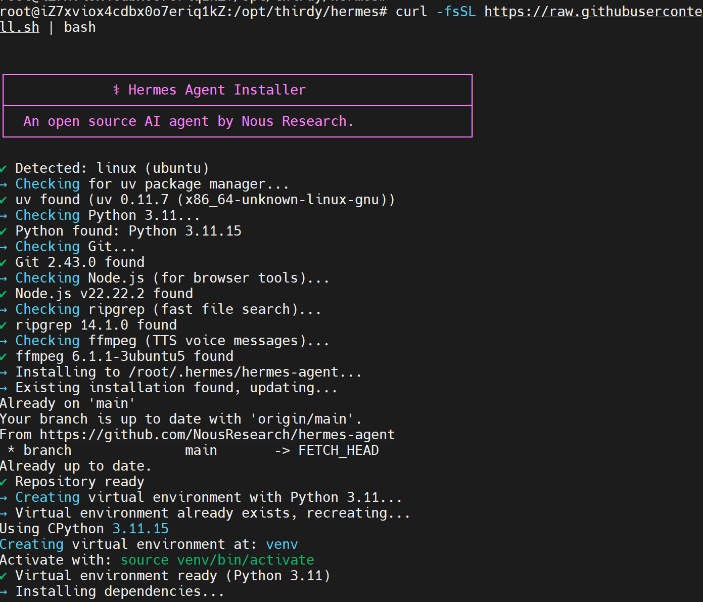
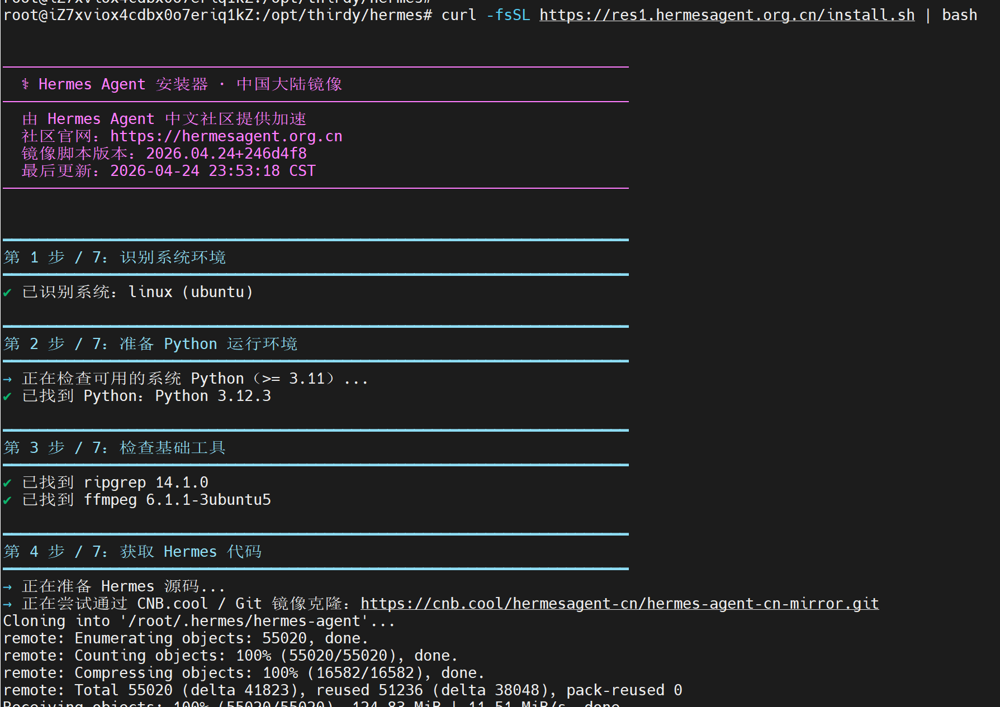
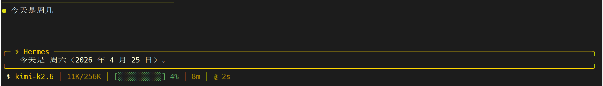
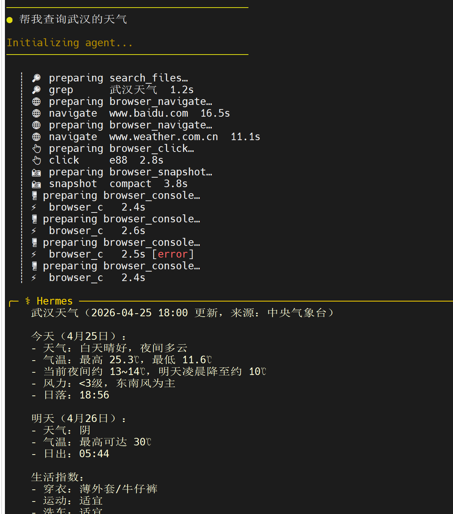

# Hermes Agent安装

## 1 环境准备

首先准备一台云服务器。

系统：Ubuntu 22.04 LTS 

## 2 安装
(1) 安装前置依赖

登录服务器后，执行以下命令更新系统包索引并安装 Git 和 curl（基础工具依赖）：
```shell
sudo apt update && sudo apt install -y git curl
```

（2）执行安装脚本
```shell
# 官方原版
curl -fsSL https://raw.githubusercontent.com/NousResearch/hermes-agent/main/scripts/install.sh | bash

# 或者国内镜像
curl -fsSL https://res1.hermesagent.org.cn/install.sh | bash
```






（3）激活环境
```shell
source ~/.bashrc
# 或关闭终端重新打开
```

（4）配置模型

执行以下命令进入配置界面：
```shell
hermes model       # 选择大语言模型提供商和模型
hermes tools       # 配置启用哪些工具
hermes setup       # 或一次性完成全部配置
```
选择模型供应商：Nous Portal / OpenRouter / OpenAI / 自定义端点

配置工具集：终端、文件、浏览器、记忆、技能、MCP

(5) 启动对话

执行以下命令启动对话：
```shell
hermes
```



(6) 打开记忆和Skill
```shell
# 开启长期记忆
hermes config set memory.memory_enabled true
hermes config set memory.user_profile_enabled true

# 开启技能系统
hermes config set skills.enabled true
hermes config set skills.auto_create true
```

## 3 连接消息平台

```
hermes gateway setup 
```

### 4 简单对话



### 参考：
https://hermesagent.org.cn/

https://hermesagent.org.cn/docs/getting-started/quickstart


