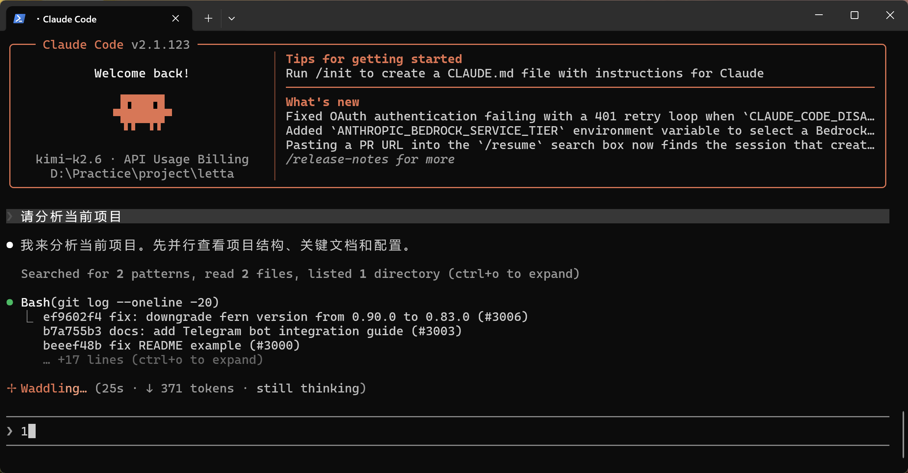
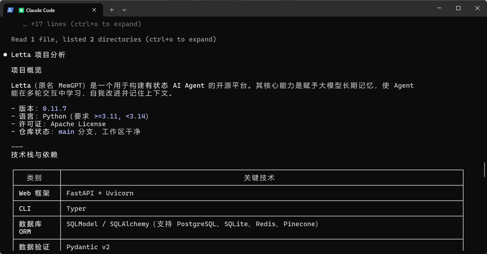

# Windows安装与配置Claude Code
## 环境
Windows

## 安装Cluade Code
```
# 打开 windows 终端中的 powershell 终端
# windows 上安装 nodejs
# 右键按 Windows 按钮，点击「终端」

# 然后依次执行下面的
winget install OpenJS.NodeJS
Set-ExecutionPolicy -Scope CurrentUser RemoteSigned

# 然后关闭终端窗口，新开一个终端窗口

# 安装 claude-code
npm install -g @anthropic-ai/claude-code --registry=https://registry.npmmirror.com

# 初始化配置
node --eval "
    const homeDir = os.homedir();
    const filePath = path.join(homeDir, '.claude.json');
    if (fs.existsSync(filePath)) {
        const content = JSON.parse(fs.readFileSync(filePath, 'utf-8'));
        fs.writeFileSync(filePath,JSON.stringify({ ...content, hasCompletedOnboarding: true }, 2), 'utf-8');
    } else {
        fs.writeFileSync(filePath,JSON.stringify({ hasCompletedOnboarding: true }), null, 'utf-8');
    }"
```

## 配置环境变量
```shell
# Windows Powershell 启动模型
$env:ANTHROPIC_BASE_URL="https://api.moonshot.cn/anthropic";
$env:ANTHROPIC_AUTH_TOKEN="YOUR_API_KEY"
$env:ANTHROPIC_MODEL="kimi-k2.6"
$env:ANTHROPIC_DEFAULT_OPUS_MODEL="kimi-k2.6"
$env:ANTHROPIC_DEFAULT_SONNET_MODEL="kimi-k2.6"
$env:ANTHROPIC_DEFAULT_HAIKU_MODEL="kimi-k2.6"
$env:CLAUDE_CODE_SUBAGENT_MODEL="kimi-k2.6"
$env:ENABLE_TOOL_SEARCH="false"
```

## 使用
键入claude code，接下来就可以和cc对话了：






## 参考
https://platform.kimi.com/docs/guide/agent-support