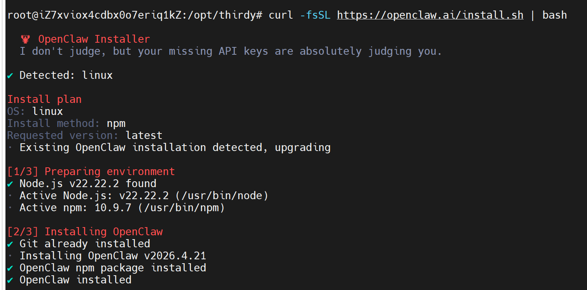
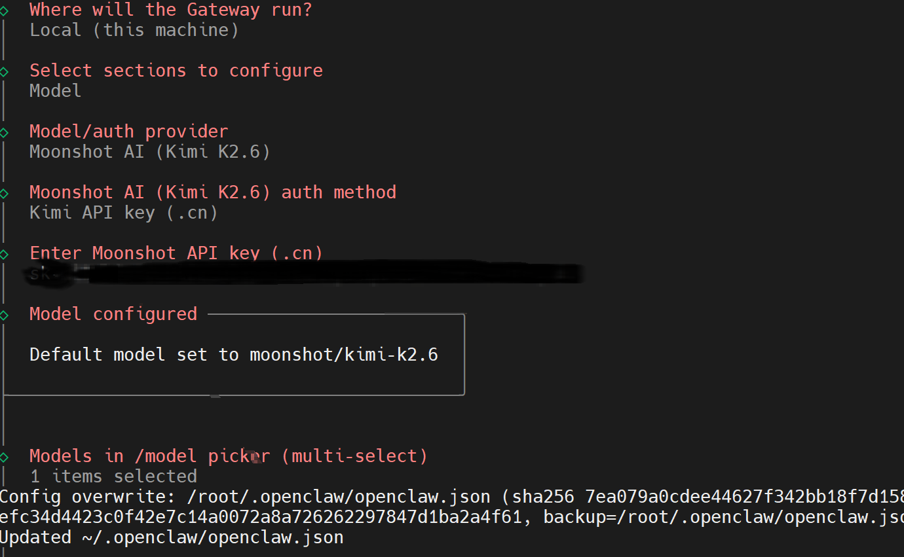
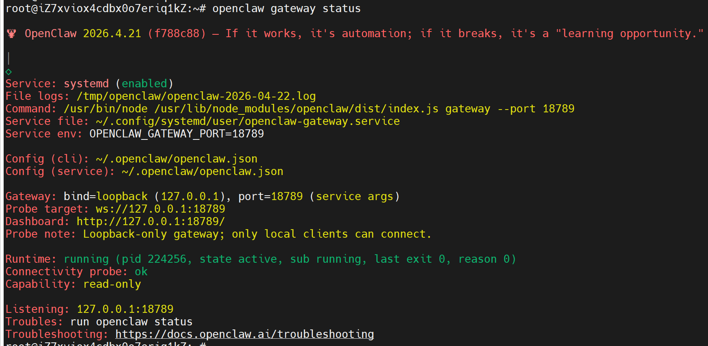

# OpenClaw部署

## 1 环境准备

首先准备一台云服务器。

系统：Ubuntu 22.04 LTS 

## 2 依赖安装

sudo apt update && sudo apt upgrade -y

sudo apt install -y curl wget git vim

sudo apt install -y openssh-server

## 3 部署OpenClaw

### 若干配置
```
# 1. 创建编译缓存目录
sudo mkdir -p /var/tmp/openclaw-compile-cache
sudo chmod 777 /var/tmp/openclaw-compile-cache

# 2. 写入bashrc

cat >> ~/.bashrc << 'EOF'

# OpenClaw 性能优化
export NODE_COMPILE_CACHE=/var/tmp/openclaw-compile-cache
export OPENCLAW_NO_RESPAWN=1
EOF

source ~/.bashrc
```

### 使用一键安装脚本

curl -fsSL https://openclaw.ai/install.sh | bash



### 其他配置

openclaw config set gateway.mode local

#### 添加 moonshot 提供商
```shell
openclaw configure
选择菜单：Model（模型提供商）
选择：Moonshot
输入 API Key: Kimi 密钥（sk-xxxxxxxx）
选择：moonshot/kimi-k2.6

```




#### 添加 k2.6 模型定义


```shell
  # ~/.openclaw/openclaw.json中配置
  "gateway": {
    "controlUi": {
      "allowInsecureAuth": true,
      "dangerouslyDisableDeviceAuth": true,
      "allowedOrigins": [
        "http://xxxx"
      ]
    }
  },
```


# 重启 Gateway
openclaw gateway restart

### 安装验证

openclaw --version      # 确认 CLI 可用

openclaw doctor         # 检查配置问题

openclaw gateway status # 验证 Gateway 网关正在运行



### openclaw接入微信

在运行 OpenClaw 的服务器终端执行：
```shell
npx -y @tencent-weixin/openclaw-weixin-cli@latest install
```
绑定成功后，微信聊天列表会出现 ClawBot 对话入口，直接发消息即可与 OpenClaw 交互。

### 其他

文件的作用

~/.openclaw/openclaw.json
全局总配置

~/.openclaw/agents/main/agent/auth-profiles.json
专门存密钥

~/.openclaw/agents/main/agent/models.json
当前智能体真正使用的模型


### 参考
https://docs.openclaw.ai/zh-CN/install


