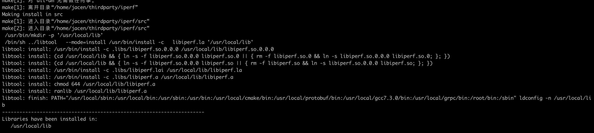
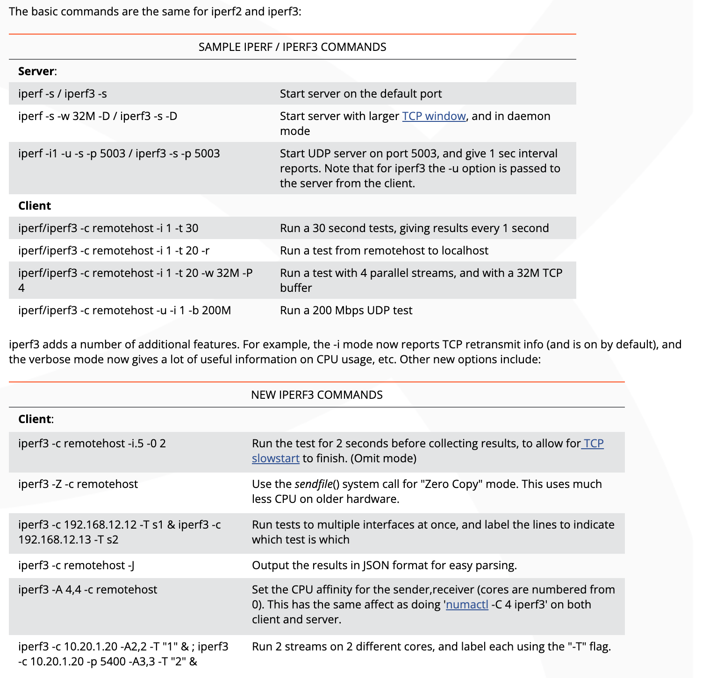
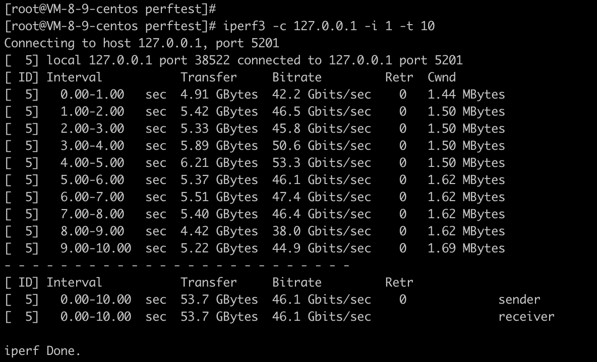

# 网络带宽性能分析工具iPerf3

## 1 iPerf3介绍

iPerf3是一个支持TCP、UDP、SCTP网络的带宽测量工具。

## 2 iPerf3下载、安装

```shell
# 两种方式：
# 下载github源码
git clone 
https://github.com/esnet/iperf.git -b 3.12

# 或者直接下载源码包
wget https://downloads.es.net/pub/iperf/iperf-3.0.1.tar.gz

# 编译
./configure; make; make install
```



## 3 iPerf3使用指导



## 4 实践

在云服务器上启动iperf3的server端：

```shell
iperf -s
```


在云服务器上启动iperf3的client端：

```shell
iperf3 -c 127.0.0.1 -i 1 -t 10
```



不同组合下的结果如下：

| server | client | bandwidth |
| :-----| :---- | :---- |
| iperf -s | iperf3 -O 4 -c 127.0.0.1 -i 2 -t 20 -w 4K -P 4 | 3.96 Gb/s |
| iperf -s | iperf3 -O 4 -c 127.0.0.1 -i 2 -t 20 -w 4K -P 8 | 4.12 Gb/s |
| iperf -s | iperf3 -O 4 -c 127.0.0.1 -i 2 -t 20 -w 4K -P 16 | 4.27 Gb/s |
| | | |
| iperf -s | iperf3 -O 4 -c 127.0.0.1 -i 2 -t 20 -w 32K -P 2 | 23.3 Gb/s |
| iperf -s | iperf3 -O 4 -c 127.0.0.1 -i 2 -t 20 -w 32K -P 4 | 25.0 Gb/s |
| iperf -s | iperf3 -O 4 -c 127.0.0.1 -i 2 -t 20 -w 32K -P 8 | 26.1 Gb/s |
| | | |
| iperf -s | iperf3 -O 4 -c 127.0.0.1 -i 2 -t 20 -w 64K -P 1 | 31.7 Gb/s |
| iperf -s | iperf3 -O 4 -c 127.0.0.1 -i 2 -t 20 -w 64K -P 2 | 31.7 Gb/s |
| iperf -s | iperf3 -O 4 -c 127.0.0.1 -i 2 -t 20 -w 64K -P 4 | 31.0 Gb/s |
| iperf -s | iperf3 -O 4 -c 127.0.0.1 -i 2 -t 20 -w 64K -P 8 | 30.4 Gb/s |
| | | |
| iperf -s | iperf3 -O 4 -c 127.0.0.1 -i 2 -t 20 -w 128K -P 2 | 40.5 Gb/s |
| iperf -s | iperf3 -O 4 -c 127.0.0.1 -i 2 -t 20 -w 128K -P 4 | 38.9 Gb/s |
| iperf -s | iperf3 -O 4 -c 127.0.0.1 -i 2 -t 20 -w 128K -P 8 | 38.3 Gb/s |
| | | |
| iperf -s | iperf3 -O 4 -c 127.0.0.1 -i 2 -t 20 -w 256K -P 2 | 46.3 Gb/s|
| iperf -s | iperf3 -O 4 -c 127.0.0.1 -i 2 -t 20 -w 256K -P 4 | 44.8 Gb/s |
| iperf -s | iperf3 -O 4 -c 127.0.0.1 -i 2 -t 20 -w 256K -P 8 | 42.7 Gb/s |
| iperf -s | iperf3 -O 4 -c 127.0.0.1 -i 2 -t 20 -w 256K -P 16 | 41.9 Gb/s |

基于本文使用的4核GB云服务器环境的结果数据，可以看到：
随着客户端的buffer size、并发数递增，测得的带宽结果呈现递增趋势。但到一定程度就不会增长了，软件的能力受限于硬件（网卡带宽、CPU核数&性能等因素）。

## 5 参考资料

* iPerf

https://iperf.fr/

https://github.com/esnet/iperf

* iPerf3 usage

https://fasterdata.es.net/performance-testing/network-troubleshooting-tools/iperf/
